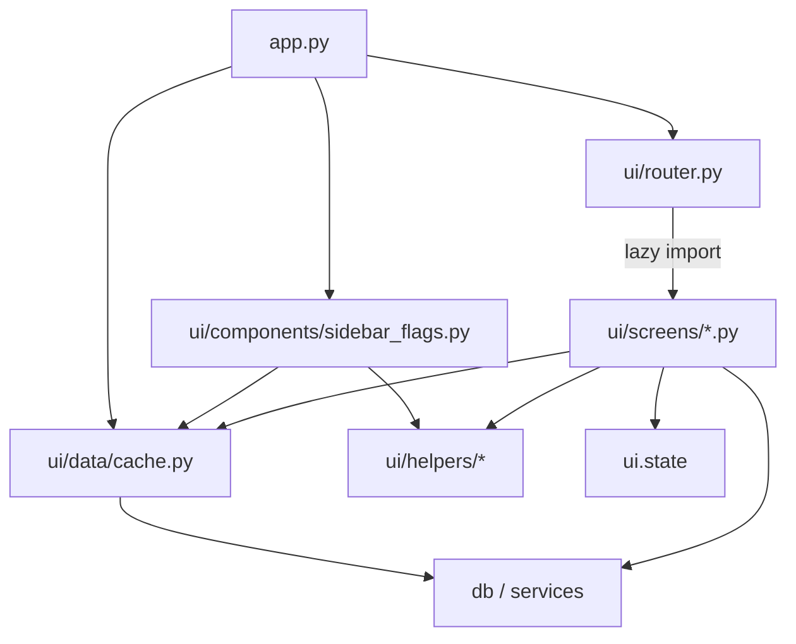

# Prompt 1 — Extract Router and Screens (Fix app.py)

## Current state

- [app.py](app.py) is ~~2671 lines: page config, CSS, session init, backend check, **sidebar "Top Flags" block** (lines 519–611), **~~50 helper/cache functions** (e.g. `_parse_date`, `_cached_list_properties`, `_get_active_property`, `_db_write`), and **6 main screen implementations** (`render_dmrb_board`, `render_flag_bridge`, `render_risk_radar`, `render_detail`, `render_admin`, `render_dmrb_ai_agent`) plus helpers used only by one screen.
- [ui/screens/](ui/screens/) already exists with 6 thin wrappers (e.g. [ui/screens/board.py](ui/screens/board.py)) that define `render_board(render_impl)` and call `render_impl()`; the real logic lives in app.py.
- Page dispatch is a single if/elif block at the end of app.py (lines 2658–2671) using `st.session_state.page` and calling the thin screen wrappers with the app-defined render functions.

## Target state

- **app.py** under 150 lines: only Streamlit page config, session init, backend check, global CSS, sidebar (navigation + Top Flags), and delegation to the router.
- **ui/router.py**: determines current page, **lazily** imports the correct screen module, calls its `render()`.
- **ui/screens/** (8 modules): each contains the **actual** screen implementation and exposes a single `render()` (no `render_impl` indirection). Admin remains the single "admin" page and internally uses tabs that call unit_import and exports logic (either in the same file or by importing `unit_import` and `exports` sub-modules and calling their `render()` in the right tab).
- Shared code used by app.py and by screens (cache, DB helpers, date/format helpers, sidebar Top Flags) must live in **shared modules** so app.py and screens can import it; otherwise app.py cannot stay under 150 lines and we avoid circular imports.

## Implementation plan

### 1. Shared modules (required so app.py and screens can stay slim)

Screens and the sidebar depend on many functions currently in app.py. Move them into modules that app.py and screens will import from.

- **Create [ui/data/cache.py](ui/data/cache.py)**  
Move: `_get_conn`, `_db_available`, `_db_write`, `_db_cache_identity`, `_iso_to_date`, `_cached_list_properties`, `_cached_list_phases`, `_cached_list_buildings`, `_cached_list_units`, `_cached_list_unit_master_import_units`, `_cached_get_flag_bridge_rows`, `_cached_get_dmrb_board_rows`, `_cached_get_risk_radar_rows`, `_cached_get_turnover_detail`, `_sync_active_property`, `_get_active_property`, `_set_active_property`, `_render_active_property_banner`.  
These depend on `db_repository`, `board_query_service`, `ui_get_conn`, `ui_db_write`, `ui_get_db_path`, `get_connection`, `ensure_database_ready`, and `st`. Pass in or import backend availability and service refs (e.g. from a small app-specific bootstrap or from config) so cache.py does not import app.py. Keep `get_connection` / `ensure_database_ready` and service imports inside this module (or a small `ui/data/backend.py`) so only this layer touches DB/services.
- **Create [ui/helpers/dates.py](ui/helpers/dates.py)**  
Move: `_parse_date`, `_to_date`, `_dates_equal`, `_fmt_date`, `_parse_date_for_input`. Used by multiple screens and by cache/sidebar. Use `datetime`/`date` and optional `pandas` for NaT only where needed; keep Streamlit out if possible.
- **Create [ui/helpers/formatting.py](ui/helpers/formatting.py)**  
Move: `_normalize_label`, `_normalize_enum`, `_safe_index`, `_operational_state_to_badge`, `_get_attention_badge`. Pure formatting; no DB/Streamlit.
- **Create [ui/helpers/dropdowns.py](ui/helpers/dropdowns.py)** (or fold into existing state)  
Move: `_dropdown_config_path`, `_load_dropdown_config`, `_save_dropdown_config` if they are not already in ui.state. Used by admin and possibly others.
- **Create [ui/components/sidebar_flags.py](ui/components/sidebar_flags.py)**  
Move the entire "Top Flags" block (lines 519–611): divider, "Top Flags" header, `_all_rows` fetch (using cache), `_FLAG_CATEGORIES`, `_sort`_*, `_sidebar_unit_btn`, the loop over categories and expanders. This module will import from `ui.data.cache` and `ui.helpers.dates` (for `_parse_date` in sort key). Expose a single function, e.g. `render_top_flags()`, called from app.py after `render_navigation()`.

Add **ui/data/init.py** and **ui/helpers/init.py** if they do not exist, and export the public helpers so screens can do `from ui.helpers.dates import parse_date, ...` and `from ui.data.cache import get_active_property, cached_get_dmrb_board_rows, ...` (use clear public names when re-exporting the former private helpers).

### 2. Router

- **Create [ui/router.py*](ui/router.py)*  
  - Read current page: `page = st.session_state.get("page", "dmrb_board")`.  
  - Map page to module name: `dmrb_board` -> `board`, `flag_bridge` -> `flag_bridge`, `risk_radar` -> `risk_radar`, `detail` -> `turnover_detail`, `dmrb_ai_agent` -> `ai_agent`, `admin` -> `admin`.  
  - **Lazy load**: e.g. `module = importlib.import_module(f"ui.screens.{module_name}")`, then `module.render()`. Do not import all screens at the top of router.py.  
  - Default: if page is unknown, default to board (same as current `else: render_board_screen(render_dmrb_board)`).  
  - No business logic, no SQL, no service calls; only page resolution and lazy import + render.

### 3. Screen modules (8 total)

Each screen module gets the **implementation** currently in app.py (the `render`_* function and any helper used only by that screen). Each module exposes **one** function: `**render()`**. Replace the current thin wrappers that take `render_impl`.

**Naming and scope:**

- **board** — Move `render_dmrb_board` and its screen-local helpers (`_get_dmrb_rows`, `_exec_label`, `_confirm_label`) into [ui/screens/board.py](ui/screens/board.py). Expose `def render(): ...` that runs the same logic (optionally keep a single internal `_render_dmrb_board()` and have `render()` call it). Import shared helpers from `ui.data.cache`, `ui.helpers.dates`, `ui.helpers.formatting`, and `ui.state` (constants).
- **flag_bridge** — Move `render_flag_bridge` and `_get_flag_bridge_rows` into [ui/screens/flag_bridge.py](ui/screens/flag_bridge.py). Expose `render()`. Same import pattern.
- **risk_radar** — Move `render_risk_radar` and `_get_risk_radar_rows` into [ui/screens/risk_radar.py](ui/screens/risk_radar.py). Expose `render()`.
- **turnover_detail** — Move `render_detail` (and `_parse_date_for_input` if only used here) into [ui/screens/turnover_detail.py](ui/screens/turnover_detail.py). Expose `render()`. This screen uses workflows and services; keep those imports inside this module so they are only loaded when the detail screen is shown.
- **ai_agent** — Move `render_dmrb_ai_agent`, `_chat_api_base_url`, `_chat_api_request` into [ui/screens/ai_agent.py](ui/screens/ai_agent.py). Expose `render()`.
- **admin** — Move `render_admin` (tabs: Add Unit, Import, Unit Master Import, Exports, Dropdown Manager) and the tab contents: `render_dropdown_manager`, `render_property_structure`, `render_add_availability`, `render_unit_master_import`, `render_import`, `render_exports`, and `_run_import_for_report` into [ui/screens/admin.py](ui/screens/admin.py). Expose `render()` that runs the same admin UI. This keeps one "admin" page; all admin-only logic lives in this module. Optionally split later into sub-modules (e.g. `admin/unit_import.py`, `admin/exports.py`) that admin imports and calls from the tabs; for Prompt 1, a single admin.py under ~500 lines is acceptable if needed to avoid over-refactor.
- **unit_import** — The prompt asks for a "unit_import" screen module. Currently that logic is `render_unit_master_import` inside app.py and is shown as a tab inside admin. Create [ui/screens/unit_import.py](ui/screens/unit_import.py) with the content of `render_unit_master_import` and expose `render()`. Admin will then `from ui.screens.unit_import import render as render_unit_master_import` and call it in the "Unit Master Import" tab. No new nav item required.
- **exports** — Same idea: create [ui/screens/exports.py](ui/screens/exports.py) with `render_exports` and expose `render()`. Admin imports it and calls it in the "Exports" tab.

So: 8 screen modules (admin, board, flag_bridge, risk_radar, turnover_detail, ai_agent, unit_import, exports). Router only needs to know about the 6 **pages** (dmrb_board, flag_bridge, risk_radar, detail, dmrb_ai_agent, admin). Admin screen internally uses unit_import and exports in its tabs.

### 4. app.py slimming

- **Remove** all moved code (helpers, cache, sidebar flags, every `render`_* and their local helpers).
- **Keep**: docstring; minimal imports (e.g. `streamlit`, `config.settings`, `ui.state.init_session_state`, `ui.components.sidebar.render_navigation`, `ui.components.sidebar_flags.render_top_flags`, `ui.router`); backend availability check (try/except that sets `_BACKEND_AVAILABLE` and stops with st.error if false); `get_settings()`; `st.set_page_config`; global CSS block; `_init_session_state()` (or delegate to ui.state); `ensure_database_ready` + optional task backfill (if still desired at startup); `render_navigation(st.session_state.page)`; `render_top_flags()`; then `**ui.router.render_current_page()`** (or equivalent name).
- **Do not** import application.workflows, application.commands, or heavy services at the top of app.py. Let only the screen modules that need them import them (e.g. turnover_detail and admin), so lazy loading reduces rerun cost.
- Ensure **app.py is under 150 lines** after the move.

### 5. ui/screens/**init**.py

- **Do not** re-export or import all screen modules at package load. That would defeat lazy loading. Either leave **init**.py minimal (empty or only `__all`__ listing module names) or remove eager imports of screen implementations. The router will use `importlib.import_module("ui.screens.<name>")` so it does not depend on **init** importing screens.

### 6. Backend availability and service refs

- Cache and screens need `db_repository`, `board_query_service`, and other services only when they run. Today app.py sets `_BACKEND_AVAILABLE` and assigns `db_repository`, etc., in a try/except. Move that bootstrap into **ui/data/cache.py** (or a small **ui/data/backend.py**): on first use, try to import `db.connection`, `db.repository`, `board_query_service`, etc., and set module-level flags/refs. app.py can still do the initial "if not _BACKEND_AVAILABLE: st.error(...); st.stop()" by importing that flag from the same place. That way screens and cache get backend refs from one place without importing app.py.

## Dependency flow (no circular imports)

- app.py does not import any screen module directly; it only calls the router.
- Router imports screen modules only when that page is active (importlib).
- Screens import cache, helpers, and state; some screens import backend (workflows, services). No app -> screens or screens -> app.

## Constraints (from prompt)

- Do not modify business logic, SQL, or service call behavior; only relocate UI logic.
- Navigation behavior stays the same: same 6 pages, same sidebar nav and Top Flags.
- Result: app.py under 150 lines; all screen implementations live under ui/screens/; router does lazy import and calls each screen’s `render()`.

## Order of operations

1. Create ui/helpers (dates, formatting, dropdowns) and ui/data (cache + backend bootstrap), moving the corresponding functions from app.py and updating them to use public names where appropriate.
2. Create ui/components/sidebar_flags.py and move the Top Flags block; have it use cache and helpers.
3. Create ui/router.py with page -> module map and lazy import + render().
4. Implement each of the 8 screen modules (board, flag_bridge, risk_radar, turnover_detail, ai_agent, admin, unit_import, exports) by moving the corresponding render_* and private helpers from app.py, exposing render(), and wiring imports from ui.data.cache, ui.helpers, ui.state. For admin, call unit_import.render() and exports.render() inside the appropriate tabs.
5. Slim app.py: remove all moved code, keep only entrypoint, backend check, CSS, init_session_state, render_navigation, render_top_flags, router.render_current_page().
6. Update ui/screens/**init**.py so it does not eagerly import screen implementations (so router’s lazy loading is effective).
7. Smoke-test: run the app, open each of the 6 pages, and confirm navigation and Top Flags behave the same.

## Files to create or heavily modify

| Action  | Path                                                     |
| ------- | -------------------------------------------------------- |
| Create  | ui/data/**init**.py                                      |
| Create  | ui/data/cache.py (and optionally backend.py)             |
| Create  | ui/helpers/**init**.py                                   |
| Create  | ui/helpers/dates.py                                      |
| Create  | ui/helpers/formatting.py                                 |
| Create  | ui/helpers/dropdowns.py                                  |
| Create  | ui/components/sidebar_flags.py                           |
| Create  | ui/router.py                                             |
| Replace | ui/screens/board.py (implementation + render())          |
| Replace | ui/screens/flag_bridge.py                                |
| Replace | ui/screens/risk_radar.py                                 |
| Replace | ui/screens/turnover_detail.py                            |
| Replace | ui/screens/ai_agent.py                                   |
| Replace | ui/screens/admin.py (tabs + unit_import + exports calls) |
| Create  | ui/screens/unit_import.py                                |
| Create  | ui/screens/exports.py                                    |
| Modify  | ui/screens/**init**.py (no eager screen imports)         |
| Modify  | app.py (slim to < 150 lines)                             |

