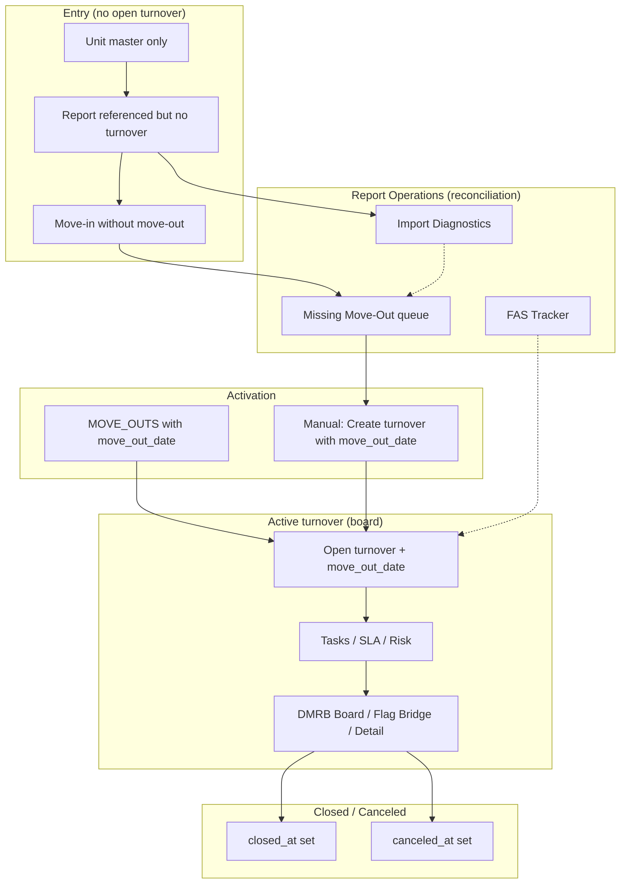

# Lifecycle Documentation

**Purpose:** Single reference for lifecycle rules, report authority, behaviors by report type, exception workflows, clarifications, manager workflows, and execution order.  
**Companion specs:** `LIFECYCLE_STATE_AND_WORKFLOW_SPECIFICATION.md` (implementation detail), `IMPORT_DIAGNOSTICS_DESIGN_REPORT.md`, `LIFECYCLE_MANUAL_TEST_MATRIX.md`.  
**Date:** 2025-03-12

---

## 1. Lifecycle Rules

| Rule | Description |
|------|-------------|
| **Turnover requires move_out_date** | A turnover is **operational** (board, tasks, SLA) only when `move_out_date` is set. No turnover is created or shown on the board without a move-out date. Schema enforces `move_out_date NOT NULL`; MOVE_OUTS and manual creation both require it. |
| **One open turnover per unit** | At most one open turnover per unit at any time. Enforced by unique partial index `idx_one_open_turnover_per_unit` (WHERE closed_at IS NULL AND canceled_at IS NULL). Creation paths check for an existing open turnover before insert. |
| **Report order independence** | Reports may be imported in **any order**. Each report type is applied independently; idempotency is per-batch (checksum). No required sequence (e.g. MOVE_OUTS need not run before PENDING_MOVE_INS). Rows that reference a unit without an open turnover produce exceptions (CONFLICT/IGNORED) and are handled in Report Operations. |
| **Manual override precedence** | When a manager has set a manual override (move-out, ready date, move-in, or status), imports **do not overwrite** that value unless the incoming value **matches** the override—then the override is cleared and the value is applied. If the incoming value differs, the row is recorded as SKIPPED_OVERRIDE and the manual value is kept. |

---

## 2. Report Authority

- **Available Units (AVAILABLE_UNITS):** Treated as the strongest validator of live vacancy/readiness (product intent). It can update `report_ready_date`, `available_date`, and `availability_status` on an existing open turnover; manual overrides are respected.
- **DMRB:** Updates `report_ready_date` and `available_date` on an existing open turnover; no `availability_status` in DMRB. Manual overrides respected.
- **Move-Outs (MOVE_OUTS):** The **only** report type that can **create** a new turnover. Authority for creating the operational turnover; requires a non-null move-out date per row.
- **Pending Move-Ins (PENDING_MOVE_INS):** Updates `move_in_date` on an existing open turnover only; never creates a turnover.
- **Pending FAS (PENDING_FAS):** Updates legal/confirmed move-out fields and supports FAS tracking (notes); never creates a turnover.
- **Manual creation (Add Availability):** Same authority as MOVE_OUTS for creating a turnover; requires `move_out_date`. No import_row is written.

---

## 3. Behavior by Report Type

### MOVE_OUTS

- **Creates turnover:** Yes—when unit exists, unit has no open turnover, and row has a **non-null move-out date**. Inserts turnover and then calls `instantiate_tasks_for_turnover`.
- **Missing move-out date:** Row is written with `validation_status = INVALID`, `conflict_reason = MOVE_OUT_DATE_MISSING`. No turnover or unit created.
- **Unit already has open turnover:** Match by unit; if move_out_date differs and no manual override → CONFLICT (MOVE_OUT_DATE_MISMATCH_FOR_OPEN_TURNOVER). If manual override set and incoming matches → clear override and update; if incoming differs → SKIPPED_OVERRIDE.
- **Post-process:** For the property, open turnovers not seen in this batch have `missing_moveout_count` incremented; if ≥ 2, turnover is canceled (“Move-out disappeared from report twice”).

### PENDING_MOVE_INS

- **Creates turnover:** No. Only updates existing open turnover’s `move_in_date`.
- **Unit not found or no open turnover:** `validation_status = CONFLICT`, `conflict_reason = MOVE_IN_WITHOUT_OPEN_TURNOVER`. Row feeds the **Missing Move-Out queue** (repair workflow).
- **Unit has open turnover:** Update `move_in_date`; respect `move_in_manual_override_at` (skip if differs, clear and apply if matches).

### AVAILABLE_UNITS

- **Creates turnover:** No. Only updates existing open turnover’s `report_ready_date`, `available_date`, `availability_status`.
- **Unit not found or no open turnover:** `validation_status = IGNORED`, `conflict_reason = NO_OPEN_TURNOVER_FOR_READY_DATE`. Unit does not appear on board.
- **Unit has open turnover:** Update readiness fields; respect `ready_manual_override_at` and `status_manual_override_at`.

### PENDING_FAS

- **Creates turnover:** No. Updates legal/confirmed move-out and FAS tracker notes when unit has open turnover.
- **Unit not found or no open turnover:** `validation_status = IGNORED`, `conflict_reason = NO_OPEN_TURNOVER_FOR_VALIDATION`.
- **Unit has open turnover:** Apply FAS confirmation; FAS Tracker in Report Operations allows notes per unit/fas_date (persist across imports).

### DMRB

- **Creates turnover:** No. Only updates existing open turnover’s `report_ready_date` and `available_date`.
- **Unit not found or no open turnover:** `validation_status = IGNORED`, `conflict_reason = NO_OPEN_TURNOVER_FOR_READY_DATE`.
- **Unit has open turnover:** Update report_ready_date, available_date; respect `ready_manual_override_at`.

### Manual creation

- **Entry:** Admin → Add Unit, or Report Operations → Missing Move-Out → Resolve (select unit, enter move_out_date, “Create turnover”).
- **Rule:** Unit must exist; unit must have no open turnover; **move_out_date required** (no default).
- **Action:** `create_turnover_and_reconcile` → `insert_turnover` → `instantiate_tasks_for_turnover` → SLA/risk reconciliation. No import_row written.

---

## 4. Exception Workflows

### Missing Move-Out queue

- **Trigger:** `import_row` where `conflict_reason` IN (`MOVE_IN_WITHOUT_OPEN_TURNOVER`, `MOVE_OUT_DATE_MISSING`), unit exists, and unit has **no** open turnover.
- **Surface:** Report Operations → **Missing Move-Out** tab. List shows unit, report type, move-in date (if any), conflict reason, import timestamp.
- **Action:** Manager selects unit, enters move-out date, clicks “Create turnover.” System calls same path as manual creation (`add_manual_availability`). Turnover is created; unit appears on board and leaves the queue.

### FAS Tracker

- **Trigger:** PENDING_FAS import rows; unit exists (open turnover optional for display).
- **Surface:** Report Operations → **FAS Tracker** tab. List shows unit, FAS date, import timestamp, and an editable note.
- **Action:** Add or edit a note per (unit, fas_date). Notes stored in `fas_tracker_note`; persist across imports. Observational/tracking only; no turnover creation.

### Import Diagnostics

- **Trigger:** Any `import_row` with `validation_status != 'OK'` (IGNORED, CONFLICT, INVALID, SKIPPED_OVERRIDE), joined to `import_batch`.
- **Surface:** Report Operations → **Import Diagnostics** tab. Table: Unit, Report Type, Status, Conflict Reason, Import Time, Source File. Deduplicated: most recent row per (unit_code_norm, report_type).
- **Action:** Observational only. No state changes from this tab. Use to see why rows were ignored, conflicted, or invalid; resolve via Missing Move-Out or data correction as appropriate.

### Report Operations purpose

- **Report Operations** is the **reconciliation workspace**: diagnostics, report-based workflows, and fixing exceptions **before** they become board work. It surfaces non-OK import outcomes and provides resolve flows (Missing Move-Out) and tracking (FAS Tracker). The main **Board** is for operational execution of **active** turnovers only.

---

## 5. Clarifications

| Term | Meaning |
|------|---------|
| **Report Operations = reconciliation workspace** | Where managers triage import exceptions, resolve missing move-out, add FAS notes, and view import diagnostics. Not for day-to-day execution of turnovers. |
| **Board = operational execution** | The DMRB Board (and Flag Bridge, Risk Radar, Turnover Detail) shows only **open turnovers with move_out_date set**. Day-to-day work: tasks, dates, status, manual overrides, auto-close. |
| **Turnover activation rule** | A turnover is “active” when it is an open turnover (closed_at/canceled_at NULL) **and** has `move_out_date` set. Only active turnovers appear on the board and have tasks/SLA. |
| **move_out_date activates turnover** | Setting `move_out_date` (via MOVE_OUTS import or manual creation) is what makes the turnover operational. Without it, no board row and no task instantiation. |
| **Task instantiation rule** | **Tasks are created only when a turnover exists** (and in practice only when that turnover has move_out_date). `instantiate_tasks_for_turnover` is called only after `insert_turnover` in MOVE_OUTS and manual paths; `reconcile_missing_tasks` filters to open turnovers with `move_out_date IS NOT NULL` before creating tasks. |

---

## 6. Manager Workflow

### Morning imports

- **Intent:** Ingest latest reports (any subset: MOVE_OUTS, PENDING_MOVE_INS, AVAILABLE_UNITS, PENDING_FAS, DMRB) to refresh turnover state and readiness.
- **Steps:** Admin → Import; select report type and file for each. Each import runs independently (checksum idempotency per batch). No required sequence.
- **Outcomes:** New turnovers from MOVE_OUTS (with move_out_date); updates to move_in_date, report_ready_date, availability, FAS confirmation from other reports. Non-OK rows written to import_row.
- **Follow-up:** Report Operations → Missing Move-Out for units that need a move-out date; resolve as needed. Optionally Import Diagnostics for other exceptions.

### Midday imports

- **Intent:** Apply updated reports (e.g. revised Move-Outs, new Pending Move-Ins, updated Available Units).
- **Steps:** Same as morning: Admin → Import per report type. Idempotency by checksum; new batch if file changed.
- **Outcomes:** Same rules as morning. Manual overrides preserved when import value differs; cleared when import matches.

### End-of-day imports

- **Intent:** Final snapshot of the day; reconcile readiness and FAS.
- **Steps:** Same import flow. Optional: run exports (Final Report, DMRB Report) after imports for handoff or audit.

### Repair loop

- **Intent:** Clear pre-turn exceptions so units can become active turnovers and appear on the board.
- **Trigger:** Report Operations → Missing Move-Out queue shows units with MOVE_IN_WITHOUT_OPEN_TURNOVER or MOVE_OUT_DATE_MISSING (unit exists, no open turnover).
- **Steps:** (1) Open Missing Move-Out tab. (2) Select unit. (3) Enter move_out_date. (4) Click “Create turnover.” (5) System creates turnover and tasks; unit appears on board. Repeat for other units.
- **Exit:** When no unresolved missing-move-out exceptions for the active property (or operator leaves some for later).

### Turnover execution loop

- **Intent:** Execute work on active turnovers (board), update tasks, dates, status, and close when done.
- **Trigger:** Board shows open turnovers (with move_out_date). Flag Bridge / Risk Radar filter by breach or risk.
- **Steps:** (1) View DMRB Board (or Flag Bridge / Risk Radar). (2) Open Turnover Detail for a unit. (3) Update task status, assignees, dates (move-out, ready, move-in), or manual status. (4) Clear or set manual overrides as needed. (5) When move-in complete and past stabilization (e.g. move_in_date + 14 days, no critical risks), system may auto-close or manager closes. (6) Repeat; re-import as needed during the day.
- **Exit:** Turnover is closed or canceled; it disappears from the board. New turnover for same unit only after MOVE_OUTS or manual creation with move_out_date.

---

## 7. Lifecycle Diagram

**Simplified flow (per unit):**

1. **Unit exists** (unit master). Reports may reference it (PENDING_MOVE_INS, AVAILABLE_UNITS, etc.).
2. **No open turnover** → rows produce CONFLICT/IGNORED; unit appears in Report Operations (Missing Move-Out if MOVE_IN_WITHOUT_OPEN_TURNOVER or MOVE_OUT_DATE_MISSING, or in Import Diagnostics).
3. **Activation:** MOVE_OUTS row with move_out_date **or** manual “Create turnover” with move_out_date → one open turnover created, tasks instantiated.
4. **Active turnover** → appears on Board; gets updates from PENDING_MOVE_INS, AVAILABLE_UNITS, DMRB, PENDING_FAS; manual overrides respected.
5. **Close or cancel** → turnover leaves board; same unit can have a new turnover only after a new MOVE_OUTS or manual creation.

---

## 8. Execution Order (Related Work)

When implementing or verifying lifecycle-related features, run or apply work in this order:

1. **Import Diagnostics** — Implement or verify the Import Diagnostics tab (repository, service, UI); observational view of non-OK import outcomes.
2. **Lifecycle Guardrails** — Enforce move_out_date for creation and task instantiation; one open turnover per unit; board filter by move_out_date (already in repository).
3. **Board Filter** — Ensure board and list_open_turnovers only return turnovers with move_out_date IS NOT NULL (already enforced in `db/repository/turnovers.py`).
4. **Repair Workflow UI** — Missing Move-Out tab with resolve flow (create turnover with move-out date); caption clarifying repair workflow (already in `report_operations.py`).
5. **Test Matrix** — Execute or extend manual test cases in `docs/LIFECYCLE_MANUAL_TEST_MATRIX.md` for entry states, report order, resolve flow, and invariants.
6. **Documentation** — Keep this document and `LIFECYCLE_STATE_AND_WORKFLOW_SPECIFICATION.md` aligned with implementation; update on guardrail or workflow changes.

---

## 9. References

| Document | Purpose |
|----------|---------|
| `docs/LIFECYCLE_STATE_AND_WORKFLOW_SPECIFICATION.md` | Full implementation-ready spec: entry states, lifecycle phases, report rules, guardrails, exception workflows. |
| `docs/IMPORT_DIAGNOSTICS_DESIGN_REPORT.md` | Design for Import Diagnostics tab (query, deduplication, service, UI). |
| `docs/LIFECYCLE_ALIGNMENT_REPORT.md` | Alignment of current code with target lifecycle rules; gaps and priorities. |
| `docs/LIFECYCLE_MANUAL_TEST_MATRIX.md` | Manual test cases for lifecycle, board visibility, report order, repair workflows. |
