# Technical Specification

# 1. Introduction

## 1.1 Executive Summary

### 1.1.1 Project Overview

DMRB — the **Digital Make Ready Board** — is an offline-first operational application for managing apartment turnover and make-ready workflows. Built on Python and Streamlit with a local SQLite database, DMRB provides property operations teams with a single working board for tracking residential units through their complete make-ready lifecycle: from initial notice through vacancy, make ready, move-in readiness, and post-move-in stabilization.

The application is not a passive reporting dashboard. It actively manages operational state by persisting turnover records, task progress, operator notes, SLA breach events, and system-generated risk flags. Business logic resides in a dedicated domain layer (`domain/`), separate from the UI, ensuring that lifecycle evaluation is deterministic, testable, and auditable. An append-only audit trail in the `audit_log` table captures all significant mutations with explicit source attribution — `manual`, `import`, or `system`.

DMRB's architecture follows a strict layered design where the UI layer (`app.py`, `ui/`) contains no business rules, the domain layer (`domain/`) houses pure deterministic logic, the services layer (`services/`) orchestrates all write operations and reconciliation, and the persistence layer (`db/`) owns schema management and data access. This separation is a deliberate design boundary that keeps core operational behaviors concentrated in testable modules rather than scattered across UI components.

### 1.1.2 Core Business Problem

Property operations teams managing apartment turnovers face a set of interconnected operational challenges that manual processes and spreadsheet-based tracking cannot reliably address:

- **Fragmented Visibility**: Turnover status, task progress, and readiness timelines are dispersed across spreadsheets, vendor reports, and verbal communication channels, preventing a consolidated operational picture.
- **Manual Tracking Fragility**: Spreadsheet workflows lack field-level validation, structured audit trails, and protection against accidental data overwrites — leading to silent data loss and inconsistent state.
- **SLA Compliance Opacity**: Service Level Agreement breaches for unit readiness are difficult to detect early without systematic threshold monitoring, resulting in reactive rather than proactive management.
- **Risk Blindspots**: Operational risks — QC gaps near move-in, overdue vendor execution, data integrity conflicts, washer/dryer notification failures — are identified only after they escalate into missed deadlines or quality failures.
- **Import Reconciliation Complexity**: External operational reports from property management systems must be reconciled with manually entered data without silently discarding operator decisions, a problem that naive last-write-wins approaches cannot solve.

DMRB addresses these problems by providing a structured, rules-driven operational cockpit that replaces ad-hoc tracking with deterministic lifecycle management, automated risk detection, and protected data reconciliation.

### 1.1.3 Key Stakeholders and Users

| Stakeholder Group | Role | System Interaction |
|---|---|---|
| Property Operations Managers | Primary decision-makers for turnover workflows | Full read/write access: DMRB Board, Turnover Detail, Admin tools |
| Maintenance Supervisors / Coordinators | Task execution oversight and coordination | Board review, task status updates, flag monitoring |
| Operations Reviewers / Executives | Oversight, operational reviews, and demonstrations | Read-only mode (via `Enable DB Writes` toggle disabled) |

The system's `default_actor` configuration is set to `"manager"` in `config/settings.py`, confirming that the primary operational context is manager-driven decision-making. The availability of a read-only mode — where database writes are disabled by default for SQLite deployments (`enable_db_writes_default: False`) — supports secondary use cases including operational reviews and stakeholder demonstrations.

### 1.1.4 Business Impact and Value Proposition

DMRB delivers operational value across five core dimensions:

| Value Dimension | Description |
|---|---|
| **Single Operational Cockpit** | Consolidates turnover tracking, task orchestration, SLA monitoring, and risk visibility into a unified working board, eliminating fragmented spreadsheets and reports |
| **Deterministic Lifecycle Management** | Turnover phases are derived through explicit domain logic in `domain/lifecycle.py` — not ad-hoc status assignments — ensuring consistency across the entire operation |
| **Manual Override Protection** | Operator-entered values are timestamped and protected from silent overwriting during import processing in `services/import_service.py`, preserving institutional knowledge and operator intent |
| **Early-Warning Risk Detection** | Eight distinct risk types are systematically evaluated by `domain/risk_engine.py`, surfacing operational concerns before they become missed deadlines or quality failures |
| **Auditable Operations** | Every significant change is recorded in an append-only `audit_log` table with source attribution (`manual`, `import`, `system`) and actor identification, supporting compliance and operational review |

### 1.1.5 Document Conventions

This Technical Specification treats the **current codebase as the primary source of truth**. Where planning documents in `docs/` or `spec/` directories describe transitional architecture that diverges from the implemented code, the code takes precedence. This convention is necessary because the repository is in an active development state with evolving schema and compatibility patterns visible in the codebase.

The specification also acknowledges the current test suite state transparently: `pytest` does not currently achieve a fully passing baseline, with failures concentrated in enrichment parity and manual-override schema paths. This is documented as a delivery risk rather than suppressed, and any assumption of a stable green test baseline would be misleading.

---

## 1.2 System Overview

### 1.2.1 Project Context

#### Business Context and Positioning

DMRB is purpose-built for apartment turnover operations within a single property's organizational hierarchy. It is not a general-purpose property management platform, a multi-service cloud-native application, or an API-first system. The application targets a specific operational niche: managing the complete workflow from when a resident gives notice to vacate through the unit's physical readiness for a new move-in and the subsequent short-term stabilization period.

The application operates in a **local, offline-first deployment model**. It uses SQLite as its default database engine, boots its schema automatically on startup through `ensure_database_ready()` in `db/connection.py`, and requires no external API dependencies or remote database connections for core functionality. The primary runtime environment variable is `COCKPIT_DB_PATH` (or `DMRB_DATABASE_PATH`), which overrides the default database location of `data/cockpit.db`. Configuration follows a secrets-first lookup path: Streamlit secrets are checked before environment variables, as implemented in `config/settings.py`.

#### Current System Context

DMRB replaces manual, spreadsheet-based turnover tracking workflows. It is designed to operate as a standalone operational tool rather than as a component within a larger integrated platform. The system does not currently require or support formal authentication, multi-tenant operations, or API-to-API integrations with external property management systems.

The system's data scope is constrained to a single property (configurable via `default_property_id`, default: `1`) and a configurable subset of property phases (default: phases `5`, `7`, `8` via `allowed_phases`). This scoping model supports focused operational management within a defined property segment.

#### Integration with Existing Landscape

DMRB integrates with external operational systems exclusively through **file-based imports**. Five structured report types can be ingested through the import pipeline implemented in `services/import_service.py`:

| Report Type | Operational Purpose |
|---|---|
| `MOVE_OUTS` | Create or update open turnovers from move-out reports |
| `PENDING_MOVE_INS` | Update move-in dates on existing turnovers |
| `AVAILABLE_UNITS` | Reconcile ready/status-related fields |
| `PENDING_FAS` | Legal/move-out confirmation validation |
| `DMRB` | Reconcile operational status fields |

Additionally, a **Unit Master Import** (`services/unit_master_import_service.py`) enables bootstrap or repair of the property/phase/building/unit hierarchy from a structured `Units.csv` file. All imports are checksum-based and idempotent at the batch level, with full audit trail preservation through `import_batch` and `import_row` records in the database.

An optional **AI conversational agent** (accessed through `api/chat_routes.py` and orchestrated by `services/chat_service.py` with context injection from `services/ai_context_service.py`) integrates with OpenAI's API (default model: `gpt-4o-mini`) to provide turnover-aware contextual assistance. This represents the only external API integration in the current codebase.

### 1.2.2 High-Level System Description

#### Primary System Capabilities

| Capability | Description | Key Modules |
|---|---|---|
| DMRB Board | Operational board of active turnovers with phase, status, assignee, and QC filters | `services/board_query_service.py`, `domain/enrichment.py` |
| Flag Bridge | Breach and flag-focused view for operational prioritization | `services/board_query_service.py`, `domain/enrichment.py` |
| Risk Radar | Scored risk ranking across all active turnovers | `domain/risk_radar.py`, `domain/risk_engine.py` |
| Turnover Detail | Per-turnover editing for dates, tasks, notes, WD state, readiness | `services/turnover_service.py`, `services/task_service.py`, `services/note_service.py` |
| Import Pipelines | Structured ingestion of five operational report types | `services/import_service.py` |
| Unit Master Import | Property hierarchy bootstrap and metadata repair | `services/unit_master_import_service.py` |
| Manual Availability | Manual turnover creation for existing units | `services/manual_availability_service.py` |
| SLA Tracking | Breach detection against 10-day readiness threshold | `domain/sla_engine.py`, `services/sla_service.py` |
| Risk Reconciliation | Systematic evaluation of eight risk types | `domain/risk_engine.py`, `services/risk_service.py` |
| Export Workflows | Report generation in Excel, PNG, text, and ZIP formats | `services/export_service.py`, `services/excel_writer.py` |
| DMRB AI Agent | Conversational assistant with full turnover context injection | `services/chat_service.py`, `services/ai_context_service.py` |
| Audit Logging | Append-only change tracking with source attribution | `db/repository.py`, `audit_log` table |

#### Major System Components

The application follows a layered architecture with strict separation of concerns. Each layer has a well-defined responsibility boundary:

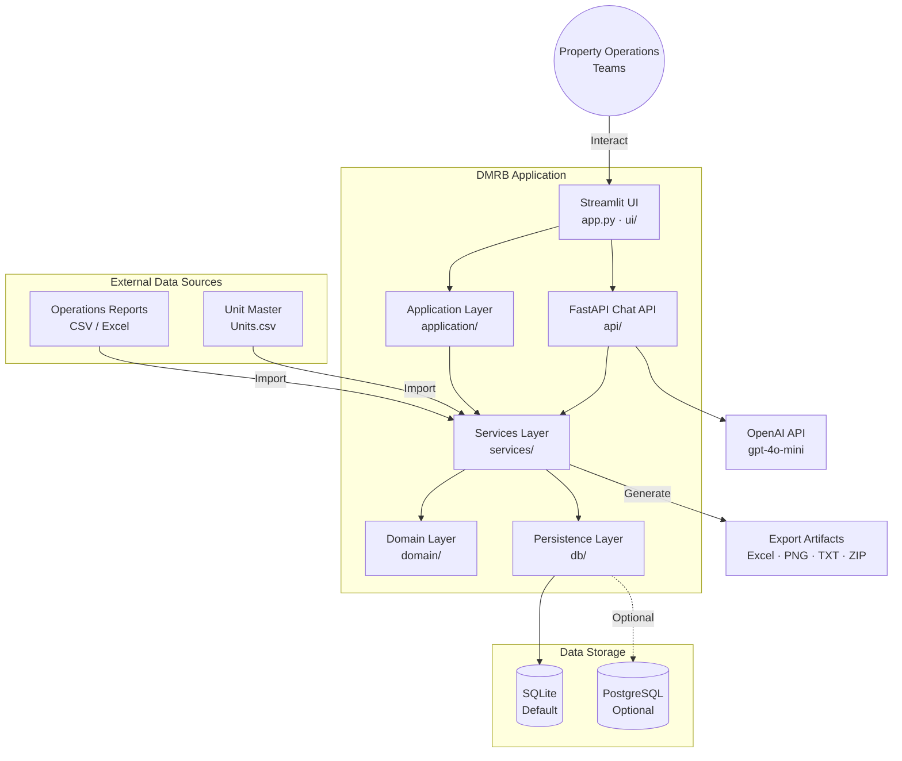

The architecture layers and their responsibilities are defined as follows:

| Layer | Location | Responsibility |
|---|---|---|
| **Streamlit UI** | `app.py`, `ui/` | Presentation, user interaction, session state; contains no business rules |
| **Application** | `application/commands/`, `application/workflows/` | Immutable command DTOs and thin orchestration workflows for write operations |
| **Domain** | `domain/` | Pure deterministic business logic: lifecycle, enrichment, risk, SLA, unit identity |
| **Services** | `services/` | Orchestration, reconciliation, imports, exports, AI, audit-aware write workflows |
| **Persistence** | `db/` | Schema, ordered migrations, repository CRUD, database adapter abstraction (SQLite + PostgreSQL) |
| **API** | `api/` | FastAPI transport layer exclusively for AI chat endpoints (`/health`, `/api/chat/*`) |
| **Configuration** | `config/` | Runtime settings: database engine, actor, phases, timezone, write-enable defaults |

The intended design boundary is architecturally significant and consistently enforced:

- The **UI layer** contains no business rules — it delegates all logic to lower layers.
- The **Domain layer** remains pure and deterministic — no I/O, no side effects, no database access.
- The **Services layer** orchestrates all writes, imports, reconciliation, and audit operations.
- The **Persistence layer** owns all SQL generation, migration execution, and database interaction.

This separation ensures that most core business behaviors are implemented as explicit Python logic in testable modules rather than being embedded in UI components or persistence queries.

#### Core Technical Approach

DMRB operates as an **operational rules engine with a UI**, not a simple CRUD application. The system's technical approach is characterized by five defining patterns:

1. **Deterministic Lifecycle Derivation**: Turnover phases are computed from date field state using explicit precedence rules in `domain/lifecycle.py`. The effective move-out date is resolved through a four-tier precedence chain: (1) manager manual override (`move_out_manual_override_at` + `move_out_date`), (2) legal confirmation (`legal_confirmation_source` → `confirmed_move_out_date`), (3) scheduled date (`scheduled_move_out_date`), (4) legacy fallback (`move_out_date`).

2. **Template-Driven Task Instantiation**: Task sets for new turnovers are generated from configurable templates (`task_template` table) with support for inter-task dependencies (`task_template_dependency` table). Tasks track both execution status (`NOT_STARTED`, `SCHEDULED`, `IN_PROGRESS`, `VENDOR_COMPLETED`, `NA`, `CANCELED`) and confirmation status (`PENDING`, `CONFIRMED`, `REJECTED`, `WAIVED`).

3. **Reconciliation-Based Imports**: Imports do not use naive last-write-wins. Override protection ensures that operator-entered dates and statuses — tracked with manual override timestamps — take precedence over later imported values when conflicts arise.

4. **Constraint-Enforced Data Integrity**: The database schema in `db/schema.sql` enforces critical invariants, including a partial unique index (`idx_one_open_turnover_per_unit`) ensuring only one open turnover per unit, and CHECK constraints for risk types, execution statuses, and confirmation statuses.

5. **Automatic Bootstrap and Migration**: Database schema creation and all 13 ordered migrations (`db/migrations/001` through `013`) execute automatically at startup via `ensure_database_ready()` in `db/connection.py`. This eliminates the need for a separate deployment or migration step.

#### Turnover Lifecycle State Model

The turnover lifecycle is the central domain concept in DMRB. Each turnover progresses through a series of phases that are derived deterministically from its date field state by `domain/lifecycle.py`:

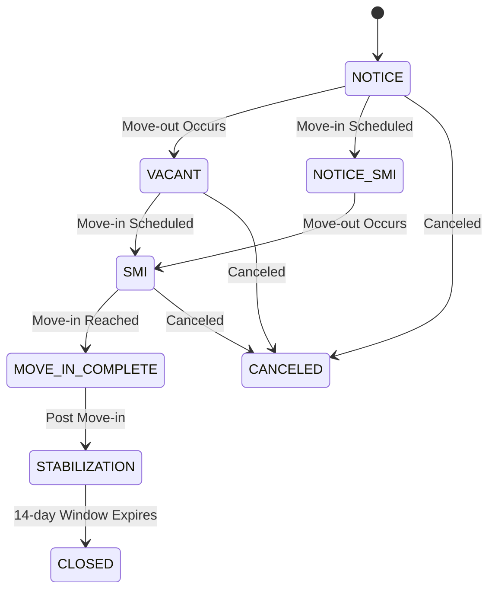

| Phase | Description |
|---|---|
| `NOTICE` | Pre-move-out; unit is on notice to vacate |
| `NOTICE_SMI` | On notice with a scheduled move-in already set |
| `VACANT` | Post-move-out; no move-in date yet scheduled |
| `SMI` | Post-move-out; scheduled move-in is upcoming |
| `MOVE_IN_COMPLETE` | Move-in date has been reached |
| `STABILIZATION` | Post-move-in; within the 14-day stabilization window |
| `CANCELED` | Turnover has been canceled |
| `CLOSED` | Turnover lifecycle is complete |

Phase transitions are not triggered by explicit user actions on the phase field itself. Instead, phases are *derived* from the current state of date fields on the turnover record, making the lifecycle evaluation purely deterministic and reproducible.

### 1.2.3 Technology Stack

The following technologies comprise the DMRB runtime and development environment, as specified in `requirements.txt`, `packages.txt`, and `.devcontainer/devcontainer.json`:

| Technology | Version | Role |
|---|---|---|
| Python | 3.10+ (dev container: 3.11) | Runtime language |
| Streamlit | 1.48.0 (pinned) | Frontend UI framework |
| SQLite | Built-in | Default local database engine |
| PostgreSQL | Optional | Alternate deployment database |
| pandas | 2.3.1 (pinned) | Data manipulation for import/export pipelines |
| openpyxl | 3.1.5 (pinned) | Excel file read/write operations |
| matplotlib | 3.9.2 (pinned) | Chart and dashboard PNG generation |
| FastAPI | Unpinned | HTTP API layer for chat endpoints |
| uvicorn | Unpinned | ASGI server for FastAPI |
| openai | Unpinned | LLM integration (default model: `gpt-4o-mini`) |
| psycopg\[binary\] | 3.3.3 (pinned) | PostgreSQL adapter (optional deployment path) |
| pytest | Dev dependency | Behavioral and regression test framework |
| libpq-dev | System package | Native PostgreSQL library dependency |

Runtime configuration is centralized in the `Settings` dataclass within `config/settings.py`. Key configurable parameters include:

| Parameter | Default | Environment Override |
|---|---|---|
| `database_engine` | `"sqlite"` | — |
| `database_path` | `data/cockpit.db` | `COCKPIT_DB_PATH` / `DMRB_DATABASE_PATH` |
| `database_url` | — | `DATABASE_URL` (PostgreSQL) |
| `default_property_id` | `1` | `DMRB_DEFAULT_PROPERTY_ID` |
| `allowed_phases` | `("5", "7", "8")` | `DMRB_ALLOWED_PHASES` |
| `timezone` | `"UTC"` | `DMRB_TIMEZONE` |
| `enable_db_writes_default` | `False` (SQLite) / `True` (Postgres) | `DMRB_ENABLE_DB_WRITES_DEFAULT` |
| `default_actor` | `"manager"` | `DMRB_DEFAULT_ACTOR` |

### 1.2.4 Success Criteria

#### Measurable Objectives

| Objective | Measure | Evidence |
|---|---|---|
| Complete lifecycle tracking | All turnovers tracked from notice through stabilization or closure | `domain/lifecycle.py` — eight lifecycle phases |
| SLA breach detection | Breaches identified against 10-day readiness threshold | `domain/sla_engine.py` — `SLA_THRESHOLD_DAYS = 10` |
| Audit completeness | All mutations recorded with source and actor attribution | `audit_log` table in `db/schema.sql` |
| Import reliability | Checksum-based idempotency prevents duplicate batch processing | `services/import_service.py`, `import_batch` table |
| Data integrity enforcement | Single open turnover per unit invariant maintained at all times | `idx_one_open_turnover_per_unit` partial unique index |
| Risk coverage | Eight operational risk types systematically evaluated | `domain/risk_engine.py` — risk type enum |

#### Critical Success Factors

- **Deterministic Lifecycle Evaluation**: Phase computation must produce identical results given identical date field state. No dependence on UI state, timing, or external context is permitted.
- **Override Protection Integrity**: Manual overrides must survive import cycles without silent overwriting. Override timestamps must be preserved for auditability and conflict resolution.
- **Reliable Automatic Bootstrap**: Schema creation and all 13 ordered migrations must execute successfully on every application startup without manual intervention, as managed by `ensure_database_ready()`.
- **Layer Discipline**: Business rules must remain exclusively in the domain layer. No business logic may leak into UI components, persistence queries, or configuration modules.
- **Import Reconciliation Accuracy**: Override-aware field resolution must correctly handle all five report types, respecting manual overrides and producing auditable import records.

#### Key Performance Indicators

| KPI | Target Behavior |
|---|---|
| Risk evaluation completeness | All eight risk types evaluated on every significant lifecycle or task change |
| Task template fidelity | Template-driven task sets instantiated with correct dependencies for every new turnover |
| Import audit coverage | Every import batch and every import row tracked with validation outcomes |
| SLA monitoring coverage | Breach detection applied to all active turnovers with scheduled move-in dates |
| Audit trail completeness | `manual`, `import`, and `system` sources captured with actor attribution for all state changes |

---

## 1.3 Scope

### 1.3.1 In-Scope

#### Core Features and Functionalities

| Feature Category | Must-Have Capabilities |
|---|---|
| **Board Operations** | DMRB Board with phase/status/assignee/QC filters; Flag Bridge for breach prioritization; Risk Radar for scored risk ranking |
| **Turnover Management** | Lifecycle date editing, task management, note capture, washer/dryer state tracking, manual readiness status assignment |
| **Import Pipelines** | Structured ingestion of five report types: `MOVE_OUTS`, `PENDING_MOVE_INS`, `AVAILABLE_UNITS`, `PENDING_FAS`, `DMRB` |
| **Unit Master Import** | Property/phase/building/unit hierarchy bootstrap and repair from `Units.csv` |
| **Manual Availability** | Manual turnover creation for existing units outside the import pipeline |
| **Task Engine** | Template-driven instantiation with inter-task dependencies; execution and confirmation status tracking |
| **Risk Engine** | Evaluation of eight risk types with reconciliation on lifecycle changes |
| **SLA Engine** | Breach detection and tracking against configurable readiness thresholds |
| **Export Workflows** | Generation of `Final_Report.xlsx`, `DMRB_Report.xlsx`, `Dashboard_Chart.png`, `Weekly_Summary.txt`, `DMRB_Reports.zip` |
| **AI Assistant** | Conversational agent with turnover context injection via OpenAI integration |
| **Audit System** | Append-only logging for manual, import, and system changes with actor attribution |
| **Write Control** | UI writes gated by `Enable DB Writes` toggle; default off for SQLite |

#### Primary User Workflows

| Workflow | Description |
|---|---|
| Board Review | Inspect active turnovers with phase, status, lifecycle, assignee, and QC filters on the DMRB Board |
| Flag Review | Prioritize turnovers based on breach conditions and operational flags via Flag Bridge |
| Turnover Detail Management | Edit lifecycle dates, manage tasks, add notes, update washer/dryer state and readiness status |
| Report Import | Ingest external operational reports (CSV/Excel) through five structured import pipelines |
| Unit Master Maintenance | Bootstrap or repair the property/phase/building/unit hierarchy from a structured Unit Master file |
| Manual Availability Entry | Create turnovers for existing units that are not covered by import pipelines |
| Dropdown Configuration | Manage task assignees, scheduling offsets, and template defaults via Admin tools |
| Report Export | Generate and download operational report artifacts in Excel, PNG, text, or ZIP formats |
| AI Chat | Query the DMRB AI agent for turnover-related insights and contextual assistance |

#### Implementation Boundaries

| Boundary Dimension | Specification |
|---|---|
| **Property Scope** | Single-property operations, configurable via `default_property_id` (default: `1`) |
| **Phase Filtering** | Configurable phase subset via `allowed_phases` (default: phases `5`, `7`, `8`) |
| **Deployment Model** | Local, offline-first; SQLite default with optional PostgreSQL deployment path |
| **User Groups** | Property operations managers (primary), maintenance supervisors, operations reviewers (read-only) |
| **Data Domains** | Units, turnovers, tasks, notes, risk flags, SLA events, import audit records, chat sessions |
| **Write Gating** | All UI database writes controlled by an explicit `Enable DB Writes` toggle |
| **Database Bootstrap** | Schema and migrations applied automatically at startup — no separate deployment step |

### 1.3.2 Out-of-Scope

The following capabilities are explicitly excluded from the DMRB system's current design and implementation. These exclusions reflect deliberate architectural decisions, not implementation gaps:

| Excluded Capability | Rationale |
|---|---|
| Generic property management platform | DMRB is purpose-built exclusively for turnover/make-ready workflows |
| Multi-service / cloud-native architecture | Single-process local application; no microservices, container orchestration, or service mesh |
| API-first design | FastAPI layer exists solely for AI chat endpoints; not a general-purpose REST API |
| Authentication / authorization | No auth layer, user management, role-based access control, or secret-managed integrations |
| Multi-tenant operations | Single-property-ID design; no tenant isolation, cross-property aggregation, or organizational hierarchy |
| Packaged deployable service | Not structured as separately deployable backend/frontend services |
| Real-time collaborative editing | Single-user operational model; no concurrent write conflict resolution or real-time synchronization |
| Mobile-native interface | Streamlit web UI only; no native iOS or Android application |
| External API-to-API integrations | All external data ingestion is file-based (CSV/Excel); no live API integrations with external systems |
| Historical analytics / data warehousing | Operational system focused on active turnovers; not a BI, analytics, or historical reporting platform |

### 1.3.3 Future Phase Considerations

The following items are identified for potential future implementation based on existing preparatory work visible in the codebase:

| Future Phase | Current State | Evidence |
|---|---|---|
| **PostgreSQL Migration** | Migration infrastructure prepared: `db/postgres_schema.sql` defined, migration scripts in `scripts/migrate_to_postgres`, deployment guide in `docs/POSTGRES_MIGRATION.md` | PostgreSQL driver (`psycopg[binary]` 3.3.3) already in `requirements.txt`; database adapter abstraction in `db/` supports both engines |
| **Backend Enrichment Completion** | Some board enrichment features remain in progress | `docs/BACKEND_ENRICHMENT_DELIVERABLES.md` tracks outstanding items; enrichment parity test failures indicate active development |
| **Test Suite Stabilization** | Automated tests do not currently achieve a fully passing baseline | 21 test files in `tests/` covering critical paths; failures concentrated in enrichment parity and manual-override schema paths |
| **Staged Verification** | Verification infrastructure exists for incremental delivery validation | `spec/` contains Phase 0 baseline, Stage 2D verification, and post-cleanup health report documents |

### 1.3.4 Current System State and Delivery Risks

The DMRB repository is in a **partially transitional state**. The architecture and layered design boundaries are clearly established, but the following conditions are material to delivery planning and should be understood by all stakeholders:

| Risk Area | Description | Impact |
|---|---|---|
| **Test Suite Status** | `pytest -q` does not currently achieve a fully passing baseline; failures concentrated in enrichment parity and turnover/manual-override schema paths | Any planning that assumes a stable green test baseline would be misleading; test stabilization is a prerequisite for CI confidence |
| **Schema Evolution** | 13 ordered migrations (`db/migrations/001`–`013`) reflect incremental schema evolution; bridge-era compatibility patterns remain visible, especially around property/phase hierarchy changes | Schema changes must be carefully validated against both SQLite and PostgreSQL paths |
| **Documentation Currency** | Some documents in `docs/` and `spec/` describe transitional architecture states | Code is the authoritative reference; older planning documents may not reflect current implementation |
| **PostgreSQL Readiness** | Migration path is prepared but not yet the default production target | SQLite remains the operational default; PostgreSQL deployment requires explicit configuration |

These conditions are documented transparently to support accurate risk assessment and delivery planning. The codebase's layered architecture and explicit domain logic provide a strong foundation, but the transitional elements identified above require attention before the system reaches full production readiness.

---

#### References

- `README.md` — Primary project overview, feature descriptions, architecture summary, tech stack, setup instructions, development guidelines, and deployment documentation
- `requirements.txt` — Python dependency manifest with pinned versions for all runtime and optional dependencies
- `packages.txt` — System-level package dependency specification (`libpq-dev`)
- `config/settings.py` — Runtime configuration `Settings` dataclass with environment variable mappings, defaults, and secrets-first lookup path
- `domain/lifecycle.py` — Turnover lifecycle phase constants, effective move-out date four-tier precedence logic, and deterministic phase derivation rules
- `domain/risk_engine.py` — Risk evaluation engine implementing systematic assessment of eight operational risk types
- `domain/risk_radar.py` — Risk scoring and ranked visibility module
- `domain/sla_engine.py` — SLA breach detection logic with `SLA_THRESHOLD_DAYS = 10` configuration
- `domain/enrichment.py` — Board enrichment logic for derived turnover status fields and Flag Bridge data
- `domain/unit_identity.py` — Unit identity canonicalization through normalized phase-building-unit parsing
- `db/schema.sql` — Complete canonical SQLite schema defining 18 tables with CHECK constraints, partial unique indexes, and foreign key relationships
- `db/connection.py` — Database connection management, `ensure_database_ready()` bootstrap entry point, and migration runner
- `db/repository.py` — Repository layer with CRUD operations and integrated audit logging
- `db/migrations/` — 13 ordered SQL migration files (001–013) for incremental schema evolution
- `db/postgres_schema.sql` — PostgreSQL-specific schema definition for alternate deployment path
- `app.py` — Streamlit application entry point, backend initialization, and UI wiring logic
- `application/commands/` — Immutable command DTO definitions for write operations
- `application/workflows/` — Thin orchestration workflow modules for application-layer coordination
- `services/import_service.py` — Import pipeline orchestration for five report types with checksum-based idempotency
- `services/unit_master_import_service.py` — Unit Master Import for property hierarchy bootstrap and repair
- `services/board_query_service.py` — Board query construction and enrichment integration
- `services/turnover_service.py` — Turnover lifecycle mutation orchestration
- `services/task_service.py` — Task management, template instantiation, and dependency handling
- `services/note_service.py` — Operator note management service
- `services/manual_availability_service.py` — Manual turnover creation flow for existing units
- `services/export_service.py` — Export workflow orchestration for multiple output formats
- `services/excel_writer.py` — Excel report generation (`Final_Report.xlsx`, `DMRB_Report.xlsx`)
- `services/chat_service.py` — AI chat session management and message handling
- `services/ai_context_service.py` — Turnover context injection for AI agent conversations
- `services/sla_service.py` — SLA tracking service orchestration
- `services/risk_service.py` — Risk reconciliation service orchestration
- `api/chat_routes.py` — FastAPI route definitions for chat endpoints (`/health`, `/api/chat/*`)
- `ui/` — Streamlit UI components and view modules (board, detail, admin, flag bridge views)
- `tests/` — pytest test suite with 21 test files covering database, imports, overrides, SLA, risk, enrichment, exports, and AI integration
- `docs/POSTGRES_MIGRATION.md` — PostgreSQL migration guide and Streamlit Community Cloud deployment documentation
- `docs/BACKEND_ENRICHMENT_DELIVERABLES.md` — Backend enrichment feature tracking document
- `spec/` — Architecture specification hub with staged verification documents (Phase 0, Stage 2D, post-cleanup health reports)
- `scripts/migrate_to_postgres` — PostgreSQL migration utility scripts
- `.devcontainer/devcontainer.json` — Development container configuration specifying Python 3.11 runtime
- Streamlit 1.48.0 release — [GitHub Release](https://github.com/streamlit/streamlit/releases/tag/1.48.0)
- Psycopg 3.3.3 — [PyPI](https://pypi.org/project/psycopg/)

# 2. Product Requirements

## 2.1 Feature Catalog

### 2.1.1 Feature Registry

The DMRB system is decomposed into twenty discrete features organized across nine functional categories. Each feature is grounded in implemented code and verified against the repository's source modules. The following registry provides a consolidated view of all features with their classification metadata.

| ID | Feature Name | Category | Priority |
|---|---|---|---|
| F-001 | DMRB Board | Board Operations | Critical |
| F-002 | Flag Bridge | Board Operations | High |
| F-003 | Risk Radar | Board Operations | High |
| F-004 | Turnover Lifecycle Management | Lifecycle Management | Critical |
| F-005 | Import Pipelines | Data Ingestion | Critical |
| F-006 | Task Engine | Task Management | Critical |
| F-007 | SLA Engine | SLA & Risk Compliance | Critical |
| F-008 | Risk Engine | SLA & Risk Compliance | Critical |
| F-009 | Manual Override Protection | Data Integrity | High |
| F-010 | Unit Identity Management | Data Integrity | High |
| F-011 | Manual Availability | Lifecycle Management | Medium |
| F-012 | Unit Master Import | Data Ingestion | Medium |
| F-013 | Audit Logging | Operational Support | Critical |
| F-014 | Export Workflows | Operational Support | High |
| F-015 | Turnover Detail Management | Lifecycle Management | High |
| F-016 | Note Management | Operational Support | Low |
| F-017 | Write Control | Infrastructure | High |
| F-018 | AI Chat Assistant | AI Integration | Low |
| F-019 | Database Bootstrap & Migration | Infrastructure | Critical |
| F-020 | Enrichment Cache | Infrastructure | Medium |

All features carry a status of **Completed** based on implemented code in the repository. However, the test suite does not currently pass fully—failures are concentrated in enrichment parity and manual-override schema paths—which represents a delivery risk documented in Section 1.3.4.

### 2.1.2 Board Operations

#### F-001: DMRB Board (Operational Board)

| Attribute | Detail |
|---|---|
| **Feature ID** | F-001 |
| **Category** | Board Operations |
| **Priority** | Critical |

**Overview:** The DMRB Board is the primary operational interface, assembling flat board rows from turnover, unit, task, note, and risk repository data into a consolidated view of all active turnovers. It is implemented in `services/board_query_service.py` via the `get_dmrb_board_rows()` entry point, with a pure deterministic enrichment pipeline in `domain/enrichment.py`.

**Business Value:** Consolidates fragmented spreadsheet-based turnover tracking into a single, filterable operational board with derived status fields, eliminating manual cross-referencing across multiple data sources.

**User Benefits:** Operations managers can inspect all active turnovers with phase, status, assignee, and QC filters, sorted by move-in availability and days vacant. Derived fields such as days vacant (dv), days to be ready (dtbr), NVM classification, SLA breach flags, and attention badges are computed automatically.

**Technical Context:** The enrichment pipeline processes a fixed sequence of eight task types (`Insp`, `CB`, `MRB`, `Paint`, `MR`, `HK`, `CC`, `FW`) as defined in `domain/enrichment.py` (line 23), each with expected duration days. Nine task slots are flattened into fixed fields. Phase filtering defaults to phases `5`, `7`, `8` via `allowed_phases` in `config/settings.py`. Sorting uses move-in availability and parsed move-in date, with days vacant as tiebreaker.

**Dependencies:**

| Dependency Type | Dependencies |
|---|---|
| Prerequisite Features | F-004 (Lifecycle), F-006 (Task Engine), F-007 (SLA), F-008 (Risk) |
| System Dependencies | F-019 (Database Bootstrap), F-020 (Enrichment Cache) |
| Integration Requirements | `db/repository.py` for data access |

---

#### F-002: Flag Bridge (Breach-Focused View)

| Attribute | Detail |
|---|---|
| **Feature ID** | F-002 |
| **Category** | Board Operations |
| **Priority** | High |

**Overview:** The Flag Bridge provides a breach-focused subset view of the DMRB Board, allowing operators to filter and prioritize turnovers by specific breach conditions. It is implemented in `services/board_query_service.py` via `get_flag_bridge_rows()`.

**Business Value:** Enables rapid operational prioritization by surfacing only turnovers that match selected breach criteria, reducing the cognitive load of scanning the full board for critical issues.

**User Benefits:** Users select a breach label (e.g., `"Insp Breach"`, `"Plan Bridge"`), and the view returns only matching turnovers with a Yes/No filter option.

**Technical Context:** A `BRIDGE_MAP` dictionary in `services/board_query_service.py` translates user-facing breach labels into enriched boolean keys from the board enrichment pipeline. The feature fully reuses the `get_dmrb_board_rows()` pipeline, applying breach-specific filtering as a post-processing step.

**Dependencies:**

| Dependency Type | Dependencies |
|---|---|
| Prerequisite Features | F-001 (DMRB Board) |
| System Dependencies | Inherits all F-001 dependencies |

---

#### F-003: Risk Radar (Scored Risk Ranking)

| Attribute | Detail |
|---|---|
| **Feature ID** | F-003 |
| **Category** | Board Operations |
| **Priority** | High |

**Overview:** Risk Radar provides a scored, ranked view of operational risk across all active turnovers. Implemented in `domain/risk_radar.py` with board integration via `services/board_query_service.py` (`get_risk_radar_rows()`).

**Business Value:** Transforms individual risk flags into a composite score, enabling operations managers to focus attention on the highest-risk turnovers rather than reviewing flags one at a time.

**User Benefits:** Each turnover receives a numeric risk score and a categorical risk level (LOW, MEDIUM, HIGH), with the ability to filter by risk level and sort highest risk first. Risk reasons are surfaced for each scored turnover.

**Technical Context:** Scoring uses seven weighted risk factors defined in `domain/risk_radar.py` (lines 10–18): `inspection_overdue` (weight 3), `task_execution_overdue` (2), `qc_rejected` (2), `sla_breach` (3), `sla_near_breach` (2), `blocked_dependency` (1), `movein_approaching_incomplete` (2). Risk level thresholds are: LOW ≤ 2, MEDIUM ≤ 5, HIGH > 5 (lines 20–21).

**Dependencies:**

| Dependency Type | Dependencies |
|---|---|
| Prerequisite Features | F-001 (DMRB Board), F-008 (Risk Engine) |
| System Dependencies | Inherits all F-001 dependencies |

---

### 2.1.3 Turnover Lifecycle Management

#### F-004: Turnover Lifecycle Management

| Attribute | Detail |
|---|---|
| **Feature ID** | F-004 |
| **Category** | Lifecycle Management |
| **Priority** | Critical |

**Overview:** The turnover lifecycle is the central domain concept in DMRB. Each turnover progresses through deterministically derived phases based on date field state, implemented as pure logic in `domain/lifecycle.py` with mutation orchestration in `services/turnover_service.py`.

**Business Value:** Replaces ad-hoc, manually assigned status labels with a deterministic state model that ensures consistent lifecycle tracking across the entire operation. The four-tier effective move-out date precedence chain ensures the most authoritative date is always used.

**User Benefits:** Operations staff can trust that phase designations (NOTICE, VACANT, SMI, MOVE_IN_COMPLETE, STABILIZATION, etc.) always reflect the actual state of date fields on the turnover record, without manual phase management.

**Technical Context:** Eight lifecycle phases are defined in `domain/lifecycle.py` (lines 4–11): `NOTICE`, `NOTICE_SMI`, `VACANT`, `SMI`, `MOVE_IN_COMPLETE`, `STABILIZATION`, `CANCELED`, `CLOSED`. The effective move-out date is resolved through a four-tier precedence chain (lines 32–55): (1) manager manual override, (2) legal confirmation, (3) scheduled date, (4) legacy fallback. Auto-close triggers after a 14-day stabilization window (line 75) unless blocked by an active `CRITICAL` risk flag (`services/turnover_service.py`, lines 434–455). Turnover creation enforces one open turnover per unit via the `idx_one_open_turnover_per_unit` partial unique index.

**Dependencies:**

| Dependency Type | Dependencies |
|---|---|
| Prerequisite Features | F-010 (Unit Identity) |
| System Dependencies | F-019 (Database Bootstrap) |
| Integration Requirements | F-007 (SLA), F-008 (Risk) for reconciliation after mutations |

---

#### F-011: Manual Availability

| Attribute | Detail |
|---|---|
| **Feature ID** | F-011 |
| **Category** | Lifecycle Management |
| **Priority** | Medium |

**Overview:** Enables manual turnover creation for existing units that are not covered by import pipelines. Implemented in `services/manual_availability_service.py`.

**Business Value:** Provides an operational fallback for creating turnovers when units do not appear in imported reports, ensuring complete operational coverage.

**User Benefits:** Operations managers can create a turnover directly for any existing unit without waiting for an import cycle.

**Technical Context:** The service validates the target unit exists in the database (does not create units), confirms the phase, building, and unit resolution hierarchy, and verifies no open turnover already exists for the unit. Source turnover key format: `"manual:{property_id}:{unit_identity_key}:{move_out_iso}"`. Delegates to `turnover_service.create_turnover_and_reconcile()` for turnover creation, task instantiation, and SLA/risk reconciliation (lines 19–91).

**Dependencies:**

| Dependency Type | Dependencies |
|---|---|
| Prerequisite Features | F-004 (Lifecycle), F-006 (Task Engine) |
| System Dependencies | F-007 (SLA), F-008 (Risk) |
| External Dependencies | Requires pre-existing unit in database |

---

#### F-015: Turnover Detail Management

| Attribute | Detail |
|---|---|
| **Feature ID** | F-015 |
| **Category** | Lifecycle Management |
| **Priority** | High |

**Overview:** Provides per-turnover editing capabilities for lifecycle dates, task state, washer/dryer panel, and readiness status. Implemented across `services/turnover_service.py`.

**Business Value:** Allows operators to perform granular, audited updates to individual turnovers, supporting day-to-day operational management of the make-ready process.

**User Benefits:** Operators can update move-out, move-in, and report-ready dates; set manual readiness status (`Vacant ready`, `Vacant not ready`, `On notice`); confirm manual readiness; and manage washer/dryer state—all with automatic SLA and risk reconciliation.

**Technical Context:** Key capabilities include `set_manual_ready_status()` (lines 160–208), `confirm_manual_ready()` (lines 211–257), `update_wd_panel()` (lines 260–318), and `update_turnover_dates()` (lines 321–401). Date updates set manual override timestamps and trigger full SLA and risk reconciliation. Washer/dryer panel manages `wd_present`, `wd_present_type`, `wd_supervisor_notified`, and `wd_installed` fields with timestamps.

**Dependencies:**

| Dependency Type | Dependencies |
|---|---|
| Prerequisite Features | F-004 (Lifecycle), F-006 (Task Engine) |
| System Dependencies | F-007 (SLA), F-008 (Risk), F-009 (Override), F-013 (Audit) |

---

### 2.1.4 Data Ingestion

#### F-005: Import Pipelines

| Attribute | Detail |
|---|---|
| **Feature ID** | F-005 |
| **Category** | Data Ingestion |
| **Priority** | Critical |

**Overview:** Structured ingestion of five external operational report types with checksum-based idempotency, override-aware reconciliation, and full audit trail. Implemented in `services/import_service.py` with validation support in `imports/validation/`.

**Business Value:** Replaces manual data entry from external property management system reports with automated, auditable imports that respect operator decisions through override protection.

**User Benefits:** Operations teams can import CSV/Excel reports without risk of silently overwriting manually entered data. Each import is traceable through batch and row-level audit records.

**Technical Context:** Five report types are supported, each with specific parsing rules:

| Report Type | Format | Key Columns |
|---|---|---|
| `MOVE_OUTS` | CSV (skip 6 rows) | Unit, Move-Out Date |
| `PENDING_MOVE_INS` | CSV (skip 5 rows) | Unit, Move In Date |
| `AVAILABLE_UNITS` | CSV (skip 5 rows) | Unit, Status, Available Date |
| `PENDING_FAS` | CSV (skip 4 rows) | Unit Number, MO / Cancel Date |
| `DMRB` | Excel (.xlsx) | Unit, Ready_Date, Move_out, Move_in |

Checksum-based idempotency uses SHA-256 of `report_type + file_bytes` (lines 49–53); duplicate batches return `NO_OP`. Import outcomes are classified as `APPLIED`, `SKIPPED_OVERRIDE`, or `CONFLICT`. The auto-cancel behavior for `MOVE_OUTS` marks turnovers as canceled after missing from two consecutive imports (lines 880–905), tracked via `missing_moveout_count`.

**Dependencies:**

| Dependency Type | Dependencies |
|---|---|
| Prerequisite Features | F-004 (Lifecycle), F-006 (Task Engine), F-009 (Override), F-010 (Unit Identity) |
| System Dependencies | F-007 (SLA), F-013 (Audit), F-019 (Database Bootstrap) |
| External Dependencies | CSV/Excel files from external property management systems |

---

#### F-012: Unit Master Import

| Attribute | Detail |
|---|---|
| **Feature ID** | F-012 |
| **Category** | Data Ingestion |
| **Priority** | Medium |

**Overview:** Bootstraps or repairs the property/phase/building/unit hierarchy from a structured `Units.csv` file. Implemented in `services/unit_master_import_service.py`.

**Business Value:** Provides a reliable mechanism to establish or repair the foundational property hierarchy that all other features depend on, without manual database manipulation.

**User Benefits:** Administrators can initialize new properties or correct structural data (floor plans, square footage, unit codes) through a standard import workflow.

**Technical Context:** Updates are limited to structural attributes: `floor_plan`, `gross_sq_ft`, and raw unit code. The import creates or updates `property`, `phase`, `building`, and `unit` hierarchy records as needed.

**Dependencies:**

| Dependency Type | Dependencies |
|---|---|
| System Dependencies | F-019 (Database Bootstrap) |
| External Dependencies | `Units.csv` file |

---

### 2.1.5 Task Management

#### F-006: Task Engine

| Attribute | Detail |
|---|---|
| **Feature ID** | F-006 |
| **Category** | Task Management |
| **Priority** | Critical |

**Overview:** Template-driven task instantiation with inter-task dependencies, execution/confirmation status tracking, and reconciliation triggers. Task schema is defined in `db/schema.sql` (lines 98–114), with transitions in `services/task_service.py` and template instantiation in `services/import_service.py`.

**Business Value:** Automates the creation of standardized task sets for new turnovers, ensuring consistent work order coverage while supporting per-turnover customization through overrides.

**User Benefits:** When a turnover is created, the correct set of tasks is automatically generated from templates. Task transitions (vendor completion, manager confirmation, rejection) are validated and trigger operational reconciliation.

**Technical Context:** Execution statuses: `NOT_STARTED`, `SCHEDULED`, `IN_PROGRESS`, `VENDOR_COMPLETED`, `NA`, `CANCELED`. Confirmation statuses: `PENDING`, `CONFIRMED`, `REJECTED`, `WAIVED`. CHECK constraints enforce: `VENDOR_COMPLETED` requires `vendor_completed_at NOT NULL`; `CONFIRMED` requires both `vendor_completed_at` and `manager_confirmed_at NOT NULL`. Templates are scoped by `phase_id` (preferred) or `property_id` (fallback) with conditional applicability filters (`applies_if_has_carpet`, `applies_if_has_wd_expected`). The `turnover_task_override` table supports per-turnover required/blocking changes.

**Dependencies:**

| Dependency Type | Dependencies |
|---|---|
| Prerequisite Features | F-004 (Lifecycle) |
| System Dependencies | F-008 (Risk) for post-transition reconciliation, F-019 (Database Bootstrap) |

---

### 2.1.6 SLA & Risk Compliance

#### F-007: SLA Engine

| Attribute | Detail |
|---|---|
| **Feature ID** | F-007 |
| **Category** | SLA & Risk Compliance |
| **Priority** | Critical |

**Overview:** Evaluates and tracks SLA breaches against a configurable readiness threshold. Pure evaluation logic resides in `domain/sla_engine.py`; reconciliation orchestration is in `services/sla_service.py`.

**Business Value:** Provides systematic, deterministic SLA breach detection that replaces manual deadline tracking, enabling proactive intervention before readiness targets are missed.

**User Benefits:** Breaches are automatically detected, tracked as events, and surfaced in board views. The stop-dominance rule ensures that once manual readiness is confirmed, the breach cannot reopen.

**Technical Context:** The SLA threshold is defined as `SLA_THRESHOLD_DAYS = 10` in `domain/sla_engine.py` (line 5). A breach activates when `move_out_date ≤ today` AND `manual_ready_confirmed_at is None` AND `today - move_out_date > 10 days`. Stop dominance (lines 88–121 in `services/sla_service.py`) ensures `manual_ready_confirmed_at` permanently prevents breach reopening. Anchor change tracking (lines 59–79, 96–101) logs changes to the effective move-out date and updates `current_anchor_date` on open events. A convergence check (lines 204–243) flags `DATA_INTEGRITY` risk when persisted state diverges from evaluation output. SLA events are tracked in the `sla_event` table with a partial unique index (`idx_one_open_sla_breach`) ensuring one open breach per turnover.

**Dependencies:**

| Dependency Type | Dependencies |
|---|---|
| System Dependencies | F-008 (Risk) for DATA_INTEGRITY flagging, F-019 (Database Bootstrap) |
| Integration Requirements | Invoked by F-004, F-005, F-015 after lifecycle mutations |

---

#### F-008: Risk Engine

| Attribute | Detail |
|---|---|
| **Feature ID** | F-008 |
| **Category** | SLA & Risk Compliance |
| **Priority** | Critical |

**Overview:** Systematically evaluates eight operational risk types with severity-based classification. Pure evaluation in `domain/risk_engine.py`; reconciliation in `services/risk_service.py`.

**Business Value:** Surfaces operational risks—from QC gaps near move-in to data integrity conflicts—before they escalate into missed deadlines or quality failures, enabling a proactive operational posture.

**User Benefits:** Risk flags are automatically generated and resolved based on current turnover and task state, visible on board views and turnover detail screens.

**Technical Context:** Eight risk types are defined in `domain/risk_engine.py` (lines 4–11):

| Risk Type | Trigger Summary | Severity |
|---|---|---|
| `QC_RISK` | QC not confirmed, ≤3 days to move-in | CRITICAL (≤2d) / WARNING |
| `WD_RISK` | WD not present, supervisor not notified, ≤7 days | CRITICAL (≤3d) / WARNING |
| `CONFIRMATION_BACKLOG` | Vendor completed, not confirmed, age >2 days | CRITICAL (≥5d) / WARNING |
| `EXECUTION_OVERDUE` | Vendor due date passed, not completed | WARNING |
| `DATA_INTEGRITY` | Data integrity conflict flagged | CRITICAL |
| `DUPLICATE_OPEN_TURNOVER` | Duplicate open turnover detected | CRITICAL |
| `EXPOSURE_RISK` | Report ready date passed, not confirmed | CRITICAL (≥3d) / WARNING |
| `SLA_BREACH` | SLA breach condition active | Via SLA Engine |

Reconciliation in `services/risk_service.py` compares current active risks with `evaluate_risks()` output, upserts new risks, and resolves those no longer present. A partial unique index (`idx_one_active_risk_per_type`) enforces one active risk per type per turnover.

**Dependencies:**

| Dependency Type | Dependencies |
|---|---|
| System Dependencies | F-019 (Database Bootstrap) |
| Integration Requirements | Invoked by F-004, F-005, F-006, F-007, F-015 |

---

### 2.1.7 Data Integrity & Identity

#### F-009: Manual Override Protection

| Attribute | Detail |
|---|---|
| **Feature ID** | F-009 |
| **Category** | Data Integrity |
| **Priority** | High |

**Overview:** Preserves operator-entered values against silent overwriting during import processing through timestamp-tracked override fields. Logic is distributed across `services/import_service.py` and `services/turnover_service.py`.

**Business Value:** Ensures that institutional knowledge and deliberate operator decisions are not lost when automated imports bring in conflicting data—a critical operational integrity guarantee.

**User Benefits:** When an operator manually sets a date or status, subsequent imports that disagree with that value are skipped with an audit record. If a later import matches the manual value, the override is automatically cleared.

**Technical Context:** Four override timestamps are tracked in `services/turnover_service.py` (lines 321–401): `move_out_manual_override_at`, `move_in_manual_override_at`, `ready_manual_override_at`, and `status_manual_override_at`. During import, when an override timestamp exists and the import value differs, the row outcome is `SKIPPED_OVERRIDE`. When the import value matches the current manual value, the override is cleared (`override_at = None`) and an audit record with action `manual_override_cleared` is written. Skip audit records follow the format `field_key|report=REPORT_TYPE|v=value` with deduplication against the last recorded skip audit.

**Dependencies:**

| Dependency Type | Dependencies |
|---|---|
| System Dependencies | F-013 (Audit) for override event logging |
| Integration Requirements | Used by F-005 (Import), F-015 (Detail) |

---

#### F-010: Unit Identity Management

| Attribute | Detail |
|---|---|
| **Feature ID** | F-010 |
| **Category** | Data Integrity |
| **Priority** | High |

**Overview:** Provides deterministic unit code normalization, parsing, and identity key composition. Implemented as pure functions in `domain/unit_identity.py`.

**Business Value:** Ensures consistent unit identification across imports, manual entries, and board displays by canonicalizing all unit codes through a single normalization pipeline.

**User Benefits:** Eliminates data mismatches caused by inconsistent unit code formatting in external reports (varying case, whitespace, prefix conventions).

**Technical Context:** Three pure functions: `normalize_unit_code(raw)` (lines 9–21) strips whitespace, removes `"UNIT "` prefix case-insensitively, uppercases, and collapses whitespace. `parse_unit_parts(unit_code_norm)` (lines 24–56) decomposes into `(phase_code, building_code, unit_number)` using `"-"` separator with validation. `compose_identity_key(phase_code, building_code, unit_number)` (lines 59–70) produces the deterministic key `"{phase}-{building}-{unit}"`.

**Dependencies:**

| Dependency Type | Dependencies |
|---|---|
| System Dependencies | None (pure domain logic) |
| Integration Requirements | Used by F-004, F-005, F-011 |

---

### 2.1.8 Operational Support

#### F-013: Audit Logging

| Attribute | Detail |
|---|---|
| **Feature ID** | F-013 |
| **Category** | Operational Support |
| **Priority** | Critical |

**Overview:** Append-only change tracking with source attribution for all significant mutations. Defined in `db/schema.sql` (lines 185–196) with integration across all write services.

**Business Value:** Provides a complete, tamper-resistant record of all operational changes—supporting compliance, operational review, and dispute resolution.

**User Benefits:** Every change to a turnover, task, or related entity is traceable to a specific actor, source, and timestamp.

**Technical Context:** The `audit_log` table captures: `entity_type`, `entity_id`, `field_name`, `old_value`, `new_value`, `changed_at`, `actor`, `source`, and `correlation_id`. Source values are constrained by CHECK to `manual`, `import`, or `system`. Performance indexes exist on `entity_id`, `changed_at`, `field_name`, and the composite `(entity_type, entity_id, changed_at)`. The log is append-only with no deletes in the current schema version.

**Dependencies:**

| Dependency Type | Dependencies |
|---|---|
| System Dependencies | F-019 (Database Bootstrap) |

---

#### F-014: Export Workflows

| Attribute | Detail |
|---|---|
| **Feature ID** | F-014 |
| **Category** | Operational Support |
| **Priority** | High |

**Overview:** Generates operational report artifacts in multiple formats for offline review and distribution. Orchestrated by `services/export_service.py` with Excel generation in `services/excel_writer.py`.

**Business Value:** Enables operations teams to produce standardized reports for stakeholders who do not access the DMRB application directly, and supports offline operational review.

**User Benefits:** Multiple report formats are generated in parallel: `Final_Report.xlsx` (reconciliation-focused), `DMRB_Report.xlsx` (operational), `Dashboard_Chart.png`, `Weekly_Summary.txt`, and a bundled `DMRB_Reports.zip`.

**Technical Context:** Export uses `ThreadPoolExecutor` for parallel artifact generation. The `DMRB_Report.xlsx` includes 12 sheet types: Dashboard, Aging, Active Aging, Operations, Walking Path Board, Tasks, Schedule, Upcoming, WD Audit, Daily Ops, Priority, and Phase Performance. The `Final_Report.xlsx` includes: Reconciliation, Split View, Available Units, Move Ins, Move Outs, Pending FAS, and Move Activity sheets.

**Dependencies:**

| Dependency Type | Dependencies |
|---|---|
| Prerequisite Features | F-001 (DMRB Board) for board data |
| System Dependencies | `openpyxl`, `matplotlib` |

---

#### F-016: Note Management

| Attribute | Detail |
|---|---|
| **Feature ID** | F-016 |
| **Category** | Operational Support |
| **Priority** | Low |

**Overview:** Human-entered operational notes attached to turnovers, with creation and resolution capabilities. Implemented in `services/note_service.py`.

**Business Value:** Provides a structured way for operators to capture contextual information that is not represented in formal data fields.

**User Benefits:** Notes support `note_type`, `blocking` flag, and severity levels (`INFO`, `WARNING`, `CRITICAL`). Resolution is idempotent with a `resolved_at` timestamp.

**Technical Context:** Notes are explicitly excluded from lifecycle and risk calculations. All note operations (create, resolve) are audited. Unresolved notes are joined into board rows by the enrichment pipeline for display purposes.

**Dependencies:**

| Dependency Type | Dependencies |
|---|---|
| System Dependencies | F-013 (Audit), F-019 (Database Bootstrap) |

---

### 2.1.9 AI Integration

#### F-018: AI Chat Assistant

| Attribute | Detail |
|---|---|
| **Feature ID** | F-018 |
| **Category** | AI Integration |
| **Priority** | Low |

**Overview:** Conversational assistant with operational context injection for turnover-related queries. Orchestrated by `services/chat_service.py` with context from `services/ai_context_service.py` and exposed via `api/chat_routes.py`.

**Business Value:** Provides an accessible conversational interface for querying operational state without requiring operators to navigate complex board views for simple informational questions.

**User Benefits:** AI sessions support contextual queries with injected KPI summaries, assignee metrics, risk forecasts, phase comparisons, note counts, WD context, aging buckets, and CSV snapshots. Ten curated suggested questions guide initial use.

**Technical Context:** Default model is `gpt-4o-mini`. A 20-message history limit applies per conversation turn. Chat persistence uses `chat_session` and `chat_message` tables. The `reply_fn` override parameter supports testing without live API calls. This is the only feature with an external API dependency.

**Dependencies:**

| Dependency Type | Dependencies |
|---|---|
| Prerequisite Features | F-001 (DMRB Board) for context data |
| External Dependencies | OpenAI API (`gpt-4o-mini`) |
| System Dependencies | FastAPI (`api/chat_routes.py`) |

---

### 2.1.10 Infrastructure & Platform

#### F-017: Write Control

| Attribute | Detail |
|---|---|
| **Feature ID** | F-017 |
| **Category** | Infrastructure |
| **Priority** | High |

**Overview:** UI-level gating of database write operations through a session-state toggle. Configured in `config/settings.py` and enforced in `ui/actions/`.

**Business Value:** Enables safe read-only operational reviews and demonstrations without risk of accidental data modification.

**Technical Context:** The `Enable DB Writes` toggle defaults to `False` for SQLite and `True` for PostgreSQL (lines 64–69 of `config/settings.py`). Overridden by `DMRB_ENABLE_DB_WRITES_DEFAULT`. UI writes are gated by `st.session_state["enable_db_writes"]`.

**Dependencies:**

| Dependency Type | Dependencies |
|---|---|
| System Dependencies | `config/settings.py` |

---

#### F-019: Database Bootstrap & Migration

| Attribute | Detail |
|---|---|
| **Feature ID** | F-019 |
| **Category** | Infrastructure |
| **Priority** | Critical |

**Overview:** Automatic schema creation and ordered migration execution at application startup. Implemented in `db/connection.py` via `ensure_database_ready()`.

**Business Value:** Eliminates the need for separate deployment or migration steps, ensuring the database is always in the correct state when the application starts.

**Technical Context:** The canonical schema in `db/schema.sql` defines 18 tables. Thirteen ordered migrations (`db/migrations/001` through `013`) apply incremental changes. A `schema_version` table tracks the current version. SQLite PRAGMAs set `journal_mode=WAL` and `foreign_keys=ON`. The bootstrap includes a SQLite integrity check and timestamped backup creation. Python-side repair and backfill logic handles legacy schema drift.

**Dependencies:**

| Dependency Type | Dependencies |
|---|---|
| System Dependencies | SQLite (default) or PostgreSQL (optional) |

---

#### F-020: Enrichment Cache

| Attribute | Detail |
|---|---|
| **Feature ID** | F-020 |
| **Category** | Infrastructure |
| **Priority** | Medium |

**Overview:** Per-day caching of derived enrichment fields to reduce redundant computation on board loads. Defined in `db/schema.sql` (lines 201–206) with read/write integration in `services/board_query_service.py`.

**Business Value:** Improves board load performance by caching expensive enrichment computations, which are recalculated only when data changes or the cache becomes stale.

**Technical Context:** The `turnover_enrichment_cache` table stores a JSON payload of derived fields (dv, dtbr, nvm, task state, SLA flags, risk fields, etc.) keyed by turnover and date. Same-day cache entries are reused; stale entries are refreshed. Cache keys are defined via `ENRICHMENT_CACHE_KEYS` in the board query service.

**Dependencies:**

| Dependency Type | Dependencies |
|---|---|
| System Dependencies | F-019 (Database Bootstrap) |
| Integration Requirements | Used by F-001 (DMRB Board) |

---

## 2.2 Functional Requirements

### 2.2.1 Board Operations Requirements

#### F-001: DMRB Board

| Requirement ID | Description | Priority | Complexity |
|---|---|---|---|
| F-001-RQ-001 | Board shall assemble flat rows from turnover, unit, task, note, and risk data | Must-Have | High |
| F-001-RQ-002 | Enrichment pipeline shall compute all derived fields deterministically | Must-Have | High |
| F-001-RQ-003 | Board shall support in-memory filtering by status, NVM, assignee, QC state | Must-Have | Medium |
| F-001-RQ-004 | Board shall sort by move-in availability with days vacant as tiebreaker | Should-Have | Low |
| F-001-RQ-005 | Board shall apply configurable phase filtering | Must-Have | Low |

**Acceptance Criteria:**
- **F-001-RQ-001:** Given populated turnover, unit, task, note, and risk tables, the board returns a row for every open turnover within the allowed phases, with flattened task slots (nine slots) and joined unresolved notes.
- **F-001-RQ-002:** Given identical repository state, the enrichment pipeline in `domain/enrichment.py` produces identical derived fields (`dv`, `dtbr`, `nvm`, `phase`, task state, readiness flags, SLA breach flags, attention badge, risk score/level) on every invocation.
- **F-001-RQ-003:** When a user applies a filter (manual status, NVM classification, assignee membership, QC completion), only matching rows are returned.
- **F-001-RQ-004:** Returned rows are ordered by move-in availability descending, then by parsed move-in date, with `dv` (days vacant) as the tiebreaker.
- **F-001-RQ-005:** Only turnovers in phases matching `allowed_phases` (default: `5`, `7`, `8`) appear in results.

**Technical Specifications:**

| Aspect | Detail |
|---|---|
| Input | Property ID, date (today), phase filter, optional in-memory filters |
| Output | List of enriched flat row dictionaries |
| Performance | Per-day enrichment cache (`F-020`) reduces recomputation |
| Data Requirements | Populated `turnover`, `unit`, `task`, `note`, `risk_flag` tables |

**Validation Rules:**
- Task type sequence for enrichment must follow the canonical order: `["Insp", "CB", "MRB", "Paint", "MR", "HK", "CC", "FW"]` as defined in `domain/enrichment.py` (line 23).
- Expected days per task type must match the domain constants: `{"Insp": 1, "CB": 2, "MRB": 2, "Paint": 2, "MR": 3, "HK": 6, "CC": 7, "FW": 8}` (line 24).
- Phase filtering must be configurable at runtime and respect the `allowed_phases` setting.

---

#### F-002: Flag Bridge

| Requirement ID | Description | Priority | Complexity |
|---|---|---|---|
| F-002-RQ-001 | Flag Bridge shall reuse the DMRB Board enrichment pipeline | Must-Have | Low |
| F-002-RQ-002 | BRIDGE_MAP shall translate breach labels to enriched boolean keys | Must-Have | Low |
| F-002-RQ-003 | Users shall filter by a single selected breach flag with Yes/No | Should-Have | Low |

**Acceptance Criteria:**
- **F-002-RQ-001:** Flag Bridge output is a subset of the full board enrichment output; no independent enrichment computation occurs.
- **F-002-RQ-002:** Every user-facing breach label in `BRIDGE_MAP` corresponds to a valid boolean key in the enriched row.
- **F-002-RQ-003:** When a breach flag is selected with "Yes", only rows where that enriched key is truthy are returned; "No" returns rows where the key is falsy.

---

#### F-003: Risk Radar

| Requirement ID | Description | Priority | Complexity |
|---|---|---|---|
| F-003-RQ-001 | Each turnover shall receive a composite risk score from weighted factors | Must-Have | Medium |
| F-003-RQ-002 | Risk levels shall be classified as LOW (≤2), MEDIUM (≤5), HIGH (>5) | Must-Have | Low |
| F-003-RQ-003 | Results shall include risk reasons for each scored turnover | Should-Have | Low |
| F-003-RQ-004 | Results shall be sortable by risk score descending | Should-Have | Low |

**Acceptance Criteria:**
- **F-003-RQ-001:** Risk score equals the sum of weights for all active risk factors. Weights match `domain/risk_radar.py` definitions: `inspection_overdue` (3), `task_execution_overdue` (2), `qc_rejected` (2), `sla_breach` (3), `sla_near_breach` (2), `blocked_dependency` (1), `movein_approaching_incomplete` (2).
- **F-003-RQ-002:** A turnover with score 2 is classified LOW; score 5 is MEDIUM; score 6 is HIGH.
- **F-003-RQ-003:** The `risk_reasons` list contains a human-readable string for each active risk factor contributing to the score.

---

### 2.2.2 Turnover Lifecycle Requirements

#### F-004: Turnover Lifecycle Management

| Requirement ID | Description | Priority | Complexity |
|---|---|---|---|
| F-004-RQ-001 | Lifecycle phase shall be derived deterministically from date field state | Must-Have | High |
| F-004-RQ-002 | Effective move-out date shall follow four-tier precedence | Must-Have | High |
| F-004-RQ-003 | Only one open turnover per unit shall be allowed | Must-Have | Medium |
| F-004-RQ-004 | Auto-close shall trigger after 14-day stabilization window | Must-Have | Medium |
| F-004-RQ-005 | Auto-close shall be blocked by active CRITICAL risk flags | Must-Have | Medium |
| F-004-RQ-006 | Turnover creation shall instantiate tasks and run SLA/risk reconciliation | Must-Have | High |

**Acceptance Criteria:**
- **F-004-RQ-001:** Given `canceled_at is not None`, phase is `CANCELED`. Given `closed_at is not None`, phase is `CLOSED`. Given move-in present and `today > move_in_date + 14 days`, phase is `STABILIZATION`. Given move-in present and `today >= move_in_date`, phase is `MOVE_IN_COMPLETE`. Given move-out past and move-in scheduled, phase is `SMI`. Given move-out past and no move-in, phase is `VACANT`. Given pre-move-out with move-in, phase is `NOTICE_SMI`. Given pre-move-out without move-in, phase is `NOTICE`.
- **F-004-RQ-002:** Effective move-out date resolves in order: (1) `move_out_manual_override_at` + `move_out_date`, (2) `legal_confirmation_source` → `confirmed_move_out_date`, (3) `scheduled_move_out_date`, (4) `move_out_date` as legacy fallback.
- **F-004-RQ-003:** Creating a second open turnover for a unit that already has one raises an error (enforced by `idx_one_open_turnover_per_unit`).
- **F-004-RQ-004:** When `today > move_in_date + 14 days` and no blocking conditions exist, `closed_at` is set.
- **F-004-RQ-005:** When an active risk with severity `CRITICAL` exists, auto-close is not triggered.

**Validation Rules:**
- The `turnover` table CHECK constraint prevents a record from being both `closed_at IS NOT NULL` and `canceled_at IS NOT NULL` simultaneously.
- The `idx_one_open_turnover_per_unit` partial unique index enforces the single-open-turnover invariant at the database level.

---

#### F-011: Manual Availability

| Requirement ID | Description | Priority | Complexity |
|---|---|---|---|
| F-011-RQ-001 | System shall validate that the target unit exists in the database | Must-Have | Low |
| F-011-RQ-002 | System shall reject creation if an open turnover already exists | Must-Have | Low |
| F-011-RQ-003 | Created turnover shall follow full creation pipeline with tasks and reconciliation | Must-Have | Medium |

**Acceptance Criteria:**
- **F-011-RQ-001:** Attempting to add manual availability for a non-existent unit raises a `ValueError`.
- **F-011-RQ-002:** Attempting to add manual availability for a unit with an existing open turnover raises a `ValueError`.
- **F-011-RQ-003:** The resulting turnover has tasks instantiated from templates and SLA/risk reconciliation completed.

---

#### F-015: Turnover Detail Management

| Requirement ID | Description | Priority | Complexity |
|---|---|---|---|
| F-015-RQ-001 | Manual ready status shall accept only valid values | Must-Have | Low |
| F-015-RQ-002 | Manual readiness confirmation shall set `manual_ready_confirmed_at` | Must-Have | Low |
| F-015-RQ-003 | Date updates shall set override timestamps and trigger reconciliation | Must-Have | Medium |
| F-015-RQ-004 | WD panel updates shall manage presence, type, notification, and installation fields | Should-Have | Medium |

**Acceptance Criteria:**
- **F-015-RQ-001:** Only `'Vacant ready'`, `'Vacant not ready'`, and `'On notice'` are accepted for manual ready status (enforced by schema CHECK constraint).
- **F-015-RQ-003:** Updating `move_out_date` sets `move_out_manual_override_at` to current timestamp and triggers SLA and risk reconciliation.

---

### 2.2.3 Data Ingestion Requirements

#### F-005: Import Pipelines

| Requirement ID | Description | Priority | Complexity |
|---|---|---|---|
| F-005-RQ-001 | Imports shall be checksum-idempotent at the batch level | Must-Have | Medium |
| F-005-RQ-002 | Override-protected fields shall not be overwritten by imports | Must-Have | High |
| F-005-RQ-003 | Every import row shall be tracked with validation status and conflict data | Must-Have | Medium |
| F-005-RQ-004 | MOVE_OUTS shall create new turnovers or update existing ones | Must-Have | High |
| F-005-RQ-005 | MOVE_OUTS auto-cancel shall trigger after 2 consecutive absences | Must-Have | Medium |
| F-005-RQ-006 | PENDING_MOVE_INS shall update move-in dates with override protection | Must-Have | Medium |
| F-005-RQ-007 | PENDING_FAS shall set legal confirmation fields | Must-Have | Medium |
| F-005-RQ-008 | AVAILABLE_UNITS/DMRB shall reconcile ready/status fields | Must-Have | Medium |

**Acceptance Criteria:**
- **F-005-RQ-001:** Re-importing an identical file (same `report_type + file_bytes` SHA-256) returns status `NO_OP` without modifying any data.
- **F-005-RQ-002:** When `move_out_manual_override_at` is set and the import provides a different `move_out_date`, the import row outcome is `SKIPPED_OVERRIDE` and the existing value is preserved. When the import value matches, the override is cleared.
- **F-005-RQ-003:** Every processed row is recorded in `import_row` with `raw_json`, `unit_code_raw`, `unit_code_norm`, `validation_status`, `conflict_flag`, and `conflict_reason`.
- **F-005-RQ-004:** MOVE_OUTS import creates a new turnover (with task instantiation) if no open turnover exists for the unit; updates `scheduled_move_out_date` if an open turnover exists without override.
- **F-005-RQ-005:** A turnover not seen in two consecutive MOVE_OUTS imports receives `canceled_at` with reason `"Move-out disappeared from report twice"`, tracked via `missing_moveout_count`.
- **F-005-RQ-007:** PENDING_FAS sets `confirmed_move_out_date`, `legal_confirmation_source = "fas"`, `legal_confirmed_at` only when `legal_confirmation_source` is not already set; triggers SLA reconciliation with anchor change tracking.

**Technical Specifications:**

| Aspect | Detail |
|---|---|
| Input | CSV or Excel file, report type, property ID |
| Output | Batch record with status (SUCCESS/NO_OP/FAILED), per-row import records |
| Data Requirements | Unit hierarchy must exist for unit resolution |

**Validation Rules:**
- Phase filtering: rows are filtered to `VALID_PHASES` based on unit code during import.
- Diagnostics are emitted as structured records with `row_index`, `error_type`, `error_message`, `column`, and `suggestion`.
- Batch records capture `report_type`, `checksum`, `source_file_name`, `record_count`, and `status`.

---

#### F-012: Unit Master Import

| Requirement ID | Description | Priority | Complexity |
|---|---|---|---|
| F-012-RQ-001 | Import shall create or update property/phase/building/unit hierarchy | Must-Have | Medium |
| F-012-RQ-002 | Updates shall be limited to structural attributes only | Must-Have | Low |

**Acceptance Criteria:**
- **F-012-RQ-001:** Given a `Units.csv` with valid data, the property hierarchy is created or updated to reflect the file contents.
- **F-012-RQ-002:** Only `floor_plan`, `gross_sq_ft`, and raw unit code are modified; no turnover or task data is affected.

---

### 2.2.4 Task Management Requirements

#### F-006: Task Engine

| Requirement ID | Description | Priority | Complexity |
|---|---|---|---|
| F-006-RQ-001 | Tasks shall be instantiated from templates scoped by phase or property | Must-Have | High |
| F-006-RQ-002 | Vendor completion shall require setting execution status and timestamp | Must-Have | Medium |
| F-006-RQ-003 | Confirmation shall require prior vendor completion | Must-Have | Medium |
| F-006-RQ-004 | Rejection shall reset confirmation to REJECTED and execution to IN_PROGRESS | Must-Have | Medium |
| F-006-RQ-005 | All task transitions shall trigger SLA/risk reconciliation | Must-Have | Medium |
| F-006-RQ-006 | Templates shall support conditional applicability filters | Should-Have | Medium |
| F-006-RQ-007 | Inter-task dependencies shall be instantiated from template dependencies | Should-Have | Medium |

**Acceptance Criteria:**
- **F-006-RQ-001:** When a turnover is created, tasks are generated from templates matching the turnover's `phase_id` (preferred) or `property_id` (fallback). Default templates are ensured via `repository.ensure_default_task_templates()`.
- **F-006-RQ-002:** `mark_vendor_completed()` sets `execution_status = "VENDOR_COMPLETED"` and `vendor_completed_at` to current timestamp.
- **F-006-RQ-003:** `confirm_task()` raises an error if `execution_status != "VENDOR_COMPLETED"`. On success, sets `confirmation_status = "CONFIRMED"` and `manager_confirmed_at`.
- **F-006-RQ-004:** `reject_task()` requires `confirmation_status == "CONFIRMED"`. On success, sets `confirmation_status = "REJECTED"`, `execution_status = "IN_PROGRESS"`, and clears `manager_confirmed_at`.
- **F-006-RQ-006:** Templates with `applies_if_has_carpet = True` are only instantiated for units where `has_carpet` is true; similarly for `applies_if_has_wd_expected`.

**Validation Rules:**
- CHECK constraint: `VENDOR_COMPLETED` requires `vendor_completed_at NOT NULL`.
- CHECK constraint: `CONFIRMED` requires both `vendor_completed_at NOT NULL` and `manager_confirmed_at NOT NULL`.
- Unique constraint: `(turnover_id, task_type)` prevents duplicate task types per turnover.

---

### 2.2.5 SLA & Risk Compliance Requirements

#### F-007: SLA Engine

| Requirement ID | Description | Priority | Complexity |
|---|---|---|---|
| F-007-RQ-001 | Breach shall activate when threshold exceeded and readiness not confirmed | Must-Have | Medium |
| F-007-RQ-002 | Stop dominance shall prevent breach reopening after manual confirmation | Must-Have | Medium |
| F-007-RQ-003 | Anchor date changes shall be audit-logged | Must-Have | Low |
| F-007-RQ-004 | Convergence check shall flag DATA_INTEGRITY risk on state divergence | Should-Have | Medium |
| F-007-RQ-005 | Only one open breach per turnover shall exist at any time | Must-Have | Low |

**Acceptance Criteria:**
- **F-007-RQ-001:** Breach is active when: `move_out_date ≤ today` AND `manual_ready_confirmed_at IS NULL` AND `(today - move_out_date) > 10 days`. Breach is inactive otherwise.
- **F-007-RQ-002:** Once `manual_ready_confirmed_at` is set, no subsequent evaluation can reopen a breach for that turnover. Any existing open breach is force-closed.
- **F-007-RQ-004:** When the persisted SLA state (open or closed) does not match the output of `evaluate_sla_state()`, a `DATA_INTEGRITY` risk flag is raised.
- **F-007-RQ-005:** The `idx_one_open_sla_breach` partial unique index prevents multiple concurrent open breaches for a single turnover.

---

#### F-008: Risk Engine

| Requirement ID | Description | Priority | Complexity |
|---|---|---|---|
| F-008-RQ-001 | All eight risk types shall be evaluated on reconciliation | Must-Have | High |
| F-008-RQ-002 | New risks shall be upserted; resolved risks shall be closed | Must-Have | Medium |
| F-008-RQ-003 | Risk severity shall be assigned based on defined thresholds | Must-Have | Medium |
| F-008-RQ-004 | Only one active risk per type per turnover shall exist | Must-Have | Low |

**Acceptance Criteria:**
- **F-008-RQ-001:** Every call to `evaluate_risks()` checks conditions for all eight risk types against the current turnover and task state.
- **F-008-RQ-002:** Risks present in evaluation but not in the database are created; risks in the database but not in evaluation are resolved with `resolved_at` timestamp.
- **F-008-RQ-003:** `QC_RISK` is `CRITICAL` when ≤2 days to move-in, `WARNING` when ≤3 days. `WD_RISK` is `CRITICAL` when ≤3 days, `WARNING` when ≤7 days. `CONFIRMATION_BACKLOG` is `CRITICAL` when age ≥5 days, `WARNING` when 3–4 days. `EXPOSURE_RISK` is `CRITICAL` when ≥3 days past report ready date. All changes are audited with `source="system"`.

---

### 2.2.6 Data Integrity Requirements

#### F-009: Manual Override Protection

| Requirement ID | Description | Priority | Complexity |
|---|---|---|---|
| F-009-RQ-001 | Manual date changes shall set corresponding override timestamps | Must-Have | Low |
| F-009-RQ-002 | Imports shall skip overridden fields when values differ | Must-Have | Medium |
| F-009-RQ-003 | Overrides shall be cleared when import matches current value | Must-Have | Medium |
| F-009-RQ-004 | Skip audit records shall be deduplicated | Should-Have | Low |

**Acceptance Criteria:**
- **F-009-RQ-001:** Setting `move_out_date` manually sets `move_out_manual_override_at` to the current timestamp. Same for `move_in_date` → `move_in_manual_override_at`, `report_ready_date` → `ready_manual_override_at`, and `manual_ready_status` → `status_manual_override_at`.
- **F-009-RQ-003:** When an import value matches the current overridden value, the override timestamp is set to `None` and an audit record with action `manual_override_cleared` is written.
- **F-009-RQ-004:** Skip audit records are only written when the skipped value differs from the last recorded skip audit for the same field.

---

#### F-010: Unit Identity Management

| Requirement ID | Description | Priority | Complexity |
|---|---|---|---|
| F-010-RQ-001 | Unit codes shall be normalized consistently | Must-Have | Low |
| F-010-RQ-002 | Unit codes shall parse into phase/building/unit components | Must-Have | Low |
| F-010-RQ-003 | Identity keys shall be deterministic and reproducible | Must-Have | Low |

**Acceptance Criteria:**
- **F-010-RQ-001:** `normalize_unit_code("  unit 5-B-101  ")` returns `"5-B-101"`. Leading/trailing whitespace stripped, `"UNIT "` prefix removed case-insensitively, result uppercased, internal whitespace collapsed.
- **F-010-RQ-002:** `parse_unit_parts("5-B-101")` returns `("5", "B", "101")`. Validation rejects empty unit_number components.
- **F-010-RQ-003:** `compose_identity_key("5", "B", "101")` returns `"5-B-101"`. Identical inputs always produce identical keys.

---

### 2.2.7 Operational Support Requirements

#### F-013: Audit Logging

| Requirement ID | Description | Priority | Complexity |
|---|---|---|---|
| F-013-RQ-001 | Every significant mutation shall produce an audit record | Must-Have | Medium |
| F-013-RQ-002 | Audit records shall include source attribution | Must-Have | Low |
| F-013-RQ-003 | Audit log shall be append-only | Must-Have | Low |

**Acceptance Criteria:**
- **F-013-RQ-001:** Turnover creation, field changes, override events, SLA events, risk flag changes, task transitions, and note operations all write audit records.
- **F-013-RQ-002:** Every audit record includes a `source` value constrained to `manual`, `import`, or `system`, plus an `actor` identifier.
- **F-013-RQ-003:** No `DELETE` operations are permitted on the `audit_log` table in the current schema version.

---

#### F-014: Export Workflows

| Requirement ID | Description | Priority | Complexity |
|---|---|---|---|
| F-014-RQ-001 | System shall generate all defined export artifacts | Must-Have | High |
| F-014-RQ-002 | Export generation shall support parallel execution | Should-Have | Medium |
| F-014-RQ-003 | A ZIP bundle shall include all individual artifacts | Should-Have | Low |

**Acceptance Criteria:**
- **F-014-RQ-001:** Export produces `Final_Report.xlsx`, `DMRB_Report.xlsx`, `Dashboard_Chart.png`, `Weekly_Summary.txt`, and `DMRB_Reports.zip`.
- **F-014-RQ-002:** Artifacts are generated concurrently via `ThreadPoolExecutor`.

---

### 2.2.8 AI Integration Requirements

#### F-018: AI Chat Assistant

| Requirement ID | Description | Priority | Complexity |
|---|---|---|---|
| F-018-RQ-001 | Chat sessions shall support create, list, delete, and get messages | Must-Have | Medium |
| F-018-RQ-002 | Context injection shall provide operational data to the LLM | Must-Have | High |
| F-018-RQ-003 | History shall be limited to 20 messages per turn | Should-Have | Low |

**Acceptance Criteria:**
- **F-018-RQ-001:** Sessions persist in `chat_session` table; messages persist in `chat_message` table with role CHECK constraint (`user`/`assistant`).
- **F-018-RQ-002:** Context includes KPI summaries, assignee metrics, risk forecasts, phase comparisons, note counts, WD context, aging buckets, and CSV snapshots.
- **F-018-RQ-003:** Only the most recent 20 messages are sent to the LLM per conversation turn.

---

### 2.2.9 Infrastructure Requirements

#### F-017: Write Control

| Requirement ID | Description | Priority | Complexity |
|---|---|---|---|
| F-017-RQ-001 | Write toggle shall default based on database engine | Must-Have | Low |
| F-017-RQ-002 | All UI write operations shall respect the toggle state | Must-Have | Low |

**Acceptance Criteria:**
- **F-017-RQ-001:** SQLite deployments default to writes disabled (`False`); PostgreSQL defaults to writes enabled (`True`). Overridden by `DMRB_ENABLE_DB_WRITES_DEFAULT`.
- **F-017-RQ-002:** When `st.session_state["enable_db_writes"]` is `False`, no UI-initiated database mutations occur.

---

#### F-019: Database Bootstrap & Migration

| Requirement ID | Description | Priority | Complexity |
|---|---|---|---|
| F-019-RQ-001 | Schema shall be created automatically on first startup | Must-Have | High |
| F-019-RQ-002 | All 13 migrations shall execute in order | Must-Have | High |
| F-019-RQ-003 | Migration state shall be tracked in `schema_version` | Must-Have | Low |
| F-019-RQ-004 | SQLite PRAGMAs shall be set for safety | Must-Have | Low |
| F-019-RQ-005 | A timestamped backup shall be created before migrations | Should-Have | Medium |

**Acceptance Criteria:**
- **F-019-RQ-001:** Starting the application with no database file creates the full canonical schema from `db/schema.sql`.
- **F-019-RQ-002:** Migrations `001` through `013` execute in numeric order, each only once.
- **F-019-RQ-004:** SQLite connections have `journal_mode=WAL` and `foreign_keys=ON`.

---

#### F-020: Enrichment Cache

| Requirement ID | Description | Priority | Complexity |
|---|---|---|---|
| F-020-RQ-001 | Enrichment results shall be cached per turnover per day | Must-Have | Medium |
| F-020-RQ-002 | Same-day cache hits shall bypass enrichment computation | Must-Have | Low |
| F-020-RQ-003 | Stale cache entries shall be refreshed | Must-Have | Low |

**Acceptance Criteria:**
- **F-020-RQ-001:** After a board load, a cache entry exists in `turnover_enrichment_cache` for each enriched turnover with today's date.
- **F-020-RQ-002:** A second board load on the same day reads from cache without re-executing the enrichment pipeline for unchanged turnovers.

---

## 2.3 Feature Relationships

### 2.3.1 Feature Dependency Map

The following diagram illustrates feature dependencies organized by architectural layer. Arrows indicate "enables" relationships, flowing from foundation to derived features.

```mermaid
graph TD
    subgraph FoundationLayer["Foundation Layer"]
        F019["F-019: DB Bootstrap"]
        F010["F-010: Unit Identity"]
    end

    subgraph CoreDomainLayer["Core Domain Layer"]
        F004["F-004: Lifecycle"]
        F006["F-006: Task Engine"]
        F007["F-007: SLA Engine"]
        F008["F-008: Risk Engine"]
        F013["F-013: Audit Logging"]
    end

    subgraph ServiceLayer["Service Orchestration Layer"]
        F001["F-001: DMRB Board"]
        F005["F-005: Import Pipelines"]
        F015["F-015: Turnover Detail"]
        F011["F-011: Manual Availability"]
        F009["F-009: Override Protection"]
    end

    subgraph DerivedLayer["Derived Features Layer"]
        F002["F-002: Flag Bridge"]
        F003["F-003: Risk Radar"]
        F014["F-014: Export Workflows"]
        F018["F-018: AI Chat"]
    end

    F019 --> F004
    F019 --> F006
    F019 --> F007
    F019 --> F008
    F019 --> F013

    F010 --> F004
    F010 --> F005

    F004 --> F001
    F006 --> F001
    F007 --> F001
    F008 --> F001

    F004 --> F005
    F006 --> F005
    F007 --> F005
    F013 --> F005
    F009 --> F005

    F004 --> F015
    F006 --> F015
    F007 --> F015
    F008 --> F015

    F004 --> F011
    F006 --> F011
    F007 --> F011
    F008 --> F011

    F006 --> F008

    F001 --> F002
    F001 --> F003
    F001 --> F014
    F001 --> F018
end
```

### 2.3.2 Integration Points

Feature integration occurs at well-defined service boundaries. The following table documents the primary integration points where features invoke or depend on each other.

| Integration Point | Source Feature | Target Feature | Mechanism |
|---|---|---|---|
| Reconciliation after task change | F-006 (Task Engine) | F-007 (SLA), F-008 (Risk) | `reconcile_after_task_change()` |
| Reconciliation after date change | F-015 (Detail) | F-007 (SLA), F-008 (Risk) | `reconcile_sla_for_turnover()`, `reconcile_risks_for_turnover()` |
| Turnover creation pipeline | F-005 (Import), F-011 (Manual) | F-004 (Lifecycle), F-006 (Task) | `create_turnover_and_reconcile()` |
| Override check during import | F-005 (Import) | F-009 (Override) | Override timestamp inspection |
| Board enrichment pipeline | F-001 (Board) | F-004, F-006, F-007, F-008 | `compute_facts()`, `compute_intelligence()`, `compute_sla_breaches()` |
| Context injection for AI | F-018 (AI Chat) | F-001 (Board) | `ai_context_service.py` reads board data |
| Export data sourcing | F-014 (Export) | F-001 (Board) | Board query service provides source data |
| SLA convergence flagging | F-007 (SLA) | F-008 (Risk) | Raises `DATA_INTEGRITY` risk on divergence |

### 2.3.3 Shared Components

The following shared components serve multiple features and represent architectural coupling points that require careful coordination during changes.

| Shared Component | Location | Consuming Features |
|---|---|---|
| Repository Layer | `db/repository.py` | All features (F-001 through F-020) |
| Lifecycle Logic | `domain/lifecycle.py` | F-001, F-004, F-005, F-011, F-015 |
| Runtime Configuration | `config/settings.py` | All features via `allowed_phases`, `default_property_id`, `timezone`, etc. |
| Enrichment Pipeline | `domain/enrichment.py` | F-001, F-002, F-003, F-014, F-018 |
| Unit Identity Module | `domain/unit_identity.py` | F-004, F-005, F-010, F-011, F-012 |

### 2.3.4 Common Services

Three cross-cutting services are invoked by multiple features and represent the primary operational side-effect channels.

| Common Service | Responsibility | Invoked By |
|---|---|---|
| Audit Logging | Append-only mutation tracking | F-004, F-005, F-006, F-007, F-008, F-009, F-011, F-015, F-016 |
| SLA Reconciliation | Breach evaluation and event tracking | F-004, F-005, F-006, F-011, F-015 |
| Risk Reconciliation | Risk flag evaluation and upsert/resolve | F-004, F-005, F-006, F-007, F-011, F-015 |

---

## 2.4 Implementation Considerations

### 2.4.1 Technical Constraints

The following constraints are inherent to the system's current design and affect feature implementation across the board.

| Constraint | Description | Affected Features |
|---|---|---|
| Local/offline-first | SQLite default; no external API dependencies for core functionality | All except F-018 |
| Single-property scope | `default_property_id` (default: 1) limits operational scope | F-001, F-005, F-011, F-014 |
| No authentication | No auth layer, RBAC, or user management | All |
| No destructive deletes | v1 schema design; append-only audit log | F-013 |
| UTC timestamps | All timestamps stored in UTC | All features writing timestamps |
| Caller-managed transactions | Services do not commit; caller owns the connection | All write-path features |

The single-property scope constraint means that the system is designed for focused operational management of one property segment at a time, configurable via `config/settings.py`. The absence of authentication reflects the system's deployment model as a local operational tool, not a multi-user web application.

### 2.4.2 Performance Requirements

| Feature | Performance Consideration | Mitigation |
|---|---|---|
| F-001 (Board) | Enrichment computation cost per board load | F-020 (Enrichment Cache): per-day caching reduces redundant recomputation |
| F-005 (Import) | Batch import processing time with row-level audit | Checksum idempotency prevents reprocessing; row tracking is append-only |
| F-014 (Export) | Multiple artifact generation time | `ThreadPoolExecutor` enables parallel generation |
| F-019 (Bootstrap) | Startup time for schema + 13 migrations | Migrations execute only when `schema_version` is behind; applied once |
| F-001 (Board) | Database query volume for board assembly | Flat query pattern avoids N+1; single pass over joined data |

### 2.4.3 Scalability Considerations

DMRB is designed as a single-property, local-first application. Scalability considerations focus on data volume within a single operational property rather than multi-tenant horizontal scaling.

| Dimension | Current Approach | Limitation |
|---|---|---|
| Property scope | Single `default_property_id` | No multi-property aggregation |
| Database engine | SQLite with WAL journaling | Single-writer concurrency model |
| Board enrichment | Per-day cache in `turnover_enrichment_cache` | Cache invalidation is date-based only |
| Import volume | Checksum deduplication at batch level | Per-row processing is sequential |
| Audit log growth | Append-only with performance indexes | No archival or rotation mechanism in v1 |

The optional PostgreSQL deployment path (prepared but not default) provides a migration path for scenarios requiring multi-writer concurrency or larger data volumes.

### 2.4.4 Security Implications

| Area | Current State | Implication |
|---|---|---|
| Authentication | None | All users have equal access; write control toggle is the only access barrier |
| Data protection | Local SQLite file | Physical access to the host implies full data access |
| Write gating | `Enable DB Writes` toggle (F-017) | Prevents accidental writes during reviews but is not a security control |
| AI integration | OpenAI API key required for F-018 | API key management relies on Streamlit secrets or environment variables |
| Audit integrity | Append-only design | No tamper detection beyond database-level integrity |

The absence of authentication is a deliberate design decision for the current deployment model, not an implementation gap. Any future multi-user deployment would require an authentication layer as a prerequisite.

### 2.4.5 Maintenance Requirements

| Area | Requirement | Evidence |
|---|---|---|
| Schema evolution | New migrations must be added to `db/migrations/` in sequential order | 13 existing migrations (001–013) |
| Template management | Task templates must be maintained per phase/property | `task_template` and `task_template_dependency` tables |
| Configuration | Runtime parameters must be reviewed for each deployment | `config/settings.py` with environment variable overrides |
| Test stabilization | Enrichment parity and override schema test failures require resolution | Known delivery risk (Section 1.3.4) |
| Cache management | Enrichment cache entries accumulate daily | No automated cleanup in current implementation |
| Audit log management | Log growth is unbounded in v1 | Future consideration for archival or rotation |

---

## 2.5 Traceability Matrix

### 2.5.1 Feature-to-Source Traceability

The following matrix maps each feature to its primary source modules, enabling direct verification of requirements against implementation.

| Feature ID | Primary Source Modules |
|---|---|
| F-001 | `services/board_query_service.py`, `domain/enrichment.py` |
| F-002 | `services/board_query_service.py` |
| F-003 | `domain/risk_radar.py`, `services/board_query_service.py` |
| F-004 | `domain/lifecycle.py`, `services/turnover_service.py` |
| F-005 | `services/import_service.py`, `imports/validation/` |
| F-006 | `services/task_service.py`, `services/import_service.py` |
| F-007 | `domain/sla_engine.py`, `services/sla_service.py` |
| F-008 | `domain/risk_engine.py`, `services/risk_service.py` |
| F-009 | `services/import_service.py`, `services/turnover_service.py` |
| F-010 | `domain/unit_identity.py` |
| F-011 | `services/manual_availability_service.py` |
| F-012 | `services/unit_master_import_service.py` |
| F-013 | `db/schema.sql`, `db/repository.py` |
| F-014 | `services/export_service.py`, `services/excel_writer.py` |
| F-015 | `services/turnover_service.py` |
| F-016 | `services/note_service.py` |
| F-017 | `config/settings.py`, `ui/actions/` |
| F-018 | `services/chat_service.py`, `services/ai_context_service.py`, `api/chat_routes.py` |
| F-019 | `db/connection.py`, `db/schema.sql`, `db/migrations/` |
| F-020 | `db/schema.sql`, `services/board_query_service.py` |

### 2.5.2 Requirement-to-Feature Summary

| Category | Features | Total Requirements |
|---|---|---|
| Board Operations | F-001, F-002, F-003 | 12 |
| Turnover Lifecycle | F-004, F-011, F-015 | 13 |
| Data Ingestion | F-005, F-012 | 10 |
| Task Management | F-006 | 7 |
| SLA & Risk Compliance | F-007, F-008 | 9 |
| Data Integrity | F-009, F-010 | 7 |
| Operational Support | F-013, F-014, F-016 | 6 |
| AI Integration | F-018 | 3 |
| Infrastructure | F-017, F-019, F-020 | 7 |
| **Total** | **20 Features** | **74 Requirements** |

### 2.5.3 Application Command Traceability

The application layer exposes six immutable command DTOs (defined in `application/commands/write_commands.py`) that map write operations to service-layer features.

| Command DTO | Target Feature | Service Method |
|---|---|---|
| `UpdateTurnoverStatus` | F-015 | `turnover_service.set_manual_ready_status()` |
| `UpdateTurnoverDates` | F-015 | `turnover_service.update_turnover_dates()` |
| `UpdateTaskStatus` | F-006 | `task_service.update_task_fields()` |
| `CreateTurnover` | F-011 | `manual_availability_service.add_manual_availability()` |
| `ApplyImportRow` | F-005 | `import_service.import_report_file()` |
| `ClearManualOverride` | F-009 | Direct repository clear + audit |

---

## 2.6 Assumptions and Constraints

### 2.6.1 Documented Assumptions

| ID | Assumption | Impact |
|---|---|---|
| A-001 | Single-property operation per deployment | Feature scope and data model design |
| A-002 | Property hierarchy exists before turnover operations | F-012 or manual setup prerequisite |
| A-003 | External reports follow expected CSV/Excel formats | F-005 import parsing depends on fixed column layouts and skip-row counts |
| A-004 | SQLite is sufficient for operational data volumes | Performance and concurrency limits accepted |
| A-005 | Code is the authoritative reference over planning documents | Specification decisions follow implementation |

### 2.6.2 Version History

| Version | Date | Description |
|---|---|---|
| 1.0 | Current | Initial feature catalog based on implemented codebase analysis |

---

#### References

- `domain/lifecycle.py` — Turnover lifecycle phases, effective move-out date precedence, phase derivation rules
- `domain/risk_engine.py` — Eight risk types, severity levels, `evaluate_risks()` function
- `domain/sla_engine.py` — SLA threshold (`SLA_THRESHOLD_DAYS = 10`), `evaluate_sla_state()` function
- `domain/unit_identity.py` — Unit normalization, parsing, identity key composition
- `domain/risk_radar.py` — Risk scoring weights, levels (LOW/MEDIUM/HIGH), scoring logic
- `domain/enrichment.py` — Task type sequence, expected days, enrichment pipeline functions
- `services/import_service.py` — Import orchestration for five report types, override logic, auto-cancel
- `services/turnover_service.py` — Lifecycle mutations, WD panel, date overrides, auto-close, reconciliation
- `services/task_service.py` — Task transitions (vendor complete, confirm, reject), generic updates
- `services/manual_availability_service.py` — Manual turnover creation flow and validation
- `services/sla_service.py` — SLA reconciliation, stop dominance, anchor tracking, convergence checks
- `services/risk_service.py` — Risk reconciliation, upsert/resolve logic
- `services/note_service.py` — Note creation and resolution
- `services/chat_service.py` — AI chat orchestration, session management, OpenAI integration
- `services/ai_context_service.py` — Operational context injection for AI conversations
- `services/board_query_service.py` — Board assembly, enrichment, caching, filtering
- `services/export_service.py` — Export artifact generation, parallel execution
- `services/excel_writer.py` — Excel report generation for operational and reconciliation reports
- `services/unit_master_import_service.py` — Property hierarchy bootstrap and repair
- `db/schema.sql` — Canonical schema (18 tables, CHECK constraints, partial unique indexes)
- `db/connection.py` — Database bootstrap via `ensure_database_ready()`, migration runner
- `db/repository.py` — Repository CRUD and integrated audit logging
- `db/migrations/` — Thirteen ordered SQL migration files (001–013)
- `config/settings.py` — Runtime configuration, environment variables, secrets-first lookup
- `application/commands/write_commands.py` — Six immutable command DTOs for write operations
- `imports/validation/` — File and schema validation for import pipelines
- `ui/actions/` — Session-state gating for write control
- `api/chat_routes.py` — FastAPI route definitions for AI chat endpoints

# 3. Technology Stack

## 3.1 Stack Overview and Design Philosophy

### 3.1.1 Guiding Principles

The DMRB technology stack is governed by three deliberate architectural principles that inform every component selection:

1. **Local-first and offline-capable**: The system operates as a standalone application with no mandatory external service dependencies for core functionality. The default database is embedded SQLite, and the UI framework runs as a single-process Python application. This design ensures operational continuity in environments where network connectivity is unreliable or unavailable.

2. **Python-only monoglot stack**: The entire application — from UI rendering through business logic to database access — is implemented exclusively in Python. There is no JavaScript, TypeScript, HTML, or CSS authoring. The Streamlit framework handles all frontend rendering, eliminating the need for a separate frontend technology chain.

3. **Minimal dependency surface**: The production runtime requires only eight pip-installable packages (as declared in `requirements.txt`), supplemented by one system-level library (`libpq-dev` in `packages.txt`). This deliberate minimalism reduces supply chain risk, simplifies dependency management, and lowers the maintenance burden of version upgrades.

### 3.1.2 Default Template Inapplicability

The generic default technology stack template (AWS, Docker, Terraform, GitHub Actions, Flask, Auth0, MongoDB, Langchain, React, TailwindCSS, React-Native, Swift, Kotlin, Objective-C, ElectronJS) is **not applicable** to this system. DMRB is purpose-built as a local, offline-first operational tool — not a cloud-native, multi-service, or API-first platform. The following table documents each template component and its status:

| Default Template Component | Status | DMRB Actual |
|---|---|---|
| AWS (Cloud Platform) | ❌ Not used | Local-first deployment; no cloud platform dependency |
| Docker (Containerization) | ❌ Not used for deployment | Dev container only (`.devcontainer/devcontainer.json`) |
| Terraform (IaC) | ❌ Not used | No infrastructure-as-code |
| GitHub Actions (CI/CD) | ❌ Not present in codebase | No CI/CD pipeline configured |
| Flask (Backend Framework) | ❌ Not used | FastAPI for chat endpoints only; Streamlit for primary UI |
| Auth0 (Authentication) | ❌ Not used | No authentication layer — deliberate design decision |
| MongoDB (Database) | ❌ Not used | SQLite (primary), PostgreSQL (optional) |
| Langchain (AI Framework) | ❌ Not used | Direct `openai` Python client |
| React / TypeScript (Frontend) | ❌ Not used | Streamlit renders all UI in Python |
| TailwindCSS (CSS Framework) | ❌ Not used | No CSS authoring required |
| React-Native (Mobile) | ❌ Not used | Web-only via Streamlit; no mobile application |
| Swift / Kotlin / Objective-C / ElectronJS | ❌ Not used | No native desktop or mobile applications |

### 3.1.3 Technology Layer Architecture

The following diagram illustrates how technologies map to the DMRB layered architecture, showing each layer's primary technology dependencies:

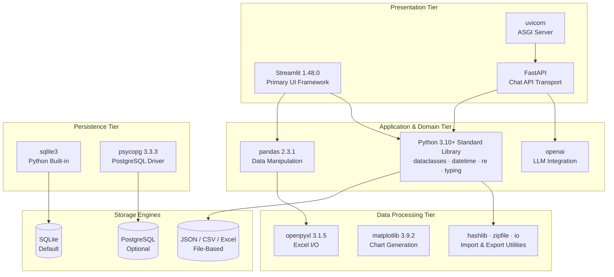

---

## 3.2 Programming Languages

### 3.2.1 Python

Python is the sole programming language for the DMRB application. Every layer — UI, application commands, domain logic, services, persistence, API transport, configuration, tests, and migration scripts — is implemented in Python.

| Attribute | Detail | Evidence |
|---|---|---|
| **Minimum Version** | Python 3.10+ | Type annotation syntax using `str \| None` union operator throughout `config/settings.py` and `db/connection.py` |
| **Development Container Version** | Python 3.11 on Debian Bookworm | `.devcontainer/devcontainer.json`: `"image": "mcr.microsoft.com/devcontainers/python:1-3.11-bookworm"` |
| **Runtime Model** | Single-process, synchronous | Streamlit execution model with Streamlit session state for UI interaction |
| **Type Annotation Coverage** | Comprehensive | `typing` module used throughout all layers |

#### Selection Justification

Python was selected for DMRB based on the following criteria:

- **Streamlit ecosystem alignment**: Streamlit is a Python-native framework. Using Python end-to-end eliminates the need for a separate frontend language and the associated build toolchain, deployment complexity, and skill requirements.
- **Data processing strength**: The operational domain requires CSV/Excel parsing, DataFrame manipulation, and report generation — all areas where Python's pandas and openpyxl ecosystem excels.
- **SQLite built-in support**: Python's standard library includes `sqlite3`, meaning the primary database driver requires zero additional dependencies.
- **Rapid operational tooling**: DMRB is a purpose-built operational tool, not a consumer-facing web application. Python's rapid development cycle and readable syntax support the domain-focused development model.
- **Domain layer purity**: The `domain/` layer uses exclusively Python standard library features (`datetime`, `re`, `dataclasses`, `typing`), which keeps the core business logic free of external dependencies and fully portable.

### 3.2.2 SQL

SQL is used as the data definition and query language across two dialect targets:

| SQL Dialect | Usage Context | Key Files |
|---|---|---|
| **SQLite** | Default schema, all 13 migrations, runtime queries in `db/repository.py` | `db/schema.sql`, `db/migrations/001` through `013`, `db/adapters/sqlite_adapter.py` |
| **PostgreSQL** | Alternate deployment schema, migration tooling | `db/postgres_schema.sql`, `scripts/apply_postgres_schema.py` |

SQLite-specific SQL features in use include:
- `PRAGMA journal_mode = WAL` — Write-Ahead Logging for improved read concurrency (`db/adapters/sqlite_adapter.py`, lines 24–25; `db/schema.sql`, lines 5–6)
- `PRAGMA foreign_keys = ON` — Referential integrity enforcement (`db/adapters/sqlite_adapter.py`, lines 24–25; `db/schema.sql`, lines 5–6)
- `PRAGMA integrity_check` — Database health validation during bootstrap (`db/connection.py`, lines 33–45)
- Partial unique indexes (e.g., `idx_one_open_turnover_per_unit`) — Conditional uniqueness enforcement
- CHECK constraints — Domain value validation at the storage layer

A SQL dialect translation layer (`qmark_to_percent()` in `db/adapters/base_adapter.py`) converts SQLite `?` parameter placeholders to PostgreSQL `%s` format, enabling a shared repository layer across both engines.

### 3.2.3 Excluded Languages

No other programming languages are present in the DMRB codebase:

| Language Category | Status | Rationale |
|---|---|---|
| JavaScript / TypeScript | Not used | Streamlit handles all frontend rendering; no separate frontend build |
| HTML / CSS | Not authored | Streamlit generates all markup; no custom templates or stylesheets |
| Shell / Bash scripts | Not used | Dev container uses inline JSON commands; no deployment scripts |
| Compiled languages (Go, Rust, C) | Not used | No performance-critical native components required |

---

## 3.3 Frameworks & Libraries

### 3.3.1 Core Application Framework — Streamlit

| Attribute | Detail |
|---|---|
| **Package** | `streamlit` |
| **Version** | 1.48.0 (pinned) |
| **Source** | `requirements.txt`, line 1 |
| **Role** | Primary UI framework — renders all application screens, manages session state, handles user interaction |

Streamlit serves as both the web server and the complete frontend framework for DMRB. It was selected because it enables the construction of interactive data applications entirely in Python, with no separate frontend codebase. The framework provides:

- **Session state management**: The `Enable DB Writes` toggle (`F-017`), dropdown configurations, board filters, and turnover selection all use Streamlit session state (`st.session_state`) as the UI-level state container.
- **Data display**: Board rows, turnover details, and risk radar data are rendered through Streamlit's native DataFrame and table components, powered by pandas DataFrames assembled in `services/board_query_service.py`.
- **File handling**: Import pipelines accept CSV and Excel uploads through Streamlit's `st.file_uploader` widget, which passes file bytes to `services/import_service.py` for checksum computation and parsing.
- **Configuration lookup**: Streamlit secrets (`st.secrets`) serve as the first-priority configuration source in `config/settings.py`, checked before environment variables.
- **Deployment compatibility**: The application is deployable on Streamlit Community Cloud with PostgreSQL backend, as documented in the optional deployment path.

The development container automatically starts Streamlit with specific flags: `streamlit run app.py --server.enableCORS false --server.enableXsrfProtection false`, forwarding port 8501 for browser access.

### 3.3.2 Data Processing Libraries

#### pandas 2.3.1

| Attribute | Detail |
|---|---|
| **Version** | 2.3.1 (pinned) |
| **Source** | `requirements.txt`, line 2 |
| **Role** | Data manipulation for import pipelines, board enrichment data assembly, export report generation |

pandas is the primary data manipulation library, used across the services layer for:

- **Import parsing**: `services/import_service.py` uses pandas to read CSV files (with configurable `skiprows` per report type) and Excel files, normalizing column names and applying type coercion before row-level processing.
- **Board assembly**: `services/board_query_service.py` assembles flat board rows into DataFrames for display in Streamlit's data components.
- **Export data preparation**: `services/export_service.py` and `services/excel_writer.py` use DataFrames to structure data for multi-sheet Excel report generation.

#### openpyxl 3.1.5

| Attribute | Detail |
|---|---|
| **Version** | 3.1.5 (pinned) |
| **Source** | `requirements.txt`, line 3 |
| **Role** | Excel workbook read/write for imports and export report generation |

openpyxl handles all Excel I/O operations:

- **Import reading**: The `DMRB` report type imports data from `.xlsx` files, parsed via pandas with openpyxl as the engine.
- **Export writing**: Two multi-sheet Excel reports are generated — `Final_Report.xlsx` (7 sheets: Reconciliation, Split View, Available Units, Move Ins, Move Outs, Pending FAS, Move Activity) and `DMRB_Report.xlsx` (12 sheets: Dashboard, Aging, Active Aging, Operations, Walking Path Board, Tasks, Schedule, Upcoming, WD Audit, Daily Ops, Priority, Phase Performance).

#### matplotlib 3.9.2

| Attribute | Detail |
|---|---|
| **Version** | 3.9.2 (pinned) |
| **Source** | `requirements.txt`, line 4 |
| **Role** | Headless chart generation for `Dashboard_Chart.png` export artifact |

matplotlib operates exclusively in headless mode using the `Agg` (Anti-Grain Geometry) non-interactive backend, as configured in `services/export_service.py` (lines 604–607). It generates dashboard charts as PNG images for inclusion in export bundles. No interactive charts are rendered in the Streamlit UI through matplotlib; Streamlit's native charting handles any interactive visualization needs.

### 3.3.3 API Framework — FastAPI

| Attribute | Detail |
|---|---|
| **Package** | `FastAPI` |
| **Version** | Unpinned |
| **Source** | `requirements.txt`, line 5 |
| **Role** | HTTP API transport layer exclusively for AI chat endpoints |

FastAPI provides the HTTP API layer for the optional AI chat assistant feature (`F-018`). Its scope is strictly limited to chat-related endpoints defined in `api/chat_routes.py`:

| Endpoint | Method | Purpose |
|---|---|---|
| `/health` | GET | Health check |
| `/api/chat/*` | Various | Chat session management, message handling |

FastAPI was selected over alternatives for this specific role because:
- It provides automatic OpenAPI documentation generation for the chat endpoints
- Its Pydantic integration handles request/response validation for chat message DTOs in `api/chat_routes.py`
- It supports async request handling suitable for external API calls to OpenAI

FastAPI is served by **uvicorn** (unpinned, `requirements.txt` line 6), an ASGI server. When running the chat API independently, the command is `uvicorn api.main:app --reload`.

> **Important**: FastAPI does not serve the main application UI. It is not a general-purpose REST API for DMRB. The primary application interface is Streamlit, and FastAPI exists solely as a transport mechanism for the AI chat feature.

### 3.3.4 AI Integration — OpenAI Client

| Attribute | Detail |
|---|---|
| **Package** | `openai` |
| **Version** | Unpinned |
| **Source** | `requirements.txt`, line 7 |
| **Role** | OpenAI API client for AI chat assistant (default model: `gpt-4o-mini`) |

The `openai` Python package is lazy-imported within the `_default_openai_reply()` function in `services/chat_service.py` (line 32). This lazy import pattern ensures that the OpenAI dependency is not loaded during normal application startup and does not block core functionality if the package or API key is unavailable.

Configuration is managed through two environment variables:
- `AI_INTEGRATIONS_OPENAI_API_KEY` — Required for chat functionality (`services/chat_service.py`, line 35)
- `AI_INTEGRATIONS_OPENAI_BASE_URL` — Optional base URL override (`services/chat_service.py`, line 36)

The `services/ai_context_service.py` module builds operational context from current turnover data (KPI summaries, assignee metrics, risk forecasts, phase comparisons, note counts, WD context, aging buckets, and CSV snapshots) before injecting it into OpenAI prompts.

### 3.3.5 Python Standard Library Utilization

A distinctive characteristic of DMRB's technology stack is its extensive and intentional use of the Python standard library, particularly in the `domain/` layer, which has **zero external dependencies**. This design ensures that all core business logic — lifecycle derivation, risk evaluation, SLA computation, unit identity normalization, and board enrichment — remains free of third-party coupling.

| Standard Library Module | Usage | Key Locations |
|---|---|---|
| `dataclasses` | Frozen `Settings` dataclass; immutable command DTOs | `config/settings.py` (line 24), `application/commands/` |
| `datetime`, `timezone` | All timestamp operations, lifecycle date calculations, SLA evaluation | `domain/lifecycle.py`, `domain/sla_engine.py`, all services |
| `re` | Unit identity normalization regex patterns | `domain/unit_identity.py` |
| `functools.lru_cache` | Settings memoization (single-instance cache) | `config/settings.py` (line 58: `@lru_cache(maxsize=1)`) |
| `hashlib` | SHA-256 checksum computation for import batch idempotency | `services/import_service.py` (line 7) |
| `concurrent.futures.ThreadPoolExecutor` | Parallel export artifact generation | `services/export_service.py` (line 4) |
| `json` | Dropdown config persistence, import audit records, settings | `data/dropdown_config.json`, multiple services |
| `os`, `pathlib` | File system operations, path resolution | Application-wide |
| `typing` | Type annotations throughout all layers | Application-wide |
| `shutil` | Database backup via `shutil.copy2` | `db/connection.py` (lines 48–54) |
| `sqlite3` | Primary database driver (built-in) | `db/adapters/sqlite_adapter.py` (line 4) |
| `statistics.mean` | Export service metrics computation | `services/export_service.py` (line 7) |
| `zipfile` | Export ZIP bundle generation (`DMRB_Reports.zip`) | `services/export_service.py` (line 8) |
| `io.BytesIO` | In-memory binary buffers for export artifacts | `services/export_service.py` |
| `unicodedata` | Text normalization | `app.py` (line 8) |
| `urllib` | URL operations | `app.py` (lines 12–13) |
| `csv` | CSV processing in migration utilities | `scripts/analyze_units_csv.py` |
| `tempfile` | Temporary file management in tests | `tests/` (21 test files) |
| `argparse` | CLI argument parsing for scripts | `scripts/` utilities |

---

## 3.4 Open Source Dependencies

### 3.4.1 Production Dependencies

All production dependencies are declared in `requirements.txt` with the following pinning strategy:

| # | Package | Version | Pinned | License Type | Role |
|---|---|---|---|---|---|
| 1 | `streamlit` | 1.48.0 | ✅ Yes | Apache 2.0 | Primary UI framework |
| 2 | `pandas` | 2.3.1 | ✅ Yes | BSD 3-Clause | Data manipulation and import/export pipelines |
| 3 | `openpyxl` | 3.1.5 | ✅ Yes | MIT | Excel file read/write operations |
| 4 | `matplotlib` | 3.9.2 | ✅ Yes | PSF-based | Headless chart generation for exports |
| 5 | `FastAPI` | — | ❌ Unpinned | MIT | HTTP API transport for chat endpoints |
| 6 | `uvicorn` | — | ❌ Unpinned | BSD 3-Clause | ASGI server for FastAPI |
| 7 | `openai` | — | ❌ Unpinned | MIT | OpenAI API client for AI chat |
| 8 | `psycopg[binary]` | 3.3.3 | ✅ Yes | LGPL 3.0 | PostgreSQL adapter (optional deployment path) |

#### Version Pinning Strategy

The dependency manifest reveals a deliberate pinning strategy:

- **Core operational dependencies** (`streamlit`, `pandas`, `openpyxl`, `matplotlib`, `psycopg[binary]`) are pinned to exact versions. These libraries are directly involved in data integrity operations — import parsing, export generation, and database interaction — where version drift could introduce subtle behavioral changes.
- **Non-core feature dependencies** (`FastAPI`, `uvicorn`, `openai`) are unpinned. These support the optional AI chat feature (`F-018`), which is explicitly classified as low-priority and is the only component with an external API dependency. Unpinned versions allow these packages to receive security patches without manual version management.

#### Dependency Count Analysis

With only 8 declared production packages, DMRB maintains a notably small dependency footprint. This is achieved through:
- Using Python's built-in `sqlite3` module instead of an external database driver for the default engine
- Leveraging Python standard library modules (`hashlib`, `concurrent.futures`, `dataclasses`, `json`, `zipfile`) instead of third-party equivalents
- Keeping the domain layer (`domain/`) free of any external package dependencies

### 3.4.2 System-Level Dependencies

| Package | Source | Role |
|---|---|---|
| `libpq-dev` | `packages.txt`, line 1 | Native PostgreSQL C client library; required for `psycopg[binary]` compilation |

The `libpq-dev` package is the only system-level dependency. It provides the PostgreSQL client libraries needed to compile the binary extension for `psycopg`. This dependency is required only when the PostgreSQL deployment path is used; for the default SQLite deployment, no system-level packages beyond the Python runtime are needed.

In the Streamlit Community Cloud deployment context, `packages.txt` is read automatically by the platform's dependency provisioning system to install apt packages before Python dependencies.

### 3.4.3 Development Dependencies

Development dependencies are not declared in a separate `requirements-dev.txt` or `pyproject.toml` but are used based on codebase evidence:

| Package | Role | Evidence |
|---|---|---|
| `pytest` | Behavioral and regression test framework | 21 test files in `tests/`, project README references |
| `Pydantic` | Request/response model validation | Transitive dependency via FastAPI; used in `api/chat_routes.py` for chat message DTOs |

The test suite uses `pytest` as its runner, with temporary SQLite databases created via `tempfile` for test isolation. The current test suite state includes known failures concentrated in enrichment parity and manual-override schema paths, as documented in Section 1.3.4.

### 3.4.4 Notable Transitive Dependencies

While DMRB declares 8 direct dependencies, the transitive dependency tree is primarily driven by Streamlit and pandas:

| Direct Dependency | Notable Transitive Dependencies |
|---|---|
| `streamlit` 1.48.0 | `tornado` (web server), `protobuf` (serialization), `altair` (charting), `pyarrow` (columnar data), `toml` (config), `click` (CLI) |
| `pandas` 2.3.1 | `numpy` (numerical arrays), `python-dateutil` (date parsing), `pytz` (timezone data) |
| `FastAPI` | `pydantic` (data validation), `starlette` (ASGI toolkit), `anyio` (async) |
| `psycopg[binary]` 3.3.3 | `psycopg-binary` (C extension), `libpq` (PostgreSQL client) |
| `matplotlib` 3.9.2 | `numpy`, `pillow` (image processing), `cycler` (style cycling), `fonttools` (font handling) |

---

## 3.5 Third-Party Services

### 3.5.1 OpenAI API

The OpenAI API is the **only external service integration** in the DMRB codebase. It powers the optional AI chat assistant feature (`F-018`).

| Attribute | Detail |
|---|---|
| **API Provider** | OpenAI |
| **Default Model** | `gpt-4o-mini` (`services/chat_service.py`, line 24) |
| **Client Library** | `openai` Python package (unpinned) |
| **API Key Variable** | `AI_INTEGRATIONS_OPENAI_API_KEY` |
| **Base URL Variable** | `AI_INTEGRATIONS_OPENAI_BASE_URL` (optional override) |
| **Import Pattern** | Lazy import within `_default_openai_reply()` function (`services/chat_service.py`, line 32) |
| **Required for Core Operations** | No — core application functionality operates without OpenAI |

The integration architecture is designed for graceful degradation:
- The `openai` package is lazy-imported only when the chat feature is invoked, not at application startup
- The `reply_fn` parameter in the chat service supports test injection, allowing the AI chat feature to be tested without live API calls
- Chat session and message data are persisted locally in `chat_session` and `chat_message` database tables (introduced in migration 013)
- Context injection through `services/ai_context_service.py` builds operational summaries from turnover data before each API call
- A 20-message history limit is applied per conversation turn to manage token consumption

### 3.5.2 Supabase (Optional PostgreSQL Hosting)

| Attribute | Detail |
|---|---|
| **Role** | PostgreSQL hosting for optional Streamlit Community Cloud deployment |
| **Integration Type** | Database connection (not API) |
| **Evidence** | `test_supabase_connection.py` tests connection with `sslmode=require` |
| **Requirement** | Session pooler URL required — direct IPv6 endpoints fail on Streamlit Community Cloud |

Supabase is not a runtime dependency of the application itself. It serves as a tested and documented hosting option for the PostgreSQL backend when deploying to Streamlit Community Cloud, where the local SQLite model is not viable.

### 3.5.3 Explicitly Excluded Services

The following service categories are **not used** by DMRB, reflecting its local-first deployment model:

| Service Category | Status | Rationale |
|---|---|---|
| Authentication services (Auth0, OAuth, OIDC) | Not used | No authentication layer; write toggle is the only access barrier (Section 2.4.4) |
| Cloud platforms (AWS, GCP, Azure) | Not used | Local-first operation; no cloud infrastructure dependency |
| Monitoring / observability (Datadog, New Relic, Sentry) | Not used | Single-user local application; no telemetry infrastructure |
| CDN / static asset hosting | Not used | Streamlit serves all assets from the application process |
| Message queues (RabbitMQ, Kafka, SQS) | Not used | Synchronous single-process architecture |
| Email / notification services | Not used | No external notification capability |
| CI/CD platforms (GitHub Actions, Jenkins, CircleCI) | Not configured | No CI/CD pipeline present in the codebase |

---

## 3.6 Databases & Storage

### 3.6.1 SQLite — Primary Database Engine

SQLite is the default and primary database engine for DMRB. As a serverless, embedded database bundled with Python's standard library, it perfectly aligns with the system's local-first deployment model.

| Attribute | Detail |
|---|---|
| **Driver** | `sqlite3` (Python standard library built-in) |
| **Default Path** | `data/cockpit.db` (resolved in `config/settings.py`, line 60) |
| **Configuration Override** | `COCKPIT_DB_PATH` or `DMRB_DATABASE_PATH` environment variables |
| **Schema** | 18 tables defined in `db/schema.sql` |
| **Migrations** | 13 ordered SQL migrations (`db/migrations/001` through `013`) |

#### Connection Configuration

The SQLite adapter (`db/adapters/sqlite_adapter.py`) configures every connection with the following settings:

| PRAGMA | Value | Purpose |
|---|---|---|
| `journal_mode` | `WAL` | Write-Ahead Logging enables concurrent readers during writes |
| `foreign_keys` | `ON` | Enforces referential integrity constraints across all foreign key relationships |

Row access uses `sqlite3.Row` factory for dict-like column access by name.

#### Bootstrap and Migration Behavior

Database initialization is fully automatic and requires no separate deployment step:

1. **Schema creation**: If the database file does not exist, the canonical schema from `db/schema.sql` is executed to create all 18 tables
2. **Integrity verification**: `PRAGMA integrity_check` validates database structural health (`db/connection.py`, lines 33–45)
3. **Backup creation**: A timestamped `.db` file copy is created via `shutil.copy2` before any migration (`db/connection.py`, lines 48–54)
4. **Migration execution**: All 13 ordered migrations are checked sequentially against the `schema_version` table; each migration N is applied only when `schema_version < N`
5. **Version tracking**: The `schema_version` table is updated after each successful migration

This entire sequence executes through `ensure_database_ready()` in `db/connection.py` on every application startup.

#### Constraints and Limitations

| Constraint | Impact | Mitigation |
|---|---|---|
| Single-writer concurrency | Only one write transaction at a time | WAL mode allows concurrent reads; application is single-user |
| No archival mechanism | Append-only `audit_log` grows unbounded in v1 | Future consideration for log rotation (Section 2.4.5) |
| File-based access | Physical host access equals full data access | Acceptable for local operational tool deployment model |
| No built-in encryption | Database file is unencrypted on disk | Out of scope for current deployment model (Section 2.4.4) |

#### Schema Integrity Features

The SQLite schema enforces domain invariants at the storage layer:

- **Partial unique index** `idx_one_open_turnover_per_unit`: Ensures only one open turnover per unit
- **Partial unique index** `idx_one_open_sla_breach`: Ensures one open SLA breach per turnover
- **Partial unique index** `idx_one_active_risk_per_type`: Ensures one active risk per type per turnover
- **CHECK constraints**: Enforce valid values for risk types, execution statuses, confirmation statuses, audit source types, and note severities

### 3.6.2 PostgreSQL — Optional Deployment Database

PostgreSQL serves as an alternate database engine, prepared for deployment scenarios requiring multi-writer concurrency or cloud hosting.

| Attribute | Detail |
|---|---|
| **Driver** | `psycopg[binary]` 3.3.3 (`db/adapters/postgres_adapter.py`, lines 3–4) |
| **Row Factory** | `dict_row` from `psycopg.rows` (line 15) |
| **Schema** | Full parity in `db/postgres_schema.sql` (idempotent with `IF NOT EXISTS`) |
| **Configuration** | Requires `DATABASE_URL` environment variable and `DB_ENGINE=postgres` |
| **Bootstrap** | `db/postgres_bootstrap.py` loads and executes PostgreSQL schema |
| **Write Default** | `enable_db_writes_default` is `True` when engine is `postgres` (`config/settings.py`, line 69) |

#### Migration Toolchain

A complete SQLite-to-PostgreSQL migration pipeline is prepared in the `scripts/` directory:

| Script | Purpose |
|---|---|
| `scripts/export_sqlite_data.py` | Export all SQLite tables to JSON files |
| `scripts/import_postgres_data.py` | Import JSON data into PostgreSQL tables |
| `scripts/migrate_to_postgres.py` | Orchestrate the full end-to-end migration |
| `scripts/migration_verify.py` | Post-migration validation (row counts, NULL checks, integrity) |
| `scripts/apply_postgres_schema.py` | Apply PostgreSQL schema directly |

#### Supabase Compatibility

The PostgreSQL path has been tested with Supabase-hosted PostgreSQL (`test_supabase_connection.py` connects to Supabase with `sslmode=require`). Deployment on Streamlit Community Cloud requires the Supabase session pooler URL because direct IPv6 endpoints are not supported in that environment.

### 3.6.3 Database Adapter Abstraction

The persistence layer uses a protocol-based adapter pattern to abstract database engine differences, enabling a single repository layer (`db/repository.py`) to operate against both SQLite and PostgreSQL.

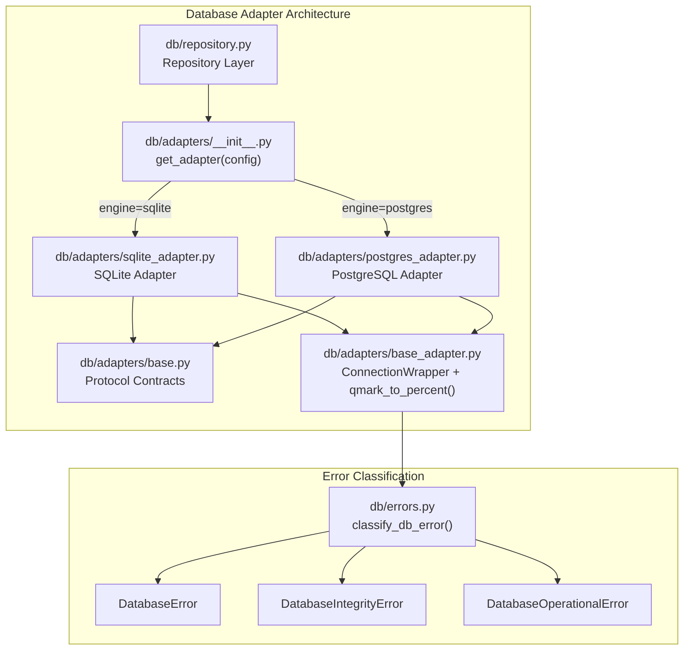

| Component | Location | Responsibility |
|---|---|---|
| **Protocol contracts** | `db/adapters/base.py` | Defines the interface contract that all adapters must satisfy |
| **Connection wrapper** | `db/adapters/base_adapter.py` | Provides `ConnectionWrapper` abstraction and `qmark_to_percent()` SQL placeholder translation |
| **SQLite adapter** | `db/adapters/sqlite_adapter.py` | Configures SQLite connections with WAL mode, foreign keys, and Row factory |
| **PostgreSQL adapter** | `db/adapters/postgres_adapter.py` | Configures psycopg connections with `dict_row` factory |
| **Adapter dispatch** | `db/adapters/__init__.py` | `get_adapter(config)` selects the correct adapter based on the `database_engine` setting |
| **Error classification** | `db/errors.py` | `classify_db_error()` maps driver-specific exceptions to project-level `DatabaseError`, `DatabaseIntegrityError`, and `DatabaseOperationalError` |

### 3.6.4 File-Based Storage

In addition to relational database storage, DMRB uses file-based storage for configuration and data exchange:

| File / Pattern | Format | Purpose |
|---|---|---|
| `data/dropdown_config.json` | JSON | Runtime configuration for task assignees and scheduling offsets, loaded into Streamlit session state at startup |
| Import files (CSV / Excel) | CSV, `.xlsx` | External operational reports ingested through five import pipelines in `services/import_service.py` |
| `data/test_imports/` | CSV, `.xlsx` | Sample import files for testing and validation |
| Export artifacts | `.xlsx`, `.png`, `.txt`, `.zip` | Generated reports (`Final_Report.xlsx`, `DMRB_Report.xlsx`, `Dashboard_Chart.png`, `Weekly_Summary.txt`, `DMRB_Reports.zip`) — produced in-memory or to temporary files |
| `Units.csv` | CSV | Unit Master Import source file for property hierarchy bootstrap |

---

## 3.7 Development & Deployment

### 3.7.1 Development Environment

Development uses a VS Code Dev Container configured in `.devcontainer/devcontainer.json`:

| Configuration | Value |
|---|---|
| **Base Image** | `mcr.microsoft.com/devcontainers/python:1-3.11-bookworm` |
| **Python Version** | 3.11 |
| **OS Base** | Debian Bookworm |
| **VS Code Extensions** | `ms-python.python`, `ms-python.vscode-pylance` |
| **Auto-Opens** | `README.md`, `app.py` |
| **Port Forwarding** | 8501 (Streamlit) |
| **Post-Attach Command** | `streamlit run app.py --server.enableCORS false --server.enableXsrfProtection false` |

The dev container provisioning process:
1. Reads `packages.txt` and installs system packages via `apt` (currently `libpq-dev`)
2. Reads `requirements.txt` and installs Python packages via `pip`
3. Always ensures `streamlit` is installed as a baseline dependency
4. Starts the Streamlit application automatically on container attach

### 3.7.2 Build System

DMRB uses a deliberately minimal build system:

| Aspect | Approach |
|---|---|
| **Package installation** | `pip install -r requirements.txt` |
| **Database setup** | Automatic at application startup — no separate build step |
| **Frontend compilation** | None required — Streamlit renders from Python source |
| **Asset bundling** | None required — no static assets to bundle |
| **Type checking** | Pylance via VS Code extension (not a build gate) |
| **Test execution** | `pytest -q` (currently not fully passing — see Section 1.3.4) |

There is no `pyproject.toml`, `setup.py`, `Makefile`, or any build automation configuration beyond `requirements.txt`. This is consistent with the system's nature as an operational tool rather than a distributable Python package.

### 3.7.3 Deployment Model

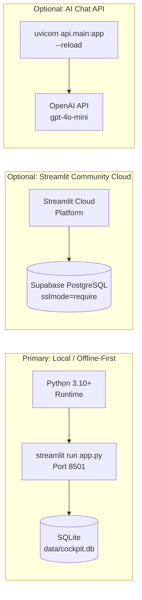

| Deployment Target | Description | Database | Command |
|---|---|---|---|
| **Local (Primary)** | Standalone Streamlit application on local machine | SQLite at `data/cockpit.db` | `streamlit run app.py` |
| **Streamlit Community Cloud** | Cloud-hosted Streamlit deployment | Supabase PostgreSQL (requires `DATABASE_URL` + `DB_ENGINE=postgres`) | Platform-managed |
| **Chat API (Optional)** | FastAPI server for AI chat endpoints | Uses same database as main app | `uvicorn api.main:app --reload` |
| **PostgreSQL Migration** | One-time migration utility | Targets PostgreSQL from SQLite source | `python -m scripts.migrate_to_postgres` |

#### What Is Absent

The following deployment infrastructure does not exist in the codebase:

| Infrastructure | Status |
|---|---|
| Dockerfile / docker-compose.yml | Not present (dev container is for development only) |
| CI/CD pipeline (GitHub Actions, Jenkins, etc.) | Not configured |
| Infrastructure-as-code (Terraform, CloudFormation) | Not present |
| Container orchestration (Kubernetes, ECS) | Not applicable |
| Reverse proxy configuration (nginx, Caddy) | Not present |
| Environment-specific configuration files | Not present — all configuration is via environment variables |

### 3.7.4 CLI Utilities

The `scripts/` directory provides utility scripts for database operations and data analysis:

| Script | Purpose | Key Dependencies |
|---|---|---|
| `scripts/export_sqlite_data.py` | Export all SQLite tables to JSON files | `sqlite3`, `json`, `argparse` |
| `scripts/import_postgres_data.py` | Import JSON data files into PostgreSQL | `psycopg`, `json`, `argparse` |
| `scripts/migrate_to_postgres.py` | Orchestrate full SQLite → PostgreSQL migration | Calls export and import scripts |
| `scripts/migration_verify.py` | Post-migration validation (row counts, NULL checks) | `sqlite3`, `psycopg` |
| `scripts/apply_postgres_schema.py` | Apply PostgreSQL schema directly | `psycopg` |
| `scripts/analyze_units_csv.py` | Unit identity analysis and validation | `csv`, `argparse` |
| `scripts/verify_stage2_dual_write.py` | Post-import dual-write smoke test | `sqlite3` |

---

## 3.8 Configuration Management

### 3.8.1 Runtime Configuration Architecture

Runtime configuration is centralized in the `Settings` frozen dataclass within `config/settings.py`. The class uses `@dataclass(frozen=True)` for immutability and `@lru_cache(maxsize=1)` on the `get_settings()` factory function for single-instance memoization (line 58).

#### Configuration Resolution Order

Settings follow a two-tier lookup strategy:

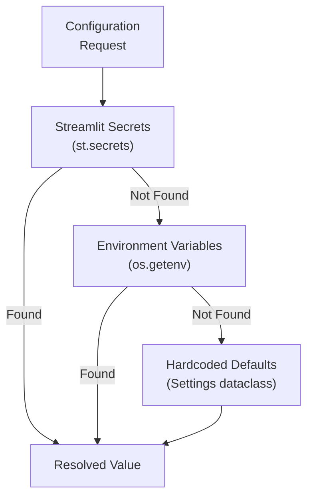

1. **Streamlit secrets** (`st.secrets`) — checked first; supports Streamlit Community Cloud secrets management
2. **Environment variables** (`os.getenv`) — fallback for local deployment
3. **Hardcoded defaults** — built into the `Settings` dataclass fields

#### Application Configuration Parameters

| Parameter | Default Value | Environment Variable(s) | Description |
|---|---|---|---|
| `database_engine` | `"sqlite"` | `DB_ENGINE`, `DMRB_DATABASE_ENGINE` | Database engine selection |
| `database_path` | `data/cockpit.db` | `COCKPIT_DB_PATH`, `DMRB_DATABASE_PATH` | SQLite database file path |
| `database_url` | `None` | `DATABASE_URL` | PostgreSQL connection string |
| `default_property_id` | `1` | `DMRB_DEFAULT_PROPERTY_ID` | Active property scope |
| `allowed_phases` | `("5", "7", "8")` | `DMRB_ALLOWED_PHASES` | Property phase filter |
| `timezone` | `"UTC"` | `DMRB_TIMEZONE` | Application timezone for display |
| `enable_db_writes_default` | `False` (SQLite) / `True` (Postgres) | `DMRB_ENABLE_DB_WRITES_DEFAULT` | Default write toggle state |
| `default_actor` | `"manager"` | `DMRB_DEFAULT_ACTOR` | Default audit actor identity |

#### AI Integration Configuration

| Parameter | Environment Variable | Required |
|---|---|---|
| OpenAI API Key | `AI_INTEGRATIONS_OPENAI_API_KEY` | Only for F-018 (AI Chat) |
| OpenAI Base URL | `AI_INTEGRATIONS_OPENAI_BASE_URL` | No (optional override) |

---

## 3.9 Technology-to-Architecture Layer Mapping

The following table provides a comprehensive mapping of technologies to each architectural layer, demonstrating how the technology selections support the system's layered design:

| Architecture Layer | Location | Technologies | External Dependencies |
|---|---|---|---|
| **Streamlit UI** | `app.py`, `ui/` | Streamlit 1.48.0, pandas (DataFrames for display) | None |
| **Application** | `application/commands/`, `application/workflows/` | Python `dataclasses` (frozen), `datetime` | None (stdlib only) |
| **Domain** | `domain/` | Python stdlib exclusively: `datetime`, `timezone`, `re`, `typing`, `dataclasses` | **Zero external dependencies** |
| **Services** | `services/` | pandas, openpyxl, matplotlib, openai, `hashlib`, `concurrent.futures`, `statistics` | OpenAI API (F-018 only) |
| **Persistence** | `db/` | `sqlite3` (stdlib), psycopg 3.3.3, SQL (both dialects) | None (drivers are local) |
| **API** | `api/` | FastAPI, Pydantic (request validation), uvicorn | None |
| **Configuration** | `config/` | Python `dataclasses`, `functools.lru_cache`, `streamlit.secrets` | None |
| **Import Validation** | `imports/` | pandas (CSV/Excel parsing), frozen dataclasses | None |
| **Scripts** | `scripts/` | `argparse`, `sqlite3`, psycopg, `json`, `csv`, `tempfile` | None |
| **Tests** | `tests/` | pytest, `tempfile` (temporary `.db` files) | None |

The domain layer's zero-dependency characteristic is an intentional architectural constraint. It ensures that all core business logic — lifecycle phase derivation, risk evaluation, SLA breach detection, unit identity normalization, and board enrichment computation — can be tested, reasoned about, and validated without any infrastructure or third-party coupling.

---

## 3.10 Security Implications of Technology Choices

### 3.10.1 Security Posture Summary

The technology stack reflects DMRB's current deployment model as a local, single-user operational tool. Security implications are documented transparently as architectural context rather than gaps requiring immediate remediation.

| Technology Decision | Security Implication | Current Mitigation |
|---|---|---|
| **No authentication layer** | All users have equal access; no identity verification | Write toggle (`Enable DB Writes`) prevents accidental modification but is not a security control. Deliberate design decision for local tool (Section 2.4.4). |
| **SQLite file-based storage** | Physical host access provides full data access; no encryption at rest | Acceptable for local deployment model; host-level access controls apply |
| **OpenAI API key management** | API key stored in Streamlit secrets or environment variables | No encrypted vault or secret rotation mechanism; key is loaded at runtime only when chat feature is invoked |
| **Append-only audit log** | No tamper detection beyond database-level integrity | `audit_log` table enforces append-only pattern; no cryptographic verification |
| **No HTTPS termination** | Dev container disables CORS and XSRF protection | Development-mode configuration; production Streamlit Community Cloud deployment provides HTTPS |
| **Unpinned AI dependencies** | `FastAPI`, `uvicorn`, `openai` versions may drift | These packages support the non-critical AI chat feature; automatic updates include security patches |
| **psycopg with SSL** | PostgreSQL connections require `sslmode=require` for Supabase | Encryption in transit for the optional cloud deployment path |

### 3.10.2 Dependency Security Considerations

| Consideration | Status |
|---|---|
| Known vulnerability scanning | Not configured (no CI/CD pipeline or dependency audit tool) |
| License compliance | All dependencies use permissive licenses (Apache 2.0, MIT, BSD, LGPL) |
| Supply chain integrity | Small dependency surface (8 packages) reduces attack surface |
| Version pinning | Core dependencies pinned; reduces risk of malicious version injection for critical packages |

---

#### References

- `requirements.txt` — Python package dependency manifest with pinned versions (8 production packages)
- `packages.txt` — System-level package dependency (`libpq-dev`)
- `.devcontainer/devcontainer.json` — Development container configuration: Python 3.11 on Debian Bookworm, VS Code extensions, port forwarding, post-attach commands
- `config/settings.py` — Runtime configuration `Settings` frozen dataclass with `@lru_cache` factory, Streamlit secrets-first lookup, environment variable mappings, and defaults
- `app.py` — Streamlit application entry point; imports for `unicodedata`, `urllib`, backend loading pattern, session state initialization
- `api/main.py` — FastAPI application setup, `/health` endpoint, startup hooks
- `api/chat_routes.py` — FastAPI route definitions for AI chat endpoints with Pydantic request models
- `db/schema.sql` — Canonical SQLite schema (18 tables) with PRAGMA requirements, CHECK constraints, and partial unique indexes
- `db/connection.py` — Database connection management, `ensure_database_ready()` bootstrap, integrity check, backup creation, migration runner with 13 ordered migrations
- `db/adapters/sqlite_adapter.py` — SQLite connection configuration: WAL journal mode, foreign keys enabled, `sqlite3.Row` factory
- `db/adapters/postgres_adapter.py` — PostgreSQL connection via psycopg 3.3.3 with `dict_row` factory
- `db/adapters/base_adapter.py` — `ConnectionWrapper` abstraction and `qmark_to_percent()` SQL placeholder translation
- `db/adapters/base.py` — Protocol-based adapter interface contracts
- `db/adapters/__init__.py` — `get_adapter(config)` engine dispatch
- `db/errors.py` — `classify_db_error()` maps driver exceptions to project-specific error hierarchy
- `db/postgres_schema.sql` — PostgreSQL-specific schema with `IF NOT EXISTS` idempotency
- `db/postgres_bootstrap.py` — PostgreSQL schema bootstrap loader
- `db/migrations/` — 13 ordered SQL migration files (001 through 013)
- `services/chat_service.py` — OpenAI integration: lazy import, default model (`gpt-4o-mini`), API key configuration, `reply_fn` test override
- `services/ai_context_service.py` — Operational context injection for AI conversations
- `services/import_service.py` — Import pipeline orchestration: pandas CSV/Excel parsing, SHA-256 checksums via `hashlib`, five report types
- `services/export_service.py` — Export workflow: matplotlib `Agg` backend, `ThreadPoolExecutor` for parallel generation, `zipfile`, `statistics.mean`, `io.BytesIO`
- `services/excel_writer.py` — Excel report generation for `Final_Report.xlsx` and `DMRB_Report.xlsx`
- `services/board_query_service.py` — Board data assembly using pandas DataFrames
- `domain/` — Pure Python domain layer: `lifecycle.py`, `enrichment.py`, `risk_engine.py`, `risk_radar.py`, `sla_engine.py`, `unit_identity.py` — zero external dependencies
- `application/commands/` — Immutable command DTOs using frozen dataclasses
- `imports/validation/` — File and schema validation for import pipelines
- `scripts/` — CLI utilities: `export_sqlite_data.py`, `import_postgres_data.py`, `migrate_to_postgres.py`, `migration_verify.py`, `apply_postgres_schema.py`, `analyze_units_csv.py`, `verify_stage2_dual_write.py`
- `tests/` — 21 pytest test files with temporary SQLite databases via `tempfile`
- `test_supabase_connection.py` — Supabase PostgreSQL connectivity test with `sslmode=require`
- `data/dropdown_config.json` — Runtime JSON configuration for task assignees and scheduling offsets
- Streamlit 1.48.0 — [GitHub Release](https://github.com/streamlit/streamlit/releases/tag/1.48.0), [PyPI](https://pypi.org/project/streamlit/)
- psycopg 3.3.3 — [PyPI](https://pypi.org/project/psycopg/), [Documentation](https://www.psycopg.org/psycopg3/docs/)

# 4. Process Flowchart

This section documents the complete set of process workflows within the Digital Make Ready Board (DMRB) system. Each workflow is represented through Mermaid.js diagrams accompanied by detailed descriptions of decision logic, business rules, timing constraints, and cross-system interactions. The diagrams are organized from high-level system overview through detailed subsystem flows, covering the full operational lifecycle from application startup through turnover management, import processing, reconciliation, and board rendering.

DMRB operates as an operational rules engine with a UI rather than a simple CRUD application. The workflows documented here reflect this design philosophy: imports are reconciliation-based rather than overwrite-based, lifecycle phases are derived deterministically rather than manually assigned, and SLA and risk state is continuously re-evaluated after significant mutations. All process flows are grounded in the implemented codebase, with file references provided throughout for traceability.

---

## 4.1 HIGH-LEVEL SYSTEM WORKFLOW

### 4.1.1 End-to-End System Overview

DMRB's end-to-end workflow encompasses application startup with automatic database bootstrap, user interaction through Streamlit UI views, data ingestion through five import pipelines, operational mutations through turnover detail management, and continuous reconciliation of SLA breach and risk flag state. The following diagram illustrates the primary process paths from application launch through operational board rendering.

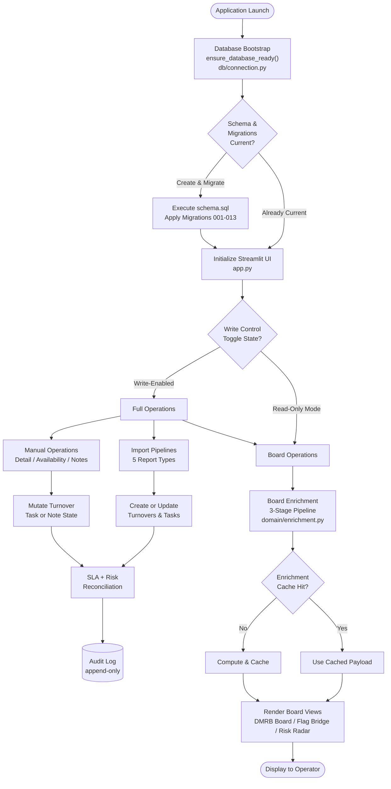

#### System Boundary Interactions

The system operates through two primary workflow categories that traverse the layered architecture defined in `app.py`, `services/`, `domain/`, and `db/`:

**Read Operations** encompass board assembly (`services/board_query_service.py`), Flag Bridge filtering, Risk Radar scoring (`domain/risk_radar.py`), and export generation (`services/export_service.py`). These workflows traverse the services layer into the pure domain layer for enrichment computation in `domain/enrichment.py`, with optional per-day cache acceleration via the `turnover_enrichment_cache` table.

**Write Operations** encompass import processing (`services/import_service.py`), turnover and task mutations (`services/turnover_service.py`, `services/task_service.py`), note management (`services/note_service.py`), and manual availability creation (`services/manual_availability_service.py`). Every write operation triggers appropriate SLA and/or risk reconciliation through `services/sla_service.py` and `services/risk_service.py`, and produces audit log entries with source attribution (`manual`, `import`, or `system`).

DMRB integrates with external systems exclusively through file-based imports. Five CSV/Excel report types flow into the import pipelines, and a Unit Master file (`Units.csv`) can bootstrap the property hierarchy through `services/unit_master_import_service.py`. The only external API dependency is the optional OpenAI integration for the AI Chat Assistant (F-018), accessed via `api/chat_routes.py`.

### 4.1.2 Application Startup and Database Bootstrap

The database bootstrap sequence, orchestrated by `ensure_database_ready()` in `db/connection.py`, executes automatically on every application startup. This eliminates the need for a separate deployment or migration step. The bootstrap handles schema creation, ordered migration execution with Python backfills, legacy drift repair, and performance structure initialization.

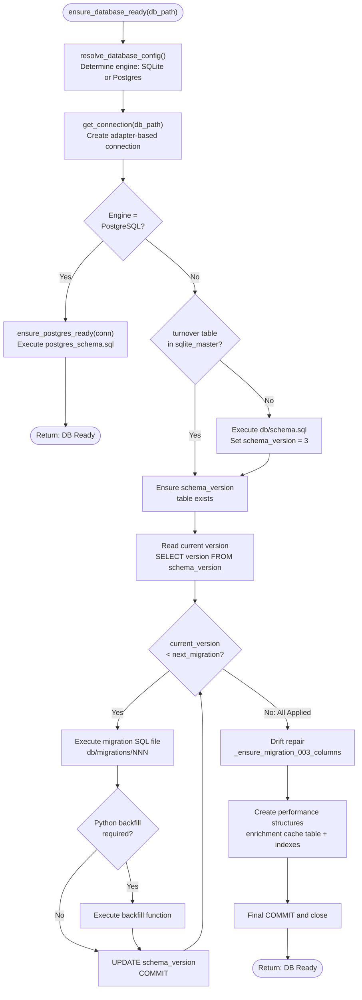

#### Migration Execution Sequence

The 13 ordered migrations apply incrementally, each executing only when `schema_version < N`. Three migrations require Python-side backfill functions that transform existing data to match the new schema:

| Migration | Description | Python Backfill |
|---|---|---|
| 001 | `add_report_ready_date` | — |
| 002 | `add_exposure_risk_type` | — |
| 003 | `add_assignee_blocking_wd_type` | — |
| 004 | `add_unit_identity_columns` | `_backfill_unit_identity` |
| 005 | `add_phase_building` | — |
| 006 | `add_unit_attrs` | — |
| 007 | `add_unit_hierarchy_fk` | `_backfill_hierarchy` |
| 008 | `task_template_phase_id` | `_backfill_task_template_phase_id` |
| 009 | `add_legal_and_availability_columns` | — |
| 010 | `add_sla_event_anchor_snapshot` | — |
| 011 | `add_manual_override_timestamps` | — |
| 012 | `add_last_import_columns` | — |
| 013 | `add_chat_tables` | — |

#### Startup Timing and Safety Constraints

- **Idempotent execution**: Each migration runs exactly once, tracked by the `schema_version` table with a singleton row
- **SQLite PRAGMAs**: Connections are configured with `journal_mode=WAL` (Write-Ahead Logging for concurrent reads) and `foreign_keys=ON` (referential integrity enforcement), as configured in `db/adapters/sqlite_adapter.py`
- **Pre-migration backup**: A timestamped `.db` file copy is created via `shutil.copy2` before any migration execution
- **Drift repair**: `_ensure_migration_003_columns()` corrects legacy schema variations that may exist from earlier development states
- **Performance structures**: The enrichment cache table and supporting indexes are created after all migrations complete

### 4.1.3 Write Control Gate

All UI-initiated write operations pass through a session-state gate controlled by the `Enable DB Writes` toggle, implemented through `st.session_state["enable_db_writes"]` and configured in `config/settings.py`.

| Database Engine | Default State | Environment Override |
|---|---|---|
| SQLite | `False` (writes disabled) | `DMRB_ENABLE_DB_WRITES_DEFAULT` |
| PostgreSQL | `True` (writes enabled) | `DMRB_ENABLE_DB_WRITES_DEFAULT` |

When writes are disabled, the application operates in read-only mode, supporting safe operational reviews and stakeholder demonstrations. The write gate is enforced exclusively at the UI layer in `ui/actions/`; the services and domain layers contain no write-gating logic, ensuring that business logic remains independent of presentation concerns.

---

## 4.2 TURNOVER LIFECYCLE PROCESSES

The turnover lifecycle is the central domain concept in DMRB. Each turnover progresses through deterministically derived phases based on the state of date fields, implemented as pure logic in `domain/lifecycle.py` with mutation orchestration in `services/turnover_service.py`.

### 4.2.1 Lifecycle Phase State Machine

Eight lifecycle phases represent the complete turnover trajectory from initial notice through closure or cancellation. Phase transitions are not triggered by explicit user actions on the phase field itself; instead, phases are derived from the current date field state, making evaluation purely deterministic and reproducible.

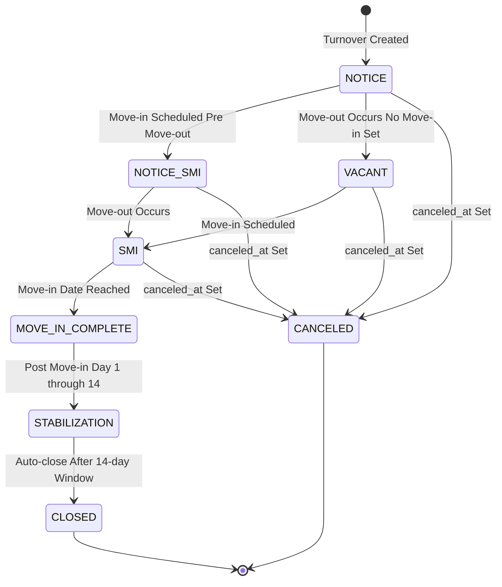

| Phase | Description | Entry Condition |
|---|---|---|
| `NOTICE` | Pre-move-out; unit is on notice to vacate | `move_out_date` is None; or pre-move-out without move-in scheduled |
| `NOTICE_SMI` | On notice with a scheduled move-in already set | Pre-move-out with `move_in_date` set |
| `VACANT` | Post-move-out; no move-in date yet scheduled | `today >= move_out_date` and `move_in_date` is None |
| `SMI` | Post-move-out; scheduled move-in is upcoming | `today >= move_out_date` and `today < move_in_date` |
| `MOVE_IN_COMPLETE` | Move-in date has been reached | `today >= move_in_date` (day of move-in) |
| `STABILIZATION` | Post-move-in; within the 14-day stabilization window | `today > move_in_date` and `today <= move_in_date + 14 days` |
| `CANCELED` | Turnover has been canceled | `canceled_at` is not None |
| `CLOSED` | Turnover lifecycle is complete | `closed_at` is set via auto-close or explicit closure |

### 4.2.2 Lifecycle Phase Derivation Logic

The `derive_lifecycle_phase()` function in `domain/lifecycle.py` (lines 58–91) implements the following decision tree. The evaluation order is critical: earlier checks take precedence, and the function returns immediately upon matching a condition.

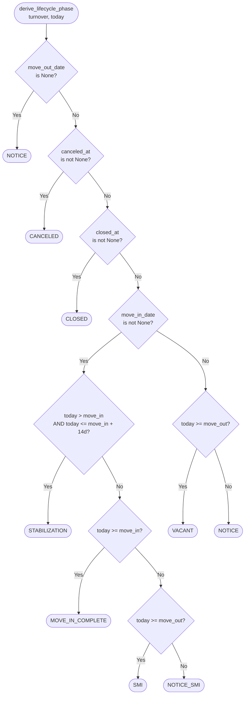

#### Business Rules at Each Decision Point

- **Cancellation precedence**: `canceled_at` is checked before `closed_at`, ensuring that a canceled-then-closed record resolves as `CANCELED`
- **Stabilization window**: The 14-day stabilization period begins the day after move-in (`today > move_in_date`) and ends at `move_in_date + 14 days`
- **MOVE_IN_COMPLETE scope**: Applies only on the exact day of move-in (`today >= move_in_date` but not yet in stabilization)
- **Default fallback**: If no conditions match, the function returns `NOTICE` as the safe default

### 4.2.3 Effective Move-Out Date Resolution

The effective move-out date is resolved through a four-tier precedence chain defined in `domain/lifecycle.py` (lines 32–55). This hierarchy ensures that the most authoritative date source is always used for lifecycle calculations, SLA evaluation, and board enrichment.

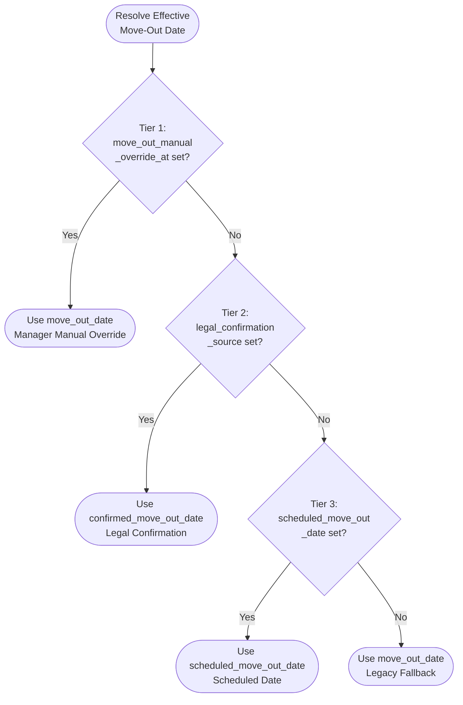

| Tier | Source Field | Authority | Set By |
|---|---|---|---|
| 1 | `move_out_date` + `move_out_manual_override_at` | Highest — manager override | Manual date edit in Turnover Detail |
| 2 | `confirmed_move_out_date` + `legal_confirmation_source` | Legal confirmation | PENDING_FAS import pipeline |
| 3 | `scheduled_move_out_date` | Operational schedule | MOVE_OUTS import pipeline |
| 4 | `move_out_date` | Legacy fallback | Historical data or initial import |

### 4.2.4 Turnover Creation Pipeline

New turnovers enter the system through two paths, both converging on `create_turnover_and_reconcile()` in `services/turnover_service.py`. This function orchestrates record insertion, template-driven task instantiation, and mandatory SLA/risk reconciliation.

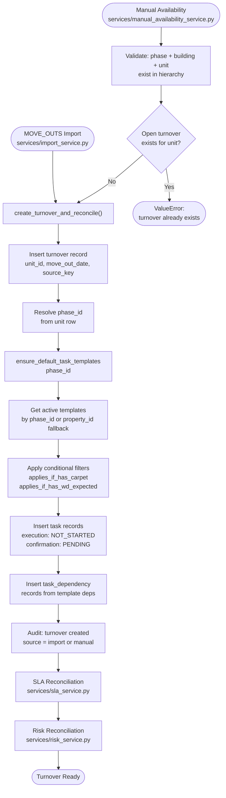

#### Task Instantiation Details

The `_instantiate_tasks_for_turnover_impl()` function in `services/import_service.py` (lines 364–416) resolves task templates through a priority hierarchy:

1. **Phase-scoped templates** (preferred): Templates matching the turnover's `phase_id`
2. **Property-scoped templates** (fallback): Templates matching the `property_id` when no phase-specific templates exist

Two conditional applicability filters are evaluated per template before instantiation:
- `applies_if_has_carpet`: Template is included only if the unit's `has_carpet` attribute is true
- `applies_if_has_wd_expected`: Template is included only if the unit's `has_wd_expected` attribute is true

After task records are inserted, inter-task dependencies from the `task_template_dependency` table are mapped from template IDs to the newly created task IDs and inserted as `task_dependency` records.

#### Data Integrity Constraint

The `idx_one_open_turnover_per_unit` partial unique index in `db/schema.sql` enforces that only one open turnover (where `closed_at IS NULL AND canceled_at IS NULL`) can exist per unit. Any attempt to create a second open turnover raises a `DatabaseIntegrityError`.

### 4.2.5 Auto-Close Logic

The auto-close mechanism in `services/turnover_service.py` (lines 434–455) automatically closes turnovers that have completed their 14-day post-move-in stabilization window, provided no blocking conditions exist.

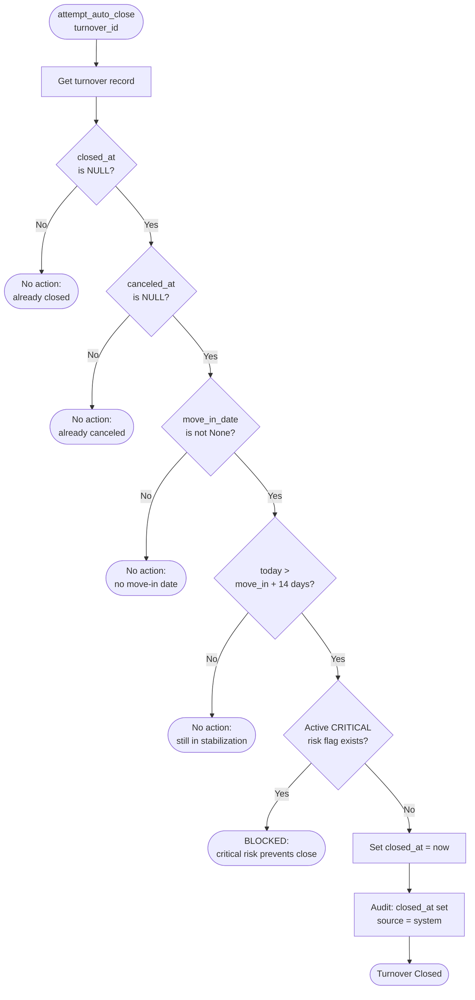

#### Auto-Close Timing Constraint

The 14-day stabilization window is a hard business rule: `today > move_in_date + 14 days`. Auto-close is additionally blocked by any active risk flag with severity `CRITICAL`, ensuring that unresolved critical operational issues prevent premature closure.

---

## 4.3 IMPORT PIPELINE WORKFLOWS

DMRB's import pipelines, implemented in `services/import_service.py` (lines 419–920), ingest five structured report types from external property management systems. All imports are checksum-based and idempotent at the batch level, with full audit trail preservation and manual override protection.

### 4.3.1 Common Import Flow

Every import operation follows a common entry flow through `import_report_file()` before branching into report-type-specific processing. The flow enforces duplicate detection, schema validation, and structured outcome tracking.

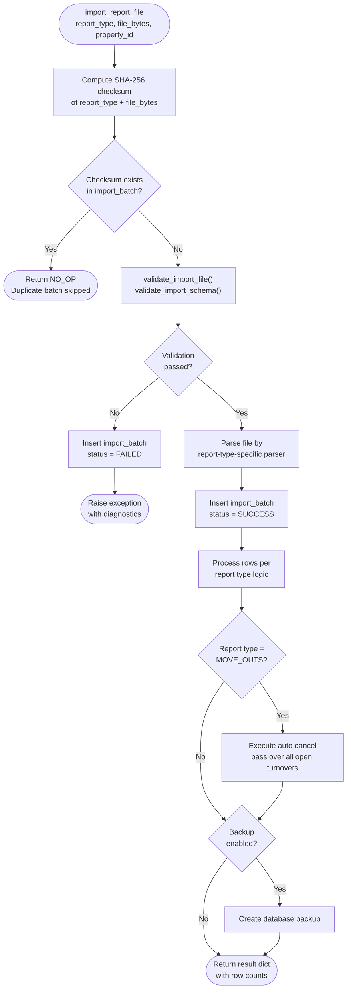

#### Validation Rules

- **Checksum idempotency**: SHA-256 of `report_type + file_bytes` ensures identical re-imports return `NO_OP` without modifying data
- **Batch tracking**: Every import produces an `import_batch` record with `report_type`, `checksum`, `source_file_name`, `record_count`, and `status`
- **Row tracking**: Every processed row produces an `import_row` record with `raw_json`, `unit_code_raw`, `unit_code_norm`, `validation_status`, `conflict_flag`, and `conflict_reason`
- **Phase filtering**: Rows are filtered to `VALID_PHASES` based on the unit code's phase component during import
- **Diagnostics**: Validation failures emit structured diagnostic records with `row_index`, `error_type`, `error_message`, `column`, and `suggestion`

### 4.3.2 MOVE_OUTS Import Process

The MOVE_OUTS import is the most complex report type, handling turnover creation, date updates with override protection, and post-import auto-cancellation. It is processed through `services/import_service.py` (lines 493–604).

#### Row-Level Processing

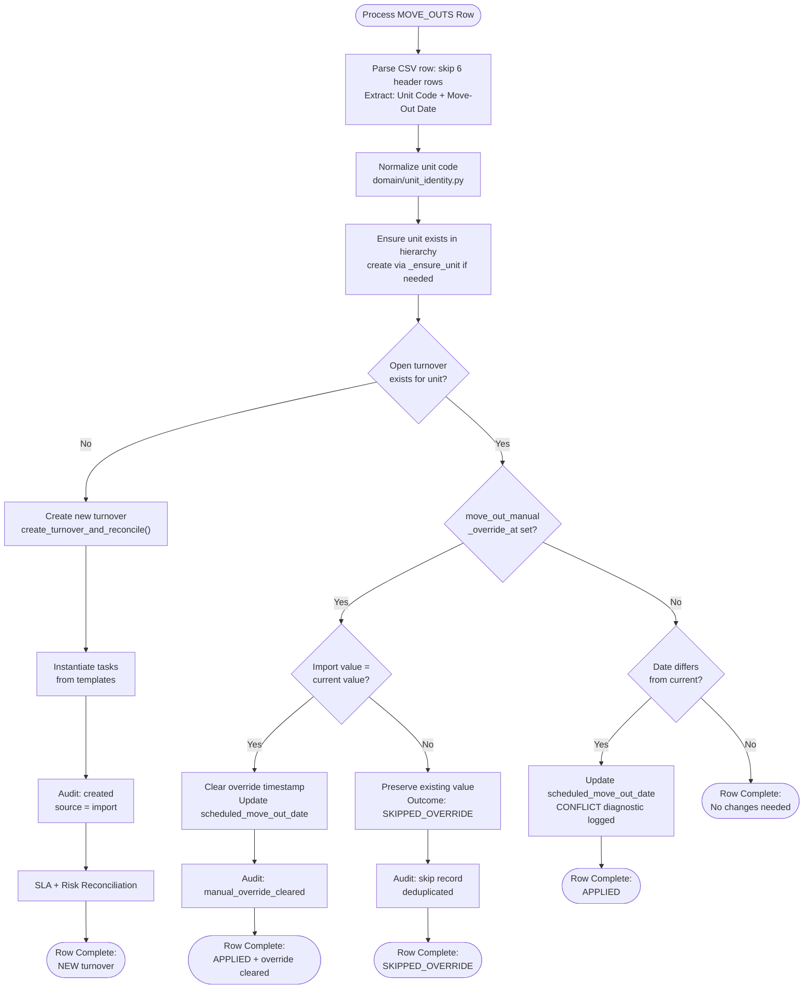

#### Auto-Cancel Mechanism

After all MOVE_OUTS rows are processed, an auto-cancel pass scans all open turnovers for the property. Units that disappear from two consecutive MOVE_OUTS imports are automatically canceled, tracked via the `missing_moveout_count` field.

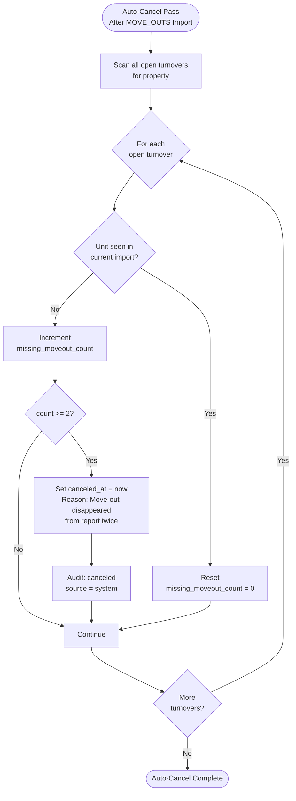

### 4.3.3 PENDING_MOVE_INS Import Process

The PENDING_MOVE_INS import (`services/import_service.py`, lines 606–678) updates move-in dates on existing turnovers. The flow is structurally similar to MOVE_OUTS but does not create new turnovers.

**Processing steps per row:**

1. **Parse CSV** (skip 5 header rows): Extract Unit Code and Move In Date
2. **Unit lookup** by normalized code: If not found → `CONFLICT` diagnostic
3. **Open turnover lookup**: If not found → `CONFLICT` diagnostic
4. **Override check** against `move_in_manual_override_at`:
   - **Override set + values match**: Clear override, update `move_in_date`, audit `manual_override_cleared`
   - **Override set + values differ**: `SKIPPED_OVERRIDE` outcome, write deduplicated skip audit
   - **No override + value changed**: Update `move_in_date`, audit the change

Unlike MOVE_OUTS, the PENDING_MOVE_INS pipeline does not trigger SLA reconciliation directly. Move-in date changes affect lifecycle phase derivation, which is re-evaluated on the next board load through the enrichment pipeline.

### 4.3.4 PENDING_FAS Import Process

The PENDING_FAS import (`services/import_service.py`, lines 680–761) sets legal confirmation fields that influence the effective move-out date precedence chain. This import has unique first-write-wins semantics for legal confirmation data.

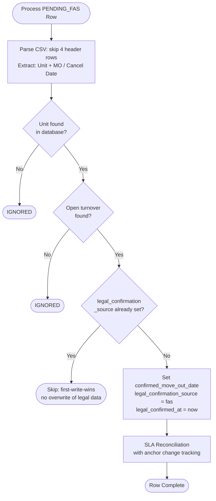

#### Legal Confirmation Business Rules

- **First-write-wins**: Once `legal_confirmation_source` is set, subsequent PENDING_FAS imports do not overwrite the value. This protects confirmed legal dates from accidental modification.
- **SLA anchor impact**: Legal confirmation changes the effective move-out date (Tier 2 in the precedence chain), which triggers SLA reconciliation with explicit anchor date change tracking and auditing.
- **No override semantics**: Unlike other import types, PENDING_FAS does not participate in the manual override protection system; it uses its own first-write-wins mechanism.

### 4.3.5 AVAILABLE_UNITS and DMRB Import Process

The AVAILABLE_UNITS (CSV, skip 5 rows) and DMRB (Excel) imports reconcile readiness-related fields on existing turnovers (`services/import_service.py`, lines 763–878). Both follow the standard override protection pattern:

**Processing steps per row:**

1. **Parse file**: Extract Unit, Status/Ready Date, Available Date
2. **Unit and turnover lookup**: If either not found → `IGNORED`
3. **Override check** against `ready_manual_override_at`:
   - **Override set + values match**: Clear override, update `report_ready_date` + `available_date`
   - **Override set + values differ**: `SKIPPED_OVERRIDE` outcome
   - **No override**: Apply imported values
4. **AVAILABLE_UNITS only**: Additional `status_manual_override_at` check for the status field

These imports do not create turnovers, trigger SLA reconciliation, or run the auto-cancel pass.

---

## 4.4 TASK LIFECYCLE AND TRANSITIONS

The Task Engine (F-006), implemented across `services/task_service.py` and `services/import_service.py`, manages template-driven task instantiation with dual-track status tracking: execution status and confirmation status.

### 4.4.1 Task State Machine

Tasks track two independent status dimensions that interact through the three canonical transitions. The execution track captures vendor work progress, while the confirmation track captures manager review state.

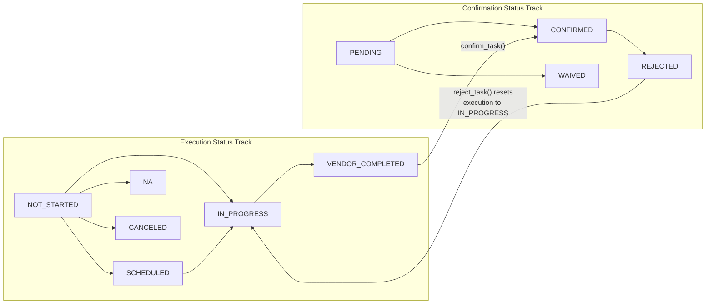

#### Database Constraints on Status Transitions

The `task` table in `db/schema.sql` enforces critical status invariants through CHECK constraints:

- `VENDOR_COMPLETED` requires `vendor_completed_at NOT NULL` — a timestamp must be recorded when vendor work completes
- `CONFIRMED` requires both `vendor_completed_at NOT NULL` and `manager_confirmed_at NOT NULL` — manager confirmation is only valid after vendor completion
- A unique constraint on `(turnover_id, task_type)` prevents duplicate task types per turnover

### 4.4.2 Canonical Task Transitions

Three canonical transition functions in `services/task_service.py` (lines 38–119) implement the validated state changes with mandatory reconciliation triggers.

#### Vendor Completion — `mark_vendor_completed()`

1. **Retrieve** task record → validate exists
2. **Set** `execution_status = "VENDOR_COMPLETED"`, `vendor_completed_at = now`
3. **Audit** the status change with `source = manual`
4. **Trigger** `reconcile_after_task_change()` → risk reconciliation

#### Manager Confirmation — `confirm_task()`

1. **Retrieve** task record → validate exists
2. **Guard**: `execution_status` must be `VENDOR_COMPLETED` → raises `ValueError` if not met
3. **Set** `confirmation_status = "CONFIRMED"`, `manager_confirmed_at = now`
4. **Audit** the status change
5. **Trigger** `reconcile_after_task_change()` → risk reconciliation

#### Manager Rejection — `reject_task()`

1. **Retrieve** task record → validate exists
2. **Guard**: `confirmation_status` must be `CONFIRMED` → raises `ValueError` if not met
3. **Set** `confirmation_status = "REJECTED"`, `execution_status = "IN_PROGRESS"`, clear `manager_confirmed_at`
4. **Audit** both field changes
5. **Trigger** `reconcile_after_task_change()` → risk reconciliation

### 4.4.3 Reconciliation After Task Change

The `reconcile_after_task_change()` function in `services/turnover_service.py` (lines 404–431) is invoked after every task status transition. It loads the turnover's complete state (all tasks, effective dates, WD state) and delegates to `reconcile_risks_for_turnover()` only. Task changes do not trigger SLA reconciliation because SLA breaches are based on date thresholds and readiness confirmation, not individual task state.

The canonical eight-task-type sequence processed by the enrichment pipeline is: `Insp`, `CB`, `MRB`, `Paint`, `MR`, `HK`, `CC`, `FW`, as defined in `domain/enrichment.py` (line 23).

---

## 4.5 SLA RECONCILIATION ENGINE

The SLA Engine (F-007) evaluates Service Level Agreement breaches against a 10-day readiness threshold. Pure evaluation logic resides in `domain/sla_engine.py`, while reconciliation orchestration with event tracking, stop dominance, and convergence safety operates in `services/sla_service.py`.

### 4.5.1 SLA Evaluation and Reconciliation Flow

The `reconcile_sla_for_turnover()` function in `services/sla_service.py` (lines 1–260) is the primary SLA reconciliation entry point. It handles data integrity validation, anchor change tracking, pure evaluation, stop dominance, event management, and convergence checking.

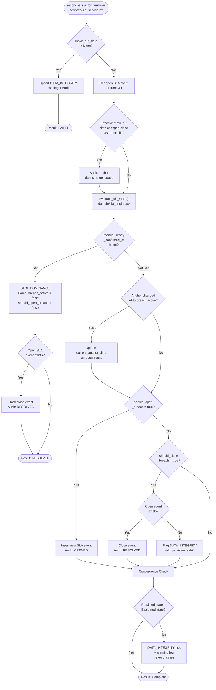

#### SLA Breach Evaluation Rule

The pure `evaluate_sla_state()` function in `domain/sla_engine.py` (lines 1–31) determines breach state through a single compound condition:

**Breach is active when:**
- `move_out_date <= today` — move-out has occurred
- AND `manual_ready_confirmed_at is None` — readiness not yet confirmed
- AND `(today - move_out_date) > 10 days` — the `SLA_THRESHOLD_DAYS` (10) threshold is exceeded

The function returns three boolean values: `breach_active`, `should_open_breach`, `should_close_breach`.

### 4.5.2 Stop Dominance Mechanism

Stop dominance (`services/sla_service.py`, lines 88–121) is a critical SLA rule: once `manual_ready_confirmed_at` is set for a turnover, no subsequent SLA evaluation can reopen a breach for that turnover. This permanent closure behavior ensures that confirmed readiness is authoritative over any date-based calculation.

When stop dominance activates:
1. `should_open_breach` is forced to `False`
2. `breach_active` is forced to `False`
3. Any existing open SLA event is hard-closed with an audit record
4. The reconciliation result is set to `RESOLVED`

### 4.5.3 Convergence Safety Check

The convergence check (`services/sla_service.py`, lines 204–243) acts as a defensive validation layer. After the main reconciliation logic completes, it compares the persisted SLA state (open or closed events) against the pure evaluation output. If a mismatch is detected, a `DATA_INTEGRITY` risk flag is raised and a warning is logged. Critically, this check is wrapped in exception handling with the principle "never crash production paths" — any error in the convergence check itself is silently caught to prevent disruption of the parent workflow.

---

## 4.6 RISK RECONCILIATION ENGINE

The Risk Engine (F-008) systematically evaluates eight operational risk types with severity-based classification. Pure evaluation logic resides in `domain/risk_engine.py`, with diff-based reconciliation in `services/risk_service.py`.

### 4.6.1 Risk Type Evaluation

The `evaluate_risks()` function in `domain/risk_engine.py` (lines 1–97) evaluates all eight risk types against the current turnover and task state. Each risk type has defined trigger conditions and severity thresholds:

| Risk Type | Trigger Condition | WARNING Threshold | CRITICAL Threshold |
|---|---|---|---|
| `QC_RISK` | QC not confirmed, move-in approaching | ≤ 3 days to move-in | ≤ 2 days to move-in |
| `WD_RISK` | WD not present, supervisor not notified | ≤ 7 days to event | ≤ 3 days to event |
| `CONFIRMATION_BACKLOG` | Vendor completed, not confirmed | 3–4 days age | ≥ 5 days age |
| `EXECUTION_OVERDUE` | Vendor due date passed, not completed | Due date passed | — |
| `DATA_INTEGRITY` | Data integrity conflict detected | — | Always CRITICAL |
| `DUPLICATE_OPEN_TURNOVER` | Multiple open turnovers for unit | — | Always CRITICAL |
| `EXPOSURE_RISK` | Report ready date passed, not confirmed | Report ready passed | ≥ 3 days past |
| `SLA_BREACH` | SLA breach condition active | Via SLA Engine | Via SLA Engine |

The `idx_one_active_risk_per_type` partial unique index in `db/schema.sql` enforces one active risk per type per turnover.

### 4.6.2 Diff-Based Reconciliation Flow

The `reconcile_risks_for_turnover()` function in `services/risk_service.py` (lines 1–106) uses a diff-based approach: it compares the desired risk set (from evaluation) against the existing active risks, then upserts new risks and resolves stale ones.

```mermaid
flowchart TD
    Start(["reconcile_risks_for_turnover<br/>services/risk_service.py"]) --> GetExisting["Get all active risks<br/>for turnover from DB"]
    GetExisting --> LoadState["Load turnover row:<br/>report_ready_date<br/>manual_ready_confirmed_at"]
    LoadState --> LoadTasks["Load all tasks<br/>for turnover"]
    LoadTasks --> Evaluate["evaluate_risks()<br/>domain/risk_engine.py<br/>8 risk types"]
    Evaluate --> DiffComp["Compare: desired risks<br/>vs existing risks"]

    DiffComp --> NewRisks{"New risks<br/>in desired but<br/>not in existing?"}
    NewRisks -->|"Yes"| UpsertNew["Upsert each new risk<br/>Audit: risk flag created<br/>source = system"]
    NewRisks -->|"No"| StaleCheck{"Stale risks<br/>in existing but<br/>not in desired?"}
    UpsertNew --> StaleCheck

    StaleCheck -->|"Yes"| ResolveOld["Resolve each stale risk<br/>Set resolved_at = now<br/>Audit: risk resolved"]
    StaleCheck -->|"No"| Done(["Reconciliation Complete"])
    ResolveOld --> Done
```

#### Reconciliation Characteristics

- **Idempotent**: Running reconciliation with unchanged state produces no new audit entries or database changes
- **Symmetric**: Both risk creation (upsert) and risk resolution (resolve) are handled in a single pass
- **System-attributed**: All risk changes are audited with `source = "system"` to distinguish them from manual changes
- **Severity-aware**: Risk severity is included in the upserted record, enabling CRITICAL flags to block auto-close

---

## 4.7 BOARD ENRICHMENT PIPELINE

The board enrichment pipeline, implemented in `domain/enrichment.py` (lines 1–273) and orchestrated by `services/board_query_service.py` (lines 1–392), transforms raw database rows into the rich, derived fields displayed on the DMRB Board, Flag Bridge, and Risk Radar views.

### 4.7.1 Three-Stage Enrichment Flow

The `enrich_row()` function processes each turnover through three sequential computation stages. Each stage builds upon the outputs of previous stages, creating a layered enrichment model that separates factual computation from intelligence derivation and compliance evaluation.

```mermaid
flowchart TD
    Start(["get_dmrb_board_rows()<br/>services/board_query_service.py"]) --> LoadTO["Load open turnovers<br/>filtered by phase_ids"]
    LoadTO --> CacheCheck{"Per-turnover<br/>cache exists<br/>for today?"}
    CacheCheck -->|"Cache Hit"| UseCached["Apply cached<br/>enrichment payload"]
    CacheCheck -->|"Cache Miss"| BatchLoad["Batch-load units,<br/>tasks, notes"]

    BatchLoad --> BuildRow["Build flat row:<br/>turnover + unit + tasks + notes"]
    BuildRow --> Stage1["STAGE 1: compute_facts()"]

    Stage1 --> FactsOut["Outputs:<br/>effective move-out date<br/>dv: days vacant<br/>dtbr: days to be ready<br/>lifecycle phase + NVM label<br/>boolean flags<br/>task state analysis<br/>current/next task<br/>stall detection"]

    FactsOut --> Stage2["STAGE 2: compute_intelligence()"]
    Stage2 --> IntelOut["Outputs:<br/>is_unit_ready<br/>is_ready_for_moving<br/>in_turn_execution<br/>operational_state<br/>attention_badge"]

    IntelOut --> Stage3["STAGE 3: compute_sla_breaches()"]
    Stage3 --> BreachOut["Outputs:<br/>inspection_sla_breach<br/>sla_breach<br/>sla_movein_breach<br/>plan_breach<br/>has_violation"]

    BreachOut --> WriteCache["Write to<br/>turnover_enrichment_cache"]
    WriteCache --> MergeRow["Merge enrichment<br/>into board row"]
    UseCached --> MergeRow

    MergeRow --> ApplyFilters["Apply in-memory filters:<br/>status, NVM, assignee, QC"]
    ApplyFilters --> Sort["Sort: move-in availability<br/>with dv as tiebreaker"]
    Sort --> Return(["Return enriched<br/>board rows"])
```

#### Stage 1: Fact Computation — `compute_facts()`

The factual computation stage (`domain/enrichment.py`, lines 79–159) derives all measurable, observable attributes from raw data:

- **Days vacant (dv)**: Business days from effective move-out to today
- **Days to be ready (dtbr)**: Business days from today to move-in date
- **Lifecycle phase**: Derived via `domain/lifecycle.py`
- **NVM short label**: Normalized display classification
- **Task state analysis**: Counts vendor-completed tasks, determines overall state (`"All Tasks Complete"`, `"In Progress"`, `"Not Started"`)
- **Current/next task**: Identified from the canonical sequence `["Insp", "CB", "MRB", "Paint", "MR", "HK", "CC", "FW"]` with expected day durations `{Insp: 1, CB: 2, MRB: 2, Paint: 2, MR: 3, HK: 6, CC: 7, FW: 8}`
- **Stall detection**: `is_vacant AND current_task AND dv > expected_days + 1`

#### Stage 2: Intelligence Derivation — `compute_intelligence()`

The intelligence stage (`domain/enrichment.py`, lines 178–214) synthesizes facts into operational assessments:

- **`is_unit_ready`**: `manual_ready_status == "Vacant ready"` AND `task_state == "All Tasks Complete"`
- **`is_ready_for_moving`**: `is_unit_ready` AND `is_move_in_present` AND `is_qc_done`
- **`operational_state`**: Derived category from a priority evaluation chain: `"On Notice"` → `"Out of Scope"` → `"Move-In Risk"` → `"QC Hold"` → `"Work Stalled"` → `"In Progress"` → `"Apartment Ready"` → `"Pending Start"`
- **`attention_badge`**: Mapped from `operational_state` via `ATTENTION_BADGE_MAP`

#### Stage 3: SLA Breach Evaluation — `compute_sla_breaches()`

The compliance stage (`domain/enrichment.py`, lines 217–247) evaluates four breach conditions:

| Breach Type | Condition |
|---|---|
| `inspection_sla_breach` | `is_vacant` AND inspection not done AND `dv > 1` |
| `sla_breach` | `is_vacant` AND not ready AND `dv > 10` |
| `sla_movein_breach` | Move-in present AND not ready for moving AND `dtbr <= 2` |
| `plan_breach` | Report ready date passed AND not ready |

The composite `has_violation` flag is true if any of the four breach conditions is active.

### 4.7.2 Enrichment Cache Management

The enrichment cache (`turnover_enrichment_cache` table) stores a JSON payload of derived fields keyed by `(turnover_id, cache_date)`. Cache behavior is managed by `services/board_query_service.py`:

- **Cache hit**: Same-day entries are reused, bypassing the full enrichment computation
- **Cache miss**: Full three-stage pipeline runs, and results are written to the cache
- **Invalidation**: Cache is date-based only — entries expire daily. There is no event-driven invalidation in the current implementation
- **Cache keys**: Defined via `ENRICHMENT_CACHE_KEYS` in the board query service, covering all derived enrichment fields

### 4.7.3 Flag Bridge and Risk Radar Derivation

**Flag Bridge** (`services/board_query_service.py`, `get_flag_bridge_rows()`): Fully reuses the `get_dmrb_board_rows()` pipeline, then applies a post-processing filter via `BRIDGE_MAP`:

| Breach Label | Enriched Boolean Key |
|---|---|
| `"Insp Breach"` | `inspection_sla_breach` |
| `"SLA Breach"` | `sla_breach` |
| `"SLA MI Breach"` | `sla_movein_breach` |
| `"Plan Bridge"` | `plan_breach` |

Users select a breach label and a Yes/No toggle; the view returns the matching subset of enriched board rows.

**Risk Radar** (`domain/risk_radar.py`, `services/board_query_service.py`, `get_risk_radar_rows()`): Applies a weighted scoring model over seven risk factors:

| Risk Factor | Weight |
|---|---|
| `inspection_overdue` | 3 |
| `task_execution_overdue` | 2 |
| `qc_rejected` | 2 |
| `sla_breach` | 3 |
| `sla_near_breach` | 2 |
| `blocked_dependency` | 1 |
| `movein_approaching_incomplete` | 2 |

Risk levels are classified by composite score: **LOW** (≤ 2), **MEDIUM** (≤ 5), **HIGH** (> 5). Results include `risk_score`, `risk_level`, and `risk_reasons` for each turnover.

---

## 4.8 TURNOVER DETAIL MANAGEMENT FLOWS

The Turnover Detail view (F-015) provides per-turnover editing capabilities, each routed through `services/turnover_service.py` and triggering appropriate reconciliation based on the operation type.

### 4.8.1 Operational Update Paths

Four distinct update operations are available, each with different reconciliation implications. The following diagram shows the complete decision flow and downstream effects.

```mermaid
flowchart TD
    User(["Operator Action<br/>via Turnover Detail"]) --> ActionType{"Action Type?"}

    ActionType -->|"Set Ready Status"| ReadyStatus["Update manual_ready_status<br/>Set status_manual_override_at<br/>turnover_service lines 160-208"]
    ActionType -->|"Confirm Ready"| ConfirmReady["Set manual_ready_confirmed_at<br/>= now<br/>turnover_service lines 211-257"]
    ActionType -->|"Update Dates"| UpdateDates["Update date field<br/>Set *_manual_override_at<br/>turnover_service lines 321-401"]
    ActionType -->|"Update WD Panel"| UpdateWD["Update WD fields<br/>wd_present, wd_present_type<br/>wd_supervisor_notified, wd_installed<br/>turnover_service lines 260-318"]

    ReadyStatus --> AuditRS["Audit: status changed + override set"]
    ConfirmReady --> AuditCR["Audit: manual_ready_confirmed"]
    UpdateDates --> AuditDT["Audit: date changed + override set"]
    UpdateWD --> AuditWD["Audit: WD field changes"]

    AuditRS --> SLARisk1["SLA Reconciliation<br/>+ Risk Reconciliation"]
    AuditCR --> SLAStop["SLA Reconciliation<br/>TRIGGERS STOP DOMINANCE"]
    SLAStop --> RiskOnly1["Risk Reconciliation"]
    AuditDT --> SLAAnchor["SLA Reconciliation<br/>with anchor change tracking"]
    SLAAnchor --> RiskOnly2["Risk Reconciliation"]
    AuditWD --> RiskOnlyWD["Risk Reconciliation ONLY<br/>no SLA impact"]

    SLARisk1 --> Done(["Update Complete"])
    RiskOnly1 --> Done
    RiskOnly2 --> Done
    RiskOnlyWD --> Done
```

#### Note Management

Note operations in `services/note_service.py` (lines 1–84) follow a simpler flow:

- **Create note**: Insert note with `turnover_id`, `description`, `note_type`, `blocking`, `severity` → audit with `source = "manual"`
- **Resolve note**: Retrieve note → if already resolved, return (idempotent) → set `resolved_at` → audit

Notes are explicitly excluded from lifecycle and risk calculations. Unresolved notes are joined into board rows by the enrichment pipeline for display purposes only.

### 4.8.2 Reconciliation Trigger Summary

The following table documents which reconciliation engines are invoked by each trigger event, mapping the complete reconciliation surface across all write operations:

| Trigger Event | SLA Reconciliation | Risk Reconciliation | Source Module |
|---|---|---|---|
| Turnover creation | ✓ | ✓ | `turnover_service.py` |
| Turnover date update | ✓ (anchor tracking) | ✓ | `turnover_service.py` |
| Manual ready status change | ✓ | ✓ | `turnover_service.py` |
| Manual ready confirmation | ✓ (stop dominance) | ✓ | `turnover_service.py` |
| Task vendor completed | — | ✓ | `task_service.py` |
| Task confirmed | — | ✓ | `task_service.py` |
| Task rejected | — | ✓ | `task_service.py` |
| WD panel update | — | ✓ | `turnover_service.py` |
| PENDING_FAS import (legal) | ✓ (anchor change) | — | `import_service.py` |
| MOVE_OUTS import (new turnover) | ✓ | ✓ | `import_service.py` |

---

## 4.9 MANUAL OVERRIDE PROTECTION

Manual Override Protection (F-009) ensures that operator-entered values are preserved against silent overwriting during import processing. The mechanism uses timestamp-tracked override fields and applies a consistent check-match-or-skip pattern across all import types.

### 4.9.1 Override Setting During Manual Edits

When an operator manually changes a date or status through the Turnover Detail view, the corresponding override timestamp is set to the current time. Four override fields are tracked:

| Data Field | Override Timestamp | Set By |
|---|---|---|
| `move_out_date` | `move_out_manual_override_at` | `turnover_service.update_turnover_dates()` |
| `move_in_date` | `move_in_manual_override_at` | `turnover_service.update_turnover_dates()` |
| `report_ready_date` | `ready_manual_override_at` | `turnover_service.update_turnover_dates()` |
| `manual_ready_status` | `status_manual_override_at` | `turnover_service.set_manual_ready_status()` |

Each manual edit produces an audit record with action `manual_override_set` and `source = "manual"`.

### 4.9.2 Override Handling During Imports

During import processing, every field update checks for an active override timestamp before applying the imported value. The following diagram shows the complete override decision flow used consistently across all import types.

```mermaid
flowchart TD
    subgraph ManualEditPath["Manual Edit Path - Setting Overrides"]
        UserEdit(["Operator changes<br/>date or status"]) --> SetField["Update field value"]
        SetField --> SetOverride["Set *_manual_override_at<br/>= current timestamp"]
        SetOverride --> AuditOverrideSet["Audit: manual_override_set"]
        AuditOverrideSet --> TriggerRecon["Trigger SLA + Risk<br/>Reconciliation"]
    end

    subgraph ImportCheckPath["Import Path - Checking Overrides"]
        ImportRow(["Import row with<br/>new value for field"]) --> ChkOR{"Override timestamp<br/>exists for field?"}
        ChkOR -->|"No"| ApplyValue["Apply imported value<br/>Outcome: APPLIED"]
        ChkOR -->|"Yes"| ValMatch{"Import value =<br/>current value?"}
        ValMatch -->|"Yes"| ClearOvr["Clear override timestamp<br/>override_at = None"]
        ClearOvr --> AuditCleared["Audit: manual_override_cleared"]
        AuditCleared --> ApplyCleared["Apply value normally"]
        ValMatch -->|"No"| SkipImport["Preserve existing value<br/>Outcome: SKIPPED_OVERRIDE"]
        SkipImport --> AuditSkip["Audit: skip record<br/>field_key pipe report=TYPE pipe v=value<br/>deduplicated against last skip"]
    end
```

#### Override Resolution Business Rules

- **Match-and-clear**: When an import value matches the currently overridden value, the system interprets this as the external system "catching up" to the operator's decision. The override is cleared, allowing future imports to update the field normally.
- **Skip-and-protect**: When an import value differs from the currently overridden value, the import is skipped entirely for that field. The skip outcome is audited with `SKIPPED_OVERRIDE` and a deduplicated skip audit record.
- **Skip audit deduplication**: Skip audit records are only written when the skipped value differs from the last recorded skip audit for the same field, preventing audit log bloat from repeated imports with the same conflicting value.

---

## 4.10 ERROR HANDLING AND RECOVERY

DMRB implements defensive error handling across all subsystems, prioritizing operational continuity over strict failure propagation. The design philosophy is that reconciliation and safety checks should never crash production paths.

### 4.10.1 Import Pipeline Error Handling

The import pipeline handles errors at three levels:

1. **Batch-level validation failure**: File format or schema validation fails → `import_batch` record with `status = FAILED` is inserted → exception is re-raised to the caller
2. **Row-level processing errors**: Individual row failures produce structured `import_row` diagnostic records with `row_index`, `error_type`, `error_message`, `column`, and `suggestion` → processing continues to the next row
3. **Checksum duplicate detection**: Re-importing an identical file → `NO_OP` return with no data modification (not an error, but a designed idempotency safeguard)

### 4.10.2 Task Validation Guards

Task transitions enforce strict preconditions through guard clauses that raise `ValueError` when violated:

| Transition | Guard Condition | Error |
|---|---|---|
| `confirm_task()` | `execution_status` must be `VENDOR_COMPLETED` | `ValueError` if precondition not met |
| `reject_task()` | `confirmation_status` must be `CONFIRMED` | `ValueError` if precondition not met |

These guards prevent invalid state transitions that would violate the database CHECK constraints on the `task` table.

### 4.10.3 SLA Convergence Safety

The SLA convergence check (`services/sla_service.py`, lines 204–243) is designed with explicit crash prevention. If the convergence comparison detects a mismatch between persisted and evaluated SLA state, it raises a `DATA_INTEGRITY` risk flag rather than throwing an exception. Additionally, the convergence check itself is wrapped in a try/except block — any exception during the check is silently caught, logged as a warning, and execution continues. This "hard safety" pattern ensures that the SLA convergence check can never disrupt a parent workflow.

### 4.10.4 Error Handling Flow

```mermaid
flowchart TD
    subgraph ImportErrHandling["Import Error Handling"]
        IE1(["File Received"]) --> IE2{"Format & Schema<br/>Valid?"}
        IE2 -->|"No"| IE3["Insert import_batch<br/>status = FAILED"]
        IE3 --> IE4["Re-raise exception<br/>to caller"]
        IE2 -->|"Yes"| IE5{"Checksum<br/>duplicate?"}
        IE5 -->|"Yes"| IE6(["Return NO_OP"])
        IE5 -->|"No"| IE7["Process rows"]
        IE7 --> IE8{"Row-level<br/>error?"}
        IE8 -->|"Yes"| IE9["Write diagnostic record<br/>Continue to next row"]
        IE8 -->|"No"| IE10["Row processed OK"]
    end

    subgraph TaskGuardHandling["Task Validation Guards"]
        TG1{"confirm_task()"} --> TG2{"execution_status =<br/>VENDOR_COMPLETED?"}
        TG2 -->|"No"| TG3["Raise ValueError"]
        TG2 -->|"Yes"| TG4["Proceed"]
        TG5{"reject_task()"} --> TG6{"confirmation_status =<br/>CONFIRMED?"}
        TG6 -->|"No"| TG7["Raise ValueError"]
        TG6 -->|"Yes"| TG8["Proceed"]
    end

    subgraph SLASafetyHandling["SLA Convergence Safety"]
        SLA1["Run convergence check"] --> SLA2{"Persisted =<br/>Evaluated?"}
        SLA2 -->|"No"| SLA3["Flag DATA_INTEGRITY<br/>risk + warning log"]
        SLA2 -->|"Yes"| SLA4["No action needed"]
        SLA3 --> SLA5["Continue: never crash"]
    end

    subgraph ManualAvailGuards["Manual Availability Guards"]
        MA1(["add_manual_availability()"]) --> MA2{"Unit exists<br/>in database?"}
        MA2 -->|"No"| MA3["Raise ValueError"]
        MA2 -->|"Yes"| MA4{"Open turnover<br/>already exists?"}
        MA4 -->|"Yes"| MA5["Raise ValueError"]
        MA4 -->|"No"| MA6["Proceed with creation"]
    end
```

#### Database Error Classification

The `db/errors.py` module defines a three-tier error hierarchy for database operations:

- **`DatabaseError`**: Base exception for all database-related errors
- **`DatabaseOperationalError`**: Connection failures, lock timeouts, and other operational issues
- **`DatabaseIntegrityError`**: Constraint violations (unique index, CHECK constraint, foreign key), including the critical `idx_one_open_turnover_per_unit` violation

The `classify_db_error()` function maps driver-specific exceptions (SQLite or psycopg) to this project-level hierarchy, enabling consistent error handling regardless of database engine.

---

## 4.11 INTEGRATION SEQUENCES

This section documents the cross-component interaction patterns that connect DMRB's layered architecture, showing how commands flow from the UI through workflows, services, domain logic, and persistence.

### 4.11.1 Turnover Date Update Sequence

The following sequence diagram illustrates the complete flow when an operator updates a turnover date through the Turnover Detail view, showing how the update propagates through the application, workflow, service, domain, and persistence layers.

```mermaid
sequenceDiagram
    actor User as Operator
    participant UI as Streamlit UI
    participant WF as Workflow Layer
    participant TS as Turnover Service
    participant SLA as SLA Service
    participant Risk as Risk Service
    participant Domain as Domain Layer
    participant DB as Repository
    participant Audit as Audit Log

    User->>UI: Update move-out date
    UI->>WF: UpdateTurnoverDates command
    WF->>TS: update_turnover_dates()
    TS->>DB: Get turnover record
    DB-->>TS: Turnover row
    TS->>TS: Compute old anchor date
    TS->>DB: Update date field
    TS->>DB: Set move_out_manual_override_at
    TS->>Audit: Audit: date changed
    TS->>Audit: Audit: manual_override_set
    TS->>TS: Compute new anchor date
    TS->>SLA: reconcile_sla_for_turnover()
    SLA->>Domain: evaluate_sla_state()
    Domain-->>SLA: breach_active, should_open, should_close
    SLA->>DB: Update/create SLA event
    SLA->>Audit: Audit: SLA state change
    SLA-->>TS: SLA result
    TS->>Risk: reconcile_risks_for_turnover()
    Risk->>Domain: evaluate_risks()
    Domain-->>Risk: Desired risk set
    Risk->>DB: Upsert new / resolve stale risks
    Risk->>Audit: Audit: risk changes
    Risk-->>TS: Risk result
    TS-->>WF: Complete
    WF-->>UI: Success
    UI-->>User: Updated view
```

### 4.11.2 Import-to-Reconciliation Sequence

The following sequence diagram illustrates the complete flow of a MOVE_OUTS import from file upload through turnover creation, task instantiation, and dual reconciliation.

```mermaid
sequenceDiagram
    actor User as Operator
    participant Admin as Admin Panel
    participant IS as Import Service
    participant TS as Turnover Service
    participant TaskSvc as Task Service
    participant SLA as SLA Service
    participant Risk as Risk Service
    participant DB as Repository

    User->>Admin: Upload MOVE_OUTS CSV
    Admin->>IS: import_report_file()
    IS->>IS: Compute SHA-256 checksum
    IS->>DB: Check import_batch for duplicate
    alt Duplicate Batch
        DB-->>IS: Checksum exists
        IS-->>Admin: Return NO_OP
    else New Batch
        DB-->>IS: Not found
        IS->>IS: Validate file + Parse rows
        IS->>DB: Insert import_batch: SUCCESS
        loop For Each Row
            IS->>DB: Look up unit by normalized code
            alt No Open Turnover
                IS->>TS: create_turnover_and_reconcile()
                TS->>DB: Insert turnover record
                TS->>TaskSvc: Instantiate tasks from templates
                TaskSvc->>DB: Insert task + dependency records
                TS->>SLA: reconcile_sla_for_turnover()
                TS->>Risk: reconcile_risks_for_turnover()
            else Open Turnover With Override
                IS->>IS: Check override protection
                IS->>DB: Write skip audit or update field
            end
        end
        IS->>IS: Run auto-cancel pass
        IS-->>Admin: Result with row counts
    end
```

### 4.11.3 Reconciliation Trigger Map

The following comprehensive map shows all events that trigger reconciliation across the system, organized by the originating module and the reconciliation type invoked:

```mermaid
flowchart LR
    subgraph TriggerEvents["Trigger Events"]
        T1["Turnover Created"]
        T2["Turnover Date Updated"]
        T3["Ready Status Changed"]
        T4["Ready Confirmed"]
        T5["Task Vendor Completed"]
        T6["Task Confirmed"]
        T7["Task Rejected"]
        T8["WD Panel Updated"]
        T9["FAS Import: Legal Date"]
        T10["MOVE_OUTS: New Turnover"]
    end

    subgraph ReconEngines["Reconciliation Engines"]
        SLAEng["SLA Reconciliation<br/>services/sla_service.py"]
        RiskEng["Risk Reconciliation<br/>services/risk_service.py"]
    end

    T1 --> SLAEng
    T1 --> RiskEng
    T2 --> SLAEng
    T2 --> RiskEng
    T3 --> SLAEng
    T3 --> RiskEng
    T4 --> SLAEng
    T4 --> RiskEng
    T5 --> RiskEng
    T6 --> RiskEng
    T7 --> RiskEng
    T8 --> RiskEng
    T9 --> SLAEng
    T10 --> SLAEng
    T10 --> RiskEng
```

#### Application Command Routing

The application layer (`application/commands/` and `application/workflows/`) provides a thin command-dispatch layer between the UI and services. Six immutable command DTOs route to their corresponding service methods:

| Command | Workflow | Target Service Method |
|---|---|---|
| `UpdateTurnoverStatus` | `update_turnover_status_workflow` | `turnover_service.set_manual_ready_status()` |
| `UpdateTurnoverDates` | `update_turnover_dates_workflow` | `turnover_service.update_turnover_dates()` |
| `UpdateTaskStatus` | `update_task_status_workflow` | `task_service.update_task_fields()` |
| `CreateTurnover` | `create_turnover_workflow` | `manual_availability_service.add_manual_availability()` |
| `ApplyImportRow` | `apply_import_row_workflow` | `import_service.import_report_file()` |
| `ClearManualOverride` | `clear_manual_override_workflow` | Direct repository clear + audit |

---

## 4.12 MANUAL AVAILABILITY FLOW

The Manual Availability feature (F-011), implemented in `services/manual_availability_service.py` (lines 1–92), provides an operational fallback for creating turnovers when units do not appear in imported reports. Unlike import-driven creation, manual availability requires the target unit to already exist in the database and performs full hierarchy validation before delegating to the standard creation pipeline.

### 4.12.1 Hierarchy Validation Chain

The validation flow resolves the complete property hierarchy before turnover creation:

1. **Validate** `unit_number` is not empty → `ValueError` if empty
2. **Look up phase** by `property_id` + `phase_code` → `ValueError` if not found
3. **Look up building** by `phase_id` + `building_code` → `ValueError` if not found
4. **Look up unit** by `building_id` + `unit_number` → `ValueError` if not found (does NOT create units)
5. **Check** for existing open turnover → `ValueError` if already exists

### 4.12.2 Creation and Reconciliation

After validation, the flow composes a source key in the format `"manual:{property_id}:{unit_identity_key}:{move_out_iso}"` and delegates to `turnover_service.create_turnover_and_reconcile()`, which executes the standard creation pipeline: turnover record insertion, template-driven task instantiation, audit logging, and SLA + risk reconciliation.

### 4.12.3 Unit Identity Normalization

Unit identity is canonicalized throughout the system by three pure functions in `domain/unit_identity.py` (lines 1–71):

1. **`normalize_unit_code(raw)`**: Strip whitespace, remove `"UNIT "` prefix (case-insensitive), uppercase, collapse internal whitespace
2. **`parse_unit_parts(unit_code_norm)`**: Split on `"-"` separator → `(phase_code, building_code, unit_number)` with validation
3. **`compose_identity_key(phase, building, unit)`**: Produce deterministic key `"{phase}-{building}-{unit}"`

This normalization ensures consistent unit identification across imports, manual entries, and board displays, eliminating mismatches caused by inconsistent formatting in external reports.

---

#### References

#### Source Files Examined

- `app.py` — Streamlit application entry point, backend initialization, and UI wiring
- `domain/lifecycle.py` — Lifecycle phase constants (lines 4–11), `derive_lifecycle_phase` decision logic (lines 58–91), effective move-out date 4-tier precedence (lines 32–55)
- `domain/sla_engine.py` — SLA threshold definition (`SLA_THRESHOLD_DAYS = 10`), `evaluate_sla_state` pure evaluation function (lines 1–31)
- `domain/risk_engine.py` — Eight risk type definitions and severity thresholds, `evaluate_risks` function (lines 1–97)
- `domain/enrichment.py` — Three-stage enrichment pipeline: `compute_facts` (lines 79–159), `compute_intelligence` (lines 178–214), `compute_sla_breaches` (lines 217–247); task type sequence (line 23)
- `domain/unit_identity.py` — `normalize_unit_code`, `parse_unit_parts`, `compose_identity_key` pure functions (lines 1–71)
- `domain/risk_radar.py` — Seven weighted risk factors, risk level thresholds (lines 1–78)
- `services/import_service.py` — Complete import pipeline for five report types (lines 419–920), task instantiation (lines 364–416), auto-cancel pass (lines 880–905), override handling
- `services/turnover_service.py` — `create_turnover_and_reconcile`, `set_manual_ready_status` (lines 160–208), `confirm_manual_ready` (lines 211–257), `update_wd_panel` (lines 260–318), `update_turnover_dates` (lines 321–401), `reconcile_after_task_change` (lines 404–431), `attempt_auto_close` (lines 434–455)
- `services/task_service.py` — `mark_vendor_completed` (lines 38–61), `confirm_task` (lines 64–89), `reject_task` (lines 92–119), `update_task_fields` (lines 122–177)
- `services/sla_service.py` — `reconcile_sla_for_turnover` with stop dominance (lines 88–121), anchor tracking (lines 59–79), convergence check (lines 204–243)
- `services/risk_service.py` — `reconcile_risks_for_turnover` with diff-based upsert/resolve (lines 1–106)
- `services/board_query_service.py` — Board assembly `get_dmrb_board_rows` (lines 149–259), enrichment caching, Flag Bridge `BRIDGE_MAP`, Risk Radar integration (lines 1–392)
- `services/manual_availability_service.py` — Manual turnover creation with hierarchy validation (lines 1–92)
- `services/note_service.py` — `create_note` and `resolve_note` with audit integration (lines 1–84)
- `db/connection.py` — `ensure_database_ready` bootstrap orchestration (lines 319–389), migration list `_MIGRATIONS` (lines 58–72), backfill functions for migrations 004/007/008
- `db/schema.sql` — 18-table canonical schema with partial unique indexes and CHECK constraints
- `db/errors.py` — `DatabaseError`, `DatabaseOperationalError`, `DatabaseIntegrityError` hierarchy
- `db/adapters/sqlite_adapter.py` — SQLite connection configuration with WAL mode and foreign keys
- `config/settings.py` — Runtime configuration including `enable_db_writes_default`, `allowed_phases`, `default_property_id`
- `application/commands/` — Six frozen command DTOs for write operations
- `application/workflows/` — Six workflow modules routing commands to service methods

#### Folders Explored

- `domain/` — Pure deterministic business logic modules (lifecycle, enrichment, SLA, risk, unit identity, risk radar)
- `services/` — Service orchestration modules (import, turnover, task, SLA, risk, board query, manual availability, note, export)
- `db/` — Persistence layer (schema, migrations, repository, adapters, connection management, error classification)
- `application/` — Application layer command DTOs and workflow orchestration

#### Cross-Referenced Technical Specification Sections

- Section 1.1 — Executive Summary: System positioning and core value proposition
- Section 1.2 — System Overview: Architecture layers, lifecycle state model, technology stack
- Section 1.3 — Scope: In-scope features, out-of-scope exclusions, delivery risks
- Section 2.1 — Feature Catalog: All 20 features with dependencies and technical context
- Section 2.2 — Functional Requirements: Detailed requirements and acceptance criteria per feature
- Section 2.3 — Feature Relationships: Dependency map, integration points, shared components
- Section 2.4 — Implementation Considerations: Technical constraints, performance, scalability
- Section 2.5 — Traceability Matrix: Feature-to-source and command-to-service mappings
- Section 3.6 — Databases & Storage: SQLite/PostgreSQL configuration, adapter abstraction, schema integrity
- Section 3.9 — Technology-to-Architecture Layer Mapping: Layer responsibilities and technology assignments

# 5. System Architecture

This section provides the definitive architectural reference for the Digital Make Ready Board (DMRB), documenting the system's structural composition, component interactions, data flows, integration boundaries, and the rationale behind key technical decisions. DMRB is an operational rules engine with a UI — not a simple CRUD application — and its architecture reflects this identity through strict layer separation, pure deterministic domain logic, reconciliation-based data processing, and a local-first deployment model.

All architectural descriptions in this section are grounded in the implemented codebase. Where transitional or compatibility patterns exist, the code is treated as the authoritative source of truth.

---

## 5.1 HIGH-LEVEL ARCHITECTURE

### 5.1.1 System Overview

#### Architectural Style and Rationale

DMRB employs a **layered monolithic architecture** with strict separation of concerns across seven distinct layers. The system is a **Python-only monoglot stack** — the entire application from UI through business logic to persistence is implemented exclusively in Python. There is no JavaScript, CSS authoring, or separate frontend build pipeline.

Three guiding principles govern the architecture:

1. **Local-first and offline-capable**: No mandatory external service dependencies are required for core functionality. The default database is embedded SQLite, and the Streamlit UI runs as a single-process Python application. This ensures operational continuity in environments where network connectivity is unreliable or unavailable.

2. **Python-only monoglot stack**: Streamlit handles all frontend rendering, eliminating the need for a separate frontend technology chain. This reduces complexity and allows a single-language development team to own the full stack.

3. **Minimal dependency surface**: Only eight pip-installable packages comprise the production runtime (as declared in `requirements.txt`), supplemented by one system-level library (`libpq-dev` in `packages.txt`). This deliberate minimalism reduces supply chain risk and lowers the maintenance burden of version upgrades.

The architecture enforces four critical design boundaries that are consistently maintained throughout the codebase:

- **UI layer contains no business rules** — it delegates all logic to lower layers via dependency injection
- **Domain layer remains pure and deterministic** — no I/O, no side effects, no database access, zero external dependencies
- **Services layer orchestrates all writes** — imports, reconciliation, mutations, and audit operations flow through services
- **Persistence layer owns all SQL** — schema management, migration execution, and database interaction are isolated in `db/`

These boundaries ensure that most core business behaviors are implemented as explicit, testable Python logic rather than being embedded in UI components or persistence queries.

#### System Boundary Diagram

```mermaid
graph TD
    Users(("Property Operations<br/>Teams"))

    subgraph ExternalSources["External Data Sources"]
        CSVReports["Operations Reports<br/>CSV / Excel"]
        UnitCSV["Unit Master<br/>Units.csv"]
    end

    subgraph DMRBSystem["DMRB Application Boundary"]
        subgraph PresentationTier["Presentation Tier"]
            StreamlitUI["Streamlit UI<br/>app.py · ui/"]
            FastAPIChatAPI["FastAPI Chat API<br/>api/"]
        end

        subgraph ApplicationTier["Application Tier"]
            CommandDTOs["Command DTOs<br/>application/commands/"]
            Workflows["Workflows<br/>application/workflows/"]
        end

        subgraph ServiceTier["Service Tier"]
            BoardSvc["Board Query Service"]
            ImportSvc["Import Service"]
            TurnoverSvc["Turnover Service"]
            TaskSvc["Task Service"]
            SLASvc["SLA Service"]
            RiskSvc["Risk Service"]
            ChatSvc["Chat Service"]
            ExportSvc["Export Service"]
        end

        subgraph DomainTier["Domain Tier — Zero Dependencies"]
            Lifecycle["Lifecycle Engine"]
            Enrichment["Enrichment Pipeline"]
            SLAEngine["SLA Engine"]
            RiskEngine["Risk Engine"]
            UnitIdentity["Unit Identity"]
        end

        subgraph PersistenceTier["Persistence Tier"]
            Repository["Repository Layer<br/>db/repository.py"]
            Adapters["Database Adapters<br/>db/adapters/"]
            Migrations["Migration System<br/>db/connection.py"]
        end
    end

    subgraph DataStores["Data Storage"]
        SQLiteDB[("SQLite<br/>Default")]
        PostgresDB[("PostgreSQL<br/>Optional")]
    end

    LLMService["OpenAI API<br/>gpt-4o-mini"]
    ExportArtifacts["Export Artifacts<br/>Excel · PNG · TXT · ZIP"]

    Users -->|"Interact"| StreamlitUI
    CSVReports -->|"Upload"| ImportSvc
    UnitCSV -->|"Upload"| ImportSvc
    StreamlitUI --> CommandDTOs
    StreamlitUI --> FastAPIChatAPI
    CommandDTOs --> Workflows
    Workflows --> ServiceTier
    ServiceTier --> DomainTier
    ServiceTier --> Repository
    FastAPIChatAPI --> ChatSvc
    ChatSvc -->|"Optional"| LLMService
    ExportSvc -->|"Generate"| ExportArtifacts
    Repository --> Adapters
    Adapters --> SQLiteDB
    Adapters -.->|"Optional"| PostgresDB
```

### 5.1.2 Core Components

The following table enumerates every major architectural component, its responsibility, dependencies, integration points, and critical design considerations.

| Component | Primary Responsibility | Key Dependencies |
|---|---|---|
| **Streamlit UI** (`app.py`, `ui/`) | Presentation, user interaction, session state management, screen routing; contains no business rules | Streamlit 1.48.0, pandas |
| **Application Layer** (`application/`) | Immutable command DTOs and thin orchestration workflows for write operations | Python stdlib only (`dataclasses`, `datetime`) |
| **Domain Layer** (`domain/`) | Pure deterministic business logic: lifecycle derivation, enrichment, risk/SLA evaluation, unit identity | **Zero external dependencies** — Python stdlib exclusively |
| **Services Layer** (`services/`) | Orchestration, reconciliation, imports, exports, AI context, audit-aware write workflows | pandas, openpyxl, matplotlib, openai, hashlib |
| **Persistence Layer** (`db/`) | Schema management, ordered migrations, repository CRUD, database adapter abstraction | sqlite3 (stdlib), psycopg 3.3.3 |
| **API Layer** (`api/`) | FastAPI HTTP transport exclusively for AI chat endpoints | FastAPI, Pydantic, uvicorn |
| **Configuration** (`config/`) | Runtime settings resolution: database engine, actor, phases, timezone, write-enable defaults | `dataclasses`, `functools.lru_cache`, `streamlit.secrets` |
| **Import Validation** (`imports/`) | File-level and schema-level validation for import pipelines | pandas |

| Component | Integration Points | Critical Considerations |
|---|---|---|
| **Streamlit UI** | Delegates to Application/Services/Persistence layers; hosts write control gate | Re-executes on every interaction; write gate in `ui/actions/db.py` |
| **Application Layer** | Receives commands from UI, delegates to Services | Six frozen command DTOs enforce immutability |
| **Domain Layer** | Called by Services for all business logic evaluation | Must never import I/O or infrastructure modules |
| **Services Layer** | Calls Domain for logic, Persistence for data; caller-managed transactions | Services never commit — callers own transaction boundaries |
| **Persistence Layer** | Serves Repository queries to Services; manages SQLite and PostgreSQL adapters | Adapter pattern with `qmark_to_percent()` SQL translation |
| **API Layer** | Mounts on `/api/chat` prefix; delegates to `ChatService` | Exists solely for AI chat — not a general-purpose REST API |
| **Configuration** | Read by all layers at startup via `get_settings()` | Memoized via `@lru_cache(maxsize=1)` — resolved once per process |
| **Import Validation** | Called by Import Service before row processing | Accumulates all defects rather than failing on first issue |

### 5.1.3 Data Flow Description

DMRB's data flows are organized around three primary patterns: **read assembly**, **write mutation**, and **import reconciliation**. Each pattern traverses the layered architecture in a distinct manner with well-defined responsibilities at each tier.

#### Read Flow: Board Assembly

The dominant read path is board assembly, orchestrated by `services/board_query_service.py`. This flow loads all open turnovers filtered by configured `phase_ids`, batch-loads associated units, tasks, and notes, and passes each row through the three-stage enrichment pipeline in `domain/enrichment.py`. Enrichment results are cached per-turnover per-day in the `turnover_enrichment_cache` table; cache hits bypass the full computation pipeline. After enrichment, in-memory filters (status, NVM, assignee, QC) are applied, and results are sorted by move-in availability with days vacant as a tiebreaker. The Flag Bridge and Risk Radar views fully reuse this enriched dataset, applying post-processing filters (breach label matching) or weighted scoring (seven risk factors) respectively.

#### Write Flow: Mutation Pipeline

All write operations follow a consistent pattern: the UI layer constructs an immutable command DTO (e.g., `UpdateTurnoverDates`) and invokes the corresponding workflow function in `application/workflows/`. The workflow delegates to the appropriate service, which performs the mutation, writes audit log entries with source attribution (`manual`, `import`, or `system`), and triggers post-mutation SLA and risk reconciliation. The UI layer owns the transaction boundary — it commits on success and rolls back on failure, with connection lifecycle managed in `ui/actions/db.py`. The write control gate (`st.session_state["enable_db_writes"]`) is checked before any persistence operation, and is enforced exclusively at the UI layer.

#### Import Flow: Reconciliation Pipeline

Imports flow through `services/import_service.py` with a reconciliation-based approach rather than naive overwrite. File bytes are checksummed (SHA-256) to detect and skip duplicate batches. Validated rows are processed individually with manual override protection: if an operator has previously set a field manually (tracked via `*_manual_override_at` timestamps), the import either clears the override when values match (match-and-clear) or skips the field entirely when values conflict (skip-and-protect). New turnovers created through imports receive template-driven task sets with dependencies. After row processing, SLA and risk reconciliation execute. The entire pipeline produces an append-only audit trail through `import_batch` and `import_row` records.

#### Data Stores and Caching

The primary data store is a relational database (SQLite default, PostgreSQL optional) containing 18 tables defined in `db/schema.sql`. The `turnover_enrichment_cache` table provides per-day caching of derived enrichment fields to reduce redundant computation. Cache invalidation is date-based only — entries expire daily with no event-driven invalidation mechanism. A secondary file-based store (`data/dropdown_config.json`) persists runtime configuration for task assignees and scheduling offsets. Export artifacts (Excel, PNG, TXT, ZIP) are generated in-memory or to temporary files and do not persist beyond the session.

### 5.1.4 External Integration Points

DMRB integrates with external systems through narrowly scoped channels. There is no general-purpose API layer, no message queue, and no service mesh. Each integration point is documented below.

| System | Integration Type | Data Pattern |
|---|---|---|
| CSV/Excel Reports (5 types) | File-based import via Streamlit uploader | One-way inbound, batch-level checksum idempotency |
| Units.csv | File-based import via Admin screen | One-way inbound, property hierarchy bootstrap/repair |
| OpenAI API (gpt-4o-mini) | HTTP API call from `services/chat_service.py` | Request/response, optional, lazy-loaded at first use |
| File System (exports) | File-based output via `services/export_service.py` | One-way outbound, generated in-memory or temporary |

| System | Protocol/Format | SLA / Availability Requirements |
|---|---|---|
| CSV/Excel Reports | CSV (4 types), XLSX (1 type — DMRB report) | None — file-based, operator-initiated |
| Units.csv | CSV with structured columns | None — manual upload, administrative action |
| OpenAI API | REST/JSON over HTTPS | Best-effort; lazy import ensures chat unavailability never blocks core ops |
| File System (exports) | XLSX, PNG, TXT, ZIP | None — on-demand generation, session-scoped |

> **Architectural Note**: The optional Supabase-hosted PostgreSQL path uses `sslmode=require` for encryption in transit. Streamlit Community Cloud deployments require the Supabase session pooler URL because direct IPv6 endpoints are not supported in that environment.

---

## 5.2 COMPONENT DETAILS

### 5.2.1 Configuration Layer

**Location**: `config/__init__.py`, `config/settings.py`

**Purpose and Responsibilities**: The configuration layer centralizes all runtime settings into a single immutable `Settings` dataclass. It resolves configuration values through a defined precedence chain and provides a memoized factory function to ensure consistency throughout the application lifecycle.

**Technologies**: Python `dataclasses` (frozen), `functools.lru_cache`, `streamlit.secrets`, `os.getenv`

**Key Interface — `get_settings()`**: Returns a frozen `Settings` instance, memoized via `@lru_cache(maxsize=1)` so that configuration is resolved exactly once per process lifetime. The resolution follows a three-tier lookup: Streamlit secrets (`st.secrets`) are checked first, environment variables (`os.getenv`) serve as fallback, and hardcoded defaults in the `Settings` dataclass apply when neither source provides a value.

**Settings Parameters**:

| Parameter | Default | Override Variable(s) |
|---|---|---|
| `database_engine` | `"sqlite"` | `DB_ENGINE`, `DMRB_DATABASE_ENGINE` |
| `database_path` | `data/cockpit.db` | `COCKPIT_DB_PATH`, `DMRB_DATABASE_PATH` |
| `database_url` | `None` | `DATABASE_URL` |
| `default_property_id` | `1` | `DMRB_DEFAULT_PROPERTY_ID` |
| `allowed_phases` | `("5", "7", "8")` | `DMRB_ALLOWED_PHASES` |
| `timezone` | `"UTC"` | `DMRB_TIMEZONE` |
| `enable_db_writes_default` | `False` (SQLite) / `True` (Postgres) | `DMRB_ENABLE_DB_WRITES_DEFAULT` |
| `default_actor` | `"manager"` | `DMRB_DEFAULT_ACTOR` |

**Scaling Considerations**: Configuration is immutable after resolution. The `@lru_cache` pattern means that environment variable changes require a process restart to take effect. This is acceptable for the single-process deployment model.

### 5.2.2 Persistence Layer

**Location**: `db/config.py`, `db/connection.py`, `db/repository.py`, `db/schema.sql`, `db/postgres_schema.sql`, `db/postgres_bootstrap.py`, `db/errors.py`, `db/adapters/`

**Purpose and Responsibilities**: The persistence layer owns all database interaction — schema creation, migration execution, CRUD operations, and error classification. It abstracts database engine differences through a protocol-based adapter pattern, enabling a single repository layer to operate against both SQLite and PostgreSQL without SQL duplication.

**Technologies**: `sqlite3` (Python stdlib), `psycopg[binary]` 3.3.3, SQL (both dialects)

#### Database Adapter Architecture

The adapter pattern is the central architectural mechanism of the persistence layer. It enables `db/repository.py` to issue queries using a single API regardless of the underlying database engine.

```mermaid
graph TD
    subgraph AdapterArchitecture["Database Adapter Architecture"]
        Repo["db/repository.py<br/>Unified Repository Layer"]
        ConfigRes["db/config.py<br/>resolve_database_config()"]
        AdapterDispatch["db/adapters/__init__.py<br/>get_adapter(config)"]
        BaseProto["db/adapters/base.py<br/>Protocol Contracts"]
        ConnWrapper["db/adapters/base_adapter.py<br/>ConnectionWrapper"]
    end

    subgraph Adapters["Engine-Specific Adapters"]
        SQLiteAdapt["db/adapters/sqlite_adapter.py<br/>PRAGMA: WAL, foreign_keys=ON<br/>Row factory: sqlite3.Row"]
        PGAdapt["db/adapters/postgres_adapter.py<br/>psycopg 3.3.3<br/>Row factory: dict_row"]
    end

    subgraph ErrorClassification["Error Classification"]
        ClassifyFn["db/errors.py<br/>classify_db_error()"]
        DBError["DatabaseError<br/>Base exception"]
        DBIntErr["DatabaseIntegrityError<br/>Constraint violations"]
        DBOpErr["DatabaseOperationalError<br/>Connection failures"]
    end

    Repo --> ConfigRes
    ConfigRes --> AdapterDispatch
    AdapterDispatch -->|"engine=sqlite"| SQLiteAdapt
    AdapterDispatch -->|"engine=postgres"| PGAdapt
    SQLiteAdapt --> ConnWrapper
    PGAdapt --> ConnWrapper
    ConnWrapper --> ClassifyFn
    ClassifyFn --> DBError
    ClassifyFn --> DBIntErr
    ClassifyFn --> DBOpErr
```

The `ConnectionWrapper` in `db/adapters/base_adapter.py` provides engine-aware method forwarding (`execute()`, `executemany()`, `executescript()`, `commit()`, `rollback()`, `close()`, `inserted_id()`). The `qmark_to_percent()` utility translates SQLite `?` placeholders to PostgreSQL `%s` placeholders, allowing the repository to author SQL in a single style. The `classify_db_error()` function maps driver-specific exceptions to the project's three-tier error hierarchy (`DatabaseError`, `DatabaseOperationalError`, `DatabaseIntegrityError`), enabling consistent error handling regardless of engine.

#### Schema Structure

The database schema, defined in `db/schema.sql`, comprises 18 tables organized around the core operational domain:

| Table Group | Tables | Purpose |
|---|---|---|
| **Property hierarchy** | `property`, `phase`, `building`, `unit` | Organizational structure and unit identity |
| **Turnover lifecycle** | `turnover`, `task`, `task_dependency` | Active make-ready records and operational work items |
| **Templates** | `task_template`, `task_template_dependency` | Configurable task generation rules |
| **Operational records** | `note`, `risk_flag`, `sla_event` | Operator notes, system-generated risks, breach tracking |
| **Import audit** | `import_batch`, `import_row` | Append-only import history and diagnostics |
| **System** | `audit_log`, `schema_version`, `turnover_enrichment_cache` | Change tracking, migration state, performance cache |
| **AI chat** | `chat_session`, `chat_message` | Chat history persistence |

Key schema integrity features include partial unique indexes (`idx_one_open_turnover_per_unit`, `idx_one_open_sla_breach`, `idx_one_active_risk_per_type`) and CHECK constraints enforcing valid enums for risk types, execution statuses, confirmation statuses, and audit sources.

#### Bootstrap and Migration System

The `ensure_database_ready()` function in `db/connection.py` executes automatically on every application startup, eliminating any separate deployment or migration step. For SQLite, the sequence proceeds as follows:

1. Check if the `turnover` table exists in `sqlite_master`
2. If absent, execute `db/schema.sql` and set `schema_version = 3`
3. Ensure the `schema_version` table exists
4. Apply 13 ordered migrations (001–013) sequentially, each executing only when `schema_version < N`
5. Three migrations include Python-side backfills: 004 (`_backfill_unit_identity`), 007 (`_backfill_hierarchy`), 008 (`_backfill_task_template_phase_id`)
6. Run drift repair (`_ensure_migration_003_columns()`)
7. Create performance structures: enrichment cache table and five supporting indexes
8. Final COMMIT and close

Safety mechanisms include pre-migration backup via `shutil.copy2`, `PRAGMA integrity_check` validation, and idempotent version tracking via the singleton `schema_version` table. For PostgreSQL, the system delegates to `ensure_postgres_ready()` which executes `db/postgres_schema.sql` with `IF NOT EXISTS` idempotency.

#### Repository Layer

`db/repository.py` serves as the central query and CRUD interface for all 18 tables. It normalizes rows via `_row_to_dict()` / `_rows_to_dicts()`, handles cross-backend ID retrieval via `_inserted_id()` (SQLite `lastrowid` vs. PostgreSQL `lastval()`), and provides whitelist-driven dynamic updates for turnover fields. Enrichment cache helpers (`invalidate_turnover_enrichment_cache()`, `get_enrichment_cache_for_turnover_ids()`, `upsert_turnover_enrichment_cache()`) are wrapped in try/except with silent fallback — cache operations never throw exceptions.

### 5.2.3 Domain Layer

**Location**: `domain/enrichment.py`, `domain/lifecycle.py`, `domain/risk_engine.py`, `domain/risk_radar.py`, `domain/sla_engine.py`, `domain/unit_identity.py`

**Purpose and Responsibilities**: The domain layer contains all pure, deterministic business logic. It is the architectural core of DMRB — every operational rule, lifecycle derivation, enrichment computation, risk evaluation, and SLA assessment is implemented here. The zero-external-dependency characteristic is an intentional architectural constraint that ensures all core logic can be tested, reasoned about, and validated without any infrastructure coupling.

**Technologies**: Python standard library exclusively (`datetime`, `timezone`, `re`, `typing`, `dataclasses`)

**Key Interfaces and Modules**:

- **Lifecycle Engine** (`domain/lifecycle.py`): Defines eight lifecycle phases (`NOTICE`, `NOTICE_SMI`, `VACANT`, `SMI`, `MOVE_IN_COMPLETE`, `STABILIZATION`, `CLOSED`, `CANCELED`). The `derive_lifecycle_phase()` function deterministically derives the current phase from date field state — phases are never manually set. The `effective_move_out_date()` function resolves the authoritative move-out date through a four-tier precedence chain: (1) manager manual override, (2) legal confirmation, (3) scheduled date, (4) legacy fallback.

- **Enrichment Pipeline** (`domain/enrichment.py`): Implements a three-stage pipeline — `compute_facts()` → `compute_intelligence()` → `compute_sla_breaches()`. Stage 1 derives measurable attributes (days vacant, days to be ready, task state, stall detection). Stage 2 synthesizes operational assessments (`operational_state`, `attention_badge`). Stage 3 evaluates four SLA breach conditions against defined thresholds.

- **SLA Engine** (`domain/sla_engine.py`): Provides pure `evaluate_sla_state()` function with the `SLA_THRESHOLD_DAYS = 10` constant. Returns three booleans: `breach_active`, `should_open_breach`, `should_close_breach`.

- **Risk Engine** (`domain/risk_engine.py`): Evaluates eight canonical risk types (`SLA_BREACH`, `QC_RISK`, `WD_RISK`, `CONFIRMATION_BACKLOG`, `EXECUTION_OVERDUE`, `DATA_INTEGRITY`, `DUPLICATE_OPEN_TURNOVER`, `EXPOSURE_RISK`) with severity classification (`INFO`, `WARNING`, `CRITICAL`).

- **Risk Radar** (`domain/risk_radar.py`): Applies weighted scoring over seven risk factors with defined weights (e.g., `inspection_overdue: 3`, `sla_breach: 3`, `task_execution_overdue: 2`). Risk levels: LOW (≤ 2), MEDIUM (≤ 5), HIGH (> 5).

- **Unit Identity** (`domain/unit_identity.py`): Provides `normalize_unit_code()`, `parse_unit_parts()`, and `compose_identity_key()` for canonical phase-building-unit parsing and deterministic identity key generation.

### 5.2.4 Services Layer

**Location**: `services/` (13 modules)

**Purpose and Responsibilities**: The services layer orchestrates all write operations, reconciliation, imports, exports, and AI interactions. Services are the coordination layer between the pure domain and the persistence layer. A critical architectural invariant is that **services never commit transactions** — the caller (typically the UI layer) owns the connection and manages commit/rollback/close.

**Technologies**: pandas, openpyxl, matplotlib, openai, `hashlib`, `concurrent.futures`, `statistics`

**Service Catalog**:

| Service | Responsibility | Key Patterns |
|---|---|---|
| `board_query_service.py` | Board row assembly, enrichment orchestration, cache management, filtering | Per-day enrichment caching, flat query pattern |
| `import_service.py` | Deterministic idempotent import for 5 report types | SHA-256 checksums, override protection, audit trail |
| `turnover_service.py` | Turnover creation, ready status, date overrides, auto-close | Post-mutation SLA + Risk reconciliation |
| `task_service.py` | Task transitions (vendor complete, confirm, reject), generic updates | Guard clauses for state validity |
| `sla_service.py` | SLA reconciliation, stop dominance, convergence safety | Never crashes production paths |
| `risk_service.py` | Diff-based risk reconciliation (upsert new, resolve stale) | Idempotent, system-attributed audit |
| `manual_availability_service.py` | Manual turnover creation with hierarchy validation | Validates unit existence, no duplicate open turnovers |
| `note_service.py` | Note creation and resolution | Excluded from lifecycle — informational only |
| `unit_master_import_service.py` | Property hierarchy bootstrap from Units.csv | Administrative, structural setup |
| `ai_context_service.py` | LLM context building from turnover data | Builds operational summaries for chat |
| `chat_service.py` | Chat persistence and OpenAI API integration | Lazy OpenAI import — loaded only when chat is used |
| `export_service.py` | Multi-format export (Excel, PNG, TXT, ZIP) | `ThreadPoolExecutor` for parallel artifact generation |
| `excel_writer.py` | Reusable openpyxl helpers for workbook generation | Shared formatting utilities |

#### Component Interaction: Write Mutation Sequence

```mermaid
sequenceDiagram
    participant UI as Streamlit UI
    participant WG as Write Gate
    participant DB as db.get_conn()
    participant CMD as Command DTO
    participant WF as Workflow
    participant SVC as Service
    participant DOM as Domain
    participant REPO as Repository
    participant AUDIT as Audit Log

    UI->>WG: Check enable_db_writes
    WG-->>UI: Allowed
    UI->>DB: get_conn()
    DB-->>UI: connection
    UI->>CMD: Construct frozen DTO
    UI->>WF: invoke workflow(cmd, conn)
    WF->>SVC: delegate to service
    SVC->>DOM: evaluate business rules
    DOM-->>SVC: derived state
    SVC->>REPO: persist mutation
    REPO-->>SVC: success
    SVC->>AUDIT: append audit record
    SVC->>SVC: reconcile SLA + Risk
    SVC-->>WF: result
    WF-->>UI: result
    UI->>DB: COMMIT
    Note over UI,DB: On failure: ROLLBACK
    UI->>DB: close()
```

### 5.2.5 Application Layer

**Location**: `application/commands/write_commands.py`, `application/workflows/write_workflows.py`

**Purpose and Responsibilities**: The application layer serves as a thin coordination boundary between the UI and service layers. It defines immutable command DTOs that capture user intent and workflow functions that route commands to the appropriate service methods.

**Technologies**: Python `dataclasses` (frozen), `datetime`

**Command DTOs** (six `@dataclass(frozen=True)` types):

| Command | Purpose |
|---|---|
| `UpdateTurnoverStatus` | Manual ready status change |
| `UpdateTurnoverDates` | Date field mutations |
| `UpdateTaskStatus` | Task field updates |
| `CreateTurnover` | Manual turnover creation |
| `ApplyImportRow` | Import processing trigger |
| `ClearManualOverride` | Override field clearing |

**Workflow Functions** (six thin orchestration functions): Each workflow receives a command DTO and a database connection, delegates to the appropriate service method, and returns the result. Workflows do not contain business logic — they are routing functions that maintain the separation between UI intent and service execution.

### 5.2.6 Presentation Layer

**Location**: `app.py`, `ui/actions/`, `ui/components/`, `ui/screens/`, `ui/state/`

**Purpose and Responsibilities**: The presentation layer handles all user interaction, screen routing, session state management, and write control gating. It delegates all business logic and data operations to lower layers. The six application screens (Board, Flag Bridge, Risk Radar, Turnover Detail, Admin, AI Agent) are implemented as thin dependency-injection wrappers in `ui/screens/`, each exposing a `render_*` function that accepts a `render_impl` callable.

**Technologies**: Streamlit 1.48.0, pandas (for DataFrame display)

**Entry Point** (`app.py`):
- `st.set_page_config(layout="wide", page_title="The DMRB — Apartment Turn Tracker")` configures the Streamlit page
- Backend imports are wrapped in try/except with a `_BACKEND_AVAILABLE` flag — if the backend is unavailable, the UI displays `st.error()` and calls `st.stop()`
- Settings are loaded via `APP_SETTINGS = get_settings()` immediately after backend validation
- Screen navigation is managed via `ui/components/sidebar.py` → `render_navigation()` using `st.session_state.page`

**Write Control Gate** (`ui/actions/db.py`):
- `db_write()` checks `st.session_state.get("enable_db_writes")` before any persistence operation
- Default: SQLite → writes disabled; PostgreSQL → writes enabled
- Override available via `DMRB_ENABLE_DB_WRITES_DEFAULT` environment variable
- This is a **safety control**, not a security control — it prevents accidental modifications during reviews

### 5.2.7 API Layer

**Location**: `api/main.py`, `api/chat_routes.py`, `api/__init__.py`

**Purpose and Responsibilities**: The API layer provides a FastAPI HTTP transport exclusively for AI chat endpoints. It is **not** a general-purpose REST API — it exists solely to serve the conversational AI feature.

**Technologies**: FastAPI, Pydantic (request validation), uvicorn (ASGI server)

**Endpoints**:

| Endpoint | Method | Purpose |
|---|---|---|
| `/health` | GET | Health check returning `{"ok": True}` |
| `/api/chat/sessions` | GET | List chat sessions |
| `/api/chat/sessions` | POST | Create new session (`CreateSessionBody`) |
| `/api/chat/{session_id}/messages` | GET | Retrieve session messages |
| `/api/chat/{session_id}` | DELETE | Delete session |
| `/api/chat/{session_id}/suggestions` | GET | Get contextual suggestions |
| `/api/chat/{session_id}` | POST | Submit chat message (`ChatBody`) |

Connection lifecycle is managed per-request with explicit open/close/commit/rollback. The startup hook calls `ensure_database_ready()` to guarantee schema availability. The OpenAI client is lazily imported in `services/chat_service.py` (loaded only when the chat feature is actually invoked), ensuring that unavailability of the OpenAI dependency never blocks core application functionality.

### 5.2.8 Import Validation Layer

**Location**: `imports/validation/`

**Purpose and Responsibilities**: The import validation layer performs file-level and schema-level validation for all import pipelines before row processing begins. It validates report type, file extension, file existence, worksheet presence (for Excel), required columns, required fields, and date/numeric column formats.

**Technologies**: pandas (CSV/Excel parsing), frozen dataclasses

**Key Design Characteristics**:
- Supported report types: `MOVE_OUTS`, `PENDING_MOVE_INS`, `AVAILABLE_UNITS`, `PENDING_FAS` (CSV) and `DMRB` (Excel with specific worksheet name)
- Validation produces structured `ValidationDiagnostic` dataclass instances
- Accumulates ALL defects rather than failing on first issue — enables comprehensive error reporting to the operator

#### Import Pipeline State Transitions

```mermaid
stateDiagram-v2
    [*] --> FileReceived: Upload via Streamlit
    FileReceived --> ChecksumComputed: SHA-256 of type + bytes

    ChecksumComputed --> DuplicateDetected: Checksum exists in import_batch
    DuplicateDetected --> [*]: NO_OP return

    ChecksumComputed --> ValidationRunning: New checksum
    ValidationRunning --> ValidationFailed: Format or schema errors
    ValidationFailed --> BatchRecordFailed: status = FAILED
    BatchRecordFailed --> [*]: Exception raised

    ValidationRunning --> ValidationPassed: All checks pass
    ValidationPassed --> RowProcessing: Parse and iterate rows
    RowProcessing --> OverrideCheck: Per-field override evaluation
    OverrideCheck --> Applied: No override or match-and-clear
    OverrideCheck --> Skipped: Override conflict (skip-and-protect)
    Applied --> ReconciliationTriggered: SLA + Risk if applicable
    Skipped --> RowComplete: Audit skip recorded
    ReconciliationTriggered --> RowComplete: Audit changes recorded
    RowComplete --> RowProcessing: Next row
    RowProcessing --> BatchComplete: All rows processed
    BatchComplete --> [*]: Return result with counts
```

---

## 5.3 TECHNICAL DECISIONS

### 5.3.1 Architecture Style Decisions

The following table documents the key architectural decisions, their rationale, trade-offs accepted, and any future migration paths prepared in the codebase.

| Decision | Rationale | Trade-offs Accepted |
|---|---|---|
| **Layered monolith** | Simplicity for single-user operational tool; clear separation without distributed complexity | No horizontal scaling; all layers share a single process |
| **Python-only monoglot** | Single-language team ownership; eliminates frontend build chain; Streamlit handles UI | Limited UI customization; Streamlit re-executes on every interaction |
| **Local-first with SQLite** | Offline-capable; no external service dependency; embedded in Python stdlib | Single-writer concurrency (WAL mitigates for reads); no encryption at rest |
| **Pure domain layer** | Testability; deterministic behavior; infrastructure independence | Convention-enforced only — no framework prevents I/O imports in domain |
| **Caller-managed transactions** | Full control over transaction boundaries at call sites; services remain composable | Requires disciplined connection management; error-prone without careful `finally` blocks |

| Decision | Migration Path / Future Considerations |
|---|---|
| **Layered monolith** | Service extraction possible at layer boundaries if scaling demands change |
| **Python-only monoglot** | Acceptable for current scope; custom UI would require new frontend technology |
| **Local-first with SQLite** | Full PostgreSQL adapter prepared; migration scripts in `scripts/` directory |
| **Pure domain layer** | Should be enforced via linting rules if team scales |
| **Caller-managed transactions** | UI layer's `db_write()` pattern handles lifecycle consistently |

### 5.3.2 Communication Pattern Choices

| Pattern | Where Applied | Rationale |
|---|---|---|
| **Synchronous function calls** | All inter-layer communication | Single-process model; no need for async messaging; simplicity |
| **Dependency injection** | Screen rendering (`render_impl` callables) | Enables UI testing without backend; thin screen wrappers |
| **Command DTO pattern** | `application/commands/` | Immutable data transfer; captures user intent cleanly |
| **Caller-managed connections** | Service invocations from UI | Transaction boundary control; composable service calls |
| **Lazy import** | `openai` in `services/chat_service.py` | Prevents import failure when optional dependency absent |

### 5.3.3 Data Storage Rationale

```mermaid
flowchart TD
    Start([Storage Decision]) --> Q1{Deployment<br/>Model?}
    Q1 -->|"Local / Offline"| SQLite["SQLite<br/>Default Engine"]
    Q1 -->|"Cloud / Multi-writer"| Postgres["PostgreSQL<br/>Optional Engine"]

    SQLite --> WAL["WAL Journal Mode<br/>Concurrent reads"]
    SQLite --> FK["Foreign Keys ON<br/>Referential integrity"]
    SQLite --> Backup["Pre-migration backup<br/>shutil.copy2"]

    Postgres --> SSL["sslmode=require<br/>Encryption in transit"]
    Postgres --> IdempotentSchema["IF NOT EXISTS<br/>Idempotent bootstrap"]
    Postgres --> DictRow["dict_row factory<br/>Compatible row access"]

    SQLite --> Adapter["Unified Adapter Layer<br/>db/adapters/"]
    Postgres --> Adapter
    Adapter --> SingleRepo["Single Repository<br/>db/repository.py"]
    SingleRepo --> Translation["qmark_to_percent()<br/>SQL Placeholder Translation"]
```

**SQLite Selection Rationale**: SQLite is embedded, requires zero configuration, and aligns with the local-first deployment model. Its single-writer limitation is acceptable for a single-user operational tool. WAL mode enables concurrent reads during writes.

**PostgreSQL Preparation Rationale**: A full PostgreSQL adapter and migration toolchain are prepared for deployment scenarios requiring multi-writer concurrency or cloud hosting (e.g., Streamlit Community Cloud with Supabase). Full schema parity is maintained in `db/postgres_schema.sql`.

**Adapter Pattern Rationale**: The protocol-based adapter pattern in `db/adapters/` enables a single `db/repository.py` to serve both engines without SQL duplication. The `ConnectionWrapper` class provides engine-transparent method forwarding, and `qmark_to_percent()` handles the only syntactic difference between SQLite and PostgreSQL SQL dialects.

### 5.3.4 Caching Strategy Justification

| Aspect | Decision | Rationale |
|---|---|---|
| **Cache scope** | Per-turnover, per-day | Enrichment values are date-dependent; daily expiry matches operational cadence |
| **Cache storage** | `turnover_enrichment_cache` table | Database-backed for persistence across Streamlit re-runs within a day |
| **Invalidation** | Date-based only | Simplicity; no event-driven invalidation complexity for v1 |
| **Failure mode** | Silent fallback | Cache operations wrapped in try/except — cache failure never breaks reads or writes |
| **Cache keys** | Defined via `ENRICHMENT_CACHE_KEYS` | Explicit set of derived enrichment fields covered |

The date-based-only invalidation is a deliberate v1 simplification. Mutations within a day may not be reflected in cached enrichment until the next calendar day. This is acceptable because the board assembly pipeline always computes fresh enrichment on a cache miss, and daily operational workflows naturally trigger full recomputation.

### 5.3.5 Security Mechanism Selection

| Mechanism | Decision | Rationale |
|---|---|---|
| **Authentication** | None | Deliberate for local operational tool deployment; write toggle provides safety, not security |
| **Write control** | Session-state toggle (`enable_db_writes`) | Prevents accidental modifications during reviews and demonstrations |
| **Audit trail** | Append-only `audit_log` table | First-class architectural concern; all mutations tracked with source attribution |
| **API key management** | Streamlit secrets / environment variables | Acceptable for optional AI feature; no vault or rotation mechanism |
| **Database encryption** | None (SQLite) / SSL in transit (PostgreSQL) | Local deployment: file access = data access; cloud: `sslmode=require` |
| **Dependency surface** | 8 packages, all permissive licenses | Minimal attack surface; no known vulnerability scanning configured |

> **Architectural Assumption**: The absence of authentication is a deliberate design decision for the current local-tool deployment model, not an implementation gap. Any future multi-user deployment would require authentication as a prerequisite.

---

## 5.4 CROSS-CUTTING CONCERNS

### 5.4.1 Audit Logging and Traceability

Audit logging is a **first-class architectural concern** in DMRB, not an afterthought. Every state mutation — whether initiated by an operator, an import pipeline, or the system itself — produces an append-only record in the `audit_log` table.

**Audit Record Structure**:

| Attribute | Purpose |
|---|---|
| `entity_type` / `entity_id` | Identifies the mutated record (turnover, task, risk_flag, sla_event) |
| `field_name` / `old_value` / `new_value` | Captures the specific field change |
| `source` | Attribution: `manual`, `import`, or `system` |
| `actor` | Operator identity (from `default_actor` configuration) |
| `changed_at` | UTC timestamp of the change |

**Performance Indexes**: `idx_audit_log_entity_id`, `idx_audit_log_changed_at`, `idx_audit_log_field_name`, `idx_audit_log_entity_changed`

**Known Limitations**:
- No tamper detection beyond database-level integrity — no cryptographic verification
- No archival or rotation mechanism in v1 — audit log growth is unbounded
- No log export or external sink integration

### 5.4.2 Error Handling Patterns

DMRB implements a defensive error handling strategy that prioritizes operational continuity. The guiding principle is that reconciliation and safety checks should **never crash production paths**.

```mermaid
flowchart TD
    subgraph ImportErrors["Import Error Handling"]
        IEFile([File Received]) --> IEValid{Format and Schema Valid?}
        IEValid -->|No| IEBatchFail[Insert import_batch<br/>status = FAILED]
        IEBatchFail --> IERaise[Re-raise to caller]
        IEValid -->|Yes| IEChecksum{Checksum Duplicate?}
        IEChecksum -->|Yes| IENoOp([Return NO_OP])
        IEChecksum -->|No| IERows[Process rows]
        IERows --> IERowErr{Row-level Error?}
        IERowErr -->|Yes| IEDiag[Write diagnostic record<br/>Continue to next row]
        IERowErr -->|No| IERowOk[Row processed OK]
    end

    subgraph TaskErrors["Task Validation Guards"]
        TEConfirm{confirm_task} --> TEChk1{execution_status =<br/>VENDOR_COMPLETED?}
        TEChk1 -->|No| TEErr1[Raise ValueError]
        TEChk1 -->|Yes| TEOk1[Proceed]
        TEReject{reject_task} --> TEChk2{confirmation_status =<br/>CONFIRMED?}
        TEChk2 -->|No| TEErr2[Raise ValueError]
        TEChk2 -->|Yes| TEOk2[Proceed]
    end

    subgraph SLAErrors["SLA Convergence Safety"]
        SECheck[Run convergence check] --> SEMatch{Persisted =<br/>Evaluated?}
        SEMatch -->|No| SEFlag[Flag DATA_INTEGRITY risk<br/>Warning log]
        SEMatch -->|Yes| SEOk[No action needed]
        SEFlag --> SEContinue[Continue: never crash]
    end

    subgraph UIErrors["UI Error Handling"]
        UEWrite[db_write invoked] --> UETry[Execute operation]
        UETry --> UESuccess{Success?}
        UESuccess -->|Yes| UECommit[COMMIT]
        UESuccess -->|No| UERollback[ROLLBACK<br/>st.error displayed]
    end
```

**Error Handling by Layer**:

| Layer | Pattern | Behavior |
|---|---|---|
| **Import Pipeline** | Three-level: batch validation → row-level diagnostics → checksum duplicate | Accumulates all defects; row errors do not halt batch |
| **Task Transitions** | Guard clauses raising `ValueError` | Prevents invalid state transitions before database write |
| **SLA Reconciliation** | Convergence safety with risk flag fallback | Raises `DATA_INTEGRITY` risk flag instead of exception; wrapped in try/except |
| **Risk Reconciliation** | Diff-based with idempotent operations | No-op when state is already consistent |
| **Database Operations** | Three-tier hierarchy via `classify_db_error()` | `DatabaseError` → `DatabaseOperationalError` / `DatabaseIntegrityError` |
| **Cache Operations** | Silent fallback | Cache helpers never throw — wrapped in try/except |
| **UI Layer** | `db_write()` with commit/rollback/close | Catches exceptions, displays `st.error()`, rolls back transaction |

### 5.4.3 Performance Requirements and Optimization

DMRB is designed for single-property operational data volumes rather than high-throughput or multi-tenant scenarios. Performance optimizations focus on reducing redundant computation and avoiding common query anti-patterns.

| Concern | Strategy | Implementation |
|---|---|---|
| **Board enrichment cost** | Per-day caching | `turnover_enrichment_cache` table; cache hit bypasses three-stage pipeline |
| **Import reprocessing** | Checksum idempotency | SHA-256 of `report_type + file_bytes`; duplicate batches return NO_OP |
| **Export generation time** | Parallel artifact creation | `ThreadPoolExecutor` in `services/export_service.py` |
| **Startup migration time** | Conditional execution | Migrations run only when `schema_version` is behind; applied exactly once |
| **Board query volume** | Flat query pattern | Single-pass joined data avoids N+1 query problem |
| **Audit log query speed** | Performance indexes | Four indexes on `audit_log` for common query patterns |

### 5.4.4 Write Control and Safety

The write control gate is a cross-cutting safety mechanism that spans the UI and configuration layers.

| Database Engine | Default Write State | Override Mechanism |
|---|---|---|
| SQLite | Disabled (`False`) | `DMRB_ENABLE_DB_WRITES_DEFAULT` env var |
| PostgreSQL | Enabled (`True`) | `DMRB_ENABLE_DB_WRITES_DEFAULT` env var |

When writes are disabled, the application operates in **read-only mode**, supporting safe operational reviews and stakeholder demonstrations. The gate is enforced exclusively at the UI layer via `st.session_state["enable_db_writes"]` — the services and domain layers contain no write-gating logic, preserving business logic independence from presentation concerns. This is architecturally significant: it means the write gate is a safety control, not a security boundary.

### 5.4.5 Deployment Architecture

DMRB supports multiple deployment targets, each with a defined database and invocation model.

| Target | Database | Invocation | Notes |
|---|---|---|---|
| Local (Primary) | SQLite at `data/cockpit.db` | `streamlit run app.py` | Port 8501; offline-capable |
| Streamlit Community Cloud | Supabase PostgreSQL | Platform-managed | Requires `DATABASE_URL` + `DB_ENGINE=postgres` |
| Chat API (Optional) | Same as main app | `uvicorn api.main:app --reload` | Separate process; independent lifecycle |
| PostgreSQL Migration | Targets PostgreSQL | `python -m scripts.migrate_to_postgres` | One-time migration via `scripts/` toolchain |

**What Does NOT Exist in the Current Codebase**:
- No Dockerfile or docker-compose for production deployment (dev container only, in `.devcontainer/devcontainer.json`)
- No CI/CD pipeline or GitHub Actions configuration
- No infrastructure-as-code (Terraform, CloudFormation)
- No reverse proxy configuration (nginx, Caddy)
- No environment-specific configuration files

The development container (`.devcontainer/devcontainer.json`) provides Python 3.11 on Debian Bookworm, auto-starts Streamlit with CORS/XSRF disabled for development, and forwards port 8501.

### 5.4.6 Known Constraints and Delivery Risks

These constraints are inherent to the current architecture and affect implementation scope and operational expectations.

| Constraint | Impact | Mitigation |
|---|---|---|
| Single-property scope per deployment | No multi-property aggregation | Configurable `default_property_id` with phase filtering |
| Single-writer concurrency (SQLite) | Only one write transaction at a time | WAL mode allows concurrent reads; single-user deployment model |
| No authentication layer | All users have equal access | Write toggle prevents accidental modifications |
| Date-only cache invalidation | Intra-day mutations may not reflect in cached enrichment | Fresh computation on cache miss; daily operational cadence |
| Unbounded audit log growth | `audit_log` table grows indefinitely in v1 | Performance indexes mitigate query impact; rotation is a future consideration |
| Test suite instability | `pytest -q` does not currently pass | Failures concentrated in enrichment parity and manual-override schema paths; code is source of truth |
| Transitional schema patterns | Some schema evolution and compatibility paths visible in code | Drift repair in `_ensure_migration_003_columns()`; migration backfills handle legacy data |

---

#### References

- `app.py` — Main Streamlit entry point: page configuration, backend loading pattern, screen routing, session state initialization
- `config/settings.py` — Runtime configuration `Settings` frozen dataclass with `@lru_cache` factory, secrets-first lookup, environment variable mappings
- `db/connection.py` — Database bootstrap via `ensure_database_ready()`, 13 ordered migrations, backfill functions, drift repair, performance structures
- `db/config.py` — Database configuration resolution (`resolve_database_config()`)
- `db/repository.py` — Central repository CRUD layer, enrichment cache helpers, row normalization, whitelist-driven updates
- `db/schema.sql` — Canonical schema (18 tables, CHECK constraints, partial unique indexes)
- `db/postgres_schema.sql` — PostgreSQL schema with `IF NOT EXISTS` idempotency
- `db/postgres_bootstrap.py` — PostgreSQL schema bootstrap loader
- `db/errors.py` — Three-tier error hierarchy (`DatabaseError`, `DatabaseOperationalError`, `DatabaseIntegrityError`)
- `db/adapters/` — Protocol-based adapter pattern: `base.py` (contracts), `base_adapter.py` (ConnectionWrapper, `qmark_to_percent()`), `sqlite_adapter.py`, `postgres_adapter.py`, `__init__.py` (dispatch)
- `db/migrations/` — 13 ordered SQL migration files (001–013) with three Python backfills
- `domain/lifecycle.py` — Lifecycle phase constants, `derive_lifecycle_phase()`, `effective_move_out_date()` precedence chain
- `domain/enrichment.py` — Three-stage enrichment pipeline: `compute_facts()`, `compute_intelligence()`, `compute_sla_breaches()`
- `domain/risk_engine.py` — Eight risk types, severity levels, `evaluate_risks()` function
- `domain/risk_radar.py` — Weighted risk scoring (7 factors), risk level classification (LOW/MEDIUM/HIGH)
- `domain/sla_engine.py` — SLA threshold (`SLA_THRESHOLD_DAYS = 10`), `evaluate_sla_state()` pure function
- `domain/unit_identity.py` — Unit code normalization, parsing, identity key composition
- `services/board_query_service.py` — Board assembly, enrichment orchestration, caching, filtering, Flag Bridge and Risk Radar derivation
- `services/import_service.py` — Five report type import orchestration, checksum idempotency, override protection, auto-cancel
- `services/turnover_service.py` — Turnover creation, date overrides, ready status, auto-close, reconciliation triggers
- `services/task_service.py` — Task transitions, generic updates, guard clauses
- `services/sla_service.py` — SLA reconciliation, stop dominance, anchor tracking, convergence safety
- `services/risk_service.py` — Diff-based risk reconciliation, upsert/resolve pattern
- `services/manual_availability_service.py` — Manual turnover creation with hierarchy validation
- `services/note_service.py` — Note creation and resolution
- `services/chat_service.py` — Chat persistence, OpenAI integration, lazy import
- `services/ai_context_service.py` — Operational context injection for AI conversations
- `services/export_service.py` — Multi-format export with `ThreadPoolExecutor`
- `services/excel_writer.py` — Reusable openpyxl workbook generation helpers
- `services/unit_master_import_service.py` — Property hierarchy bootstrap from Units.csv
- `application/commands/write_commands.py` — Six immutable command DTOs (`@dataclass(frozen=True)`)
- `application/workflows/write_workflows.py` — Six thin orchestration workflow functions
- `imports/validation/` — File-level and schema-level validation, `ValidationDiagnostic` dataclass
- `api/main.py` — FastAPI application setup, health endpoint, startup hooks
- `api/chat_routes.py` — Six chat endpoints with Pydantic request validation
- `ui/actions/db.py` — `get_db_path()`, `get_conn()`, `db_write()` with write-gate enforcement
- `ui/screens/` — Six thin dependency-injection screen wrappers
- `ui/components/sidebar.py` — `render_navigation()` sidebar rendering
- `ui/state/constants.py` — Canonical UI options, task types, dropdown configurations
- `ui/state/session.py` — Session state initialization, JSON-based dropdown config persistence
- `scripts/` — CLI migration and utility scripts: `export_sqlite_data.py`, `import_postgres_data.py`, `migrate_to_postgres.py`, `migration_verify.py`, `apply_postgres_schema.py`
- `requirements.txt` — Production dependency manifest (8 packages)
- `packages.txt` — System-level dependency (`libpq-dev`)
- `.devcontainer/devcontainer.json` — Development container configuration
- `data/dropdown_config.json` — Runtime JSON configuration for task assignees and scheduling offsets

# 6. SYSTEM COMPONENTS DESIGN

## 6.1 Core Services Architecture

### 6.1.1 Architecture Classification and Applicability Statement

#### Distributed Services Architecture: Not Applicable

**Core Services Architecture, as traditionally defined for microservices and distributed systems, is not applicable for DMRB.** The system does not employ microservices, distributed service components, container orchestration, service meshes, API gateways, or any form of multi-process service topology for its core operational functionality.

This is a deliberate, documented architectural decision — not an implementation gap. DMRB is a **layered monolithic application** built on a **Python-only monoglot stack**, where the entire system — from UI rendering through business logic to database persistence — executes within a single Python process (`app.py`, `ui/`, `domain/`, `services/`, `db/`).

#### Evidence Supporting Non-Applicability

The following evidence from the codebase and existing architectural decisions substantiates this classification:

| Distributed Pattern | DMRB Status | Evidence |
|---|---|---|
| Microservices | Not used | Single-process layered monolith; all modules imported via Python `import` within one process (`app.py`, lines 60–78) |
| Service discovery | Not applicable | All service modules resolved via direct Python imports (e.g., `from services import board_query_service`) |
| Load balancing | Not applicable | Single-process SQLite-based application with single-writer concurrency model |
| Circuit breakers | Not applicable | Error handling is function-level try/except; no remote service calls for core operations |
| Message queues | Not applicable | All inter-layer communication uses synchronous function calls (`5.3.2 Communication Pattern Choices`) |
| API gateway | Not applicable | FastAPI layer exists solely for AI chat endpoints; not a general-purpose API gateway |
| Container orchestration | Not applicable | No Dockerfile for production deployment; dev container only (`.devcontainer/devcontainer.json`) |
| Auto-scaling | Not applicable | Local-first deployment model; no cloud platform dependency |

The architectural decision is explicitly documented in Section 5.3.1:

| Decision | Rationale | Trade-off |
|---|---|---|
| Layered monolith | Simplicity for single-user operational tool; clear separation without distributed complexity | No horizontal scaling; all layers share a single process |

The default cloud-native template components (AWS, Docker, Terraform, GitHub Actions, Flask, Auth0, MongoDB, Langchain, React, TailwindCSS) are all explicitly marked as not used, as documented in Section 3.1.2. The production runtime consists of only eight pip-installable packages declared in `requirements.txt`: `streamlit==1.48.0`, `pandas==2.3.1`, `openpyxl==3.1.5`, `matplotlib==3.9.2`, `fastapi`, `uvicorn`, `openai`, and `psycopg[binary]==3.3.3`.

#### Architectural Decision Diagram

```mermaid
flowchart TD
    Start([Architecture Decision]) --> Q1{Deployment Model?}
    Q1 -->|"Local / Offline-First"| LocalPath[Single-Process Model]
    Q1 -->|"Cloud / Multi-Instance"| CloudPath[Distributed Services]

    LocalPath --> Q2{Concurrency Requirements?}
    Q2 -->|"Single User / Single Writer"| SingleWriter[SQLite with WAL Mode]
    Q2 -->|"Multi-User / Multi-Writer"| MultiWriter[PostgreSQL Cluster]

    SingleWriter --> Q3{Communication Pattern?}
    Q3 -->|"In-Process Function Calls"| Monolith[Layered Monolith<br/>DMRB Selected Path]
    Q3 -->|"Remote Procedure Calls"| Microservices[Microservices Architecture]

    Monolith --> Outcome1[/"Python-Only Monoglot Stack<br/>7 Layers · 13 Service Modules<br/>Single Process Execution"/]

    CloudPath -.->|"Not Applicable"| NotUsed1["❌ No Container Orchestration"]
    MultiWriter -.->|"Prepared Only"| NotUsed2["PostgreSQL Adapter Ready<br/>Not Primary Path"]
    Microservices -.->|"Not Applicable"| NotUsed3["❌ No Service Mesh<br/>❌ No API Gateway"]

    style Monolith fill:#2d6a4f,color:#fff
    style NotUsed1 fill:#6c757d,color:#fff
    style NotUsed2 fill:#6c757d,color:#fff
    style NotUsed3 fill:#6c757d,color:#fff
```

### 6.1.2 Internal Service Layer Architecture

Although DMRB does not use distributed services, it implements a well-structured **internal service layer** within the monolith that provides clear separation of concerns, consistent patterns, and defined interaction contracts. The `services/` directory contains 13 distinct modules, each with a focused operational responsibility. This internal service architecture is the functional equivalent of service boundaries within the single-process model.

#### Architectural Invariants

Three critical invariants govern the service layer's design and must be understood before examining individual services:

1. **Services never commit transactions.** Every service function accepts a `conn` parameter (a database connection) and delegates all persistence operations to `db/repository.py`. The caller — typically the UI layer via `ui/actions/db.py` — owns the connection lifecycle and manages commit, rollback, and close operations. This enables composable service calls within a single transaction boundary.

2. **Services contain no business rules.** Core business logic resides exclusively in the `domain/` layer. Services orchestrate calls to domain functions, coordinate persistence, trigger reconciliation, and manage audit logging — but the deterministic evaluation logic lives in modules like `domain/lifecycle.py`, `domain/enrichment.py`, `domain/sla_engine.py`, and `domain/risk_engine.py`.

3. **All inter-service communication is synchronous.** Communication between services uses direct Python function calls within the same process. There are no message queues, event buses, or asynchronous messaging patterns. This is documented in Section 5.3.2 as a deliberate decision: synchronous function calls for all inter-layer communication within a single-process model.

#### Caller-Managed Transaction Pattern

The transaction boundary ownership model is central to understanding the service architecture. The `db_write()` function in `ui/actions/db.py` implements this pattern:

- The UI layer obtains a database connection via `get_conn()`
- A write operation callback is passed to `db_write()`, which executes it within a try/except block
- On success, the connection is committed; on failure, the connection is rolled back and `st.error()` displays the error message
- The connection is always closed in the `finally` block

This pattern means services are inherently composable — multiple service calls can participate in a single atomic transaction without distributed transaction coordination.

#### Write Control Gate

An additional cross-cutting concern is the write control gate, enforced at the UI layer only. The `st.session_state["enable_db_writes"]` flag defaults to disabled for SQLite and enabled for PostgreSQL. This is a safety control (not a security control) that prevents accidental modifications during operational reviews. The services and domain layers contain no write-gating logic, preserving business logic independence from presentation concerns.

### 6.1.3 Service Component Catalog

The following catalog documents all 13 service modules within the `services/` directory, their responsibilities, dependencies, and key design patterns.

#### Core Operational Services

| Service Module | Primary Responsibility | Key Pattern |
|---|---|---|
| `board_query_service.py` | Board row assembly, enrichment orchestration, cache management, filtering, Flag Bridge, Risk Radar | Per-day enrichment caching; flat query pattern |
| `turnover_service.py` | Turnover creation, ready status updates, date overrides, WD panel management, auto-close | Post-mutation SLA + Risk reconciliation |
| `task_service.py` | Task transitions (vendor complete, confirm, reject), generic task updates | Guard clauses for state validity |
| `import_service.py` | Deterministic idempotent import for 5 report types | SHA-256 checksums; override protection; audit trail |

#### Reconciliation Services

| Service Module | Primary Responsibility | Key Pattern |
|---|---|---|
| `sla_service.py` | SLA reconciliation, stop dominance, convergence safety, anchor tracking | Never crashes production paths; wrapped in try/except |
| `risk_service.py` | Diff-based risk reconciliation (upsert new, resolve stale) | Idempotent; system-attributed audit entries |

#### Support Services

| Service Module | Primary Responsibility | Key Pattern |
|---|---|---|
| `manual_availability_service.py` | Manual turnover creation with hierarchy validation | Validates unit existence; enforces single-open-turnover invariant |
| `note_service.py` | Note creation and resolution | Excluded from lifecycle — informational only |
| `unit_master_import_service.py` | Property hierarchy bootstrap from Units.csv | Administrative structural setup |

#### Export and AI Services

| Service Module | Primary Responsibility | Key Pattern |
|---|---|---|
| `export_service.py` | Multi-format export (Excel, PNG, TXT, ZIP) | `ThreadPoolExecutor` for parallel artifact generation |
| `excel_writer.py` | Reusable openpyxl helpers for workbook generation | Shared formatting utilities |
| `chat_service.py` | Chat persistence and OpenAI API integration | Lazy `openai` import — loaded only when chat is used |
| `ai_context_service.py` | LLM context building from turnover operational data | Builds summaries for conversational AI prompts |

### 6.1.4 Service Interaction and Dependency Patterns

#### Internal Service Dependency Map

Within the monolith, services maintain well-defined dependency relationships. These are not remote calls — they are direct function invocations — but they follow a consistent orchestration pattern where higher-level services coordinate lower-level ones.

```mermaid
flowchart TD
    subgraph UILayer["Presentation Layer"]
        WriteGate["Write Gate<br/>ui/actions/db.py"]
    end

    subgraph AppLayer["Application Layer"]
        CmdDTOs["Command DTOs<br/>6 frozen dataclasses"]
        Workflows["Workflows<br/>6 routing functions"]
    end

    subgraph SvcLayer["Service Layer — 13 Modules"]
        BoardQS["Board Query<br/>Service"]
        ImportS["Import<br/>Service"]
        TurnoverS["Turnover<br/>Service"]
        TaskS["Task<br/>Service"]
        SLAS["SLA<br/>Service"]
        RiskS["Risk<br/>Service"]
        ManualS["Manual Availability<br/>Service"]
        NoteS["Note<br/>Service"]
        ExportS["Export<br/>Service"]
        ChatS["Chat<br/>Service"]
        AIS["AI Context<br/>Service"]
        UnitMasterS["Unit Master<br/>Import Service"]
        ExcelW["Excel<br/>Writer"]
    end

    subgraph DomainLayer["Domain Layer — Zero Dependencies"]
        Enrich["Enrichment<br/>Pipeline"]
        Lifecycle["Lifecycle<br/>Engine"]
        SLAEng["SLA<br/>Engine"]
        RiskEng["Risk<br/>Engine"]
        RiskRadar["Risk<br/>Radar"]
        UnitID["Unit<br/>Identity"]
    end

    subgraph PersistLayer["Persistence Layer"]
        Repo["Repository<br/>db/repository.py"]
    end

    WriteGate --> CmdDTOs
    CmdDTOs --> Workflows
    Workflows --> TurnoverS
    Workflows --> TaskS
    Workflows --> ImportS

    TurnoverS --> SLAS
    TurnoverS --> RiskS
    TaskS --> TurnoverS
    ManualS --> TurnoverS
    ImportS --> SLAS
    BoardQS --> Enrich
    BoardQS --> RiskRadar
    ExportS --> BoardQS
    ExportS --> ExcelW
    ChatS --> AIS

    TurnoverS --> Lifecycle
    SLAS --> SLAEng
    RiskS --> RiskEng
    ImportS --> UnitID

    TurnoverS --> Repo
    TaskS --> Repo
    SLAS --> Repo
    RiskS --> Repo
    NoteS --> Repo
    ImportS --> Repo
    BoardQS --> Repo
    ManualS --> Repo
    UnitMasterS --> Repo
    ChatS --> Repo
```

#### Key Service Interaction Chains

The following interaction chains represent the most critical operational pathways through the service layer:

**Post-Mutation Reconciliation Chain**: After every significant turnover or task mutation, the system triggers a reconciliation cascade:
- `task_service` → calls `turnover_service.reconcile_after_task_change()` after task transitions
- `turnover_service` → calls `sla_service.reconcile_sla_for_turnover()` and `risk_service.reconcile_risks_for_turnover()` after every mutation
- `import_service` → calls `sla_service.reconcile_sla_for_turnover()` when legal confirmation arrives

**Board Assembly Chain**: The dominant read path traverses multiple layers:
- `export_service` → `board_query_service` → `domain/enrichment` pipeline → `domain/risk_radar` scoring
- `board_query_service` loads data via `db/repository.py`, passes rows through the three-stage enrichment pipeline in `domain/enrichment.py`, applies per-day caching via the `turnover_enrichment_cache` table, and returns enriched, filtered, sorted results

**Manual Availability Chain**: Manual turnover creation flows through delegation:
- `manual_availability_service` → validates unit existence and enforces no-duplicate-open-turnover invariant → delegates to `turnover_service.create_turnover_and_reconcile()`

**AI Chat Chain**: The optional conversational AI path:
- `chat_service` → `ai_context_service` for operational context building → OpenAI API (external, lazy-loaded)

#### Command and Workflow Routing

The application layer provides a thin coordination boundary between the UI and service layers. Six frozen command DTOs in `application/commands/write_commands.py` capture user intent:

| Command DTO | Target Service |
|---|---|
| `UpdateTurnoverStatus` | `turnover_service` |
| `UpdateTurnoverDates` | `turnover_service` |
| `UpdateTaskStatus` | `task_service` |
| `CreateTurnover` | `turnover_service` |
| `ApplyImportRow` | `import_service` |
| `ClearManualOverride` | `turnover_service` |

Six corresponding workflow functions in `application/workflows/write_workflows.py` route each command to the appropriate service method. Workflows contain no business logic — they exist solely to maintain the separation between UI intent and service execution.

### 6.1.5 Scalability Characteristics

#### Current Scalability Profile

DMRB is designed for **single-property operational data volumes** rather than high-throughput or multi-tenant scenarios. The architecture explicitly accepts the trade-off of no horizontal scaling in exchange for simplicity and local-first operation.

| Scalability Dimension | Current Capability | Constraint |
|---|---|---|
| Horizontal scaling | Not supported | All layers share a single process |
| Vertical scaling | Bounded by host resources | Standard Python process limits |
| Concurrent writes | Single-writer (SQLite) | WAL mode allows concurrent reads |
| Multi-property | One property per deployment | Configurable via `default_property_id` |
| Multi-user | Not designed for concurrent multi-user access | Single-user operational tool |
| Auto-scaling | Not applicable | No cloud platform, no container orchestration |

#### Performance Optimization Techniques

Despite the single-process constraint, DMRB employs several optimization strategies to minimize redundant computation:

| Optimization | Implementation | Location |
|---|---|---|
| Board enrichment caching | Per-turnover, per-day cache in `turnover_enrichment_cache` table | `services/board_query_service.py` |
| Import deduplication | SHA-256 checksum of `report_type + file_bytes` detects duplicate batches | `services/import_service.py` |
| Flat query pattern | Single-pass joined data avoids N+1 query problem | `services/board_query_service.py` |
| Parallel export generation | `ThreadPoolExecutor` for concurrent artifact creation | `services/export_service.py` |
| Conditional migration execution | Migrations run only when `schema_version` is behind | `db/connection.py` |
| Configuration memoization | `@lru_cache(maxsize=1)` resolves settings once per process | `config/settings.py` |
| Performance indexes | Four indexes on `audit_log` for common query patterns | `db/schema.sql` |

#### Database Scalability Path

The database adapter pattern in `db/adapters/` represents the primary prepared migration path for scaling beyond local SQLite:

```mermaid
flowchart LR
    subgraph CurrentState["Current: Local SQLite"]
        SQLiteDefault["SQLite<br/>data/cockpit.db"]
        SingleWriter["Single-Writer<br/>WAL Concurrent Reads"]
        LocalFS["Local File System"]
    end

    subgraph PreparedPath["Prepared: PostgreSQL Adapter"]
        PGAdapter["PostgreSQL Adapter<br/>db/adapters/postgres_adapter.py"]
        PlaceholderTranslation["qmark_to_percent()<br/>SQL Translation"]
        SSLTransit["sslmode=require<br/>Encryption in Transit"]
    end

    subgraph FutureTarget["Future Target: Cloud PostgreSQL"]
        SupabasePG["Supabase PostgreSQL<br/>Streamlit Community Cloud"]
        MultiWriter["Multi-Writer<br/>Concurrent Access"]
        MigrationScript["scripts/migrate_to_postgres.py<br/>One-Time Migration"]
    end

    SQLiteDefault --> PGAdapter
    PGAdapter --> SupabasePG
    SingleWriter -.->|"Adapter Pattern"| PlaceholderTranslation
    PlaceholderTranslation -.->|"Schema Parity"| SSLTransit
    SSLTransit -.->|"Deployment"| MultiWriter
    LocalFS -.->|"Migration"| MigrationScript
```

The adapter architecture enables a single `db/repository.py` to serve both SQLite and PostgreSQL without SQL duplication. The `ConnectionWrapper` class in `db/adapters/base_adapter.py` provides engine-transparent method forwarding, and `qmark_to_percent()` handles the syntactic difference between SQLite's `?` and PostgreSQL's `%s` placeholders. Full schema parity is maintained between `db/schema.sql` (SQLite) and `db/postgres_schema.sql` (PostgreSQL with `IF NOT EXISTS` idempotency).

### 6.1.6 Resilience Patterns Within the Monolith

While DMRB does not implement distributed resilience patterns (circuit breakers, bulkheads, service mesh health checks), it does employ several resilience strategies appropriate to its single-process architecture.

#### Resilience Strategy Summary

```mermaid
flowchart TD
    subgraph ImportResilience["Import Pipeline Resilience"]
        ChecksumGate["SHA-256 Checksum<br/>Idempotent Batch Detection"]
        OverrideProtect["Manual Override<br/>Protection"]
        RowLevelDiag["Row-Level Diagnostics<br/>Continue on Error"]
        AccumulateDefects["Accumulate All Defects<br/>No Fail-Fast"]
    end

    subgraph ReconciliationResilience["Reconciliation Resilience"]
        SLASafety["SLA Convergence Safety<br/>Never Crashes Paths"]
        RiskIdempotent["Risk Diff-Based<br/>Idempotent Operations"]
        DataIntegrityFlag["DATA_INTEGRITY Flag<br/>Instead of Exception"]
    end

    subgraph CacheResilience["Cache Resilience"]
        SilentFallback["Silent Fallback<br/>Cache Failures Ignored"]
        FreshCompute["Fresh Computation<br/>On Cache Miss"]
        DateExpiry["Date-Based Expiry<br/>Daily Invalidation"]
    end

    subgraph TransactionResilience["Transaction Resilience"]
        CallerManaged["Caller-Managed<br/>Commit/Rollback"]
        WriteGateCtrl["Write Gate<br/>Safety Control"]
        PreMigBackup["Pre-Migration<br/>shutil.copy2 Backup"]
    end

    ChecksumGate --> OverrideProtect
    OverrideProtect --> RowLevelDiag
    RowLevelDiag --> AccumulateDefects

    SLASafety --> RiskIdempotent
    RiskIdempotent --> DataIntegrityFlag

    SilentFallback --> FreshCompute
    FreshCompute --> DateExpiry
```

#### Resilience Pattern Details

| Pattern | Implementation | Layer |
|---|---|---|
| **Import idempotency** | SHA-256 checksum of `report_type + file_bytes` detects and skips duplicate batches; returns NO_OP | `services/import_service.py` |
| **Override protection** | Manual override timestamps (`*_manual_override_at`) prevent imports from silently overwriting operator values; match-and-clear or skip-and-protect | `services/import_service.py` |
| **Row-level error isolation** | Import row failures are recorded as diagnostics without halting the batch; all defects accumulated | `services/import_service.py`, `imports/validation/` |
| **SLA convergence safety** | SLA reconciliation raises a `DATA_INTEGRITY` risk flag instead of throwing an exception when persisted state diverges from evaluated state | `services/sla_service.py` |
| **Risk reconciliation idempotency** | Diff-based approach: upsert new risks, resolve stale risks; no-op when state is already consistent | `services/risk_service.py` |
| **Cache failure isolation** | All enrichment cache operations (`get_enrichment_cache_for_turnover_ids`, `upsert_turnover_enrichment_cache`, `invalidate_turnover_enrichment_cache`) are wrapped in try/except with silent fallback — cache failure never breaks reads or writes | `db/repository.py` |
| **Lazy dependency loading** | The `openai` package is imported only when the chat feature is first invoked; unavailability never blocks core application functionality | `services/chat_service.py` |
| **Transaction safety** | `db_write()` in `ui/actions/db.py` ensures every write operation is wrapped in commit/rollback/close lifecycle management | `ui/actions/db.py` |
| **Pre-migration backup** | Before any SQLite migration execution, a timestamped `.db` file copy is created via `shutil.copy2` | `db/connection.py` |
| **Schema drift repair** | `_ensure_migration_003_columns()` corrects legacy schema variations from earlier development states | `db/connection.py` |
| **Database error classification** | `classify_db_error()` in `db/errors.py` maps driver-specific exceptions to a three-tier hierarchy (`DatabaseError`, `DatabaseOperationalError`, `DatabaseIntegrityError`) for consistent handling | `db/errors.py` |
| **Backend availability check** | `app.py` wraps backend imports in try/except; if unavailable, UI displays `st.error()` and calls `st.stop()` | `app.py` |

#### Error Handling by Layer

| Layer | Error Strategy | Failure Behavior |
|---|---|---|
| Import pipeline | Three-level: batch validation → row diagnostics → checksum duplicate | Accumulates all defects; row errors do not halt batch |
| Task transitions | Guard clauses raising `ValueError` | Prevents invalid state transitions before write |
| SLA reconciliation | Convergence safety with risk flag fallback | Continues execution; flags data integrity concern |
| Risk reconciliation | Diff-based with idempotent operations | No-op when state is already consistent |
| Cache operations | Silent fallback (try/except with pass) | Cache failure is invisible to calling code |
| UI layer | `db_write()` with commit/rollback/close | Displays `st.error()`, rolls back transaction |

### 6.1.7 Deployment Topology

DMRB supports four deployment targets, all operating as single-process instances without distributed service topology:

| Target | Database | Invocation | Notes |
|---|---|---|---|
| Local (Primary) | SQLite at `data/cockpit.db` | `streamlit run app.py` | Port 8501; offline-capable |
| Streamlit Community Cloud | Supabase PostgreSQL | Platform-managed | Requires `DATABASE_URL` + `DB_ENGINE=postgres` |
| Chat API (Optional) | Same as main app | `uvicorn api.main:app --reload` | Separate process; independent lifecycle |
| PostgreSQL Migration | Targets PostgreSQL | `python -m scripts.migrate_to_postgres` | One-time migration via `scripts/` toolchain |

The Chat API target is the only scenario where two processes coexist — the main Streamlit application and the FastAPI/uvicorn server for AI chat endpoints. Even in this scenario, the two processes share the same database and operate independently without inter-process coordination, service discovery, or load balancing.

Infrastructure patterns explicitly absent from the current codebase include: no Dockerfile for production deployment, no CI/CD pipeline, no infrastructure-as-code, no reverse proxy configuration, and no environment-specific configuration files.

### 6.1.8 Future Evolution and Migration Readiness

While the current architecture is a single-process monolith, the layered design provides defined boundaries at which service extraction could occur if scaling demands change.

#### Prepared Migration Paths

| Boundary | Extraction Path | Current Preparation |
|---|---|---|
| Database engine | SQLite → PostgreSQL | Full adapter pattern in `db/adapters/`; migration scripts in `scripts/`; schema parity in `db/postgres_schema.sql` |
| Chat functionality | Embedded → Standalone API | FastAPI endpoints in `api/` already operate as an independent transport layer |
| Domain logic | Monolith → Shared library | Zero-dependency domain layer (`domain/`) can be extracted without infrastructure changes |
| Service layer | Internal → External services | Services accept `conn` parameter — could be replaced with remote client injection |

#### Architectural Constraints on Evolution

The following constraints, documented in Section 5.4.6, would need to be addressed before any distributed service extraction:

- **Single-property scope per deployment**: No multi-property aggregation is supported in the current data model
- **Caller-managed transactions**: The transaction ownership model assumes in-process coordination; distributed transactions would require saga patterns or eventual consistency
- **Date-only cache invalidation**: The enrichment cache has no event-driven invalidation mechanism; distributed caching would require pub/sub or change data capture
- **No authentication layer**: Any multi-user or multi-service deployment would require authentication as a prerequisite
- **Test suite instability**: Current test failures are concentrated in enrichment parity and manual-override schema paths; stabilization would be required before safe architectural refactoring

The documented migration path acknowledges these constraints: "Service extraction possible at layer boundaries if scaling demands change" (Section 5.3.1). The PostgreSQL adapter pattern demonstrates preparation for deployment scenarios beyond local SQLite, but this is a database-level migration, not a service-level architecture change.

#### References

- `app.py` — Main Streamlit entry point; backend import wrapping in try/except; screen routing and session state initialization
- `services/board_query_service.py` — Board row assembly, enrichment orchestration, per-day caching, filtering, Flag Bridge, Risk Radar
- `services/import_service.py` — Deterministic idempotent import for 5 report types with SHA-256 checksums and override protection
- `services/turnover_service.py` — Turnover creation, date overrides, ready status, auto-close, post-mutation SLA + Risk reconciliation
- `services/task_service.py` — Task transitions with guard clauses, generic task updates
- `services/sla_service.py` — SLA reconciliation with stop dominance, convergence safety, anchor tracking
- `services/risk_service.py` — Diff-based risk reconciliation with idempotent upsert/resolve pattern
- `services/manual_availability_service.py` — Manual turnover creation with hierarchy validation
- `services/note_service.py` — Note creation and resolution (excluded from lifecycle)
- `services/chat_service.py` — Chat persistence and lazy OpenAI API integration
- `services/ai_context_service.py` — LLM context building from operational turnover data
- `services/export_service.py` — Multi-format export with ThreadPoolExecutor for parallel generation
- `services/excel_writer.py` — Reusable openpyxl helpers for workbook generation
- `services/unit_master_import_service.py` — Property hierarchy bootstrap from Units.csv
- `application/commands/write_commands.py` — Six frozen command DTOs for write operations
- `application/workflows/write_workflows.py` — Six thin workflow routing functions
- `ui/actions/db.py` — Write gate enforcement, caller-managed transaction pattern (commit/rollback/close)
- `config/settings.py` — Frozen Settings dataclass with `@lru_cache(maxsize=1)` memoization
- `db/repository.py` — Central repository CRUD, enrichment cache helpers with silent fallback
- `db/connection.py` — Database bootstrap via `ensure_database_ready()`, 13 ordered migrations, pre-migration backup
- `db/errors.py` — Three-tier error hierarchy and `classify_db_error()` function
- `db/adapters/` — Protocol-based adapter pattern: `base.py`, `base_adapter.py` (ConnectionWrapper, `qmark_to_percent()`), `sqlite_adapter.py`, `postgres_adapter.py`
- `db/schema.sql` — Canonical 18-table schema with CHECK constraints and partial unique indexes
- `db/postgres_schema.sql` — PostgreSQL schema with `IF NOT EXISTS` idempotency
- `domain/enrichment.py` — Three-stage enrichment pipeline (facts → intelligence → SLA breaches)
- `domain/lifecycle.py` — Lifecycle phase derivation and effective move-out date precedence
- `domain/sla_engine.py` — Pure SLA evaluation function with 10-day threshold
- `domain/risk_engine.py` — Eight risk types with severity classification
- `domain/risk_radar.py` — Weighted seven-factor risk scoring
- `domain/unit_identity.py` — Unit code normalization and identity key composition
- `requirements.txt` — Production dependency manifest (8 packages)
- `imports/validation/` — File-level and schema-level import validation
- `scripts/migrate_to_postgres.py` — One-time SQLite-to-PostgreSQL migration script
- `.devcontainer/devcontainer.json` — Development container configuration (not production deployment)

## 6.2 Database Design

The DMRB persistence layer is built around a relational schema of **18 operational tables** plus a `schema_version` control table, canonically defined in `db/schema.sql` (SQLite) with full parity maintained in `db/postgres_schema.sql` (PostgreSQL). The schema is at **version 13** after all migrations are applied. The database design reflects DMRB's nature as an operational rules engine — it enforces business invariants directly at the storage layer through partial unique indexes, CHECK constraints, and foreign key relationships, while supporting a layered application architecture where the repository layer (`db/repository.py`) owns all SQL and persistence details.

This section documents the complete schema design, dual database engine architecture, data management lifecycle, compliance mechanisms, and performance optimization patterns that constitute the DMRB persistence tier.

### 6.2.1 Schema Design

The DMRB schema organizes 18 tables into six logical domains: property hierarchy, turnover lifecycle, task system, operational risk and SLA tracking, audit and import infrastructure, and AI chat support. All tables use auto-incrementing integer primary keys (SQLite `INTEGER PRIMARY KEY` / PostgreSQL `GENERATED BY DEFAULT AS IDENTITY`), and referential integrity is enforced through declared foreign keys with `PRAGMA foreign_keys=ON` in SQLite.

#### Entity-Relationship Model

The following diagram captures all entity relationships across the schema. Self-referential dependency relationships (task-to-task and template-to-template) are modeled through dedicated junction tables.

```mermaid
erDiagram
    property ||--o{ phase : contains
    property ||--o{ unit : scopes
    phase ||--o{ building : groups
    phase ||--o{ task_template : defines
    building ||--o{ unit : houses
    unit ||--o{ turnover : has
    turnover ||--o{ task : includes
    turnover ||--o{ note : annotates
    turnover ||--o{ risk_flag : generates
    turnover ||--o{ sla_event : tracks
    turnover ||--o| turnover_enrichment_cache : caches
    turnover ||--o{ turnover_task_override : configures
    task_template ||--o{ task_template_dependency : precedes
    task ||--o{ task_dependency : precedes
    import_batch ||--o{ import_row : contains
    import_batch ||--o{ turnover : references
    chat_session ||--o{ chat_message : stores
```

**Key Relationship Patterns:**

| Relationship | Cardinality | Enforcement |
|---|---|---|
| Property → Phase → Building → Unit | Hierarchical 1:N chain | Foreign keys with NOT NULL |
| Unit → Turnover (open) | 1:0..1 for open turnovers | Partial unique index on `unit_id` |
| Turnover → Task | 1:N with uniqueness | UNIQUE on `(turnover_id, task_type)` |
| Turnover → Risk Flag (active) | 1:0..1 per risk type | Partial unique index on `(turnover_id, risk_type)` |
| Turnover → SLA Event (open) | 1:0..1 | Partial unique index on `turnover_id` |
| Task Template / Task (self-join) | N:N via junction tables | CHECK prevents self-referencing |

#### Property Hierarchy Tables

The property hierarchy represents the physical structure of managed apartment properties. These four tables form a top-down containment chain from property through phase and building down to individual units.

**`property`** — Root entity for property scope, defined in `db/schema.sql` lines 14–17.

| Column | Type | Constraints | Description |
|---|---|---|---|
| `property_id` | INTEGER | PRIMARY KEY | Auto-incrementing identifier |
| `name` | TEXT | NOT NULL | Property display name |

**`phase`** — Mid-level hierarchy grouping within a property, introduced by migration 005 (`db/migrations/005_add_phase_building.sql`).

| Column | Type | Constraints | Description |
|---|---|---|---|
| `phase_id` | INTEGER | PRIMARY KEY | Auto-incrementing identifier |
| `property_id` | INTEGER | FK → property, NOT NULL | Parent property |
| `phase_code` | TEXT | NOT NULL, UNIQUE with property_id | Phase identifier code |
| `name` | TEXT | Nullable | Optional display name |

**`building`** — Physical building within a phase, introduced alongside `phase` in migration 005.

| Column | Type | Constraints | Description |
|---|---|---|---|
| `building_id` | INTEGER | PRIMARY KEY | Auto-incrementing identifier |
| `phase_id` | INTEGER | FK → phase, NOT NULL | Parent phase |
| `building_code` | TEXT | NOT NULL, UNIQUE with phase_id | Building identifier code |

**`unit`** — Individual apartment unit with identity and metadata. This table evolved through multiple migrations to incorporate identity canonicalization (migration 004), metadata attributes (migration 006), and hierarchy foreign keys (migration 007), as defined in `db/schema.sql` lines 22–32 and `db/postgres_schema.sql` lines 22–44.

*Core Identity Columns:*

| Column | Type | Constraints | Description |
|---|---|---|---|
| `unit_id` | INTEGER | PRIMARY KEY | Auto-incrementing identifier |
| `property_id` | INTEGER | FK → property | Property scope |
| `unit_code_raw` | TEXT | — | Original unparsed unit code |
| `unit_code_norm` | TEXT | UNIQUE with property_id, CHECK ≠ '' | Normalized unit code |

*Hierarchy and Identity Columns:*

| Column | Type | Constraints | Description |
|---|---|---|---|
| `phase_id` | INTEGER | FK → phase (nullable) | Hierarchy link to phase |
| `building_id` | INTEGER | FK → building (nullable) | Hierarchy link to building |
| `phase_code` | TEXT | — | Parsed phase component |
| `building_code` | TEXT | — | Parsed building component |
| `unit_number` | TEXT | — | Parsed unit number |
| `unit_identity_key` | TEXT | UNIQUE with property_id, CHECK ≠ '' | Canonical identity key |

*Metadata and Status Columns (migration 006):*

| Column | Type | Constraints | Description |
|---|---|---|---|
| `floor_plan` | TEXT | — | Unit floor plan code |
| `gross_sq_ft` | REAL | — | Unit square footage |
| `bed_count` | INTEGER | — | Number of bedrooms |
| `bath_count` | REAL | — | Number of bathrooms |
| `has_carpet` | INTEGER | CHECK IN(0,1) | Carpet presence flag |
| `has_wd_expected` | INTEGER | CHECK IN(0,1) | Washer/dryer expected flag |
| `is_active` | INTEGER | CHECK IN(0,1) | Active status flag |

#### Turnover Lifecycle Tables

The turnover lifecycle domain represents the core operational data — each make-ready cycle for a unit, from notice through move-out, work execution, readiness, and move-in.

**`turnover`** — Central operational record for one make-ready lifecycle. This is the schema's most complex entity with 34+ columns spanning core identity, lifecycle dates, legal confirmation, manual overrides, and import tracking. Defined in `db/schema.sql` lines 37–66 and `db/postgres_schema.sql` lines 56–100.

*Core Identity and Lifecycle:*

| Column | Type | Constraints | Description |
|---|---|---|---|
| `turnover_id` | INTEGER | PRIMARY KEY | Auto-incrementing identifier |
| `property_id` | INTEGER | FK → property | Property scope |
| `unit_id` | INTEGER | FK → unit | Associated unit |
| `source_turnover_key` | TEXT | UNIQUE | Import deduplication key |
| `move_out_date` | TEXT | NOT NULL | Actual move-out date |
| `move_in_date` | TEXT | — | Scheduled move-in date |
| `report_ready_date` | TEXT | — | Reported ready date |
| `manual_ready_status` | TEXT | CHECK IN values | Operator-set readiness |
| `expedited_flag` | INTEGER | — | Expedited processing flag |

*Legal Confirmation and Availability (migration 009):*

| Column | Type | Constraints | Description |
|---|---|---|---|
| `scheduled_move_out_date` | TEXT | — | Scheduled move-out from import |
| `confirmed_move_out_date` | TEXT | — | Legally confirmed move-out |
| `legal_confirmation_source` | TEXT | CHECK IN ('fas','manual') | Confirmation source type |
| `legal_confirmed_at` | TEXT | — | Confirmation timestamp |
| `available_date` | TEXT | — | Unit availability date |
| `availability_status` | TEXT | — | Current availability status |

*Manual Override Tracking (migration 011):*

| Column | Type | Constraints | Description |
|---|---|---|---|
| `move_out_manual_override_at` | TEXT | — | Move-out override timestamp |
| `ready_manual_override_at` | TEXT | — | Ready date override timestamp |
| `move_in_manual_override_at` | TEXT | — | Move-in override timestamp |
| `status_manual_override_at` | TEXT | — | Status override timestamp |

*Import Comparison (migration 012):*

| Column | Type | Constraints | Description |
|---|---|---|---|
| `last_import_move_out_date` | TEXT | — | Last imported move-out |
| `last_import_ready_date` | TEXT | — | Last imported ready date |
| `last_import_move_in_date` | TEXT | — | Last imported move-in |
| `last_import_status` | TEXT | — | Last imported status |

*Lifecycle Control:*

| Column | Type | Constraints | Description |
|---|---|---|---|
| `closed_at` | TEXT | — | Closure timestamp |
| `canceled_at` | TEXT | — | Cancellation timestamp |
| `cancel_reason` | TEXT | — | Cancellation reason |
| `last_seen_moveout_batch_id` | INTEGER | FK → import_batch | Last import batch reference |
| `missing_moveout_count` | INTEGER | — | Auto-cancel threshold counter |

A critical cross-field CHECK constraint ensures mutual exclusivity: `NOT (closed_at IS NOT NULL AND canceled_at IS NOT NULL)` — a turnover cannot be both closed and canceled simultaneously.

**`turnover_task_override`** — Per-turnover overrides for task required/blocking behavior, defined in `db/schema.sql` lines 129–135.

| Column | Type | Constraints | Description |
|---|---|---|---|
| `turnover_id` | INTEGER | PK (composite), FK → turnover | Parent turnover |
| `task_type` | TEXT | PK (composite) | Task type code |
| `required_override` | INTEGER | — | Override required flag |
| `blocking_override` | INTEGER | — | Override blocking flag |

**`turnover_enrichment_cache`** — Per-day derived data cache for board enrichment, defined in `db/schema.sql` lines 201–206.

| Column | Type | Constraints | Description |
|---|---|---|---|
| `turnover_id` | INTEGER | PK, FK → turnover | Cached turnover |
| `as_of_date` | TEXT | NOT NULL | Cache date key |
| `cache_payload` | TEXT | NOT NULL | JSON enrichment data |
| `refreshed_at` | TEXT | — | Last refresh timestamp |

#### Task System Tables

The task system models operational work items through a template-driven architecture with explicit dependency graphs.

**`task_template`** — Template definitions for auto-generated task sets, scoped to property phases. Defined in `db/schema.sql` lines 71–83.

| Column | Type | Constraints | Description |
|---|---|---|---|
| `template_id` | INTEGER | PRIMARY KEY | Auto-incrementing identifier |
| `phase_id` | INTEGER | FK → phase, NOT NULL | Phase scope |
| `task_type` | TEXT | CHECK ≠ '', UNIQUE with phase_id + is_active | Task type code |
| `required` | INTEGER | — | Required by default |
| `blocking` | INTEGER | — | Blocking by default |
| `sort_order` | INTEGER | — | Display ordering |
| `is_active` | INTEGER | — | Active template flag |

Default task types defined in `db/repository.py` lines 420–430 include: Insp, CB, MRB, Paint, MR, HK, CC, FW, and QC.

**`task_template_dependency`** — DAG edges defining prerequisite relationships between task templates (`db/schema.sql` lines 88–93).

| Column | Type | Constraints | Description |
|---|---|---|---|
| `template_id` | INTEGER | PK (composite), FK → task_template | Dependent template |
| `depends_on_template_id` | INTEGER | PK (composite), FK → task_template | Prerequisite template |

A CHECK constraint prevents self-referencing: `template_id <> depends_on_template_id`.

**`task`** — Active operational work items instantiated from templates for a specific turnover. Defined in `db/schema.sql` lines 98–114.

| Column | Type | Constraints | Description |
|---|---|---|---|
| `task_id` | INTEGER | PRIMARY KEY | Auto-incrementing identifier |
| `turnover_id` | INTEGER | FK → turnover | Parent turnover |
| `task_type` | TEXT | UNIQUE with turnover_id | One task per type per turnover |
| `execution_status` | TEXT | CHECK IN valid statuses | Current execution state |
| `confirmation_status` | TEXT | CHECK IN valid statuses | Manager confirmation state |
| `vendor_completed_at` | TEXT | — | Vendor completion timestamp |
| `manager_confirmed_at` | TEXT | — | Manager confirmation timestamp |
| `assignee` | TEXT | — | Assigned worker |

Valid execution statuses: `NOT_STARTED`, `SCHEDULED`, `IN_PROGRESS`, `VENDOR_COMPLETED`, `NA`, `CANCELED`. Valid confirmation statuses: `PENDING`, `CONFIRMED`, `REJECTED`, `WAIVED`.

Cross-field CHECK constraints enforce temporal consistency: vendor completion requires a timestamp when status is `VENDOR_COMPLETED`; confirmation requires both vendor completion and manager confirmation timestamps.

**`task_dependency`** — DAG edges between active tasks, mirroring the template dependency structure (`db/schema.sql` lines 119–124).

| Column | Type | Constraints | Description |
|---|---|---|---|
| `task_id` | INTEGER | PK (composite), FK → task | Dependent task |
| `depends_on_task_id` | INTEGER | PK (composite), FK → task | Prerequisite task |

#### Risk and SLA Tables

**`risk_flag`** — System-generated risk indicators with severity classification. Eight risk types cover operational, compliance, and data integrity concerns. Defined in `db/schema.sql` lines 154–166.

| Column | Type | Constraints | Description |
|---|---|---|---|
| `risk_id` | INTEGER | PRIMARY KEY | Auto-incrementing identifier |
| `turnover_id` | INTEGER | FK → turnover | Associated turnover |
| `risk_type` | TEXT | CHECK IN 8 valid types | Risk classification |
| `severity` | TEXT | CHECK IN ('INFO','WARNING','CRITICAL') | Severity level |
| `triggered_at` | TEXT | — | Risk trigger timestamp |
| `resolved_at` | TEXT | — | Resolution timestamp |
| `auto_resolve` | INTEGER | — | Auto-resolution flag |

Valid risk types: `SLA_BREACH`, `QC_RISK`, `WD_RISK`, `CONFIRMATION_BACKLOG`, `EXECUTION_OVERDUE`, `DATA_INTEGRITY`, `DUPLICATE_OPEN_TURNOVER`, `EXPOSURE_RISK`.

**`sla_event`** — SLA breach tracking with anchor date snapshots for temporal analysis. Defined in `db/schema.sql` lines 171–180, extended by migration 010.

| Column | Type | Constraints | Description |
|---|---|---|---|
| `sla_event_id` | INTEGER | PRIMARY KEY | Auto-incrementing identifier |
| `turnover_id` | INTEGER | FK → turnover | Associated turnover |
| `breach_started_at` | TEXT | — | Breach start timestamp |
| `breach_resolved_at` | TEXT | — | Breach resolution timestamp |
| `opened_anchor_date` | TEXT | — | Anchor date at breach open |
| `current_anchor_date` | TEXT | — | Current evaluated anchor |
| `evaluated_threshold_days` | INTEGER | — | SLA threshold at evaluation |

#### Operational Support Tables

**`note`** — Operator-entered operational context with severity and blocking classification. Defined in `db/schema.sql` lines 140–149.

| Column | Type | Constraints | Description |
|---|---|---|---|
| `note_id` | INTEGER | PRIMARY KEY | Auto-incrementing identifier |
| `turnover_id` | INTEGER | FK → turnover | Associated turnover |
| `note_type` | TEXT | — | Note classification |
| `severity` | TEXT | CHECK IN ('INFO','WARNING','CRITICAL') | Severity level |
| `blocking` | INTEGER | CHECK IN (0,1) | Blocking status flag |
| `description` | TEXT | — | Note content |
| `resolved_at` | TEXT | — | Resolution timestamp |

**`audit_log`** — Append-only change history capturing every state mutation across the system. Defined in `db/schema.sql` lines 185–196.

| Column | Type | Constraints | Description |
|---|---|---|---|
| `audit_id` | INTEGER | PRIMARY KEY | Auto-incrementing identifier |
| `entity_type` | TEXT | — | Mutated entity type |
| `entity_id` | INTEGER | — | Mutated entity identifier |
| `field_name` | TEXT | — | Changed field name |
| `old_value` | TEXT | — | Previous value |
| `new_value` | TEXT | — | New value |
| `changed_at` | TEXT | — | Change timestamp |
| `actor` | TEXT | — | Operator identity |
| `source` | TEXT | CHECK IN ('manual','import','system') | Change source attribution |
| `correlation_id` | TEXT | — | Related change group identifier |

**`import_batch`** — Append-only import audit trail with checksum-based idempotency. Defined in `db/schema.sql` lines 234–242.

| Column | Type | Constraints | Description |
|---|---|---|---|
| `batch_id` | INTEGER | PRIMARY KEY | Auto-incrementing identifier |
| `report_type` | TEXT | — | Import report type |
| `checksum` | TEXT | UNIQUE | SHA-256 idempotency key |
| `source_file_name` | TEXT | — | Original file name |
| `record_count` | INTEGER | — | Row count in batch |
| `status` | TEXT | CHECK IN ('SUCCESS','NO_OP','FAILED') | Import outcome |
| `imported_at` | TEXT | — | Import timestamp |

**`import_row`** — Per-row import detail for diagnostic and audit purposes. Defined in `db/schema.sql` lines 247–258.

| Column | Type | Constraints | Description |
|---|---|---|---|
| `row_id` | INTEGER | PRIMARY KEY | Auto-incrementing identifier |
| `batch_id` | INTEGER | FK → import_batch | Parent batch |
| `raw_json` | TEXT | — | Original row data as JSON |
| `unit_code_raw` | TEXT | — | Raw unit code from import |
| `unit_code_norm` | TEXT | — | Normalized unit code |
| `validation_status` | TEXT | — | Row validation outcome |
| `conflict_flag` | INTEGER | — | Conflict detection flag |
| `conflict_reason` | TEXT | — | Conflict description |

#### Chat System Tables

Introduced by migration 013 (`db/migrations/013_add_chat_tables.sql`), the chat tables support the optional AI conversational interface.

**`chat_session`** — AI chat session tracking.

| Column | Type | Constraints | Description |
|---|---|---|---|
| `id` | INTEGER | PRIMARY KEY | Auto-incrementing identifier |
| `session_id` | TEXT | UNIQUE | Session identifier |
| `title` | TEXT | — | Session display title |
| `started_at` | TEXT | — | Session start timestamp |
| `last_message_at` | TEXT | — | Last activity timestamp |

**`chat_message`** — Chat message persistence within sessions.

| Column | Type | Constraints | Description |
|---|---|---|---|
| `id` | INTEGER | PRIMARY KEY | Auto-incrementing identifier |
| `session_id` | TEXT | — | Parent session identifier |
| `role` | TEXT | CHECK IN ('user','assistant') | Message author role |
| `content` | TEXT | — | Message content |
| `model` | TEXT | — | AI model identifier |
| `created_at` | TEXT | — | Message timestamp |

#### Schema Version Control

**`schema_version`** — Migration tracking singleton table, defined in `db/schema.sql` lines 282–286.

| Column | Type | Constraints | Description |
|---|---|---|---|
| `singleton` | INTEGER | PK, CHECK singleton=1 | Ensures single row |
| `version` | INTEGER | NOT NULL | Current schema version |

The singleton pattern guarantees exactly one version tracking row. The table is bootstrapped to version 0 on fresh schema creation and updated to version N after each migration N is successfully applied.

#### Constraint Architecture

The DMRB schema employs three tiers of constraint enforcement to protect data integrity at the storage layer, independent of application logic.

**Partial Unique Indexes — Business Invariant Enforcement:**

These database-level constraints enforce critical operational rules that would otherwise require application-level locking:

| Index | Table | WHERE Clause | Invariant |
|---|---|---|---|
| `idx_one_open_turnover_per_unit` | turnover(unit_id) | `closed_at IS NULL AND canceled_at IS NULL` | One open turnover per unit |
| `idx_one_open_sla_breach` | sla_event(turnover_id) | `breach_resolved_at IS NULL` | One open SLA breach per turnover |
| `idx_one_active_risk_per_type` | risk_flag(turnover_id, risk_type) | `resolved_at IS NULL` | One active risk per type per turnover |

**CHECK Constraints — Domain Value Enforcement:**

| Entity | Constrained Field | Valid Values |
|---|---|---|
| turnover | `manual_ready_status` | 'Vacant ready', 'Vacant not ready', 'On notice' |
| task | `execution_status` | NOT_STARTED, SCHEDULED, IN_PROGRESS, VENDOR_COMPLETED, NA, CANCELED |
| task | `confirmation_status` | PENDING, CONFIRMED, REJECTED, WAIVED |
| risk_flag | `risk_type` | 8 enumerated risk types |
| risk_flag / note | `severity` | INFO, WARNING, CRITICAL |
| audit_log | `source` | manual, import, system |
| import_batch | `status` | SUCCESS, NO_OP, FAILED |
| chat_message | `role` | user, assistant |
| turnover | `legal_confirmation_source` | fas, manual |

**Cross-Field Validation Constraints:**

| Table | Constraint | Purpose |
|---|---|---|
| turnover | `NOT (closed_at IS NOT NULL AND canceled_at IS NOT NULL)` | Mutual exclusivity of closure and cancellation |
| task | `execution_status != 'VENDOR_COMPLETED' OR vendor_completed_at IS NOT NULL` | Temporal consistency |
| task | `confirmation_status != 'CONFIRMED' OR vendor_completed_at IS NOT NULL` | Sequence enforcement |
| task | `confirmation_status != 'CONFIRMED' OR manager_confirmed_at IS NOT NULL` | Confirmation requires timestamp |
| task_template_dependency | `template_id <> depends_on_template_id` | No self-referencing |
| task_dependency | `task_id <> depends_on_task_id` | No self-referencing |

#### Indexing Strategy

The schema defines **19 indexes** (SQLite) and **21 indexes** (PostgreSQL) organized into four functional categories, as declared in `db/schema.sql` lines 263–277 and `db/postgres_schema.sql` lines 255–271.

**Foreign Key Lookup Indexes:**

| Index Name | Table(Column) | Purpose |
|---|---|---|
| `idx_turnover_unit_id` | turnover(unit_id) | Join from unit to turnovers |
| `idx_task_turnover_id` | task(turnover_id) | Join from turnover to tasks |
| `idx_risk_flag_turnover_id` | risk_flag(turnover_id) | Join from turnover to risk flags |
| `idx_note_turnover_id` | note(turnover_id) | Join from turnover to notes |
| `idx_import_row_batch_id` | import_row(batch_id) | Join from batch to import rows |
| `idx_phase_property_id` | phase(property_id) | Hierarchy navigation |
| `idx_building_phase_id` | building(phase_id) | Hierarchy navigation |

**Audit Log Indexes (4 indexes for common query patterns):**

| Index Name | Table(Column) | Purpose |
|---|---|---|
| `idx_audit_log_entity_id` | audit_log(entity_id) | Lookup by entity |
| `idx_audit_log_changed_at` | audit_log(changed_at) | Time-range queries |
| `idx_audit_log_field_name` | audit_log(field_name) | Filter by field name |
| `idx_audit_log_entity_changed` | audit_log(entity_type, entity_id, changed_at) | Composite entity timeline |

**Date and Sort Indexes:**

| Index Name | Table(Column) | Purpose |
|---|---|---|
| `idx_turnover_move_out_date` | turnover(move_out_date) | Board filtering by move-out |
| `idx_turnover_move_in_date` | turnover(move_in_date) | Board filtering by move-in |
| `idx_enrichment_cache_as_of_date` | turnover_enrichment_cache(as_of_date) | Cache date invalidation |
| `idx_chat_session_last_message_at` | chat_session(last_message_at) | Recent chat ordering |
| `idx_chat_message_session_id` | chat_message(session_id) | Message retrieval by session |
| `idx_chat_message_created_at` | chat_message(created_at) | Message ordering |

### 6.2.2 Dual Database Engine Architecture

DMRB supports two database engines through a protocol-based adapter pattern that enables a single repository layer (`db/repository.py`) to operate against both SQLite and PostgreSQL without SQL duplication. This design reflects the system's evolution from a local-first tool toward prepared cloud deployment readiness.

#### SQLite Primary Engine

SQLite is the default database engine, selected for its zero-configuration, serverless architecture that aligns with DMRB's offline-first deployment model. The SQLite adapter in `db/adapters/sqlite_adapter.py` configures every connection with performance and integrity settings.

| Attribute | Configuration | Evidence |
|---|---|---|
| Driver | `sqlite3` (Python stdlib) | No external dependency |
| Default Path | `data/cockpit.db` | `config/settings.py` line 60 |
| Journal Mode | `WAL` (Write-Ahead Logging) | Enables concurrent readers during writes |
| Foreign Keys | `ON` via PRAGMA | Enforces referential integrity |
| Row Factory | `sqlite3.Row` | Dict-like column access |

SQLite's single-writer concurrency constraint is acceptable for DMRB's single-user operational model. WAL mode mitigates the constraint by allowing concurrent read access while a write transaction is in progress.

#### PostgreSQL Alternate Engine

PostgreSQL serves as the prepared alternate engine for deployment scenarios requiring multi-writer concurrency or cloud hosting, including Supabase-hosted PostgreSQL on Streamlit Community Cloud.

| Attribute | Configuration | Evidence |
|---|---|---|
| Driver | `psycopg[binary]` 3.3.3 | `db/adapters/postgres_adapter.py` |
| Connection | `DATABASE_URL` environment variable | Requires `DB_ENGINE=postgres` |
| Row Factory | `dict_row` from `psycopg.rows` | Compatible dict access pattern |
| Schema | `db/postgres_schema.sql` | `IF NOT EXISTS` idempotency |
| Identity | `GENERATED BY DEFAULT AS IDENTITY` | PostgreSQL auto-increment |
| SSL | `sslmode=require` | Encryption in transit |

A complete SQLite-to-PostgreSQL migration toolchain is provided in the `scripts/` directory: `export_sqlite_data.py`, `import_postgres_data.py`, `migrate_to_postgres.py`, `migration_verify.py`, and `apply_postgres_schema.py`.

#### Adapter Abstraction Layer

The adapter pattern in `db/adapters/` provides engine-transparent database access through four coordinated components defined in `db/adapters/base_adapter.py` lines 1–121.

```mermaid
flowchart TD
    subgraph RepositoryLayer["Repository Layer"]
        Repo["db/repository.py<br/>Single CRUD Layer"]
    end

    subgraph AdapterDispatch["Adapter Dispatch"]
        Dispatch["get_adapter(config)<br/>db/adapters/__init__.py"]
    end

    subgraph Adapters["Database Adapters"]
        SQLiteA["SQLite Adapter<br/>sqlite_adapter.py"]
        PGA["PostgreSQL Adapter<br/>postgres_adapter.py"]
    end

    subgraph SharedInfra["Shared Infrastructure"]
        ConnWrap["ConnectionWrapper<br/>base_adapter.py"]
        QMark["qmark_to_percent()<br/>SQL Placeholder Translation"]
        ErrClass["classify_db_error()<br/>Three-Tier Error Mapping"]
    end

    subgraph Engines["Database Engines"]
        SQLiteDB[("SQLite<br/>data/cockpit.db")]
        PgDB[("PostgreSQL<br/>Supabase / Local")]
    end

    Repo --> Dispatch
    Dispatch -->|"engine=sqlite"| SQLiteA
    Dispatch -->|"engine=postgres"| PGA
    SQLiteA --> ConnWrap
    PGA --> ConnWrap
    ConnWrap --> QMark
    ConnWrap --> ErrClass
    SQLiteA --> SQLiteDB
    PGA --> PgDB
```

| Component | Responsibility |
|---|---|
| `ConnectionWrapper` | Wraps both drivers with engine-transparent method forwarding |
| `qmark_to_percent()` | Translates SQLite `?` placeholders to PostgreSQL `%s` at execution time |
| `inserted_id()` | Abstracts `lastrowid` (SQLite) vs `lastval()` (PostgreSQL) for insert returns |
| `classify_db_error()` | Maps driver-specific exceptions to `DatabaseError` → `DatabaseOperationalError` / `DatabaseIntegrityError` |

#### Partitioning and Replication

Traditional database partitioning and replication are **not applicable** to DMRB's current architecture. The system operates as a single-property, single-user local tool where the entire dataset fits within a single SQLite file. The following table documents the rationale for each non-applicable pattern:

| Pattern | Status | Rationale |
|---|---|---|
| Table partitioning | Not applicable | Single-property data volume; no time-based or range partitioning needed |
| Read replicas | Not applicable | Single-process, single-reader model |
| Multi-master replication | Not applicable | One deployment instance per property |
| Sharding | Not applicable | No multi-tenant or horizontal scaling requirement |

The dual-engine adapter architecture serves as the prepared migration path for scaling scenarios. A transition from SQLite to PostgreSQL via the migration toolchain (`scripts/migrate_to_postgres.py`) addresses the most likely scaling requirement: cloud deployment with multi-writer concurrency.

### 6.2.3 Data Management

#### Migration System

DMRB uses a sequential, version-tracked migration system with 13 ordered migrations applied automatically during application startup through `ensure_database_ready()` in `db/connection.py` lines 319–389. The migration chain is defined in `db/connection.py` lines 57–72.

```mermaid
flowchart TD
    Start([Application Startup]) --> EnsureReady["ensure_database_ready()"]
    EnsureReady --> SchemaExists{Schema exists?}
    SchemaExists -->|No| CreateSchema["Execute db/schema.sql<br/>Set version = 3"]
    SchemaExists -->|Yes| Integrity["PRAGMA integrity_check"]
    CreateSchema --> Integrity
    Integrity --> ReadVersion["Read schema_version"]
    ReadVersion --> Backup["backup_database()<br/>Timestamped .db copy"]
    Backup --> MigLoop{version less than N?}
    MigLoop -->|Yes| ApplyMig["Apply migration N<br/>SQL + optional Python backfill"]
    ApplyMig --> UpdateVer["UPDATE schema_version<br/>SET version = N"]
    UpdateVer --> CommitMig["COMMIT"]
    CommitMig --> MigLoop
    MigLoop -->|No| DriftRepair["Drift repair checks"]
    DriftRepair --> PerfStructures["Ensure performance<br/>structures exist"]
    PerfStructures --> Ready([Database Ready])
```

**Migration Chain (13 Versions):**

| Version | Migration File | Description |
|---|---|---|
| 1 | `001_add_report_ready_date.sql` | Adds `turnover.report_ready_date` |
| 2 | `002_add_exposure_risk_type.sql` | Rebuilds `risk_flag` with expanded CHECK |
| 3 | `003_add_assignee_blocking_wd_type.sql` | Adds task assignee, blocking reason, WD type |
| 4 | `004_add_unit_identity_columns.sql` | Unit identity columns with Python backfill |
| 5 | `005_add_phase_building.sql` | Creates `phase` and `building` tables |
| 6 | `006_add_unit_attrs.sql` | Unit metadata: floor plan, sq ft, beds, baths |
| 7 | `007_add_unit_hierarchy_fk.sql` | Unit hierarchy FKs with Python backfill |
| 8 | `008_task_template_phase_id.sql` | Task template phase scoping with Python backfill |
| 9 | `009_add_legal_and_availability_columns.sql` | Legal confirmation and availability columns |
| 10 | `010_add_sla_event_anchor_snapshot.sql` | SLA anchor date snapshots |
| 11 | `011_add_manual_override_timestamps.sql` | Four manual override timestamps |
| 12 | `012_add_last_import_columns.sql` | Four import comparison columns |
| 13 | `013_add_chat_tables.sql` | Chat session and message tables |

**Migration Execution Rules:**

- Each migration is applied only when `schema_version.version < N`, ensuring idempotent startup behavior
- Each migration commits independently, making each one atomic
- Three migrations (004, 007, 008) include paired Python backfill functions: `_backfill_unit_identity()`, `_backfill_hierarchy()`, and `_backfill_task_template_phase_id()` respectively, in `db/connection.py`
- Fresh schema installations set the version to 3, since `db/schema.sql` incorporates changes from migrations 001–003 directly

#### Schema Versioning Strategy

Schema versioning follows a monotonically increasing integer version tracked in the `schema_version` singleton table. The versioning contract is:

1. **Version 0**: Bare schema with no migrations applied
2. **Versions 1–3**: Included in the canonical `db/schema.sql`; fresh installations skip to version 3
3. **Versions 4–13**: Applied sequentially from `db/migrations/` directory
4. **Forward-only**: No rollback or downgrade mechanism exists; the pre-migration backup provides the recovery path

#### Schema Drift Repair

Two self-healing mechanisms in `db/connection.py` handle legacy database states and ensure structural consistency:

- `_ensure_migration_003_columns()` (lines 75–89): Detects databases that report a high `schema_version` but are missing columns from migration 003 — a condition caused by earlier development-era schema inconsistencies. This function self-heals by adding the missing columns.
- `_ensure_sqlite_performance_structures()` (lines 300–316): Idempotently creates cache tables and performance indexes that may not exist in databases bootstrapped before these structures were added to the canonical schema.

#### Repository Access Patterns

The repository layer in `db/repository.py` (1,079 lines) implements several disciplined access patterns to ensure safety and performance.

**Whitelist-Driven Dynamic UPDATE** — Three frozen column sets prevent SQL injection and unauthorized column modification:

| Whitelist | Column Count | Purpose |
|---|---|---|
| `TURNOVER_UPDATE_COLS` | 34 | Allowed turnover UPDATE columns |
| `TASK_UPDATE_COLS` | 12 | Allowed task UPDATE columns |
| `UNIT_UPDATE_COLS` | 15 | Allowed unit UPDATE columns |

When `strict=True` mode is active, any attempt to update a column not in the whitelist raises `ValueError`, preventing inadvertent or malicious column modification. This pattern is defined in `db/repository.py` lines 83–109.

**Get-or-Create (Resolve) Pattern** — Three resolve functions implement atomic lookup-or-create semantics for hierarchy entities:

| Function | Entity | Key | Evidence |
|---|---|---|---|
| `resolve_phase()` | phase | (property_id, phase_code) | `db/repository.py` lines 163–178 |
| `resolve_building()` | building | (phase_id, building_code) | `db/repository.py` lines 181–196 |
| `resolve_unit()` | unit | (property_id, phase_code, building_code, unit_number) | `db/repository.py` lines 199–249 |

**Batch Fetch Pattern** — N+1 query avoidance through explicit batch loading using dynamic IN clauses:

| Function | Purpose | Evidence |
|---|---|---|
| `get_units_by_ids()` | Batch unit fetch by ID list | `db/repository.py` lines 252–264 |
| `get_tasks_for_turnover_ids()` | Batch tasks by turnover IDs | `db/repository.py` lines 755–764 |
| `get_notes_for_turnover_ids()` | Batch notes by turnover IDs | `db/repository.py` lines 850–865 |

**Upsert Pattern** — `upsert_risk()` in `db/repository.py` lines 876–896 implements SELECT-then-INSERT logic for risk flags, checking for an existing active risk before inserting a new one.

**Confirmation Invariant Enforcement** — `_ensure_confirmation_invariant()` in `db/repository.py` lines 899–946 performs runtime validation of legal confirmation consistency after turnover writes. On invariant violation, it upserts a `DATA_INTEGRITY` risk flag and creates an audit log entry rather than throwing an exception, ensuring that confirmation integrity issues never break write operations.

**Compatibility Fallbacks** — Functions like `insert_sla_event()` (lines 965–993) and `get_active_task_templates_by_phase()` (lines 388–404) attempt the current schema pattern first and fall back to pre-migration schema if columns are missing, providing backward compatibility during transitional schema states.

#### Caching Architecture

The enrichment caching strategy uses the `turnover_enrichment_cache` database table to persist derived enrichment fields, avoiding redundant computation of the three-stage enrichment pipeline in `domain/enrichment.py` on every board load.

Cache operations in `db/repository.py` lines 24–79:

| Operation | Function | Behavior |
|---|---|---|
| Read | `get_enrichment_cache_for_turnover_ids()` | Batch fetch by turnover IDs and date; silent on failure |
| Write | `upsert_turnover_enrichment_cache()` | INSERT ... ON CONFLICT DO UPDATE; silent on failure |
| Invalidate | `invalidate_turnover_enrichment_cache()` | DELETE for one turnover; silent on failure |

**Invalidation triggers**: Cache invalidation is called on every turnover or task write — specifically within `update_turnover_fields()`, `insert_task()`, and `update_task_fields()` in `db/repository.py` (lines 743, 791, 811).

**Failure isolation**: All cache operations are wrapped in try/except with silent fallback. Cache failure never breaks reads or writes — a cache miss simply triggers fresh computation through the full enrichment pipeline in `services/board_query_service.py`.

**Expiry model**: Date-based only. Cache entries are keyed by `as_of_date`, so entries expire daily without event-driven invalidation. This is a deliberate v1 simplification acceptable because the board assembly pipeline always computes fresh enrichment on a cache miss, and daily operational workflows naturally trigger recomputation.

#### Archival Policies

DMRB v1 does not implement data archival or log rotation mechanisms. The following tables are append-only and grow unbounded:

| Table | Growth Pattern | Mitigation |
|---|---|---|
| `audit_log` | Entry per field change per mutation | Four performance indexes |
| `import_batch` | Entry per import operation | Checksum deduplication prevents redundant batches |
| `import_row` | Entry per row per import | Bounded by import file sizes |
| `chat_message` | Entry per chat interaction | Optional feature with limited usage |

This is a known v1 constraint documented in Section 5.4.6. For the current single-property, local-deployment model, unbounded growth is acceptable given the relatively low data volumes. Future evolution should consider log rotation for `audit_log` and time-based archival for `import_row` records.

### 6.2.4 Compliance Considerations

#### Audit Mechanisms

Audit logging is a **first-class architectural concern** in DMRB, not an afterthought. Every state mutation — whether initiated by an operator, an import pipeline, or the system itself — produces an append-only record in the `audit_log` table with full source attribution.

**Audit Record Attribution Model:**

| Source Value | Meaning | Examples |
|---|---|---|
| `manual` | Operator-initiated change through UI | Date edits, status changes, task transitions |
| `import` | Change resulting from file import | Turnover creation, date updates, override handling |
| `system` | Automated system action | Auto-cancel, risk flag upsert, SLA reconciliation |

The `actor` field tracks operator identity, resolved from the `default_actor` configuration parameter (default: `"manager"` per `config/settings.py`). The `correlation_id` field links related changes within a single operation, enabling reconstruction of complex multi-field mutations as a single logical transaction.

Audit entries are created through `insert_audit_log()` in `db/repository.py` lines 1060–1078. Services are responsible for calling this function for all mutations — the repository CRUD methods do not automatically generate audit records, preserving the separation between persistence mechanics and business audit policy.

**Known Limitations:**
- No tamper detection beyond database-level integrity — no cryptographic verification chain
- No archival or rotation mechanism in v1 — audit log growth is unbounded
- No log export or external sink integration

#### Data Retention and Integrity

DMRB enforces a **no-destructive-delete** policy in v1 — the schema header comment in `db/schema.sql` line 8 explicitly documents this design intent. Data lifecycle is managed through status transitions rather than physical deletion:

| Pattern | Mechanism | Example |
|---|---|---|
| Turnover closure | `closed_at` timestamp | Turnover completed normally |
| Turnover cancellation | `canceled_at` timestamp | Turnover removed from active work |
| Risk resolution | `resolved_at` timestamp | Risk condition no longer active |
| SLA breach resolution | `breach_resolved_at` timestamp | SLA breach resolved |
| Note resolution | `resolved_at` timestamp | Note addressed |

Data integrity is enforced through a defense-in-depth approach: foreign key constraints validate relational consistency, CHECK constraints enforce domain value ranges, partial unique indexes protect business invariants, and the `_ensure_confirmation_invariant()` function in `db/repository.py` lines 899–946 provides runtime cross-entity validation. When an integrity issue is detected at the application level, the system raises a `DATA_INTEGRITY` risk flag rather than throwing an exception, preserving operational continuity.

#### Backup and Fault Tolerance

**Pre-Migration Backup**: Before any migration execution, `backup_database()` in `db/connection.py` lines 48–54 creates a timestamped copy of the SQLite database file using `shutil.copy2`. Backup file naming follows the pattern: `{YYYYMMDD_HHMMSS}_batch_{batch_id}.db`. This provides a rollback path since the migration system is forward-only with no downgrade mechanism.

**Import Idempotency**: The `import_batch.checksum` UNIQUE constraint ensures that identical file re-imports are detected and return `NO_OP` status without modifying data, protecting against accidental duplicate processing.

**Override Protection**: The manual override timestamp mechanism (`*_manual_override_at` columns on turnover) prevents imports from silently overwriting operator-entered values, as documented in Section 4.9. This match-and-clear or skip-and-protect pattern ensures that deliberate human decisions are not inadvertently reversed by automated data feeds.

**Reconciliation Safety**: SLA and risk reconciliation services are wrapped in try/except blocks and never crash production paths. The SLA convergence safety pattern flags `DATA_INTEGRITY` risk instead of throwing exceptions when persisted state diverges from evaluated state.

#### Privacy and Access Controls

DMRB currently operates without an authentication layer — a deliberate design decision for its local-first, single-user deployment model documented in Section 5.3.5.

| Control | Implementation | Scope |
|---|---|---|
| Write toggle | `st.session_state["enable_db_writes"]` | UI layer safety control (not security) |
| Default write state | Disabled for SQLite, enabled for PostgreSQL | `config/settings.py` lines 65–69 |
| Physical access | File system access = full data access (SQLite) | Acceptable for local operational tool |
| Encryption at rest | None | Out of scope for current deployment |
| Encryption in transit | `sslmode=require` (PostgreSQL only) | Active only for cloud deployments |

The write toggle is enforced exclusively at the UI layer via `ui/actions/db.py`. The services and domain layers contain no write-gating logic, preserving business logic independence from presentation concerns. This architectural choice means the write gate is a safety mechanism preventing accidental modifications during reviews and demonstrations — not a security boundary.

### 6.2.5 Performance Optimization

#### Query Optimization Patterns

DMRB employs several query-level optimizations to minimize database round-trips and reduce per-request computation cost.

**Flat Query Pattern**: The board assembly pipeline in `services/board_query_service.py` loads all open turnovers in a single pass filtered by configured `phase_ids`, then batch-loads associated units, tasks, and notes using the batch fetch methods in `db/repository.py`. This single-pass approach avoids the classic N+1 query anti-pattern where each turnover would trigger separate queries for its associated entities.

**Batch Fetch with Dynamic IN Clauses**: Functions like `get_tasks_for_turnover_ids()` and `get_notes_for_turnover_ids()` accept a list of turnover IDs and generate a single query with dynamically constructed IN clauses, returning all associated records in one database round-trip.

**Import Deduplication**: The SHA-256 checksum of `report_type + file_bytes` stored in `import_batch.checksum` (UNIQUE constraint) enables O(1) duplicate detection, short-circuiting the entire import pipeline for previously processed files.

#### Enrichment Caching Strategy

The `turnover_enrichment_cache` table provides the primary computation-avoidance optimization. The three-stage enrichment pipeline (`compute_facts()` → `compute_intelligence()` → `compute_sla_breaches()` in `domain/enrichment.py`) is expensive relative to simple database reads. Caching the JSON-serialized enrichment payload per turnover per day eliminates redundant computation during Streamlit's re-execution model, where every user interaction triggers a full page re-render.

```mermaid
flowchart TD
    subgraph ReadPath["Board Read Path"]
        BoardReq([Board Request]) --> LoadTO["Load open turnovers<br/>from repository"]
        LoadTO --> BatchCache["Batch-fetch cache entries<br/>for today's date"]
        BatchCache --> HitCheck{Cache hit<br/>for turnover?}
        HitCheck -->|Hit| UseCached["Apply cached<br/>JSON payload"]
        HitCheck -->|Miss| ComputeFresh["Run 3-stage<br/>enrichment pipeline"]
        ComputeFresh --> WriteCache["Upsert cache entry<br/>silent on failure"]
        WriteCache --> Merge["Merge into<br/>board row"]
        UseCached --> Merge
    end

    subgraph WritePath["Mutation Write Path"]
        MutateReq([Turnover or Task Mutation]) --> RepoUpdate["Repository UPDATE"]
        RepoUpdate --> InvalidateCache["DELETE cache entry<br/>for turnover_id"]
        InvalidateCache --> AuditLog["Insert audit_log entry"]
        AuditLog --> Reconcile["SLA + Risk<br/>reconciliation"]
    end

    Merge --> Filter["Apply in-memory filters<br/>and sort"]
    Filter --> Return([Return enriched rows])
```

#### Connection Management

DMRB does **not implement connection pooling**. Each database operation obtains a fresh connection through `get_connection()` in `db/connection.py` lines 10–13, which resolves the current configuration, selects the appropriate adapter, and opens a new connection.

| Aspect | Current Design | Rationale |
|---|---|---|
| Pooling | None | Single-user, single-process model |
| Connection lifecycle | Caller-managed (open/commit/rollback/close) | UI layer owns transaction boundaries via `db_write()` |
| Concurrency model | Single-writer (SQLite WAL) | Acceptable for operational cadence |
| Transaction ownership | Services never commit | Enables composable multi-service transactions |

The caller-managed transaction pattern is implemented in `db_write()` within `ui/actions/db.py`: the UI layer obtains a connection, passes a write-operation callback, commits on success, rolls back on failure, and always closes the connection in a `finally` block. This enables multiple service calls to participate in a single atomic transaction without distributed coordination.

#### Read and Write Patterns

**Read Pattern**: The dominant read path is board assembly, which executes a single filtered query for open turnovers followed by batch-loading of associated entities. WAL journal mode enables concurrent read access even while a write transaction is in progress, ensuring that board reads are never blocked by simultaneous write operations.

**Write Pattern**: All writes flow through the service layer and are committed by the UI layer's `db_write()` function. The write control gate (`st.session_state["enable_db_writes"]`) defaults to disabled for SQLite, preventing accidental modifications during operational reviews. Read/write splitting is not applicable — both reads and writes target the same database instance within a single process.

#### Batch Processing

Import processing in `services/import_service.py` operates on entire report files as atomic batches. Each import:

1. Computes a SHA-256 checksum for duplicate detection
2. Creates an `import_batch` record before processing rows
3. Processes rows individually, creating `import_row` records for each
4. Applies override protection per-field per-row
5. Triggers post-import reconciliation (SLA, risk, auto-cancel for MOVE_OUTS)

The enrichment cache supports batch operations: `get_enrichment_cache_for_turnover_ids()` fetches cache entries for multiple turnovers in a single query, and `upsert_turnover_enrichment_cache()` writes entries individually with `INSERT ... ON CONFLICT DO UPDATE` semantics. Configuration resolution uses `@lru_cache(maxsize=1)` on `get_settings()` in `config/settings.py` line 58, ensuring database configuration is resolved exactly once per process lifetime.

### 6.2.6 Database Configuration

Database engine selection and connection parameters are resolved through a two-tier configuration strategy centralized in `config/settings.py` and `db/config.py`.

| Parameter | Default | Environment Variables | Description |
|---|---|---|---|
| `database_engine` | `"sqlite"` | `DB_ENGINE`, `DMRB_DATABASE_ENGINE` | Engine selection |
| `database_path` | `data/cockpit.db` | `COCKPIT_DB_PATH`, `DMRB_DATABASE_PATH` | SQLite file path |
| `database_url` | `None` | `DATABASE_URL` | PostgreSQL connection string |
| `enable_db_writes_default` | Engine-dependent | `DMRB_ENABLE_DB_WRITES_DEFAULT` | Write toggle default |

**Resolution Order**: Streamlit secrets (`st.secrets`) → Environment variables (`os.getenv`) → Hardcoded defaults. The `get_settings()` factory function is memoized via `@lru_cache(maxsize=1)`, ensuring configuration is resolved once and frozen for the process lifetime.

#### References

- `db/schema.sql` — Canonical 18-table SQLite schema with CHECK constraints, partial unique indexes, and performance indexes (lines 14–286)
- `db/postgres_schema.sql` — PostgreSQL schema with `IF NOT EXISTS` idempotency and `GENERATED BY DEFAULT AS IDENTITY` (lines 7–271)
- `db/connection.py` — Database bootstrap via `ensure_database_ready()`, 13 migration definitions, Python backfill functions, drift repair, pre-migration backup (lines 10–389)
- `db/repository.py` — Complete CRUD repository layer (1,079 lines): whitelist-driven updates, batch fetch, cache operations, audit logging, confirmation invariant, resolve patterns, compatibility fallbacks
- `db/config.py` — Database configuration resolution via `resolve_database_config()`
- `db/adapters/base_adapter.py` — `ConnectionWrapper`, `DatabaseConfig`, `qmark_to_percent()`, `classify_db_error()` (lines 1–121)
- `db/adapters/sqlite_adapter.py` — SQLite adapter with WAL mode, foreign keys, and Row factory configuration
- `db/adapters/postgres_adapter.py` — PostgreSQL adapter with `dict_row` factory and SSL configuration
- `db/adapters/__init__.py` — `get_adapter(config)` dispatch function
- `db/errors.py` — Three-tier error hierarchy: `DatabaseError`, `DatabaseOperationalError`, `DatabaseIntegrityError`
- `db/migrations/001_add_report_ready_date.sql` through `db/migrations/013_add_chat_tables.sql` — 13 ordered SQL migration files
- `config/settings.py` — `Settings` frozen dataclass with `@lru_cache(maxsize=1)`, database parameter defaults (lines 58–69)
- `services/board_query_service.py` — Board assembly, enrichment orchestration, per-day caching, flat query pattern
- `services/import_service.py` — Five report type import orchestration with SHA-256 checksum idempotency and override protection
- `domain/enrichment.py` — Three-stage enrichment pipeline: `compute_facts()`, `compute_intelligence()`, `compute_sla_breaches()`
- `ui/actions/db.py` — `db_write()` caller-managed transaction pattern, write-gate enforcement
- `scripts/` — SQLite-to-PostgreSQL migration toolchain: `export_sqlite_data.py`, `import_postgres_data.py`, `migrate_to_postgres.py`, `migration_verify.py`, `apply_postgres_schema.py`

## 6.3 Integration Architecture

DMRB is a **layered monolithic, local-first application** where traditional enterprise Integration Architecture — as defined for distributed systems involving API gateways, message queues, service meshes, event buses, and multi-service topologies — **is not applicable**. The system executes entirely within a single Python process, communicates between layers through synchronous in-process function calls, and has no mandatory external service dependencies for core operational functionality.

However, DMRB does maintain **five narrowly scoped integration channels** that facilitate data exchange across the system boundary. These channels are documented in this section as a **bounded integration profile** rather than a full enterprise integration architecture.

### 6.3.1 Applicability Statement

#### 6.3.1.1 Traditional Enterprise Integration: Not Applicable

The following table enumerates the traditional integration architecture patterns and confirms their absence from the DMRB codebase, consistent with the architectural classification established in Section 6.1.1.

| Integration Pattern | Status | Evidence |
|---|---|---|
| API gateway | Not applicable | FastAPI layer exists solely for AI chat endpoints (`api/main.py`) |
| Message queues (RabbitMQ, Kafka, SQS) | Not used | All inter-layer communication uses synchronous function calls |
| Event bus / event streaming | Not used | No pub/sub or event-driven messaging infrastructure |
| Service mesh / service discovery | Not applicable | All modules resolved via direct Python imports |

| Integration Pattern | Status | Evidence |
|---|---|---|
| Circuit breakers / bulkheads | Not applicable | Error handling is function-level try/except |
| Authentication services (Auth0, OAuth, OIDC) | Not used | No authentication layer; write toggle is the only access barrier |
| Cloud platforms (AWS, GCP, Azure) | Not used | Local-first operation; no cloud infrastructure dependency |
| Monitoring / observability (Datadog, Sentry) | Not used | Single-user local application; no telemetry infrastructure |

This is a deliberate, documented architectural decision — not an implementation gap. As stated in Section 5.3.1, the system employs a **layered monolith** architecture where simplicity for a single-user operational tool takes precedence over distributed complexity. The production runtime consists of only eight pip-installable packages declared in `requirements.txt`: `streamlit==1.48.0`, `pandas==2.3.1`, `openpyxl==3.1.5`, `matplotlib==3.9.2`, `fastapi`, `uvicorn`, `openai`, and `psycopg[binary]==3.3.3`.

#### 6.3.1.2 Bounded Integration Profile

Despite the non-applicability of traditional integration architecture, DMRB crosses its system boundary through five narrowly scoped channels, each with well-defined data flow direction, protocol, and operational characteristics.

```mermaid
flowchart TD
    subgraph ExternalWorld["External Sources & Sinks"]
        CSVReports["Operations Reports<br/>CSV / Excel<br/>5 Report Types"]
        UnitCSV["Unit Master<br/>Units.csv"]
        OpenAIAPI["OpenAI API<br/>gpt-4o-mini"]
        FileExports["Export Artifacts<br/>XLSX · PNG · TXT · ZIP"]
        PGCloud["Supabase PostgreSQL<br/>Cloud Deployment"]
    end

    subgraph DMRBBoundary["DMRB Application Boundary"]
        subgraph InboundGate["Inbound Integration"]
            ImportSvc["Import Service<br/>services/import_service.py"]
            UnitMasterSvc["Unit Master Import<br/>services/unit_master_import_service.py"]
        end

        subgraph OutboundGate["Outbound Integration"]
            ExportSvc["Export Service<br/>services/export_service.py"]
        end

        subgraph OptionalGate["Optional Integration"]
            ChatSvc["Chat Service<br/>services/chat_service.py"]
            ChatAPI["FastAPI Chat API<br/>api/"]
        end

        subgraph PersistenceGate["Persistence Integration"]
            DBAdapters["Database Adapters<br/>db/adapters/"]
        end
    end

    CSVReports -->|"File Upload<br/>One-Way Inbound"| ImportSvc
    UnitCSV -->|"File Upload<br/>One-Way Inbound"| UnitMasterSvc
    ChatSvc -->|"HTTPS REST<br/>Request/Response"| OpenAIAPI
    ExportSvc -->|"File Download<br/>One-Way Outbound"| FileExports
    DBAdapters -.->|"Optional<br/>sslmode=require"| PGCloud
```

The following summary table characterizes each integration channel:

| Channel | Direction | Protocol | Mandatory |
|---|---|---|---|
| File-Based Import (5 report types) | Inbound | CSV/Excel file upload via Streamlit | Yes — primary data ingestion |
| OpenAI API | Outbound (request/response) | HTTPS REST/JSON | No — optional AI chat only |
| FastAPI Chat API | Bidirectional (HTTP) | REST/JSON over HTTP | No — optional separate process |
| Database Engine (PostgreSQL) | Bidirectional (SQL) | `psycopg` over SSL | No — alternate to default SQLite |
| File-Based Export | Outbound | XLSX/PNG/TXT/ZIP file download | Yes — operational reporting |

### 6.3.2 Inbound File-Based Integration

The primary data ingestion pathway into DMRB is through **operator-initiated file uploads** of structured reports exported from external property management systems. This is a one-way, batch-oriented, human-mediated integration pattern — there are no webhooks, polling mechanisms, or real-time streaming connections to upstream systems.

#### 6.3.2.1 Report Import Contracts

DMRB ingests data from five structured report types, each with a fixed, hardcoded parser in `services/import_service.py`. There is no file format negotiation, dynamic schema discovery, or runtime-configurable parsing.

| Report Type | File Format | Header Rows Skipped |
|---|---|---|
| `MOVE_OUTS` | CSV | 6 |
| `PENDING_MOVE_INS` | CSV | 5 |
| `AVAILABLE_UNITS` | CSV | 5 |
| `PENDING_FAS` | CSV | 4 |
| `DMRB` | Excel (.xlsx/.xls) | N/A (worksheet named `"DMRB "`) |

| Report Type | Key Extracted Fields | Creates Turnovers |
|---|---|---|
| `MOVE_OUTS` | Unit Code, Move-Out Date | Yes — new or update |
| `PENDING_MOVE_INS` | Unit Code, Move-In Date | No — update only |
| `AVAILABLE_UNITS` | Unit, Status, Ready Date, Available Date | No — update only |
| `PENDING_FAS` | Unit, MO/Cancel Date | No — update only |
| `DMRB` | Unit, Ready Date | No — update only |

**Phase Filtering:** All imported rows are filtered against `VALID_PHASES` from `config/settings.py` (`DEFAULT_ALLOWED_PHASES = ("5", "7", "8")`), ensuring only units in configured property phases are processed. Rows with unit codes mapping to excluded phases are silently dropped.

**Unit Identity Resolution:** Imported unit codes are normalized through `domain/unit_identity.py`, which parses raw codes into canonical `phase-building-unit` identity keys. This canonicalization ensures consistent matching regardless of formatting variations in upstream reports.

#### 6.3.2.2 Import Processing Architecture

The import pipeline follows a defensive, multi-stage processing model implemented in `services/import_service.py`. Every import traverses the same entry flow through `import_report_file()` before branching into report-type-specific logic.

```mermaid
sequenceDiagram
    actor Operator
    participant Admin as Admin Panel<br/>(Streamlit UI)
    participant IS as Import Service
    participant Val as Validation Layer<br/>(imports/validation/)
    participant DB as Repository<br/>(db/repository.py)
    participant Recon as Reconciliation<br/>(SLA + Risk Services)

    Operator->>Admin: Upload report file
    Admin->>IS: import_report_file(report_type, file_bytes, property_id)
    IS->>IS: Compute SHA-256 checksum<br/>(report_type + file_bytes)
    IS->>DB: Check import_batch for duplicate checksum

    alt Duplicate Batch Detected
        DB-->>IS: Checksum exists
        IS-->>Admin: Return NO_OP (duplicate skipped)
    else New Batch
        DB-->>IS: Not found
        IS->>Val: validate_import_file() + validate_import_schema()
        alt Validation Failed
            Val-->>IS: Diagnostics with row_index, error_type, column
            IS->>DB: Insert import_batch (status = FAILED)
            IS-->>Admin: Raise exception with diagnostics
        else Validation Passed
            Val-->>IS: OK
            IS->>DB: Insert import_batch (status = SUCCESS)
            loop For Each Validated Row
                IS->>DB: Look up unit by normalized code
                IS->>IS: Apply override protection logic
                IS->>DB: Insert import_row record (raw_json, validation_status)
                IS->>DB: Create or update turnover as needed
            end
            IS->>Recon: SLA + Risk reconciliation (per report type)
            IS-->>Admin: Result dict with row counts
        end
    end
```

**Validation Architecture:** Import validation is a two-level process managed by the `imports/validation/` package. File-level validation checks format correctness and required headers, while schema-level validation verifies column presence and data type compatibility. Validation failures emit structured `ValidationDiagnostic` records containing `row_index`, `error_type`, `error_message`, `column`, and `suggestion` fields, enabling operators to diagnose and correct source files.

**Audit Trail:** Every import produces an `import_batch` record with `report_type`, `checksum`, `source_file_name`, `record_count`, and `status`. Every processed row produces an `import_row` record preserving `raw_json`, `unit_code_raw`, `unit_code_norm`, `validation_status`, `conflict_flag`, and `conflict_reason`. This append-only audit infrastructure provides complete traceability from imported file to database mutation.

#### 6.3.2.3 Idempotency and Override Protection

Two critical mechanisms govern the import integration's data integrity behavior:

**Batch-Level Checksum Idempotency:** A SHA-256 hash of `report_type + file_bytes` is computed for every import and stored in the `import_batch.checksum` column (UNIQUE constraint). Re-uploading an identical file returns a `NO_OP` status without modifying any data, preventing accidental duplicate processing.

**Manual Override Protection:** When an operator manually sets a field through the Turnover Detail UI, a corresponding `*_manual_override_at` timestamp is recorded on the turnover record. Subsequent imports encounter this protection and follow one of two paths:

| Override Scenario | Import Behavior | Audit Action |
|---|---|---|
| Override set, import value matches | Clear override timestamp, apply value | `manual_override_cleared` |
| Override set, import value differs | Skip field entirely | `SKIPPED_OVERRIDE` with conflict reason |
| No override, value changed | Apply imported value | Standard field change audit |
| No override, value unchanged | No-op for this field | No audit entry |

This match-and-clear or skip-and-protect pattern ensures that deliberate operator decisions are never silently overwritten by automated data feeds.

**Post-Import Reconciliation Cascade:** Specific report types trigger downstream reconciliation after row processing:

| Report Type | Reconciliation Triggered |
|---|---|
| `MOVE_OUTS` | SLA reconciliation + Risk reconciliation + Auto-cancel pass |
| `PENDING_FAS` | SLA reconciliation (anchor date change) |
| `PENDING_MOVE_INS` | None (affects lifecycle phase on next board load) |
| `AVAILABLE_UNITS` | None |
| `DMRB` | None |

The `MOVE_OUTS` import additionally executes an auto-cancel pass: units that disappear from two consecutive `MOVE_OUTS` imports are automatically canceled via the `missing_moveout_count` threshold mechanism, tracked on the turnover record.

### 6.3.3 External Service Integration: OpenAI API

The OpenAI API is the **only external service integration** in the DMRB codebase. It powers the optional AI chat assistant feature and is architecturally isolated so that its unavailability never impacts core operational functionality.

#### 6.3.3.1 Connection Architecture

| Attribute | Detail |
|---|---|
| API Provider | OpenAI |
| Default Model | `gpt-4o-mini` (`services/chat_service.py`, line 24) |
| Client Library | `openai` Python package (unpinned in `requirements.txt`) |
| Transport | HTTPS REST/JSON (via client library) |

| Attribute | Detail |
|---|---|
| API Key Variable | `AI_INTEGRATIONS_OPENAI_API_KEY` |
| Base URL Variable | `AI_INTEGRATIONS_OPENAI_BASE_URL` (optional override) |
| Secret Resolution | Streamlit secrets (`st.secrets`) → Environment variables (`os.getenv`) |
| History Limit | 20 messages per conversation turn |

The OpenAI client is instantiated within the `_default_openai_reply()` function in `services/chat_service.py` (lines 31–51). The `OpenAI` client constructor receives the API key and optional base URL from environment variables at call time, with no connection pooling or session reuse across calls.

#### 6.3.3.2 Graceful Degradation Design

The OpenAI integration is architecturally designed for complete graceful degradation through three isolation mechanisms:

**Lazy Import Pattern:** The `openai` package is imported inside the `_default_openai_reply()` function body (line 32), not at module load time. This means the core application starts and runs normally even if the `openai` package is not installed or not importable. The lazy import pattern is documented in Section 5.3.2 as a deliberate communication pattern choice.

**Dependency Injection for Testing:** The `chat()` function in `services/chat_service.py` accepts a `reply_fn` parameter that defaults to `_default_openai_reply()`. This enables test injection and alternative backend substitution without modifying the chat orchestration logic.

**Fallback Response:** If the OpenAI API call fails for any reason, the service returns a static fallback: `"I could not generate a response for that request."` This ensures the chat UI never crashes due to upstream API failures.

```mermaid
flowchart TD
    Start([Chat Message Submitted]) --> LoadHistory["Load conversation history<br/>from chat_session / chat_message tables"]
    LoadHistory --> BuildContext["Build operational context<br/>services/ai_context_service.py"]
    BuildContext --> TrimHistory["Trim to 20-message limit"]
    TrimHistory --> InvokeReply["Invoke reply_fn<br/>(default: _default_openai_reply)"]

    InvokeReply --> LazyImport{"`openai` package<br/>importable?"}
    LazyImport -->|No| Fallback["Return fallback text:<br/>'I could not generate a response...'"]
    LazyImport -->|Yes| CreateClient["Instantiate OpenAI client<br/>with API key from env"]
    CreateClient --> APICall["client.chat.completions.create()<br/>model = gpt-4o-mini"]
    APICall --> APISuccess{API call<br/>succeeded?}
    APISuccess -->|Yes| ExtractReply["Extract response content"]
    APISuccess -->|No| Fallback

    ExtractReply --> PersistReply["Persist assistant message<br/>to chat_message table"]
    Fallback --> PersistReply
    PersistReply --> Done([Return reply to caller])
```

#### 6.3.3.3 Context Injection Pipeline

Before each API call, `services/ai_context_service.py` builds an operational summary from active turnover data to provide the LLM with domain-specific context. This context injection converts raw database state into a natural language summary prepended to the conversation, giving the AI assistant situational awareness of current operational conditions without direct database access.

Chat persistence is local — all sessions and messages are stored in the `chat_session` and `chat_message` database tables (introduced by migration 013 in `db/migrations/013_add_chat_tables.sql`). No conversation data is stored externally beyond what is transmitted to the OpenAI API as part of the prompt.

### 6.3.4 Chat API Transport Layer (FastAPI)

The FastAPI layer in `api/` exists **solely as an HTTP transport for AI chat endpoints** — it is not a general-purpose REST API and does not expose any core operational functionality (board, imports, turnovers, tasks) over HTTP.

#### 6.3.4.1 Application Setup

The FastAPI application is defined in `api/main.py` with minimal configuration:

| Attribute | Detail |
|---|---|
| Application title | `"DMRB API"` |
| Router mount | Single router from `api/chat_routes.py` |
| Startup hook | `ensure_database_ready()` — ensures schema and migrations |
| Invocation | `uvicorn api.main:app --reload` (separate process) |

When the Chat API is running, it constitutes the only scenario where two processes coexist — the main Streamlit application and the FastAPI/uvicorn server. These processes share the same database and operate independently without inter-process coordination, service discovery, or load balancing.

#### 6.3.4.2 Endpoint Specifications

The following table documents all endpoints exposed by the Chat API:

| Method | Path | Purpose |
|---|---|---|
| `GET` | `/health` | Health check (returns `{"ok": true}`) |
| `GET` | `/api/chat/sessions` | List all chat sessions |
| `POST` | `/api/chat/sessions` | Create a new chat session |
| `GET` | `/api/chat/sessions/{session_id}/messages` | Retrieve messages for a session |

| Method | Path | Purpose |
|---|---|---|
| `DELETE` | `/api/chat/sessions/{session_id}` | Delete a chat session |
| `GET` | `/api/chat/suggestions` | Get prompt suggestions |
| `POST` | `/api/chat` | Submit a chat message and receive AI reply |

**Request Models (Pydantic):**

| Model | Fields | Used By |
|---|---|---|
| `CreateSessionBody` | `title: Optional[str]` | `POST /api/chat/sessions` |
| `ChatBody` | `sessionId: str`, `message: str` | `POST /api/chat` |

**Special Session Handling:** When a client sends `sessionId: "new"` in the `ChatBody`, the server generates a new UUID and creates the session before processing the message.

**Error Handling:** `ValueError` exceptions map to HTTP 400 responses; all other exceptions map to HTTP 500 responses. Each endpoint manages its own database connection, committing on success and rolling back on failure.

#### 6.3.4.3 Architectural Constraints and Absent Capabilities

The Chat API deliberately omits capabilities that would be expected in a production-grade REST API. These omissions are consistent with the system's local-first, single-user design and are documented here for completeness.

| API Capability | Status | Rationale |
|---|---|---|
| Authentication | Not implemented | No auth layer in the system; write toggle is the only access barrier |
| Rate limiting | Not implemented | Single-user local tool; no throttling needed |
| API versioning | Not implemented | No version prefix beyond `/api/chat` path |

| API Capability | Status | Rationale |
|---|---|---|
| CORS configuration | FastAPI defaults | No explicit CORS policy configured |
| OpenAPI/Swagger docs | Auto-generated by FastAPI | Available at `/docs` by default |
| Request validation | Pydantic models | Two request body models enforce structure |
| Connection pooling | Not implemented | Each endpoint opens its own DB connection |

### 6.3.5 Database Engine Integration

DMRB's persistence integration is abstracted through a **protocol-based adapter pattern** in `db/adapters/` that enables the application to operate against either SQLite (default, local) or PostgreSQL (optional, cloud) without SQL duplication in the repository layer.

#### 6.3.5.1 Adapter Dispatch Architecture

The adapter pattern provides engine-transparent database access through four coordinated components:

| Component | File | Responsibility |
|---|---|---|
| Protocol contracts | `db/adapters/base.py` | `AdapterConnection` and `DatabaseAdapter` interface definitions |
| Shared infrastructure | `db/adapters/base_adapter.py` | `ConnectionWrapper`, `qmark_to_percent()`, `classify_db_error()`, `DatabaseConfig` |
| SQLite adapter | `db/adapters/sqlite_adapter.py` | `sqlite3` connection with WAL mode, foreign keys, `sqlite3.Row` factory |
| PostgreSQL adapter | `db/adapters/postgres_adapter.py` | `psycopg.connect()` with `dict_row` factory and SSL support |

The `get_adapter(config)` dispatch function in `db/adapters/__init__.py` selects the correct adapter based on the `database_engine` setting: `"postgres"` routes to `PostgresAdapter`, all other values route to `SqliteAdapter`.

```mermaid
flowchart TD
    subgraph ConfigResolution["Configuration Resolution"]
        STSecrets["Streamlit Secrets<br/>(st.secrets)"]
        EnvVars["Environment Variables<br/>(os.getenv)"]
        Defaults["Hardcoded Defaults<br/>(Settings dataclass)"]
        STSecrets -->|"Priority 1"| Resolved["Resolved DatabaseConfig"]
        EnvVars -->|"Priority 2"| Resolved
        Defaults -->|"Priority 3"| Resolved
    end

    subgraph AdapterSelection["Adapter Dispatch"]
        Resolved --> EngineCheck{database_engine<br/>value?}
        EngineCheck -->|"postgres"| PGPath["PostgresAdapter<br/>postgres_adapter.py"]
        EngineCheck -->|"sqlite (default)"| SQLitePath["SqliteAdapter<br/>sqlite_adapter.py"]
    end

    subgraph ConnectionSetup["Connection Establishment"]
        PGPath --> PGConn["psycopg.connect(postgres_url)<br/>row_factory=dict_row"]
        SQLitePath --> SQLiteConn["sqlite3.connect(db_path)<br/>PRAGMA foreign_keys=ON<br/>PRAGMA journal_mode=WAL"]
        PGConn --> Wrapper["ConnectionWrapper<br/>(engine-transparent)"]
        SQLiteConn --> Wrapper
    end

    subgraph Repository["Repository Layer"]
        Wrapper --> Repo["db/repository.py<br/>Single CRUD Layer<br/>Uses ? placeholders"]
    end
```

#### 6.3.5.2 SQL Translation Layer

The key technical bridge between SQLite and PostgreSQL is the `qmark_to_percent()` function in `db/adapters/base_adapter.py`, which converts SQLite's `?` parameter placeholders to PostgreSQL's `%s` placeholders at execution time. This translation respects quoted strings, ensuring `?` characters inside string literals are not replaced. The `ConnectionWrapper` class invokes this translation transparently, allowing `db/repository.py` to use SQLite-native `?` placeholder syntax throughout.

Additional abstraction points include:

| Abstraction | SQLite Behavior | PostgreSQL Behavior |
|---|---|---|
| Parameter placeholders | `?` (native) | `%s` (translated by `qmark_to_percent()`) |
| Insert ID retrieval | `cursor.lastrowid` | `SELECT lastval()` via `inserted_id()` |
| Row access pattern | `sqlite3.Row` (dict-like) | `dict_row` from `psycopg.rows` |
| Error classification | `sqlite3.IntegrityError` → `DatabaseIntegrityError` | `psycopg.errors.IntegrityError` → `DatabaseIntegrityError` |

#### 6.3.5.3 PostgreSQL Cloud Integration

The PostgreSQL adapter enables cloud deployment, specifically tested against Supabase-hosted PostgreSQL for Streamlit Community Cloud. Key configuration requirements:

| Parameter | Environment Variable | Required Value |
|---|---|---|
| Database engine | `DB_ENGINE` or `DMRB_DATABASE_ENGINE` | `"postgres"` |
| Connection URL | `DATABASE_URL` | Supabase session pooler URL |
| SSL mode | Embedded in connection URL | `sslmode=require` |

The `test_supabase_connection.py` smoke test validates connectivity to the Supabase endpoint, confirming URL reachability and SSL handshake. Streamlit Community Cloud deployments require the Supabase **session pooler URL** because direct IPv6 endpoints are not supported in that environment.

#### 6.3.5.4 Migration Toolchain

A complete SQLite-to-PostgreSQL migration pipeline is provided in the `scripts/` directory for one-time data migration:

| Script | Role |
|---|---|
| `scripts/export_sqlite_data.py` | Export all SQLite tables to per-table JSON files |
| `scripts/apply_postgres_schema.py` | Apply `db/postgres_schema.sql` to PostgreSQL target |
| `scripts/import_postgres_data.py` | Replay JSON data into PostgreSQL with upsert semantics |
| `scripts/migrate_to_postgres.py` | End-to-end migration orchestrator (all steps) |
| `scripts/migration_verify.py` | Post-migration validation: row counts, identifiers, NULL checks |
| `scripts/verify_stage2_dual_write.py` | Dual-write column verification |

The migration is a one-time, CLI-driven operation invoked via `python -m scripts.migrate_to_postgres`. Full schema parity is maintained between `db/schema.sql` (SQLite) and `db/postgres_schema.sql` (PostgreSQL with `IF NOT EXISTS` idempotency and `GENERATED BY DEFAULT AS IDENTITY` for auto-incrementing keys).

### 6.3.6 Outbound File-Based Integration

DMRB generates export artifacts as session-scoped file downloads through the Streamlit UI. All exports are one-way outbound, operator-initiated, and do not push data to any external system, API, or storage service.

#### 6.3.6.1 Export Artifact Catalog

| Artifact | Format | Generation Method |
|---|---|---|
| `Final_Report.xlsx` | Excel workbook | `services/excel_writer.py` via openpyxl |
| `DMRB_Report.xlsx` | Excel workbook | `services/excel_writer.py` via openpyxl |
| `Dashboard_Chart.png` | PNG image | matplotlib (Agg backend for headless rendering) |
| `Weekly_Summary.txt` | Plain text | In-memory string assembly |
| `DMRB_Reports.zip` | ZIP archive | All four artifacts bundled |

#### 6.3.6.2 Generation Architecture

Export generation is implemented in `services/export_service.py` with a parallel execution model:

- **`ThreadPoolExecutor`** generates multiple artifacts concurrently, reducing total export time for the bundled ZIP package.
- Artifacts are produced **in-memory or to temporary files** and do not persist beyond the active Streamlit session.
- The export service delegates to `services/board_query_service.py` for enriched board data and to `services/excel_writer.py` for workbook formatting.
- The matplotlib `Agg` backend ensures headless PNG chart rendering without a display server dependency.

```mermaid
flowchart TD
    Start([Operator Requests Export]) --> LoadData["Board Query Service<br/>Load enriched board data"]
    LoadData --> Executor["ThreadPoolExecutor"]

    Executor --> ExcelFinal["Generate<br/>Final_Report.xlsx"]
    Executor --> ExcelDMRB["Generate<br/>DMRB_Report.xlsx"]
    Executor --> PNGChart["Generate<br/>Dashboard_Chart.png"]
    Executor --> TXTSummary["Generate<br/>Weekly_Summary.txt"]

    ExcelFinal --> Bundle["Bundle into<br/>DMRB_Reports.zip"]
    ExcelDMRB --> Bundle
    PNGChart --> Bundle
    TXTSummary --> Bundle

    Bundle --> Download([Streamlit Download Button<br/>Session-Scoped])
```

### 6.3.7 Integration Security Profile

Each integration channel has a distinct security posture appropriate to DMRB's local-first, single-user deployment model. The absence of a formal authentication layer across all channels is a deliberate design decision for the current deployment model, as documented in Section 5.3.5.

| Integration Point | Authentication | Encryption in Transit |
|---|---|---|
| File imports (CSV/Excel) | N/A — local file upload | N/A — operator-mediated |
| OpenAI API | API key via env/`st.secrets` | HTTPS (via `openai` client library) |
| FastAPI chat endpoints | None | None (plain HTTP) |
| PostgreSQL (Supabase) | Connection string credentials | `sslmode=require` |
| File exports | N/A — local file download | N/A — operator-mediated |

| Integration Point | Secret Management | Access Control |
|---|---|---|
| File imports | N/A | Streamlit UI access only |
| OpenAI API | `AI_INTEGRATIONS_OPENAI_API_KEY` via Streamlit secrets or env vars | Lazy-loaded; unavailability does not block core ops |
| FastAPI chat endpoints | N/A | Unrestricted; no API key or token |
| PostgreSQL (Supabase) | `DATABASE_URL` via Streamlit secrets or env vars | Database-level credentials |
| File exports | N/A | Streamlit UI access only |

**Architectural Assumption:** Any future multi-user or multi-service deployment would require authentication as a prerequisite before exposing any integration channel beyond the local environment. The FastAPI chat endpoints are particularly notable — they operate without any authentication, authorization, rate limiting, or CORS protection, making them suitable only for local development or trusted network environments.

### 6.3.8 Integration Architecture Constraints

The following constraints define the boundaries and limitations of DMRB's integration profile. These are inherent to the current architecture and are documented as informed trade-offs rather than deficiencies.

| Constraint | Impact | Mitigation Path |
|---|---|---|
| No real-time external data feeds | All inbound data is operator-initiated file upload | Acceptable for operational cadence; no polling/webhook needed |
| No outbound API push | Exports are local downloads, not pushed to external sinks | Sufficient for single-property, single-user model |
| Single external service dependency | Only OpenAI (optional) — no redundancy or failover | Lazy import + fallback text ensure core ops are unaffected |
| No API authentication | FastAPI chat endpoints are completely open | Local-tool scope; auth required before any network exposure |

| Constraint | Impact | Mitigation Path |
|---|---|---|
| No message queuing | All processing is synchronous within a single process | Appropriate for current data volumes and operational cadence |
| No inter-process coordination | Streamlit and FastAPI (when both running) share DB only | Independent processes with no shared state beyond database |
| Fixed import parsers | Report format changes require code updates | Hardcoded parsers match known upstream report formats |
| No API versioning | Chat API has no version prefix | Single-consumer, single-purpose API with no external clients |

#### 6.3.8.1 Future Integration Evolution

The layered architecture provides defined boundaries at which integration capabilities could be expanded if requirements change:

| Boundary | Potential Evolution | Current Preparation |
|---|---|---|
| Database engine | SQLite → PostgreSQL for cloud deployment | Full adapter pattern + migration toolchain in `scripts/` |
| Chat functionality | Embedded → standalone API service | FastAPI endpoints in `api/` already operational |
| Import pipeline | File-based → API-based ingestion | Service layer accepts data programmatically; UI is the only file-upload gate |
| Export pipeline | Local download → external push | `services/export_service.py` generates artifacts independently of delivery mechanism |

These evolution paths are prepared at the architectural level but are not implemented in the current codebase. Any distributed integration expansion would require addressing the known constraints documented in Section 5.4.6: single-property scope, caller-managed transactions, date-only cache invalidation, and the absence of an authentication layer.

#### References

- `api/main.py` — FastAPI application bootstrap, health endpoint, startup database initialization
- `api/chat_routes.py` — Six chat API endpoints, Pydantic request models (`CreateSessionBody`, `ChatBody`), connection lifecycle management
- `services/import_service.py` — Five report type import orchestration, SHA-256 checksum idempotency, override protection, auto-cancel pass
- `services/chat_service.py` — OpenAI integration with lazy import pattern, `_default_openai_reply()`, chat orchestration, conversation persistence
- `services/ai_context_service.py` — LLM context building from active turnover operational data
- `services/export_service.py` — Multi-format export generation with `ThreadPoolExecutor` for parallel artifact creation
- `services/excel_writer.py` — Reusable openpyxl helpers for workbook generation
- `services/unit_master_import_service.py` — Property hierarchy bootstrap from `Units.csv`
- `config/settings.py` — Runtime configuration `Settings` frozen dataclass, secret resolution order, AI integration parameters
- `db/adapters/` — Protocol-based adapter pattern: `base.py` (contracts), `base_adapter.py` (`ConnectionWrapper`, `qmark_to_percent()`, `classify_db_error()`), `sqlite_adapter.py`, `postgres_adapter.py`, `__init__.py` (dispatch)
- `db/repository.py` — Central CRUD repository layer, enrichment cache helpers, audit logging
- `db/connection.py` — Database bootstrap via `ensure_database_ready()`, 13 ordered migrations
- `db/postgres_schema.sql` — PostgreSQL schema with `IF NOT EXISTS` idempotency
- `db/schema.sql` — Canonical 18-table SQLite schema
- `db/migrations/013_add_chat_tables.sql` — Chat session and message table introduction
- `imports/validation/` — File-level and schema-level import validation, `ValidationDiagnostic` dataclass
- `domain/unit_identity.py` — Unit code normalization and canonical identity key composition
- `scripts/` — SQLite-to-PostgreSQL migration toolchain: `export_sqlite_data.py`, `import_postgres_data.py`, `migrate_to_postgres.py`, `migration_verify.py`, `apply_postgres_schema.py`, `verify_stage2_dual_write.py`
- `test_supabase_connection.py` — Supabase PostgreSQL connectivity smoke test with `sslmode=require`
- `requirements.txt` — Production dependency manifest (8 packages)

## 6.4 Security Architecture

### 6.4.1 Applicability Statement

#### 6.4.1.1 Formal Security Architecture: Not Applicable

**Detailed Security Architecture — as traditionally defined for systems requiring authentication frameworks, authorization systems with role-based access control, and comprehensive data protection with encryption standards — is not applicable for DMRB.** The system does not implement identity management, multi-factor authentication, session-based authentication, token handling, password policies, RBAC, permission management, resource authorization, policy enforcement points, encryption at rest, key management, or data masking rules.

This is a **deliberate, documented architectural decision** — not an implementation gap. DMRB is a local-first, single-user, offline-first operational tool for apartment turnover management. The technology stack reflects this deployment model, and security implications are documented transparently as architectural context rather than gaps requiring immediate remediation, as established in Section 3.10.

The following table enumerates the traditional security architecture domains and confirms their absence from the DMRB codebase:

| Security Domain | Status | Evidence |
|---|---|---|
| Authentication framework | Not implemented | No login flow, password handling, or identity management in any module; `config/settings.py` contains only a static `default_actor` string |
| Authorization system (RBAC) | Not implemented | No role definitions, permission model, or policy enforcement points |
| Encryption at rest | Not implemented | SQLite database stored as plain file; `sqlite3.connect(db_path)` in `db/adapters/sqlite_adapter.py` uses no encryption parameters |
| Key management | Not applicable | No encryption keys to manage |
| Data masking | Not implemented | All data stored and displayed in plain text; `db/schema.sql` contains no masking constraints |
| Multi-factor authentication | Not applicable | No authentication layer exists |
| Token handling | Not applicable | No tokens issued or validated; FastAPI endpoints in `api/chat_routes.py` have no token checks |

#### 6.4.1.2 Architectural Rationale

The absence of formal security architecture follows directly from three architectural principles documented across Sections 5.1 and 5.3:

| Principle | Security Implication |
|---|---|
| **Local-first and offline-capable** | No network-facing attack surface in the default deployment; host-level OS controls are the security boundary |
| **Single-user operational tool** | No multi-user identity differentiation required; all access is operator access |
| **Minimal dependency surface** | Eight pip-installable packages reduce supply chain risk; no security framework dependencies (OAuth, JWT, OIDC) needed |

The system's deployment model — a Streamlit application running locally against an embedded SQLite database — means that physical host access is equivalent to full data access. This is explicitly accepted as the security model for the current architecture, as documented in Section 3.10.1: the system relies on host-level access controls rather than application-level security boundaries.

#### 6.4.1.3 What This Section Covers

While formal security architecture is not applicable, DMRB implements several **security-adjacent controls** that protect data integrity, enforce operational safety, manage secrets, and provide audit traceability. These controls represent the system's actual security posture and are documented comprehensively in the subsections that follow.

```mermaid
flowchart TD
    subgraph NotApplicable["Traditional Security — Not Applicable"]
        Auth["Authentication<br/>Framework"]
        AuthZ["Authorization<br/>System (RBAC)"]
        Encrypt["Encryption at Rest<br/>Key Management"]
        MFA["Multi-Factor<br/>Authentication"]
        DataMask["Data Masking<br/>PII Protection"]
    end

    subgraph Implemented["Security-Adjacent Controls — Implemented"]
        WriteGate["Write Control Gate<br/>ui/actions/db.py"]
        AuditLog["Audit Logging<br/>db/schema.sql · db/repository.py"]
        SQLProtect["SQL Injection Protection<br/>Parameterized Queries · Whitelists"]
        SchemaInteg["Schema Integrity<br/>CHECK · FK · Partial Unique Indexes"]
        ImportVal["Import Validation<br/>Checksums · File Validation"]
        SecretMgmt["Secrets Management<br/>config/settings.py"]
        SSLTransit["SSL in Transit<br/>PostgreSQL Only"]
    end

    Auth -.->|"Not Present"| NA1["Host-level access<br/>controls apply"]
    AuthZ -.->|"Not Present"| NA2["Write toggle is<br/>safety, not security"]
    Encrypt -.->|"Not Present"| NA3["Local file system<br/>permissions only"]

    style NotApplicable fill:#6c757d,color:#fff
    style Implemented fill:#2d6a4f,color:#fff
```

---

### 6.4.2 Write Control and Safety Gate

#### 6.4.2.1 Gate Architecture

The write control gate is the most visible access-control-like mechanism in DMRB, but it is explicitly classified as a **safety control, not a security boundary**. As documented in Section 5.4.4, the gate is enforced exclusively at the UI layer via `st.session_state["enable_db_writes"]` — the services and domain layers contain no write-gating logic, preserving business logic independence from presentation concerns.

| Attribute | Detail |
|---|---|
| Enforcement layer | UI only — `ui/actions/db.py` |
| State key | `st.session_state["enable_db_writes"]` |
| SQLite default | `False` (writes disabled) |
| PostgreSQL default | `True` (writes enabled) |
| Override mechanism | `DMRB_ENABLE_DB_WRITES_DEFAULT` environment variable |

#### 6.4.2.2 Enforcement Mechanism

The `db_write()` function in `ui/actions/db.py` (lines 27–43) implements the write gate as the first check before any persistence operation. When writes are disabled, the function returns `False` immediately without executing the write callback. When writes are enabled, the operation executes within a try/commit/rollback/close transaction pattern.

Session state initialization in `ui/state/session.py` (lines 62–63) sets the default write state based on the `enable_db_writes_default` parameter from `config/settings.py`, which varies by database engine (lines 65–69).

#### 6.4.2.3 Write Gate Flow

```mermaid
flowchart TD
    Start([Write Operation<br/>Requested]) --> CheckGate{"st.session_state<br/>[enable_db_writes]?"}
    CheckGate -->|Disabled| Reject["Return False<br/>No database mutation"]
    CheckGate -->|Enabled| GetConn["Obtain database<br/>connection via get_conn()"]
    GetConn --> TryExec["Execute write<br/>callback function"]
    TryExec --> Success{Operation<br/>succeeded?}
    Success -->|Yes| Commit["COMMIT transaction"]
    Success -->|No| Rollback["ROLLBACK transaction<br/>st.error() displayed"]
    Commit --> Close["Close connection<br/>(finally block)"]
    Rollback --> Close
    Reject --> Done([Operation Complete])
    Close --> Done

    style Reject fill:#dc3545,color:#fff
    style Commit fill:#2d6a4f,color:#fff
    style Rollback fill:#ffc107,color:#000
```

#### 6.4.2.4 Safety Control Limitations

The write gate is architecturally significant because it exists only at the presentation layer. This means:

| Scope | Implication |
|---|---|
| UI layer (`app.py`, `ui/`) | Write gate enforced — mutations require toggle enabled |
| Service layer (`services/`) | No write gating — services accept `conn` and execute freely |
| Domain layer (`domain/`) | No write gating — pure deterministic logic with no I/O |
| FastAPI API (`api/`) | No write gating — chat endpoints manage their own connections and commit directly |

Any code path that bypasses the `db_write()` function in `ui/actions/db.py` — such as direct service invocations, the FastAPI chat API, or CLI migration scripts — operates without write control. This is acceptable for the single-user, local-first deployment model but would require redesign for any multi-access deployment.

---

### 6.4.3 Data Integrity Protection

#### 6.4.3.1 SQL Injection Prevention

DMRB employs a defense-in-depth approach to SQL injection prevention through parameterized queries and whitelist-driven dynamic column construction throughout `db/repository.py`.

#### Parameterized Query Pattern

All SQL operations use `?` placeholders for value parameters. The `ConnectionWrapper` in `db/adapters/base_adapter.py` (lines 54–65) transparently translates `?` to `%s` for PostgreSQL while maintaining parameterization safety across both database engines. No user-supplied values are ever interpolated directly into SQL strings.

#### Whitelist-Driven Column Updates

Dynamic column construction for UPDATE statements is governed by three frozen column sets defined in `db/repository.py` (lines 81–109), ensuring that only pre-approved columns can be modified:

| Whitelist | Column Count | Enforcement |
|---|---|---|
| `TURNOVER_UPDATE_COLS` | 28 fields | `update_turnover_fields()` (line 729) |
| `TASK_UPDATE_COLS` | 12 fields | `update_task_fields()` (line 795) |
| `UNIT_UPDATE_COLS` | 13 fields | `update_unit_fields()` (line 304) |

When `strict=True` mode is active (the default for mutation operations), any attempt to update a column not present in the frozen set raises a `ValueError` before any SQL is constructed. Column names that appear in dynamically built SQL statements originate exclusively from these frozen sets — never from user input.

#### 6.4.3.2 Schema-Level Integrity Enforcement

The DMRB schema in `db/schema.sql` enforces data integrity through three tiers of database-level constraints that operate independently of application logic.

#### Tier 1: Referential Integrity

Foreign key enforcement is enabled via `PRAGMA foreign_keys = ON` in `db/adapters/sqlite_adapter.py` (line 24). All entity relationships — property hierarchy, turnover-to-unit, task-to-turnover, risk-to-turnover, SLA-to-turnover — are backed by declared foreign keys with NOT NULL constraints on mandatory relationships.

#### Tier 2: Domain Value Constraints

CHECK constraints enforce valid value ranges on all enumerated and boolean fields across the schema:

| Entity | Constrained Field | Valid Values |
|---|---|---|
| `turnover` | `manual_ready_status` | 'Vacant ready', 'Vacant not ready', 'On notice' |
| `task` | `execution_status` | NOT_STARTED, SCHEDULED, IN_PROGRESS, VENDOR_COMPLETED, NA, CANCELED |
| `task` | `confirmation_status` | PENDING, CONFIRMED, REJECTED, WAIVED |
| `risk_flag` | `severity` | INFO, WARNING, CRITICAL |
| `audit_log` | `source` | manual, import, system |
| `import_batch` | `status` | SUCCESS, NO_OP, FAILED |
| `turnover` | `legal_confirmation_source` | fas, manual |

#### Tier 3: Business Invariant Protection

Partial unique indexes enforce critical operational rules at the database level, preventing violations regardless of application-layer bugs:

| Index | Invariant Enforced |
|---|---|
| `idx_one_open_turnover_per_unit` (`db/schema.sql`, lines 64–66) | Only one open turnover per unit at any time |
| `idx_one_active_risk_per_type` (`db/schema.sql`, lines 164–166) | Only one active risk flag per type per turnover |
| `idx_one_open_sla_breach` (`db/schema.sql`, lines 178–180) | Only one open SLA breach per turnover |

#### Cross-Field Validation

Additional CHECK constraints enforce temporal and logical consistency across multiple columns within the same row:

| Table | Constraint | Purpose |
|---|---|---|
| `turnover` | `NOT (closed_at IS NOT NULL AND canceled_at IS NOT NULL)` | Mutual exclusivity of closure and cancellation |
| `task` | `execution_status != 'VENDOR_COMPLETED' OR vendor_completed_at IS NOT NULL` | Temporal consistency for completion |
| `task` | `confirmation_status != 'CONFIRMED' OR manager_confirmed_at IS NOT NULL` | Confirmation requires timestamp |
| `task_template_dependency` | `template_id <> depends_on_template_id` | No self-referencing dependencies |

#### 6.4.3.3 Import Data Integrity

The import pipeline in `services/import_service.py` implements multiple integrity controls for inbound data:

| Control | Implementation | Evidence |
|---|---|---|
| Batch idempotency | SHA-256 checksum of `report_type + file_bytes` via `hashlib.sha256` | `services/import_service.py` (lines 49–53) |
| File type validation | Whitelisted extensions per report type | `imports/validation/file_validator.py` (lines 10–16) |
| Empty file detection | Pre-parse size check | `imports/validation/file_validator.py` (line 54) |
| Schema validation | Column presence and type verification | `imports/validation/schema_validator.py` |
| Override protection | Operator-entered values preserved via `*_manual_override_at` timestamps | `services/import_service.py` override logic |
| Row-level diagnostics | Validation failures produce `ValidationDiagnostic` records without halting the batch | `imports/validation/` package |

#### 6.4.3.4 Database Integrity Verification

Runtime integrity checks protect against database corruption:

| Mechanism | Implementation | Evidence |
|---|---|---|
| SQLite integrity check | `PRAGMA integrity_check` executed at startup | `db/connection.py` (lines 33–45) |
| WAL journal mode | Crash recovery via write-ahead logging | `db/adapters/sqlite_adapter.py` (line 25) |
| Pre-migration backup | Timestamped file copy via `shutil.copy2` before any migration | `db/connection.py` (lines 48–54) |
| Schema drift repair | `_ensure_migration_003_columns()` self-heals legacy schema inconsistencies | `db/connection.py` (lines 75–89) |
| Confirmation invariant | `_ensure_confirmation_invariant()` validates cross-entity consistency post-write | `db/repository.py` (lines 899–946) |

#### 6.4.3.5 Data Integrity Protection Zones

```mermaid
flowchart TD
    subgraph InboundZone["Inbound Data Protection"]
        FileVal["File Validation<br/>imports/validation/file_validator.py"]
        SchemaVal["Schema Validation<br/>imports/validation/schema_validator.py"]
        Checksum["SHA-256 Checksum<br/>Batch Idempotency"]
        OverrideProt["Override Protection<br/>Manual values preserved"]
        FileVal --> SchemaVal
        SchemaVal --> Checksum
        Checksum --> OverrideProt
    end

    subgraph RepositoryZone["Repository Layer Protection"]
        ParamSQL["Parameterized Queries<br/>? placeholders throughout"]
        Whitelist["Whitelist-Driven Updates<br/>3 frozen column sets"]
        StrictMode["strict=True Enforcement<br/>ValueError on unknown columns"]
        ParamSQL --> Whitelist
        Whitelist --> StrictMode
    end

    subgraph SchemaZone["Schema-Level Enforcement"]
        FKConstraints["Foreign Key Integrity<br/>PRAGMA foreign_keys=ON"]
        CheckConst["CHECK Constraints<br/>Domain value ranges"]
        PartialIdx["Partial Unique Indexes<br/>Business invariants"]
        CrossField["Cross-Field Validation<br/>Temporal consistency"]
        FKConstraints --> CheckConst
        CheckConst --> PartialIdx
        PartialIdx --> CrossField
    end

    subgraph RuntimeZone["Runtime Verification"]
        IntegrityCheck["PRAGMA integrity_check<br/>Startup verification"]
        WALMode["WAL Journal Mode<br/>Crash recovery"]
        BackupMig["Pre-Migration Backup<br/>shutil.copy2"]
        DriftRepair["Schema Drift Repair<br/>Self-healing columns"]
        IntegrityCheck --> WALMode
        WALMode --> BackupMig
        BackupMig --> DriftRepair
    end

    OverrideProt --> ParamSQL
    StrictMode --> FKConstraints
    CrossField --> IntegrityCheck
```

---

### 6.4.4 Secrets Management

#### 6.4.4.1 Configuration Resolution Hierarchy

DMRB manages sensitive configuration values through a two-tier lookup strategy centralized in `config/settings.py` (lines 14–21). The resolution order is:

1. **Streamlit secrets** (`st.secrets`) — checked first; supports Streamlit Community Cloud secrets management
2. **Environment variables** (`os.getenv`) — fallback for local deployment and CI environments
3. **Hardcoded defaults** — built into the `Settings` frozen dataclass fields

This pattern ensures that credentials are never required to be hardcoded in application code for production use. The `.gitignore` file (line 2) excludes `.streamlit/secrets.toml` from version control, preventing accidental credential exposure through source commits.

#### 6.4.4.2 Secrets Resolution Flow

```mermaid
flowchart TD
    Request([Secret Value<br/>Requested]) --> CheckST{"st.secrets<br/>contains key?"}
    CheckST -->|Yes| UseST["Use Streamlit<br/>Secret Value"]
    CheckST -->|No| CheckEnv{"os.getenv()<br/>returns value?"}
    CheckEnv -->|Yes| UseEnv["Use Environment<br/>Variable Value"]
    CheckEnv -->|No| UseDefault["Use Hardcoded<br/>Default Value"]

    UseST --> Frozen["Frozen in Settings<br/>@lru_cache(maxsize=1)"]
    UseEnv --> Frozen
    UseDefault --> Frozen
    Frozen --> Ready([Immutable for<br/>Process Lifetime])

    style UseST fill:#2d6a4f,color:#fff
    style UseEnv fill:#0d6efd,color:#fff
    style UseDefault fill:#6c757d,color:#fff
```

#### 6.4.4.3 Sensitive Configuration Parameters

| Parameter | Environment Variable | Secret Scope |
|---|---|---|
| OpenAI API key | `AI_INTEGRATIONS_OPENAI_API_KEY` | AI chat feature only |
| OpenAI base URL | `AI_INTEGRATIONS_OPENAI_BASE_URL` | Optional API override |
| PostgreSQL connection URL | `DATABASE_URL` | Cloud deployment only |
| Database engine selection | `DB_ENGINE`, `DMRB_DATABASE_ENGINE` | Deployment configuration |

The OpenAI API key is accessed via `os.environ.get("AI_INTEGRATIONS_OPENAI_API_KEY")` in `services/chat_service.py` (line 35) at the point of use — not at import time. This lazy resolution means the key is only required when the AI chat feature is actively invoked, and its absence does not affect core application functionality.

#### 6.4.4.4 Secrets Management Limitations

| Limitation | Detail |
|---|---|
| No encrypted vault | No integration with HashiCorp Vault, AWS Secrets Manager, or similar services |
| No secret rotation | API keys and database credentials are static once configured |
| No runtime re-resolution | `@lru_cache(maxsize=1)` on `get_settings()` means secrets are frozen for the process lifetime |
| Hardcoded test credentials | `test_supabase_connection.py` (line 4) contains a plaintext database URL with embedded credentials checked into version control |

The hardcoded credentials in `test_supabase_connection.py` represent a credential exposure in the repository. While this is a test utility file and not part of the production runtime, the credentials provide access to the Supabase PostgreSQL instance and should be rotated and moved to environment variables.

---

### 6.4.5 Audit Logging and Traceability

#### 6.4.5.1 Audit System Architecture

Audit logging is DMRB's strongest security-adjacent control and a **first-class architectural concern**, as documented in Section 5.4.1. Every state mutation — whether initiated by an operator, an import pipeline, or the system itself — produces an append-only record in the `audit_log` table defined in `db/schema.sql` (lines 185–196).

The audit log schema captures complete change context:

| Column | Type | Purpose |
|---|---|---|
| `entity_type` / `entity_id` | TEXT / INTEGER | Identifies the mutated record |
| `field_name` | TEXT | Specific field that changed |
| `old_value` / `new_value` | TEXT | Before and after values |
| `changed_at` | TEXT | UTC timestamp of the change |
| `actor` | TEXT | Operator identity attribution |
| `source` | TEXT | Change origin: `manual`, `import`, or `system` |
| `correlation_id` | TEXT | Groups related changes into logical transactions |

#### 6.4.5.2 Source Attribution Model

The `source` field uses a constrained vocabulary enforced by a CHECK constraint (`source IN ('manual', 'import', 'system')`) to classify every mutation by its origin:

| Source | Meaning | Examples |
|---|---|---|
| `manual` | Operator-initiated through UI | Date edits, status changes, task transitions, note creation |
| `import` | Resulting from file import pipeline | Turnover creation, date updates, override handling |
| `system` | Automated system action | Auto-cancel, risk flag upsert, SLA reconciliation, override clearing |

The `actor` field is populated from the `default_actor` configuration parameter in `config/settings.py` (line 78), which defaults to `"manager"`. This is a **static string for audit attribution** — it is not derived from any identity verification system or authentication context. All operations are attributed to the same actor identity regardless of who is operating the application.

#### 6.4.5.3 Query Performance Infrastructure

Four performance indexes on the `audit_log` table (defined in `db/schema.sql`, lines 270–273) support common audit query patterns:

| Index | Column(s) | Query Pattern Supported |
|---|---|---|
| `idx_audit_log_entity_id` | `entity_id` | Lookup all changes to a specific entity |
| `idx_audit_log_changed_at` | `changed_at` | Time-range queries and temporal analysis |
| `idx_audit_log_field_name` | `field_name` | Field-specific change history |
| `idx_audit_log_entity_changed` | `entity_type, entity_id, changed_at` | Composite entity timeline reconstruction |

Audit entries are created through `insert_audit_log()` in `db/repository.py` (lines 1060–1078). Services are responsible for calling this function for all mutations — the repository CRUD methods do not automatically generate audit records, preserving the separation between persistence mechanics and business audit policy.

#### 6.4.5.4 Audit System Limitations

| Limitation | Impact | Mitigation |
|---|---|---|
| No tamper detection | Audit records can be modified with direct database access | Append-only pattern enforced by convention, not by database triggers or cryptographic verification |
| No archival or rotation | `audit_log` table grows unbounded in v1 | Performance indexes mitigate query impact; rotation is a future consideration |
| No log export | No external sink, SIEM, or log aggregation integration | Data accessible via direct SQL queries against the database |
| Static actor identity | `"manager"` default cannot distinguish between operators | Acceptable for single-user model; multi-user would require authentication |
| Convention-based append-only | No database-level INSERT-only trigger preventing UPDATE/DELETE | Application code never issues UPDATE/DELETE on `audit_log`, but the constraint is not enforced at the database level |

---

### 6.4.6 Encryption and Communication Security

#### 6.4.6.1 Encryption at Rest

Encryption at rest is **not implemented** in DMRB. The SQLite database at `data/cockpit.db` is stored as a plain file on the local filesystem. The connection is established via `sqlite3.connect(db_path)` in `db/adapters/sqlite_adapter.py` (line 23) with no encryption parameters, extensions, or encrypted storage drivers (such as SQLCipher).

For the local, single-user deployment model, the security boundary is the host operating system's filesystem permissions. Physical access to the host provides full read/write access to all operational data, including audit records.

#### 6.4.6.2 Encryption in Transit

Encryption in transit is **partially implemented**, limited to the optional PostgreSQL deployment path:

| Communication Path | Encryption | Evidence |
|---|---|---|
| SQLite (local) | Not applicable | File-based; no network transport |
| PostgreSQL (Supabase) | `sslmode=require` | `test_supabase_connection.py` (line 4); URL parameter |
| OpenAI API | HTTPS | Via `openai` client library default transport |
| FastAPI chat endpoints | None (plain HTTP) | No TLS configuration in `api/main.py` |
| Streamlit UI (local) | None (plain HTTP) | `streamlit run app.py` serves HTTP on port 8501 |
| Streamlit Community Cloud | HTTPS | Platform-managed TLS termination |

#### 6.4.6.3 Development Environment Configuration

The development container configuration in `.devcontainer/devcontainer.json` (line 22) explicitly disables CORS and XSRF protection for Streamlit: `--server.enableCORS false --server.enableXsrfProtection false`. These are development-mode settings that simplify local testing. Production deployments on Streamlit Community Cloud use the platform's default security configuration, which includes HTTPS and standard web security headers.

---

### 6.4.7 API Security Posture

#### 6.4.7.1 FastAPI Chat API Security Profile

The FastAPI chat API defined in `api/main.py` and `api/chat_routes.py` operates with **minimal security controls**. All six endpoints are completely open, with no authentication, authorization, rate limiting, or CORS configuration.

| Security Control | Status | Evidence |
|---|---|---|
| Authentication | Not implemented | No middleware, API key, or token validation on any endpoint |
| Authorization | Not implemented | No role checks or permission guards |
| Rate limiting | Not implemented | No throttling or request quotas |
| CORS policy | FastAPI defaults | No explicit CORS middleware configured in `api/main.py` |
| Input validation | Pydantic models only | `CreateSessionBody` (optional `title`), `ChatBody` (required `sessionId`, `message` with `min_length=1`) |
| Error information | Full exception details | Error handler returns exception message strings in response body (lines 99–104) |

#### 6.4.7.2 Input Validation Controls

The only access control on the FastAPI endpoints is structural input validation via Pydantic request models:

| Model | Field | Validation |
|---|---|---|
| `ChatBody` | `sessionId` | Required string |
| `ChatBody` | `message` | Required string, `min_length=1` |
| `CreateSessionBody` | `title` | Optional string |

These models prevent malformed requests from reaching the service layer but do not provide any identity, authorization, or abuse prevention. Error responses include exception details that could expose internal implementation information in a network-accessible deployment.

---

### 6.4.8 Security Control Matrix

#### 6.4.8.1 Deployment Security Profiles

The following matrix documents the security controls available across each supported DMRB deployment target:

| Control | Local SQLite | Streamlit Community Cloud | FastAPI Chat API | Dev Container |
|---|---|---|---|---|
| Authentication | None | None | None | None |
| Network encryption | N/A (local) | HTTPS (platform) | None | None |
| Database encryption | None | `sslmode=require` | Same as main app | Same as main app |
| Write control gate | UI toggle | UI toggle | Not enforced | UI toggle |
| CORS protection | N/A | Platform default | FastAPI default | Explicitly disabled |
| XSRF protection | Streamlit default | Platform default | N/A | Explicitly disabled |
| Secret management | Env vars | Streamlit secrets | Env vars | Env vars |
| Physical access control | Host OS filesystem | Platform-managed | Host OS network | Container isolation |

#### 6.4.8.2 Comprehensive Security Control Summary

| Security Area | Control | Classification | Strength |
|---|---|---|---|
| Write prevention | `enable_db_writes` toggle | Safety control | UI-layer only; bypassable via services/API |
| SQL injection | Parameterized queries + frozen whitelists | Data integrity | Strong — consistent across all repository operations |
| Schema enforcement | CHECK constraints + foreign keys + partial unique indexes | Data integrity | Strong — database-level, application-independent |
| Import integrity | SHA-256 checksums + file/schema validation | Data integrity | Strong — prevents duplicates and malformed data |
| Override protection | `*_manual_override_at` timestamps | Operational integrity | Strong — operator decisions cannot be silently overwritten |
| Audit traceability | Append-only `audit_log` with source attribution | Accountability | Moderate — convention-enforced, no tamper detection |
| Secrets exclusion | `.gitignore` excludes `.streamlit/secrets.toml` | Credential protection | Moderate — prevents accidental commits of secrets |
| SSL in transit | `sslmode=require` for PostgreSQL | Communication security | Partial — PostgreSQL path only |

#### 6.4.8.3 Dependency Security Profile

DMRB's minimal dependency surface (eight pip-installable packages) represents a deliberate risk reduction strategy, as documented in Section 3.10.2:

| Consideration | Status |
|---|---|
| Known vulnerability scanning | Not configured; no CI/CD pipeline or dependency audit tool |
| License compliance | All permissive (Apache 2.0, MIT, BSD, LGPL) |
| Supply chain integrity | Small surface (8 packages) reduces attack vector |
| Version pinning (core) | `streamlit==1.48.0`, `pandas==2.3.1`, `openpyxl==3.1.5`, `matplotlib==3.9.2`, `psycopg[binary]==3.3.3` |
| Version pinning (optional) | `fastapi`, `uvicorn`, `openai` — unpinned; automatic updates include security patches |

#### 6.4.8.4 Rendering Security Consideration

Multiple uses of `unsafe_allow_html=True` in `app.py` (lines 218, 1044, 1128, 1197, 1207, 1219, 1225, 1297) render operational data (risk types, dates, labels) within HTML markup in the Streamlit UI. While Streamlit's execution model limits the typical cross-site scripting (XSS) attack surface — the application does not accept arbitrary URL inputs and runs as a local process by default — this pattern would require review if the deployment model changes to accept untrusted user input over a network.

---

### 6.4.9 Known Security Gaps and Recommendations

#### 6.4.9.1 Documented Security Gaps

The following gaps are inherent to the current architecture and are documented transparently as informed trade-offs for the local-first, single-user deployment model.

| Gap | Severity | Current State | Remediation Trigger |
|---|---|---|---|
| No authentication layer | Informational (for current model) | All users have equal access | Multi-user or network-exposed deployment |
| Hardcoded credentials in `test_supabase_connection.py` | High | Plaintext database URL with embedded password in version control | Immediate — rotate credentials, move to environment variables |
| No encryption at rest | Informational (for current model) | SQLite file readable by any host user | Regulated data or shared-host deployment |
| Unbounded audit log | Low | `audit_log` grows indefinitely with no rotation | Performance degradation at scale |
| CORS/XSRF disabled in dev | Low | `.devcontainer/devcontainer.json` disables protections | Only affects development container; production Streamlit Cloud provides defaults |
| Unauthenticated FastAPI API | Medium | All chat endpoints open without any access control | Any network exposure of the chat API beyond localhost |
| Error details in API responses | Low | Exception messages returned in HTTP responses (lines 99–104) | Network-exposed deployment |
| Static actor identity | Low | `"manager"` for all audit entries | Multi-operator deployment |
| No dependency vulnerability scanning | Low | No automated audit tool configured | CI/CD pipeline establishment |

#### 6.4.9.2 Standard Security Practices Followed

Despite the absence of a formal security architecture, DMRB follows several standard security practices appropriate to its deployment model:

| Practice | Implementation |
|---|---|
| Parameterized SQL queries | All database operations in `db/repository.py` use `?` placeholders |
| Input validation at system boundary | Pydantic models for API, file/schema validators for imports |
| Secrets excluded from version control | `.gitignore` excludes `.streamlit/secrets.toml` |
| Principle of least privilege (data mutation) | Write gate defaults to disabled for SQLite; operator must explicitly enable |
| Defense-in-depth for data integrity | Three-tier constraint enforcement (application → repository → schema) |
| Append-only audit trail | Every mutation produces an immutable (by convention) audit record |
| Crash-safe storage | WAL journal mode and pre-migration backups protect against data loss |
| Lazy loading of optional dependencies | `openai` package loaded only when chat is invoked; failure does not compromise core application |

#### 6.4.9.3 Prerequisites for Security Architecture Evolution

Should DMRB's deployment model evolve beyond local, single-user operation, the following security architecture elements would become prerequisites, ordered by implementation priority:

| Priority | Requirement | Trigger Condition |
|---|---|---|
| P0 | Authentication layer (identity verification) | Any multi-user deployment |
| P0 | HTTPS/TLS termination | Any network-exposed deployment |
| P1 | API authentication (tokens/API keys) | FastAPI chat API exposed beyond localhost |
| P1 | CORS policy configuration | Cross-origin access required |
| P1 | Rate limiting on API endpoints | Public or semi-public API access |
| P2 | Role-based access control | Multiple operator privilege levels |
| P2 | Encryption at rest (SQLCipher or managed database) | Regulated or shared-host environment |
| P2 | Secret rotation mechanism | Long-lived API key management |
| P3 | Dependency vulnerability scanning | CI/CD pipeline establishment |
| P3 | Audit log tamper detection | Compliance or regulatory requirement |
| P3 | Audit log rotation and archival | Large-scale or long-running deployments |

---

#### References

- `config/settings.py` — Runtime configuration, secrets lookup pattern (`st.secrets` → `os.getenv` → defaults), write-enable defaults, `default_actor` setting
- `ui/actions/db.py` — Write gate enforcement via `db_write()`, caller-managed transaction pattern (commit/rollback/close)
- `ui/state/session.py` — Session state initialization, write gate default population
- `db/schema.sql` — Canonical 18-table schema with CHECK constraints, partial unique indexes, audit_log definition, and performance indexes
- `db/repository.py` — Whitelist-driven update patterns (`TURNOVER_UPDATE_COLS`, `TASK_UPDATE_COLS`, `UNIT_UPDATE_COLS`), parameterized queries, `insert_audit_log()`, `_ensure_confirmation_invariant()`
- `db/adapters/sqlite_adapter.py` — SQLite connection configuration: WAL mode, foreign key PRAGMA, no encryption parameters
- `db/adapters/postgres_adapter.py` — PostgreSQL connection via psycopg with SSL support
- `db/adapters/base_adapter.py` — `ConnectionWrapper` with `qmark_to_percent()` SQL placeholder translation and `classify_db_error()` mapping
- `db/connection.py` — Database bootstrap, `PRAGMA integrity_check`, pre-migration backup via `shutil.copy2`, drift repair
- `services/import_service.py` — SHA-256 checksum idempotency, override protection logic
- `services/chat_service.py` — OpenAI API key resolution via `os.environ.get("AI_INTEGRATIONS_OPENAI_API_KEY")`, lazy import pattern
- `imports/validation/file_validator.py` — Whitelisted file extensions, empty file detection
- `imports/validation/schema_validator.py` — Column and type validation with `ValidationDiagnostic` records
- `api/main.py` — FastAPI application setup with no authentication middleware
- `api/chat_routes.py` — Six chat endpoints with Pydantic-only input validation, no auth checks
- `app.py` — Main Streamlit entry point, `unsafe_allow_html=True` usage, backend loading
- `.devcontainer/devcontainer.json` — Development container with CORS and XSRF explicitly disabled
- `.gitignore` — Exclusion of `.streamlit/secrets.toml` from version control
- `test_supabase_connection.py` — Hardcoded Supabase PostgreSQL credentials in version control
- `requirements.txt` — Production dependency manifest (8 packages, 5 pinned, 3 unpinned)

## 6.5 Monitoring and Observability

### 6.5.1 Applicability Statement

**Detailed Monitoring Architecture is not applicable for this system.** DMRB is a local/offline-first, single-process Streamlit application running against an embedded SQLite database. It is designed for single-user, single-property operational use. Traditional monitoring infrastructure — metrics collection agents, log aggregation pipelines, distributed tracing, centralized alerting platforms, and external dashboard tooling — is architecturally unnecessary and absent from the codebase.

This is a deliberate consequence of the system's deployment model, not an implementation gap. As documented in Section 6.1.1, DMRB is a **layered monolithic application** built on a **Python-only monoglot stack** where the entire system executes within a single Python process. There are no remote service calls for core operations, no message queues, no container orchestration, and no multi-process topology that would necessitate distributed observability tooling.

```mermaid
flowchart TD
    subgraph Decision["Monitoring Architecture Decision"]
        Start([Monitoring Requirements]) --> Q1{Deployment Model?}
        Q1 -->|"Local / Single-Process"| LocalPath[In-Process Observability]
        Q1 -->|"Distributed / Cloud-Native"| CloudPath[External Monitoring Stack]

        LocalPath --> Q2{Concurrency Model?}
        Q2 -->|"Single User / Single Writer"| SinglePath[Embedded Mechanisms Sufficient]
        Q2 -->|"Multi-User / Multi-Instance"| MultiPath[Centralized Monitoring Required]

        SinglePath --> Outcome1[/"DMRB Selected Path:<br/>Database-Level Audit Logging<br/>Risk Flag System<br/>SLA Event Tracking<br/>Import Batch Diagnostics<br/>UI-Level Feedback"/]

        CloudPath -.->|"Not Applicable"| NA1["❌ No Prometheus / Grafana"]
        MultiPath -.->|"Not Applicable"| NA2["❌ No ELK / Datadog / Sentry"]
    end

    style Outcome1 fill:#2d6a4f,color:#fff
    style NA1 fill:#6c757d,color:#fff
    style NA2 fill:#6c757d,color:#fff
```

Despite the absence of traditional monitoring infrastructure, DMRB implements five embedded observability mechanisms that are architecturally appropriate for its single-process, single-user deployment model. These mechanisms collectively provide change traceability, business-level health signals, breach lifecycle tracking, import pipeline diagnostics, and operator feedback.

| Observability Mechanism | Implementation Layer | Purpose |
|---|---|---|
| Audit logging | Database (`audit_log` table) | Full change history with source attribution |
| Risk flag system | Domain + Services (`risk_engine.py`, `risk_service.py`) | Business-level operational health signals |
| SLA event tracking | Domain + Services (`sla_engine.py`, `sla_service.py`) | Breach lifecycle monitoring with convergence safety |
| Import batch tracking | Database + Services (`import_batch`, `import_row` tables) | Pipeline status, idempotency, row-level diagnostics |
| UI feedback channel | Presentation (`app.py`, `ui/actions/db.py`) | Real-time operator notification via Streamlit widgets |

### 6.5.2 Embedded Observability Mechanisms

#### 6.5.2.1 Audit Log — Primary Observability Channel

The `audit_log` table in `db/schema.sql` serves as the **primary observability mechanism** in DMRB. It is a first-class architectural concern — every state mutation across the system, regardless of origin, produces an append-only audit record with full source attribution. This table functions as both the system's change journal and its principal diagnostic data source.

#### Audit Record Structure

| Attribute | Type | Purpose |
|---|---|---|
| `entity_type` / `entity_id` | TEXT / INTEGER | Identifies the mutated record (turnover, task, risk_flag, sla_event) |
| `field_name` | TEXT | Specific field that changed |
| `old_value` / `new_value` | TEXT | Before and after values |
| `changed_at` | TEXT | UTC timestamp of the change |
| `actor` | TEXT | Operator identity (from `default_actor` config, default: `"manager"`) |
| `source` | TEXT | Attribution: `manual`, `import`, or `system` |
| `correlation_id` | TEXT | Groups related changes within a single logical operation |

#### Source Attribution Model

The `source` field implements a three-value classification that enables filtering of audit records by change origin. A CHECK constraint in `db/schema.sql` enforces that `source` is one of three valid values:

| Source Value | Meaning | Producing Components |
|---|---|---|
| `manual` | Operator-initiated change via Streamlit UI | `services/turnover_service.py`, `services/task_service.py`, `services/note_service.py` |
| `import` | Change resulting from file import pipeline | `services/import_service.py` (override skips included) |
| `system` | Automated reconciliation action | `services/sla_service.py`, `services/risk_service.py` |

All audit entries are created through the centralized `insert_audit_log()` function in `db/repository.py` (lines 1060–1078). Services are responsible for invoking this function for every mutation — the repository CRUD layer does not automatically generate audit records, preserving the separation between persistence mechanics and business audit policy.

#### Performance Indexing

Four dedicated indexes on the `audit_log` table in `db/schema.sql` support common observability query patterns:

| Index Name | Column(s) | Query Pattern |
|---|---|---|
| `idx_audit_log_entity_id` | `entity_id` | Lookup all changes for a specific entity |
| `idx_audit_log_changed_at` | `changed_at` | Time-range queries for recent activity |
| `idx_audit_log_field_name` | `field_name` | Filter by specific field type |
| `idx_audit_log_entity_changed` | `(entity_type, entity_id, changed_at)` | Composite entity timeline reconstruction |

#### Known Limitations

The audit log has three documented limitations (Section 5.4.1):

- **No tamper detection** — There is no cryptographic verification chain beyond database-level integrity. Audit records are not hash-chained or externally attested.
- **Unbounded growth** — There is no archival or rotation mechanism in v1. The `audit_log` table grows indefinitely, bounded only by storage capacity. Performance indexes mitigate query impact at current volumes.
- **No external sink** — There is no log export mechanism, no integration with external log aggregation systems, and no API to query audit data outside the application process.

#### 6.5.2.2 Risk Flag System — Business-Level Health Signals

The risk flag system in `domain/risk_engine.py` and `services/risk_service.py` functions as DMRB's **business-level monitoring layer**. Eight distinct risk types with severity classification produce signals analogous to operational alerts in a traditional monitoring system. Unlike conventional infrastructure alerts, these signals are domain-specific — they detect operational conditions such as SLA breaches, QC delays, confirmation backlogs, and data integrity conflicts.

#### Risk Type Evaluation Thresholds

The `evaluate_risks()` function in `domain/risk_engine.py` (lines 1–97) evaluates all eight risk types against the current turnover and task state:

| Risk Type | Trigger Condition | WARNING Threshold |
|---|---|---|
| `QC_RISK` | QC not confirmed, move-in approaching | ≤ 3 days to move-in |
| `WD_RISK` | WD not present, supervisor not notified | ≤ 7 days to event |
| `CONFIRMATION_BACKLOG` | Vendor completed, not confirmed | 3–4 days age |
| `EXECUTION_OVERDUE` | Vendor due date passed, not completed | Due date passed |
| `EXPOSURE_RISK` | Report ready date passed, not confirmed | Report ready passed |

| Risk Type | CRITICAL Threshold | Notes |
|---|---|---|
| `QC_RISK` | ≤ 2 days to move-in | Time-sensitive escalation |
| `WD_RISK` | ≤ 3 days to event | Time-sensitive escalation |
| `CONFIRMATION_BACKLOG` | ≥ 5 days age | Aging-based escalation |
| `DATA_INTEGRITY` | Always CRITICAL | Systemic data conflict |
| `DUPLICATE_OPEN_TURNOVER` | Always CRITICAL | Business invariant violation |
| `EXPOSURE_RISK` | ≥ 3 days past report ready | Aging-based escalation |
| `SLA_BREACH` | Via SLA Engine evaluation | Delegated to `domain/sla_engine.py` |

#### Diff-Based Reconciliation

Risk flag reconciliation in `services/risk_service.py` uses a **diff-based, idempotent** approach. On every significant turnover or task mutation, the reconciliation engine compares the desired risk set (freshly evaluated by `domain/risk_engine.py`) against the existing active risks in the database, then upserts new risks and resolves stale ones. Running reconciliation with unchanged state produces no new audit entries or database changes. All risk changes are audited with `source = "system"` for full traceability.

A partial unique index (`idx_one_active_risk_per_type`) in `db/schema.sql` enforces one active risk per type per turnover at the database level, preventing duplicate alerts for the same condition.

```mermaid
flowchart TD
    subgraph RiskReconciliation["Risk Flag Reconciliation Flow"]
        Trigger([Turnover or Task Mutation]) --> LoadState["Load turnover state<br/>+ all tasks from DB"]
        LoadState --> Evaluate["evaluate_risks()<br/>domain/risk_engine.py<br/>8 risk types evaluated"]
        Evaluate --> LoadExisting["Get active risk flags<br/>for turnover"]
        LoadExisting --> Diff["Diff: desired vs existing"]
        Diff --> NewCheck{New risks<br/>found?}
        NewCheck -->|Yes| Upsert["Upsert new risk flags<br/>Audit: source = system"]
        NewCheck -->|No| StaleCheck
        Upsert --> StaleCheck{Stale risks<br/>found?}
        StaleCheck -->|Yes| Resolve["Resolve stale flags<br/>Set resolved_at = now<br/>Audit: source = system"]
        StaleCheck -->|No| Done([Reconciliation Complete])
        Resolve --> Done
    end
```

#### 6.5.2.3 SLA Event Tracking — Breach Lifecycle Monitoring

The SLA event system in `domain/sla_engine.py` and `services/sla_service.py` provides **breach lifecycle monitoring** — tracking SLA violations from detection through resolution with full temporal context.

#### SLA Evaluation Rule

The pure `evaluate_sla_state()` function in `domain/sla_engine.py` (lines 1–31) determines breach state through a compound condition:

| Condition | Requirement |
|---|---|
| Move-out occurred | `move_out_date <= today` |
| Readiness not confirmed | `manual_ready_confirmed_at IS NULL` |
| Threshold exceeded | `(today - move_out_date) > 10 days` |

The SLA threshold is a domain constant: `SLA_THRESHOLD_DAYS = 10` in `domain/sla_engine.py`.

#### SLA Event Schema

The `sla_event` table in `db/schema.sql` records the full lifecycle of each breach. Extended by migration 010 with anchor date snapshots:

| Column | Purpose |
|---|---|
| `breach_started_at` | When the breach was first detected |
| `breach_resolved_at` | When the breach was resolved (NULL if active) |
| `opened_anchor_date` | The effective move-out date at breach detection |
| `current_anchor_date` | The evaluated anchor date at most recent reconciliation |

A partial unique index (`idx_one_open_sla_breach`) enforces one open SLA breach per turnover.

#### Convergence Safety — Self-Monitoring

The most notable observability feature of the SLA system is its **convergence safety check** (`services/sla_service.py`, lines 204–243). After each reconciliation pass, the system compares the persisted SLA state against the pure evaluation output. If a mismatch is detected:

1. A `DATA_INTEGRITY` risk flag is upserted for the affected turnover
2. A Python `logging.warning()` is emitted (one of only two logging calls in the entire codebase)
3. Execution continues — the convergence check **never crashes production paths**

This pattern makes the SLA engine self-monitoring: it detects its own divergence conditions and surfaces them as business-level alerts rather than throwing exceptions that would disrupt parent workflows.

#### 6.5.2.4 Import Batch Tracking — Pipeline Observability

The `import_batch` and `import_row` tables in `db/schema.sql` provide **pipeline-level observability** for the five supported report import types (MOVE_OUTS, PENDING_MOVE_INS, AVAILABLE_UNITS, DMRB, PENDING_FAS).

#### Batch-Level Tracking

| Attribute | Purpose |
|---|---|
| `report_type` | Identifies the import type |
| `checksum` | SHA-256 of `report_type + file_bytes` for idempotency |
| `source_file_name` | Original file name for traceability |
| `record_count` | Row count in the batch |
| `status` | Outcome: `SUCCESS`, `NO_OP`, or `FAILED` |
| `imported_at` | Timestamp of the import |

The `checksum` column has a UNIQUE constraint, enabling O(1) duplicate detection. Re-importing an identical file produces a `NO_OP` status without data modification — this is designed idempotency, not an error condition.

#### Row-Level Diagnostics

Each import row is persisted in the `import_row` table with per-row diagnostic detail:

| Attribute | Purpose |
|---|---|
| `raw_json` | Original row data for debugging |
| `unit_code_raw` / `unit_code_norm` | Raw and normalized unit codes |
| `validation_status` | Row validation outcome |
| `conflict_flag` / `conflict_reason` | Override protection diagnostics |

This row-level tracking enables post-import forensic analysis: operators can identify which rows had validation issues, which triggered override protection, and what the raw source data contained — all without requiring external logging infrastructure.

### 6.5.3 Health Check Endpoint

#### 6.5.3.1 Minimal Liveness Probe

The **only formal health check** in the system is a FastAPI endpoint in `api/main.py` (lines 14–16), available exclusively when the optional Chat API process is running:

| Attribute | Value |
|---|---|
| Endpoint | `GET /health` |
| Response | `{"ok": true}` |
| Availability | Only when Chat API is active (`uvicorn api.main:app`) |
| Database check | None — does not verify DB connectivity |
| Readiness semantics | None — no liveness/readiness distinction |

The FastAPI startup event in `api/main.py` (lines 20–21) calls `ensure_database_ready(get_settings().database_path)`, which runs the full schema bootstrap and migration chain. However, the `/health` endpoint itself does not re-verify database connectivity on each call.

#### 6.5.3.2 Implicit Health Verification

The main Streamlit application does not expose a health endpoint. Instead, it performs an implicit health check at startup through the backend availability pattern in `app.py` (lines 60–78):

1. Backend module imports are wrapped in a `try/except` block
2. If any import fails, `st.error()` displays the failure message and `st.stop()` halts execution
3. `ensure_database_ready()` runs schema creation, integrity check (`PRAGMA integrity_check`), and migration chain
4. Failure at any stage prevents the application from rendering operational screens

This is not a formal health check in the monitoring sense — there is no externally queryable endpoint. It is an internal startup guard that prevents operation on a corrupted or misconfigured database.

### 6.5.4 Operator Feedback Channel

#### 6.5.4.1 UI-Level Notification System

Streamlit's built-in notification widgets serve as DMRB's **sole real-time operator feedback channel**. The system uses four notification severity levels consistently throughout `app.py`:

| Widget | Usage Pattern | Approximate Count |
|---|---|---|
| `st.error()` | Database unavailability, operation failures, validation errors | 25+ call sites |
| `st.warning()` | Missing data, prerequisites not met, non-blocking issues | Multiple call sites |
| `st.success()` | Successful creates, updates, and confirmations | Multiple call sites |
| `st.toast()` | Task status transitions (transient notifications) | Task flow sites |

#### 6.5.4.2 Write Gate Pattern

The `db_write()` function in `ui/actions/db.py` (lines 27–43) implements a transactional wrapper that provides structured error feedback to operators:

1. Checks `st.session_state["enable_db_writes"]` — blocks all writes when disabled
2. Obtains a database connection via `get_conn()`
3. Executes the write operation callback within a `try/except` block
4. On success: commits the transaction
5. On failure: rolls back the transaction and displays `st.error(str(exc))`
6. The connection is always closed in the `finally` block

This pattern ensures that every write failure is surfaced to the operator with the exception message, and that no partial writes persist in the database. It is the closest approximation to an alerting mechanism in the current architecture.

### 6.5.5 Business Monitoring Views

#### 6.5.5.1 Flag Bridge — Breach-Focused Prioritization View

The Flag Bridge, assembled in `services/board_query_service.py`, functions as a **business-level monitoring dashboard** for operational breaches and flags. It reuses the fully enriched board dataset and applies post-processing filters to surface turnovers with active breach conditions, providing operators with a prioritized view of operational risk.

#### 6.5.5.2 Risk Radar — Weighted Risk Scoring Dashboard

The Risk Radar, implemented in `domain/risk_radar.py` (lines 1–77) and exposed via `services/board_query_service.py` (lines 299–333), provides a **weighted composite risk score** per turnover.

#### Risk Radar Factor Weights

| Factor | Weight | Description |
|---|---|---|
| `inspection_overdue` | 3 | Inspection task past due |
| `sla_breach` | 3 | Active SLA breach event |
| `task_execution_overdue` | 2 | Task vendor due date passed |
| `qc_rejected` | 2 | QC task rejected |
| `sla_near_breach` | 2 | Approaching SLA threshold |
| `movein_approaching_incomplete` | 2 | Move-in approaching with incomplete work |
| `blocked_dependency` | 1 | Task blocked by unmet dependency |

#### Risk Level Classification

| Risk Level | Score Range | Implication |
|---|---|---|
| LOW | ≤ 2 | Normal operational state |
| MEDIUM | 3–5 | Requires attention |
| HIGH | > 5 | Urgent intervention needed |

Risk Radar rows are returned sorted by risk score descending via `get_risk_radar_rows()`, enabling operators to focus on the highest-risk turnovers first. This view serves as the system's primary business-level health indicator.

```mermaid
flowchart TD
    subgraph BusinessViews["Business Monitoring Views"]
        BoardData([Enriched Board Data<br/>board_query_service.py]) --> FlagBridge["Flag Bridge View<br/>Breach-label filter"]
        BoardData --> RiskRadar["Risk Radar View<br/>7-factor weighted scoring"]
        BoardData --> BoardView["DMRB Board View<br/>Full operational board"]
    end

    subgraph RiskScoring["Risk Radar Scoring"]
        R1["inspection_overdue (×3)"]
        R2["sla_breach (×3)"]
        R3["task_execution_overdue (×2)"]
        R4["qc_rejected (×2)"]
        R5["sla_near_breach (×2)"]
        R6["movein_approaching_incomplete (×2)"]
        R7["blocked_dependency (×1)"]
        R1 & R2 & R3 & R4 & R5 & R6 & R7 --> Composite["Composite Score"]
        Composite --> Classification{Score Range}
        Classification -->|"≤ 2"| LOW["LOW"]
        Classification -->|"3–5"| MEDIUM["MEDIUM"]
        Classification -->|"> 5"| HIGH["HIGH"]
    end

    style LOW fill:#2d6a4f,color:#fff
    style MEDIUM fill:#e9c46a,color:#000
    style HIGH fill:#e63946,color:#fff
```

### 6.5.6 Database Integrity and Resilience Monitoring

#### 6.5.6.1 Integrity Verification

The `run_integrity_check()` function in `db/connection.py` (lines 33–45) performs a SQLite-level integrity verification at every application startup:

| Check | Implementation | Behavior on Failure |
|---|---|---|
| `PRAGMA integrity_check` | Executed during `ensure_database_ready()` | Raises `RuntimeError` — application will not start |
| Foreign key enforcement | `PRAGMA foreign_keys=ON` per connection | Rejects writes that violate referential integrity |
| WAL journal mode | `PRAGMA journal_mode = WAL` in `db/adapters/sqlite_adapter.py` | Ensures concurrent read access during writes |

#### 6.5.6.2 Schema Version Tracking

The `schema_version` singleton table in `db/schema.sql` tracks the current migration state:

| Version | Status | Evidence |
|---|---|---|
| 0 | Bare schema, no migrations applied | Initial bootstrap |
| 1–3 | Incorporated in canonical `db/schema.sql` | Fresh installs skip to version 3 |
| 4–13 | Applied sequentially from `db/migrations/` | Current target: version 13 |

Schema drift repair functions in `db/connection.py` self-heal legacy inconsistencies: `_ensure_migration_003_columns()` detects and corrects databases that report a high version but are missing columns from migration 003, and `_ensure_sqlite_performance_structures()` idempotently creates performance indexes and cache tables.

#### 6.5.6.3 Pre-Migration Backup

Before any migration execution, `backup_database()` in `db/connection.py` (lines 48–54) creates a timestamped copy of the SQLite database file via `shutil.copy2`. This provides a forward-only recovery mechanism since the migration system has no rollback or downgrade capability.

#### 6.5.6.4 Error Classification

The `classify_db_error()` function in `db/adapters/base_adapter.py` (lines 33–39) maps driver-specific exceptions to a three-tier project-level hierarchy defined in `db/errors.py`:

| Error Tier | Class | Meaning |
|---|---|---|
| Base | `DatabaseError` | All database-related errors |
| Operational | `DatabaseOperationalError` | Connection failures, lock timeouts |
| Integrity | `DatabaseIntegrityError` | Constraint violations (unique, CHECK, FK) |

#### 6.5.6.5 Cache Resilience

All three enrichment cache operations in `db/repository.py` (lines 24–79) — `get_enrichment_cache_for_turnover_ids()`, `upsert_turnover_enrichment_cache()`, and `invalidate_turnover_enrichment_cache()` — are wrapped in `try/except` with silent fallback. Cache failure is invisible to calling code: a miss triggers fresh computation through the full enrichment pipeline in `services/board_query_service.py`. This ensures that observability-adjacent caching infrastructure never disrupts the primary operational data flow.

### 6.5.7 Python Logging — Current State

#### 6.5.7.1 Near-Zero Logging Footprint

The entire DMRB codebase contains exactly **two** Python `logging` calls, both in `services/sla_service.py` for SLA convergence safety diagnostics:

| Location | Level | Trigger |
|---|---|---|
| `sla_service.py` lines 197–200 | `WARNING` | SLA close requested but no open event found |
| `sla_service.py` lines 234–239 | `WARNING` | Post-reconciliation state mismatch detected |

Both calls use **inline imports** (`import logging` inside the function body), not module-level logger instances. There is no logging configuration anywhere in the codebase — no `logging.basicConfig()`, no log formatters, no handlers, and no module-level `logger = logging.getLogger(__name__)` patterns.

#### 6.5.7.2 Implications

| Aspect | Current State |
|---|---|
| Log levels | Not configurable — no logging configuration exists |
| Log destinations | Default Python stderr only |
| Log format | Unformatted — Python default format |
| Structured logging | Not present — no JSON format, no correlation ID propagation to logs |
| Log rotation | Not present — not applicable given near-zero volume |

The near-zero logging footprint is consistent with the system's architectural approach: diagnostic information is persisted in structured database tables (audit_log, risk_flag, sla_event, import_batch, import_row) rather than emitted to unstructured log streams.

### 6.5.8 Monitoring Capabilities Not Present

The following table documents monitoring capabilities that are explicitly absent from the current codebase. Their absence is a deliberate architectural consequence of DMRB's single-process, single-user, local-first deployment model.

| Capability | Status | Rationale |
|---|---|---|
| Metrics collection (Prometheus/StatsD) | Not present | No external process to scrape; single-user, no SLA on response time |
| Log aggregation (ELK/Loki) | Not present | Near-zero logging output; no log shipping target |
| Distributed tracing (Jaeger/Zipkin) | Not present | Single-process architecture with synchronous function calls |
| Alert management (PagerDuty/OpsGenie) | Not present | No external notification target; operator is co-located with the application |
| Dashboard tooling (Grafana) | Not present | Risk Radar and Flag Bridge serve as built-in business dashboards |
| APM (Application Performance Monitoring) | Not present | No profiling, no request tracing, no latency tracking |
| Error tracking (Sentry) | Not present | Errors surfaced via `st.error()` directly to operator |
| Structured logging framework | Not present | Diagnostic data stored in database tables |
| CI/CD health monitoring | Not present | No CI/CD pipeline exists |
| Infrastructure-as-code monitoring | Not present | No IaC tooling present |

| Capability | Status | Rationale |
|---|---|---|
| External health check integration | Not present | Only the optional Chat API exposes `/health` |
| Log rotation/archival | Not present | Near-zero log volume; audit_log archival is a known future consideration |
| Connection pooling metrics | Not present | No connection pool — fresh connection per operation |
| Cache hit/miss metrics | Not present | Cache operations are silent with no instrumentation |

### 6.5.9 Basic Monitoring Practices

#### 6.5.9.1 Recommended Operational Practices

Given the absence of automated monitoring infrastructure, the following basic practices are appropriate for DMRB's deployment model:

| Practice | Implementation | Frequency |
|---|---|---|
| Database integrity verification | Automatic via `PRAGMA integrity_check` at startup | Every application restart |
| Schema version validation | Automatic via `ensure_database_ready()` migration chain | Every application restart |
| Audit log review | Query `audit_log` table for recent `source = "system"` entries | Daily operational review |
| Risk flag review | Use Flag Bridge and Risk Radar views | Daily operational review |
| Import status review | Check `import_batch` status column for `FAILED` entries | After each import operation |
| Database backup | Automatic pre-migration backup via `shutil.copy2` | Before each migration |
| Storage monitoring | Monitor SQLite file size growth | Periodic (manual) |

#### 6.5.9.2 Observability Architecture Summary

```mermaid
flowchart TD
    subgraph DataSources["Observability Data Sources"]
        AuditLog[("audit_log<br/>Append-only<br/>Source-attributed")]
        RiskFlags[("risk_flag<br/>8 types × 3 severities<br/>Diff-reconciled")]
        SLAEvents[("sla_event<br/>Breach lifecycle<br/>Anchor snapshots")]
        ImportBatch[("import_batch<br/>Status tracking<br/>Checksum dedup")]
        ImportRow[("import_row<br/>Row diagnostics<br/>Conflict flags")]
    end

    subgraph Signals["Observability Signal Types"]
        ChangeTrail["Change Traceability<br/>Who changed what, when, why"]
        HealthSignals["Business Health Signals<br/>8 risk types with severity"]
        BreachTracking["Breach Lifecycle<br/>Open → Resolved with safety"]
        PipelineStatus["Pipeline Diagnostics<br/>SUCCESS / NO_OP / FAILED"]
    end

    subgraph Consumers["Signal Consumers"]
        FlagBridge["Flag Bridge View<br/>Breach prioritization"]
        RiskRadar["Risk Radar View<br/>Weighted scoring"]
        DetailView["Turnover Detail View<br/>Per-turnover audit trail"]
        OperatorUI["Streamlit Notifications<br/>st.error / st.warning / st.success"]
    end

    AuditLog --> ChangeTrail
    RiskFlags --> HealthSignals
    SLAEvents --> BreachTracking
    ImportBatch --> PipelineStatus
    ImportRow --> PipelineStatus

    ChangeTrail --> DetailView
    HealthSignals --> FlagBridge
    HealthSignals --> RiskRadar
    BreachTracking --> FlagBridge
    PipelineStatus --> OperatorUI
```

#### 6.5.9.3 Known Gaps and Future Considerations

The following gaps are acknowledged constraints of the v1 architecture, documented in Section 5.4.6:

| Gap | Impact | Recommended Future Mitigation |
|---|---|---|
| Unbounded `audit_log` growth | Table grows indefinitely with no archival | Implement time-based rotation or archival policy |
| No tamper detection | Audit records lack cryptographic verification | Consider hash-chaining for compliance scenarios |
| No external monitoring integration | System health is visible only to the co-located operator | Add webhook or email notification for CRITICAL risk flags |
| No structured logging | Python log output is unformatted and minimal | Adopt structured logging if deployment model evolves |
| No cache hit/miss instrumentation | No visibility into enrichment cache effectiveness | Add optional cache statistics tracking |
| No export/sink for audit data | Audit data locked in SQLite | Provide audit export capability for external analysis |

#### References

- `db/schema.sql` — Canonical schema definitions for `audit_log`, `risk_flag`, `sla_event`, `import_batch`, `import_row`, and associated indexes and CHECK constraints
- `db/connection.py` — `run_integrity_check()`, `ensure_database_ready()`, `backup_database()`, schema version tracking, migration chain, `_ensure_sqlite_performance_structures()`
- `db/repository.py` — `insert_audit_log()` (lines 1060–1078), enrichment cache operations with silent fallback (lines 24–79)
- `db/errors.py` — Three-tier error hierarchy: `DatabaseError`, `DatabaseOperationalError`, `DatabaseIntegrityError`
- `db/adapters/base_adapter.py` — `classify_db_error()` driver exception mapping (lines 33–39)
- `db/adapters/sqlite_adapter.py` — WAL mode configuration (`PRAGMA journal_mode = WAL`)
- `api/main.py` — Health endpoint (`GET /health`, lines 14–16), startup database bootstrap (lines 20–21)
- `domain/risk_engine.py` — Eight risk types with severity thresholds, `evaluate_risks()` (lines 1–97)
- `domain/risk_radar.py` — Seven-factor weighted risk scoring, risk level classification (lines 1–77)
- `domain/sla_engine.py` — `SLA_THRESHOLD_DAYS = 10`, `evaluate_sla_state()` pure function (lines 1–31)
- `services/sla_service.py` — SLA reconciliation with convergence safety (lines 204–243), only Python logging calls in codebase (lines 195–198, 232–239)
- `services/risk_service.py` — Diff-based risk reconciliation, upsert/resolve pattern, system-attributed audit entries
- `services/import_service.py` — Import pipeline with batch status tracking and row-level diagnostics
- `services/board_query_service.py` — Flag Bridge and Risk Radar view assembly (lines 299–333)
- `app.py` — Backend availability check (lines 60–78), `st.error()`/`st.warning()`/`st.success()` notification patterns
- `ui/actions/db.py` — `db_write()` transactional wrapper with error feedback (lines 27–43)
- `config/settings.py` — `default_actor` configuration for audit identity, `DMRB_TIMEZONE` for timestamp display

## 6.6 Testing Strategy

### 6.6.1 Testing Approach Overview

DMRB employs a test strategy aligned with its layered monolithic architecture, using **pytest** as the sole testing framework across 21 test files in the `tests/` directory plus one standalone root-level smoke test (`test_supabase_connection.py`). The testing philosophy mirrors the system's architectural boundaries: the zero-dependency domain layer (`domain/`) supports pure unit testing, the services layer (`services/`) is exercised through integration tests with real temporary SQLite databases, and the persistence layer (`db/`) is validated through schema and migration testing.

A critical delivery risk that frames the entire testing strategy is that **the test suite does not currently pass**. As documented in Section 1.3.4, `pytest -q` does not achieve a fully passing baseline, with failures concentrated in enrichment parity and turnover/manual-override schema paths. This is acknowledged as a delivery risk — test stabilization is listed as a future phase consideration in Section 1.3.3 — and any planning that assumes a stable green test baseline would be misleading. The code, not the test suite, is the current source of truth.

| Testing Aspect | Current State |
|---|---|
| **Framework** | pytest (sole framework) |
| **Execution Command** | `pytest -q` |
| **Test File Count** | 21 in `tests/` + 1 root-level |
| **Suite Status** | Not currently passing |

#### 6.6.1.1 Unit Testing

#### Testing Framework and Tools

The primary testing framework is **pytest**, confirmed by usage across all 21 test files via `import pytest` and referenced in the `README.md` project documentation. pytest is used as a development dependency but is notably absent from the production `requirements.txt` manifest — there is no `requirements-dev.txt` or `pyproject.toml` declaring test dependencies explicitly, as documented in Section 3.4.3.

| Tool | Role | Evidence |
|---|---|---|
| `pytest` | Test runner and assertion framework | All 21 test files import pytest |
| `pytest.monkeypatch` | Environment and function mocking | `test_db_config.py`, `test_performance_optimizations.py`, `test_sla_effective_anchor.py` |
| Python `sqlite3` | In-memory and file-based test databases | Multiple test files create temp SQLite instances |
| Python `tempfile` | Temporary file and database creation | Used in database lifecycle helpers and CSV/XLSX generation |
| `pandas` | Excel file creation for import tests | `test_import_validation.py` uses `pd.ExcelWriter` |
| `openpyxl` | Excel output verification | `test_export_service.py` uses `load_workbook()` |

Supporting libraries are drawn from the Python standard library — `sqlite3`, `tempfile`, `os`, `sys`, `datetime`, `json`, `zipfile`, `io`, `pathlib`, and `copy` — reinforcing the system's minimal-dependency philosophy.

#### What Is Explicitly Not Present

The following test tooling is absent from the codebase, consistent with DMRB's deliberately minimal infrastructure:

| Absent Tooling | Category |
|---|---|
| `unittest.mock` / `MagicMock` | Mocking library |
| `pytest-cov` / `coverage.py` | Code coverage measurement |
| `pytest-xdist` | Parallel test execution |
| `conftest.py` | Shared pytest fixtures |
| `pytest.ini` / `pyproject.toml` / `setup.cfg` | pytest configuration files |
| `@pytest.mark` decorators | Test categorization markers |
| Selenium / Playwright | UI automation |
| `pytest-benchmark` | Performance benchmarking |
| SAST / DAST tools | Security testing |
| `pytest-rerunfailures` | Flaky test management |

#### Test Organization Structure

All test files reside in the `tests/` directory and follow a flat organizational model with a shared helpers package:

```mermaid
graph TD
    subgraph TestSuite["tests/ — 21 Test Files"]
        Init["__init__.py"]
        subgraph Helpers["helpers/"]
            HInit["__init__.py"]
            DBBoot["db_bootstrap.py<br/>Shared DB lifecycle helpers"]
        end
        subgraph PureDomain["Pure Domain Tests"]
            RiskRadar["test_risk_radar.py (4)"]
            UnitIdentityPure["test_unit_identity.py (≈14)"]
            Enrichment["test_enrichment_harness.py (2)"]
        end
        subgraph ServiceIntegration["Service Integration Tests"]
            TaskCreation["test_task_creation.py (3)"]
            ManualOverride["test_manual_override_protection.py (6)"]
            SLAAnchor["test_sla_effective_anchor.py (7)"]
            SLAReconcile["test_sla_import_confirmation_reconcile.py (1)"]
            ManualAvail["test_manual_availability.py (5)"]
            ImportVal["test_import_validation.py (4)"]
            LegalInvariant["test_legal_confirmation_invariant.py (3)"]
            TruthSafety["test_truth_safety.py (9)"]
        end
        subgraph DBSchema["Database / Schema Tests"]
            DBConfig["test_db_config.py (2)"]
            SchemaRepair["test_db_schema_repair.py (1)"]
        end
        subgraph ExportTests["Export Tests"]
            ExportSQLite["test_export_sqlite_data.py (1)"]
            ExportService["test_export_service.py (6)"]
        end
        subgraph ChatAI["Chat / AI Tests"]
            ChatRepo["test_chat_repository.py (1)"]
            ChatService["test_chat_service.py (1)"]
            AIContext["test_ai_context_service.py (1)"]
        end
        subgraph PerfTests["Performance Tests"]
            PerfOpt["test_performance_optimizations.py (4)"]
        end
    end
    RootTest["test_supabase_connection.py<br/>Root-level Postgres smoke test"]

    style TestSuite fill:#2d6a4f,color:#fff
    style RootTest fill:#6c757d,color:#fff
```

#### Test Naming Conventions

The test suite follows consistent naming patterns:

| Element | Convention | Example |
|---|---|---|
| **File name** | `test_<feature_or_module>.py` | `test_task_creation.py` |
| **Function name** | `test_<scenario_description>()` | `test_manual_edit_not_overwritten_by_import()` |
| **Docstrings** | Behavioral description on most functions | `"""Creating a turnover via create_turnover_and_reconcile produces the 9 standard tasks."""` |

#### Path Management

All test files manually configure `sys.path` for imports using the pattern:
```
sys.path.insert(0, os.path.join(os.path.dirname(__file__), ".."))
```
No `conftest.py` is used for automatic path resolution. This is a pragmatic choice consistent with the absence of a formal Python packaging configuration (`pyproject.toml`, `setup.py`), though it introduces maintenance overhead as every test file must manage its own import paths.

#### Test Data Management

Tests use **fixed dates** for deterministic behavior. For example, `test_enrichment_harness.py` uses `FIXED_TODAY = date(2025, 2, 20)` and `test_performance_optimizations.py` uses `today = date(2026, 3, 10)`. No external test data fixtures, factory libraries, or shared test data modules exist — each test file manages its own data seeding inline.

#### 6.6.1.2 Integration Testing

Integration testing is the dominant test category in DMRB, reflecting a deliberate design choice: the system's SQLite-first, single-process architecture makes real-database integration tests more valuable than mock-heavy unit tests. The majority of service-layer tests exercise the full application stack from service through repository to a real temporary SQLite database.

#### Service Integration Test Strategy

| Aspect | Approach |
|---|---|
| **Database** | Real temporary SQLite databases |
| **Transaction model** | Full caller-managed transactions |
| **Schema** | Full production schema via `ensure_database_ready()` |
| **Data seeding** | Repository-based or direct SQL seeding |
| **Teardown** | File deletion in `finally` blocks or context managers |

#### Service Integration Test Inventory

| Test File | Tests | Scope |
|---|---|---|
| `test_task_creation.py` | 3 | 9-task bundle creation, import, reconciliation |
| `test_manual_override_protection.py` | 6 | Override skip/clear for ready dates, move-in, scheduled MO, availability |
| `test_sla_effective_anchor.py` | 7 | SLA lifecycle: open, close, keep open, NOOP, FAILED convergence |
| `test_sla_import_confirmation_reconcile.py` | 1 | PENDING_FAS confirmation → SLA breach resolution |
| `test_manual_availability.py` | 5 | Unit resolution, duplicate rejection, success path, task instantiation |
| `test_import_validation.py` | 4 | Missing columns, invalid dates, missing sheets, valid success path |
| `test_legal_confirmation_invariant.py` | 3 | DATA_INTEGRITY risk flag + audit on invariant violation |
| `test_truth_safety.py` | 9 | Schema EXPOSURE_RISK, migration 002, risk/SLA reconciliation, WD timestamps |

#### Database Integration Testing

Integration tests use the full production schema — including all 13 migrations, CHECK constraints, foreign keys, and partial unique indexes — applied via `ensure_database_ready()` from `db/connection.py`. This ensures that tests validate behavior against the same constraint environment as production. Tests interact with the database through the same repository layer (`db/repository.py`) used by production code.

#### External Service Mocking

The only external service in DMRB is the OpenAI API for AI chat. The test for `chat_service.py` bypasses the external API by injecting a `reply_fn=fake_reply` function, ensuring the chat service's persistence logic is tested without network calls. No dedicated external service mocking framework is used — simple function injection suffices given the system's minimal external integration surface.

#### Test Environment Management

Each test creates and destroys its own isolated database. There is no shared test database, no persistent test environment, and no test database seeding pipeline. This isolation model prevents test interdependence and supports execution in any order, though it increases per-test setup time due to schema creation and migration application on each database.

#### 6.6.1.3 End-to-End Testing

**End-to-end testing is not implemented in the DMRB test suite.** The following E2E testing capabilities are explicitly absent:

| E2E Capability | Status | Rationale |
|---|---|---|
| UI automation (Selenium/Playwright) | Not present | Streamlit re-execution model makes traditional E2E difficult |
| Streamlit testing (`st.testing`) | Not present | No Streamlit-specific test utilities used |
| Cross-browser testing | Not applicable | No browser-level tests exist |
| Visual regression testing | Not applicable | No screenshot comparison tooling |

This absence is consistent with DMRB's nature as a single-user, local-first operational tool where the Streamlit UI layer is architecturally thin — it contains no business rules and delegates all logic to lower layers, as documented in Section 5.1.1. The untested layers include:

- **UI layer** (`app.py`, `ui/`): Screen rendering, session state management, user interaction wiring
- **API layer** (`api/`): FastAPI chat endpoints (tested indirectly via service-level chat tests)

The architectural principle that the UI contains no business rules means the highest-risk business logic — in `domain/`, `services/`, and `db/` — is the focus of the existing test suite. The untested UI layer represents presentation risk, not business logic risk.

---

### 6.6.2 Test Infrastructure

#### 6.6.2.1 Database Test Lifecycle Management

The `tests/helpers/db_bootstrap.py` module provides the shared database lifecycle infrastructure for integration tests. It exposes three helper functions that manage temporary SQLite database creation, schema bootstrapping, and cleanup.

```mermaid
flowchart TD
    subgraph HelperFunctions["tests/helpers/db_bootstrap.py"]
        CreatePath["create_runtime_db_path()<br/>tempfile.mkstemp(.db)"]
        Bootstrap["bootstrap_runtime_db(path)<br/>ensure_database_ready() + get_connection()"]
        RuntimeDB["runtime_db()<br/>Context manager yielding (conn, path)"]
    end

    subgraph Pattern1["Pattern 1: Context Manager"]
        P1Start([Test Function]) --> P1With["with runtime_db() as (conn, _):"]
        P1With --> P1Seed["Seed test data"]
        P1Seed --> P1Assert["Execute and assert"]
        P1Assert --> P1Cleanup["Auto-cleanup: close + unlink"]
    end

    subgraph Pattern2["Pattern 2: Manual Lifecycle"]
        P2Start([Test Function]) --> P2Fresh["path = _fresh_db()"]
        P2Fresh --> P2Conn["conn = get_connection(path)"]
        P2Conn --> P2Test["Test logic"]
        P2Test --> P2Close["conn.close()"]
        P2Close --> P2Unlink["os.unlink(path)"]
    end

    subgraph Pattern3["Pattern 3: In-Memory SQLite"]
        P3Start([Test Function]) --> P3Mem["conn = sqlite3.connect(':memory:')"]
        P3Mem --> P3Schema["Load db/schema.sql"]
        P3Schema --> P3FK["PRAGMA foreign_keys = ON"]
        P3FK --> P3Test["Test logic"]
    end

    subgraph Pattern4["Pattern 4: pytest tmp_path"]
        P4Start([Test Function]) --> P4Tmp["db_path = str(tmp_path / 'source.db')"]
        P4Tmp --> P4Test["Test logic"]
        P4Test --> P4Auto["Auto-cleanup by pytest"]
    end

    style HelperFunctions fill:#2d6a4f,color:#fff
```

The four database lifecycle patterns serve different testing needs:

| Pattern | Mechanism | Used By | Isolation Level |
|---|---|---|---|
| Context manager | `runtime_db()` from `db_bootstrap.py` | `test_chat_repository.py`, `test_chat_service.py`, `test_ai_context_service.py`, `test_export_service.py`, `test_performance_optimizations.py` | Full schema with cleanup |
| Manual lifecycle | `_fresh_db()` + explicit `close()`/`unlink()` | `test_task_creation.py`, `test_import_validation.py`, `test_manual_availability.py`, `test_unit_master_import.py` | Full schema with manual cleanup |
| In-memory SQLite | `sqlite3.connect(":memory:")` + schema load | `test_truth_safety.py`, `test_legal_confirmation_invariant.py` | Schema-only, no migrations |
| pytest `tmp_path` | Built-in pytest fixture | `test_export_sqlite_data.py` | Framework-managed temp directory |

#### 6.6.2.2 Test Data Seeding Patterns

DMRB tests employ four distinct data seeding strategies, each suited to different test scenarios:

**Repository-Based Seeding** — The most common pattern, using the production repository layer to construct test data through the same code paths used in production. Functions like `repository.resolve_phase()`, `repository.resolve_building()`, `repository.insert_unit()`, `repository.insert_turnover()`, and `repository.insert_task()` are called directly. This approach validates that test data passes all production constraints.

**Direct SQL Seeding** — Used in tests that exercise schema-level constraints or need precise control over database state. Tests like `test_sla_effective_anchor.py`, `test_truth_safety.py`, and `test_legal_confirmation_invariant.py` use `conn.execute("INSERT INTO ...")` for direct row insertion.

**CSV/XLSX File Generation** — Import pipeline tests generate temporary CSV and Excel files to simulate real operational report uploads. Files are constructed inline using `tempfile.NamedTemporaryFile` and populated with structured data matching the expected import formats for `MOVE_OUTS`, `PENDING_MOVE_INS`, `AVAILABLE_UNITS`, and `PENDING_FAS` report types.

**Mock Data Module Reuse** — The enrichment harness test (`test_enrichment_harness.py`) reuses production mock data from `ui/mock_data_v2.MOCK_TURNOVERS_V2` via `deepcopy()`, validating enrichment logic against representative sample data without database interaction.

#### 6.6.2.3 Mocking Strategy

DMRB's mocking strategy is deliberately minimal, reflecting the architectural decision to test with real databases wherever possible. The system uses pytest's built-in `monkeypatch` fixture rather than a dedicated mocking library.

| Mocking Technique | Use Case | Evidence |
|---|---|---|
| `monkeypatch.setenv()` / `.delenv()` | Environment variable manipulation | `test_db_config.py` — DB_ENGINE, DATABASE_URL |
| `monkeypatch.setattr()` | Function interception and counting | `test_performance_optimizations.py` — enrichment call counting |
| `monkeypatch.setattr()` | Repository stubbing | `test_sla_effective_anchor.py` — fake SLA event retrieval |
| Direct function injection | External service bypass | `test_chat_service.py` — `reply_fn=fake_reply` for OpenAI bypass |

**Architectural note**: Most tests do **not** mock the persistence layer. Integration tests use real temporary SQLite databases through the full application stack. This design choice is architecturally aligned with DMRB's single-process, SQLite-first model where the database is embedded and cheap to instantiate. The trade-off is that tests are slower than pure unit tests but provide higher confidence in the integration between services, the repository, and the database schema.

---

### 6.6.3 Test Execution Flow

#### 6.6.3.1 Test Execution Architecture

The following diagram illustrates the end-to-end test execution flow from invocation through the four test categories to result:

```mermaid
flowchart TD
    Invoke(["`pytest -q`<br/>Manual execution from repo root"]) --> Discover["Test Discovery<br/>21 files in tests/<br/>No conftest.py"]
    Discover --> PathSetup["Per-File sys.path Setup<br/>sys.path.insert(0, parent)"]
    PathSetup --> Categorize{Test Category}

    Categorize -->|"Pure Domain"| PureDomain
    Categorize -->|"Service Integration"| ServiceInteg
    Categorize -->|"Schema / DB"| SchemaDB
    Categorize -->|"Export / Chat"| ExportChat

    subgraph PureDomain["Pure Domain Tests"]
        PD1["No DB required"]
        PD2["Dict-in / dict-out"]
        PD3["Deterministic assertions"]
    end

    subgraph ServiceInteg["Service Integration Tests"]
        SI1["Create temp SQLite DB"]
        SI2["Apply full schema + migrations"]
        SI3["Seed via repository or SQL"]
        SI4["Execute service functions"]
        SI5["Assert DB state + audit trail"]
        SI6["Cleanup: close + unlink"]
        SI1 --> SI2 --> SI3 --> SI4 --> SI5 --> SI6
    end

    subgraph SchemaDB["Schema / DB Tests"]
        SD1["Test config resolution"]
        SD2["Test migration repair"]
        SD3["Test uniqueness enforcement"]
    end

    subgraph ExportChat["Export / Chat Tests"]
        EC1["Create DB with seeded data"]
        EC2["Generate artifacts / messages"]
        EC3["Verify output format + content"]
    end

    PureDomain --> Results
    ServiceInteg --> Results
    SchemaDB --> Results
    ExportChat --> Results
    Results([Test Results<br/>Terminal output<br/>No report generation])

    style Invoke fill:#0d6efd,color:#fff
    style Results fill:#6c757d,color:#fff
```

#### 6.6.3.2 Test Environment Architecture

DMRB tests operate in a single environment — the developer's local machine — with no separate test environments, staging environments, or test infrastructure. Each test creates its own isolated database instance.

```mermaid
flowchart TD
    subgraph DevMachine["Developer Local Machine"]
        subgraph PythonRuntime["Python 3.10+ Runtime"]
            PytestRunner["pytest Runner<br/>Sequential Execution"]

            subgraph TestIsolation["Per-Test Isolation"]
                TempDB1[("Temp SQLite DB 1<br/>tempfile.mkstemp")]
                TempDB2[("Temp SQLite DB 2<br/>tempfile.mkstemp")]
                TempDBN[("Temp SQLite DB N<br/>tempfile.mkstemp")]
                MemDB[("In-Memory SQLite<br/>:memory:")]
                TempFiles["Temp CSV/XLSX Files<br/>tempfile.NamedTemporaryFile"]
            end

            PytestRunner --> TempDB1
            PytestRunner --> TempDB2
            PytestRunner --> TempDBN
            PytestRunner --> MemDB
            PytestRunner --> TempFiles
        end

        ProductionDB[("Production SQLite<br/>data/cockpit.db<br/>NEVER touched by tests")]
    end

    style DevMachine fill:#2d6a4f,color:#fff
    style ProductionDB fill:#dc3545,color:#fff
```

| Environment Aspect | Implementation |
|---|---|
| **Runtime** | Python 3.10+ on developer machine |
| **Database** | Temporary per-test SQLite instances |
| **Production isolation** | Tests never touch `data/cockpit.db` |
| **External dependencies** | None — no network, no external APIs |
| **Parallelism** | Sequential (no `pytest-xdist`) |
| **Configuration** | No pytest.ini, pyproject.toml, or setup.cfg |

---

### 6.6.4 Test Automation

#### 6.6.4.1 CI/CD Integration

**No CI/CD pipeline exists for DMRB.** As documented in Section 3.7.2 and confirmed in Section 5.4.5, the following CI/CD infrastructure is explicitly absent:

| CI/CD Capability | Status |
|---|---|
| GitHub Actions | Not configured |
| Jenkins pipeline | Not configured |
| GitLab CI | Not configured |
| Automated test triggers | Not present |
| Pre-commit hooks | Not present |
| Branch protection rules | Not present |

Test execution is entirely manual. A developer runs `pytest -q` from the repository root to execute the test suite. There is no automated gating of code changes against test results, no test reports are generated, and no build artifacts are produced from test runs.

#### 6.6.4.2 Automated Test Triggers

No automated test triggers exist. The current test execution model is:

| Trigger | Mechanism | Frequency |
|---|---|---|
| Manual developer invocation | `pytest -q` from terminal | Ad hoc |
| No pre-commit trigger | — | — |
| No push/PR trigger | — | — |
| No scheduled execution | — | — |

#### 6.6.4.3 Test Reporting and Failed Test Handling

| Reporting Aspect | Current State |
|---|---|
| **Test output** | Standard pytest terminal output |
| **Report format** | None (no `pytest-html`, no JUnit XML) |
| **Test result archival** | None |
| **Failed test alerting** | None |
| **Flaky test management** | None (no retry plugins) |
| **Test quarantine** | None |

The absence of CI/CD and reporting infrastructure is a **deliberate consequence** of DMRB's nature as a local-first operational tool developed in a single-developer context. It is also constrained by the current non-passing state of the test suite — establishing automated test gates would require test stabilization as a prerequisite, as noted in Section 1.3.4.

---

### 6.6.5 Assertion Patterns and Testing Depth

#### 6.6.5.1 Domain Invariant Testing

The test suite validates critical business invariants that define correct system behavior:

| Invariant | Test File | Validation |
|---|---|---|
| One open turnover per unit | `test_manual_availability.py` | Asserts `ValueError` on duplicate creation attempt |
| 9-task bundle completeness | `test_task_creation.py` | Asserts exactly 9 task types: `{Insp, CB, MRB, Paint, MR, HK, CC, FW, QC}` |
| Legal confirmation integrity | `test_legal_confirmation_invariant.py` | Verifies `DATA_INTEGRITY` risk flag + audit on invariant violation |
| SLA no-churn | `test_sla_effective_anchor.py` | Verifies no duplicate SLA events and no reopen after confirmation |
| Manual override protection | `test_manual_override_protection.py` | Verifies import does not overwrite manual edits across 4 field types |

#### 6.6.5.2 Audit Trail Verification

Tests consistently verify that state mutations produce correct audit log entries. This pattern appears across integration tests:

| Verified Attribute | Example Assertion | Test Files |
|---|---|---|
| `source` attribution | `assert audit["source"] == "manual"` (or `"import"` / `"system"`) | `test_manual_availability.py`, `test_manual_override_protection.py`, `test_sla_effective_anchor.py` |
| `field_name` tracking | `assert audit["field_name"] == "move_out_date"` | `test_manual_override_protection.py` |
| Audit existence | `assert audit is not None` after mutation | `test_sla_import_confirmation_reconcile.py`, `test_truth_safety.py` |

This audit trail verification is architecturally significant — it validates that DMRB's first-class audit logging system (Section 5.4.1) produces correct records for every mutation pathway.

#### 6.6.5.3 Idempotency Testing

Several tests verify that repeated operations produce stable, predictable results — a critical property for a system that processes file-based imports:

| Idempotency Type | Test | Assertion |
|---|---|---|
| Import batch checksum | `test_unit_master_import.py` | Second import of identical file returns `NO_OP` |
| Override skip dedup | `test_manual_override_protection.py` | Two identical imports produce exactly one skip audit entry |
| Task reconciliation | `test_task_creation.py` | `reconcile_missing_tasks()` second call returns 0 |

#### 6.6.5.4 Test Data Flow

The following diagram illustrates how test data flows through the testing layers, from seeding through execution to assertion:

```mermaid
flowchart LR
    subgraph Seeding["Test Data Seeding"]
        RepoBased["Repository-based<br/>resolve_phase/insert_unit/etc."]
        DirectSQL["Direct SQL<br/>INSERT statements"]
        FileGen["CSV/XLSX Generation<br/>tempfile.NamedTemporaryFile"]
        MockData["Mock Data Module<br/>ui/mock_data_v2"]
    end

    subgraph Execution["Test Execution"]
        DomainFn["Domain Functions<br/>score_enriched_turnover()<br/>normalize_unit_code()"]
        ServiceFn["Service Functions<br/>create_turnover_and_reconcile()<br/>reconcile_sla_for_turnover()"]
        ImportFn["Import Pipeline<br/>import_move_outs()<br/>import_pending_fas()"]
    end

    subgraph Assertion["Assertion Targets"]
        ReturnValue["Return Values<br/>Dicts, counts, status codes"]
        DBState["Database State<br/>SELECT queries after mutation"]
        AuditLog["Audit Log Entries<br/>Source, field_name, values"]
        Exceptions["Expected Exceptions<br/>ValueError, constraint violations"]
    end

    RepoBased --> ServiceFn
    DirectSQL --> ServiceFn
    FileGen --> ImportFn
    MockData --> DomainFn
    DomainFn --> ReturnValue
    ServiceFn --> DBState
    ServiceFn --> AuditLog
    ImportFn --> DBState
    ImportFn --> AuditLog
    ServiceFn --> Exceptions
```

---

### 6.6.6 Quality Metrics

#### 6.6.6.1 Code Coverage Targets

**No code coverage measurement is configured.** The codebase contains no `pytest-cov`, `coverage.py`, or `.coveragerc` configuration. No coverage thresholds or targets are defined, and no coverage reports are generated.

The following table documents the effective test coverage by architectural layer based on test file analysis:

| Layer | Test Coverage | Evidence |
|---|---|---|
| `domain/` (Pure logic) | Partial | `risk_radar.py`, `unit_identity.py`, `enrichment.py` tested; `lifecycle.py`, `risk_engine.py`, `sla_engine.py` tested indirectly through service integration tests |
| `services/` (Orchestration) | Substantial | 10+ service modules exercised through integration tests |
| `db/` (Persistence) | Moderate | Schema, migrations, config resolution tested; repository tested indirectly |
| `imports/` (Validation) | Partial | `test_import_validation.py` covers validation errors and success path |
| `ui/` (Presentation) | **Not tested** | No Streamlit UI testing |
| `api/` (Chat endpoints) | **Not directly tested** | Chat service tested; HTTP transport layer untested |
| `application/` (Commands/Workflows) | **Not directly tested** | Workflow routing tested indirectly via service tests |

#### 6.6.6.2 Test Success Rate Requirements

**No formal test success rate requirements exist.** As documented in Section 1.3.4, the test suite does not currently achieve a fully passing baseline. Test stabilization is identified as a prerequisite for CI confidence and is listed as a future phase consideration.

| Metric | Current State | Target |
|---|---|---|
| Test pass rate | Below 100% (failures in enrichment parity and override schema paths) | Not formally defined |
| Test execution time | Not measured | No SLA defined |
| Regression detection | Manual (no automated gates) | No automated threshold |

#### 6.6.6.3 Quality Gates

**No formal quality gates are configured.** The absence of CI/CD means there are no automated checkpoints preventing code with failing tests from being committed or deployed.

| Quality Gate | Status |
|---|---|
| Pre-commit test execution | Not configured |
| PR-blocking test requirements | Not configured |
| Coverage threshold enforcement | Not configured |
| Static analysis gates | Not configured (Pylance is IDE-only) |
| Deployment test gates | Not applicable (manual deployment) |

---

### 6.6.7 Test Strategy Matrix

#### 6.6.7.1 Layer-to-Test Mapping

The following matrix maps each architectural layer to its test coverage, test type, and key test files:

| Architectural Layer | Test Type | Key Test Files |
|---|---|---|
| `domain/risk_radar.py` | Pure unit | `test_risk_radar.py` |
| `domain/unit_identity.py` | Pure unit + DB integration | `test_unit_identity.py` |
| `domain/enrichment.py` | Mock data unit | `test_enrichment_harness.py` |
| `services/turnover_service.py` | Integration (real DB) | `test_task_creation.py`, `test_manual_override_protection.py`, `test_sla_effective_anchor.py` |
| `services/import_service.py` | Integration (file + DB) | `test_import_validation.py`, `test_manual_override_protection.py`, `test_sla_import_confirmation_reconcile.py` |
| `services/sla_service.py` | Integration (real DB) | `test_sla_effective_anchor.py`, `test_truth_safety.py` |
| `services/manual_availability_service.py` | Integration (real DB) | `test_manual_availability.py` |
| `services/export_service.py` | Integration (real DB + output) | `test_export_service.py`, `test_export_sqlite_data.py` |
| `services/chat_service.py` | Integration (mocked OpenAI) | `test_chat_service.py` |
| `db/config.py` | Unit (monkeypatched env) | `test_db_config.py` |
| `db/connection.py` | Integration (schema repair) | `test_db_schema_repair.py` |

#### 6.6.7.2 Test Type Distribution

| Test Category | File Count | Approx. Test Count | Characteristics |
|---|---|---|---|
| Pure domain/unit | 3 | ~16 | No database; dict-in/dict-out; deterministic |
| Service integration | 8 | ~38 | Real temp SQLite; full schema; audit verification |
| Database/schema | 3 | ~5 | Config resolution; migration repair; uniqueness |
| Export | 2 | ~7 | Real DB; output format verification |
| Chat/AI | 3 | ~3 | Real DB; mocked external API |
| Performance | 1 | 4 | Cache validation; index verification |
| **Total** | **20** | **~73** | — |

> **Note**: The standalone `test_supabase_connection.py` at the repository root is a Postgres connectivity smoke test and is not included in the primary test suite metrics.

#### 6.6.7.3 Workflow Test Coverage

The following matrix maps primary operational workflows to their test coverage status:

| Workflow | Tested | Test Evidence |
|---|---|---|
| Turnover creation (import) | ✅ | `test_task_creation.py` |
| Turnover creation (manual) | ✅ | `test_manual_availability.py` |
| Task bundle instantiation | ✅ | `test_task_creation.py` |
| Import override protection | ✅ | `test_manual_override_protection.py` |
| SLA breach lifecycle | ✅ | `test_sla_effective_anchor.py` |
| SLA convergence safety | ✅ | `test_sla_effective_anchor.py` (FAILED convergence test) |
| Legal confirmation reconciliation | ✅ | `test_sla_import_confirmation_reconcile.py` |
| Risk scoring | ✅ | `test_risk_radar.py` |
| Import validation | ✅ | `test_import_validation.py` |
| Export generation | ✅ | `test_export_service.py` |
| Board enrichment pipeline | ⚠️ Partial | `test_enrichment_harness.py` (known failures) |
| Board assembly and filtering | ❌ | Not tested |
| UI screen rendering | ❌ | Not tested |
| FastAPI chat endpoints | ❌ | Not tested (service layer tested) |
| Dropdown configuration | ❌ | Not tested |

---

### 6.6.8 Security Testing

#### 6.6.8.1 Security Testing Posture

**No dedicated security testing tools or practices are configured**, consistent with DMRB's local-first, single-user deployment model and the absence of a formal security architecture (Section 6.4.1). The following security testing capabilities are absent:

| Security Testing Type | Status |
|---|---|
| SAST (Static Application Security Testing) | Not configured |
| DAST (Dynamic Application Security Testing) | Not configured |
| Dependency vulnerability scanning | Not configured |
| Penetration testing | Not applicable (local-only tool) |
| API security testing | Not configured |

#### 6.6.8.2 Implicit Security Validation

While no explicit security tests exist, the test suite implicitly validates several security-adjacent data integrity controls documented in Section 6.4.3:

| Security-Adjacent Control | Implicit Test Coverage |
|---|---|
| SQL injection prevention (parameterized queries) | All integration tests exercise parameterized repository methods |
| Schema constraint enforcement (CHECK, FK, partial unique) | Integration tests validate that constraint violations are correctly rejected |
| Import idempotency (SHA-256 checksums) | `test_unit_master_import.py` verifies duplicate import returns `NO_OP` |
| Manual override protection | `test_manual_override_protection.py` — 6 tests covering 4 field types |
| One-open-turnover invariant | `test_manual_availability.py` verifies `ValueError` on duplicate |
| Audit trail completeness | Multiple test files assert correct `audit_log` entries with source attribution |

#### 6.6.8.3 Known Security Testing Gap

The `test_supabase_connection.py` file at the repository root contains hardcoded plaintext database credentials, as documented in Section 6.4.9.1. This represents a credential exposure in the version-controlled codebase. No automated scanning detects or prevents such exposures.

---

### 6.6.9 Known Issues and Future Considerations

#### 6.6.9.1 Current Test Suite Status

The following table summarizes the known issues with the test suite, based on Section 1.3.4 and direct codebase analysis:

| Issue | Impact | Remediation Path |
|---|---|---|
| `pytest -q` does not pass | No reliable regression detection baseline | Test stabilization (Section 1.3.3) |
| Enrichment parity test failures | `test_enrichment_harness.py` failures indicate active domain logic evolution | Align enrichment tests with current `domain/enrichment.py` implementation |
| Manual-override schema path failures | Schema evolution has outpaced some test expectations | Update tests to match current schema (migrations 011–012) |
| No pytest configuration file | No standardized markers, filters, or execution options | Add `pyproject.toml` with `[tool.pytest.ini_options]` |
| No `conftest.py` | Each file manages its own path and fixtures | Centralize path setup and shared fixtures |

#### 6.6.9.2 Recommended Test Infrastructure Evolution

Should DMRB evolve toward production readiness, the following test infrastructure enhancements are recommended in priority order:

| Priority | Enhancement | Rationale |
|---|---|---|
| P0 | Stabilize existing test suite to green baseline | Prerequisite for all other improvements |
| P0 | Add `conftest.py` with shared fixtures | Eliminate per-file `sys.path` manipulation |
| P1 | Add `pyproject.toml` with pytest configuration | Standardize test execution options and markers |
| P1 | Introduce `pytest-cov` with baseline targets | Measure and track coverage trends |
| P1 | Establish CI pipeline (GitHub Actions) | Automate test execution on push/PR |
| P2 | Add `@pytest.mark` categorization | Enable selective test execution (unit vs integration) |
| P2 | Introduce API-level tests for FastAPI endpoints | Cover the untested HTTP transport layer |
| P3 | Add dependency vulnerability scanning | Detect known CVEs in production dependencies |
| P3 | Introduce `pytest-xdist` for parallel execution | Reduce test execution time as suite grows |

#### 6.6.9.3 Architectural Testability Assessment

DMRB's layered architecture provides strong testability foundations that the current test suite partially leverages:

| Architecture Principle | Testability Impact |
|---|---|
| Domain layer has zero dependencies | Enables pure unit tests with no setup overhead |
| Services never commit transactions | Enables composable test scenarios within a single transaction |
| Repository owns all SQL | All database interaction flows through a single testable interface |
| Caller-managed connections | Tests can supply their own connections to isolated databases |
| SQLite as default engine | Enables cheap, fast, disposable test databases via `tempfile` |

The architectural decision to use embedded SQLite as the default database is a significant testing advantage — each test can create, seed, exercise, and destroy a complete database instance in milliseconds, providing genuine integration confidence without the overhead of managing external database services.

---

#### References

- `tests/helpers/db_bootstrap.py` — Shared test database lifecycle helpers: `create_runtime_db_path()`, `bootstrap_runtime_db()`, `runtime_db()` context manager
- `tests/test_task_creation.py` — 3 tests for 9-task bundle creation, import-triggered creation, and reconciliation idempotency
- `tests/test_db_config.py` — 2 tests for database config resolution with monkeypatched environment variables
- `tests/test_manual_override_protection.py` — 6 tests for override skip/clear across 4 field types (ready date, move-in, scheduled MO, availability)
- `tests/test_import_validation.py` — 4 tests for import validation errors and success path
- `tests/test_sla_effective_anchor.py` — 7 tests for SLA lifecycle including FAILED convergence detection
- `tests/test_risk_radar.py` — 4 tests for pure domain risk scoring thresholds and classifications
- `tests/test_unit_identity.py` — ~14 tests for unit normalization, parsing, migration uniqueness, and import regression
- `tests/test_enrichment_harness.py` — 2 tests for enrichment parity with mock data (known failures)
- `tests/test_performance_optimizations.py` — 4 tests for enrichment cache preservation/invalidation, audit_log indexes, and Postgres schema
- `tests/test_truth_safety.py` — 9 tests for schema exposure risk, migration 002, risk/SLA reconciliation, and WD timestamps
- `tests/test_manual_availability.py` — 5 tests for unit resolution, duplicate rejection, success path, and task instantiation
- `tests/test_chat_repository.py` — 1 test for chat session/message CRUD with delete cascade
- `tests/test_ai_context_service.py` — 1 test for AI context system prompt construction
- `tests/test_chat_service.py` — 1 test for chat session creation with mocked OpenAI reply function
- `tests/test_db_schema_repair.py` — 1 test for migration-003 column drift repair
- `tests/test_sla_import_confirmation_reconcile.py` — 1 test for PENDING_FAS confirmation → SLA breach resolution
- `tests/test_legal_confirmation_invariant.py` — 3 tests for DATA_INTEGRITY risk flag on legal confirmation invariant violation
- `tests/test_export_sqlite_data.py` — 1 test for SQLite table export and manifest.json generation
- `tests/test_export_service.py` — 6 tests for export turnovers, workbooks, PNG, TXT, ZIP, and fill helpers
- `tests/test_unit_master_import.py` — 4 tests for unit master parser, strict mode, repair, and checksum idempotency
- `test_supabase_connection.py` — Root-level standalone Postgres smoke test (contains hardcoded credentials)
- `tests/__init__.py` — Empty package marker
- `tests/helpers/__init__.py` — Empty package marker
- `requirements.txt` — Production dependency manifest (8 packages; pytest not declared)
- `README.md` — Testing section (lines 232–259), contribution guidelines (lines 267–277)
- `db/schema.sql` — Canonical 18-table schema used in test database bootstrapping
- `db/connection.py` — `ensure_database_ready()` called by test lifecycle helpers for full schema + migration application
- `db/repository.py` — Repository CRUD layer exercised by integration tests
- `domain/risk_radar.py` — Pure domain module validated by `test_risk_radar.py`
- `domain/unit_identity.py` — Pure domain module validated by `test_unit_identity.py`
- `domain/enrichment.py` — Enrichment pipeline tested by `test_enrichment_harness.py` (with known failures)
- `services/` — Service layer modules exercised through integration tests with real SQLite databases
- `ui/mock_data_v2.py` — Mock data module reused by enrichment harness tests

# 7. User Interface Design

## 7.1 Core UI Technologies

### 7.1.1 Primary Framework — Streamlit

DMRB's entire user interface is built using **Streamlit 1.48.0** (pinned in `requirements.txt`), which serves as both the web server and the complete frontend rendering framework. No separate frontend codebase, JavaScript, CSS authoring, or build pipeline exists — the entire UI is implemented in Python. This aligns with the project's **Python-only monoglot stack** design philosophy, where the Streamlit framework eliminates the need for a separate frontend technology chain.

The application is configured with a wide layout via:

> `st.set_page_config(layout="wide", page_title="The DMRB — Apartment Turn Tracker")`

defined at the top of the rendering flow in `app.py` (line 175). The development container starts Streamlit with `streamlit run app.py --server.enableCORS false --server.enableXsrfProtection false`, forwarding port 8501 for browser access.

### 7.1.2 Supporting Libraries

The UI leverages a focused set of supporting libraries, each with a narrowly scoped role in the presentation layer:

| Library | Version | UI Role | Source |
|---|---|---|---|
| `streamlit` | 1.48.0 (pinned) | Full UI framework: session state, widgets, layout, data display | `requirements.txt` |
| `pandas` | 2.3.1 (pinned) | DataFrame assembly for board tables and export data preparation | `requirements.txt` |
| `openpyxl` | 3.1.5 (pinned) | Excel read/write for import file parsing and export report generation | `requirements.txt` |
| `matplotlib` | 3.9.2 (pinned) | Headless chart generation (PNG export artifact only — **not** interactive in UI) | `requirements.txt` |
| `fastapi` | Unpinned | HTTP API transport for AI chat endpoints exclusively | `requirements.txt` |
| `openai` | Unpinned | AI chat assistant (lazy-imported; loaded only when chat feature is invoked) | `requirements.txt` |

> **Important Distinction**: `matplotlib` operates exclusively in headless mode using the `Agg` non-interactive backend as configured in `services/export_service.py`. No interactive charts are rendered in the Streamlit UI through matplotlib. Streamlit's native data display components handle all in-application visualization.

### 7.1.3 Technology-to-UI Mapping

```mermaid
graph TD
    subgraph PresentationLayer["Presentation Layer — app.py · ui/"]
        Streamlit["Streamlit 1.48.0<br/>Widgets · Layout · Session State"]
        PandasUI["pandas 2.3.1<br/>DataFrame Display"]
    end

    subgraph ChatTransport["Chat API Transport — api/"]
        FastAPI["FastAPI<br/>HTTP Endpoints"]
        OpenAI["openai<br/>LLM Client"]
    end

    subgraph ExportOnly["Export-Only (No UI Rendering)"]
        Matplotlib["matplotlib 3.9.2<br/>Headless PNG"]
        Openpyxl["openpyxl 3.1.5<br/>Excel Generation"]
    end

    Streamlit --> PandasUI
    Streamlit -->|"HTTP calls"| FastAPI
    FastAPI --> OpenAI
    Streamlit -->|"Download buttons"| ExportOnly
```

---

## 7.2 UI Architecture

### 7.2.1 Entry Point and Monolithic Rendering

The entire UI rendering logic is consolidated in **`app.py`** (~2,263 lines), which serves as the monolithic Streamlit entry point. This file:

1. Loads runtime settings via `config/settings.py` → `get_settings()`
2. Verifies backend availability (wrapped in try/except with a `_BACKEND_AVAILABLE` flag; if unavailable, `st.error()` + `st.stop()`)
3. Initializes Streamlit session state via `ui/state/session.py` → `init_session_state()`
4. Ensures database readiness (schema + all 13 ordered migrations via `ensure_database_ready()`)
5. Renders sidebar navigation via `ui/components/sidebar.py` → `render_navigation()`
6. Dispatches to the active screen based on `st.session_state.page`

### 7.2.2 UI Package Structure

The `ui/` package organizes presentation concerns into four purpose-specific subpackages:

```
ui/
├── __init__.py               # Inert package marker
├── mock_data.py              # V1 in-memory mock data for UI development
├── mock_data_v2.py           # V2 enrichment engine for prototyping
├── actions/
│   ├── __init__.py           # Re-exports: db_write, get_conn, get_db_path
│   └── db.py                 # Write gate enforcement, connection management
├── components/
│   ├── __init__.py           # Re-exports: render_navigation
│   └── sidebar.py            # Sidebar navigation (radio + session state sync)
├── screens/
│   ├── __init__.py           # Re-exports all 6 render_* wrapper functions
│   ├── admin.py              # Thin DI wrapper → render_impl()
│   ├── ai_agent.py           # Thin DI wrapper → render_impl()
│   ├── board.py              # Thin DI wrapper → render_impl()
│   ├── flag_bridge.py        # Thin DI wrapper → render_impl()
│   ├── risk_radar.py         # Thin DI wrapper → render_impl()
│   └── turnover_detail.py    # Thin DI wrapper → render_impl()
└── state/
    ├── __init__.py           # Re-exports 16 symbols (constants + session utils)
    ├── constants.py          # All UI constants, label maps, dropdown options
    └── session.py            # Session state initialization, dropdown JSON persistence
```

### 7.2.3 Screen Dispatch Architecture

Screen modules in `ui/screens/` are pure **dependency-injection seams** — they accept a `render_impl` callable and invoke it. All actual rendering logic resides in `app.py`. The main dispatch block (lines 2249–2262 of `app.py`) routes based on the `page` session state key:

```mermaid
flowchart TD
    Entry(["Streamlit Re-run"]) --> Init["Initialize Session State<br/>ui/state/session.py"]
    Init --> Sidebar["Render Sidebar Navigation<br/>ui/components/sidebar.py"]
    Sidebar --> PageCheck{"st.session_state.page"}

    PageCheck -->|"dmrb_board"| Board["render_board_screen(render_dmrb_board)<br/>Primary board view"]
    PageCheck -->|"flag_bridge"| FlagBridge["render_flag_bridge_screen(render_flag_bridge)<br/>Breach-focused view"]
    PageCheck -->|"risk_radar"| RiskRadar["render_risk_radar_screen(render_risk_radar)<br/>Scored risk ranking"]
    PageCheck -->|"detail"| Detail["render_turnover_detail_screen(render_detail)<br/>Per-turnover editing"]
    PageCheck -->|"dmrb_ai_agent"| AIAgent["render_ai_agent_screen(render_dmrb_ai_agent)<br/>Chat assistant"]
    PageCheck -->|"admin"| Admin["render_admin_screen(render_admin)<br/>Administrative operations"]
    PageCheck -->|"default"| Board

    Board --> Render(["Render to Browser"])
    FlagBridge --> Render
    RiskRadar --> Render
    Detail --> Render
    AIAgent --> Render
    Admin --> Render
```

The DI pattern enables testability — screen wrappers can be invoked with mock implementations without requiring the full `app.py` rendering stack.

---

## 7.3 UI / Backend Interaction Boundaries

### 7.3.1 Write Control Gate

The write control gate is the critical safety mechanism that governs all UI-initiated database mutations. It is implemented in `ui/actions/db.py` via the `db_write()` function and enforced exclusively at the UI layer — the services and domain layers contain no write-gating logic.

| Database Engine | Default Write State | Environment Override |
|---|---|---|
| SQLite | `False` (writes disabled) | `DMRB_ENABLE_DB_WRITES_DEFAULT` |
| PostgreSQL | `True` (writes enabled) | `DMRB_ENABLE_DB_WRITES_DEFAULT` |

The gate checks `st.session_state.get("enable_db_writes")` before any persistence operation. When writes are disabled:
- Individual UI widgets are rendered with `disabled=True` (e.g., `disabled=not _detail_writes`)
- The application operates in read-only mode, supporting safe operational reviews and stakeholder demonstrations
- This is a **safety control**, not a security control — it prevents accidental modifications during reviews

The write toggle is exposed in the Admin screen as an `"Enable DB Writes (⚠ irreversible)"` checkbox. Once enabled within a session, writes remain active for the duration of that session.

### 7.3.2 Write Mutation Flow

All write operations follow a consistent layered pattern that traverses from UI interaction through command construction to service execution and reconciliation:

```mermaid
sequenceDiagram
    participant UI as Streamlit UI<br/>(app.py)
    participant WG as Write Gate<br/>(ui/actions/db.py)
    participant CONN as Connection<br/>(db.get_conn)
    participant CMD as Command DTO<br/>(application/commands/)
    participant WF as Workflow<br/>(application/workflows/)
    participant SVC as Service Layer<br/>(services/)
    participant DOM as Domain Layer<br/>(domain/)
    participant REPO as Repository<br/>(db/repository.py)

    UI->>WG: Check enable_db_writes
    WG-->>UI: Allowed / Blocked
    UI->>CONN: Acquire connection
    CONN-->>UI: Active connection
    UI->>CMD: Construct frozen DTO
    UI->>WF: Invoke workflow(cmd, conn)
    WF->>SVC: Delegate to service
    SVC->>DOM: Evaluate business rules
    DOM-->>SVC: Derived state
    SVC->>REPO: Persist mutation
    SVC->>SVC: Reconcile SLA + Risk
    SVC->>REPO: Append audit log
    SVC-->>WF: Result
    WF-->>UI: Result
    UI->>CONN: COMMIT on success
    Note over UI,CONN: ROLLBACK on failure
    UI->>CONN: close() in finally
    UI->>UI: st.rerun() to refresh
```

**Key architectural invariant**: Services never commit transactions — the UI layer owns the connection and manages commit/rollback/close. This ensures that the presentation layer maintains full control over transaction boundaries.

### 7.3.3 Command DTOs

Six immutable command DTOs (frozen `@dataclass` types in `application/commands/write_commands.py`) capture user intent and decouple UI interactions from service execution:

| Command | Purpose | Used By Screen(s) |
|---|---|---|
| `UpdateTurnoverStatus` | Manual ready status change | Board, Detail |
| `UpdateTurnoverDates` | Date field mutations (move-out, ready, move-in) | Board, Detail |
| `UpdateTaskStatus` | Task field updates (execution, confirmation, assignee, date, blocking, required) | Board, Detail |
| `CreateTurnover` | Manual turnover creation | Admin → Add Unit |
| `ApplyImportRow` | Import processing trigger | Admin → Import |
| `ClearManualOverride` | Override field clearing | Detail |

### 7.3.4 Connection Management

Each write operation acquires a fresh database connection via `_get_conn()`, which wraps `ui_get_conn(_BACKEND_AVAILABLE)`. The connection behavior is engine-aware:

- **SQLite**: Uses the file path from `COCKPIT_DB_PATH` / `DMRB_DATABASE_PATH` (default: `data/cockpit.db`)
- **PostgreSQL**: Uses `DATABASE_URL` environment variable
- **Error handling**: Connection failure returns `None`, displayed to the user as `st.error("Database not available")`

### 7.3.5 AI Chat API Boundary

The DMRB AI Agent screen communicates with a separate FastAPI HTTP backend for chat operations. This is the only screen that uses an HTTP API transport rather than direct database interaction.

| Aspect | Detail |
|---|---|
| **Base URL** | `DMRB_CHAT_API_BASE_URL` (default: `http://127.0.0.1:8000`) |
| **Protocol** | REST/JSON over HTTP |
| **Endpoints** | `/health`, `/api/chat/sessions`, `/api/chat/{session_id}/messages`, `/api/chat/{session_id}/suggestions`, `/api/chat/{session_id}` |
| **External dependency** | OpenAI API (`gpt-4o-mini`) via `services/chat_service.py` — lazy-imported to prevent blocking core app startup |

---

## 7.4 Session State Schema

### 7.4.1 Core Session State Variables

Session state is initialized in `ui/state/session.py` → `init_session_state()` (lines 34–67). All session variables use `st.session_state` as the UI-level state container. Streamlit's execution model re-runs the entire script on every interaction, making session state essential for preserving user context between re-runs.

| Session Key | Type | Default | Purpose |
|---|---|---|---|
| `page` | `str` | `"dmrb_board"` | Active screen for navigation dispatch |
| `selected_turnover_id` | `int/None` | `None` | Turnover selected for Detail view |
| `search_unit` | `str` | `""` | Board unit search filter |
| `filter_phase` | `str` | `"All"` | Phase filter |
| `filter_status` | `str` | `"All"` | Status filter |
| `filter_nvm` | `str` | `"All"` | Notice/Vacant/Move-In filter |
| `filter_assignee` | `str` | `"All"` | Assignee filter |
| `filter_qc` | `str` | `"All"` | QC filter |
| `breach_filter` | `str` | `"All"` | Flag Bridge breach type filter |
| `breach_value` | `str` | `"All"` | Flag Bridge breach value (Yes/No/All) |
| `dropdown_config` | `dict` | Loaded from JSON | Task assignees + offsets configuration |
| `enable_db_writes` | `bool` | Engine-dependent | Write control gate toggle |
| `ai_current_session_id` | `str/None` | `None` | Active AI chat session identifier |
| `ai_messages` | `list` | `[]` | Current AI chat message history |

### 7.4.2 Page Alias Normalization

Multiple page identifiers are normalized to canonical routes during session initialization (lines 38–39 of `ui/state/session.py`). The aliases `add_availability`, `import`, `dropdown_mgr`, and `unit_master_import` all map to the `admin` page, ensuring that Admin sub-functions route correctly.

### 7.4.3 Persisted Dropdown Configuration

Runtime configuration for task assignees and scheduling offsets is persisted to `data/dropdown_config.json` and loaded into `st.session_state.dropdown_config` during session initialization:

| Config Key | Content |
|---|---|
| `task_assignees` | Per-task-type assignee option lists and defaults |
| `task_offsets` | Per-task-type day offsets from move-out date |

Persistence is managed via `save_dropdown_config()` in `ui/state/session.py`, which serializes the current configuration to the JSON file, ensuring changes survive application restarts.

---

## 7.5 UI Constants and Configuration

### 7.5.1 Status and Dropdown Options

All UI constants are centralized in `ui/state/constants.py` (69 lines), providing a single source of truth for dropdown options, label mappings, and display configuration used across all screens.

| Constant | Values |
|---|---|
| `STATUS_OPTIONS` | `["Vacant ready", "Vacant not ready", "On notice"]` |
| `ASSIGNEE_OPTIONS` | `["", "Michael", "Brad", "Miguel A", "Roadrunner", "Make Ready Co"]` |
| `BLOCK_OPTIONS` | `["Not Blocking", "Key Delivery", "Vendor Delay", "Parts on Order", "Permit Required", "Other"]` |
| `TASK_TYPES_ALL` | `["Insp", "CB", "MRB", "Paint", "MR", "HK", "CC", "FW", "QC"]` (9 task types) |

### 7.5.2 Task Display Name Mapping

Task codes are mapped to human-readable labels in `TASK_DISPLAY_NAMES`:

| Code | Display Name |
|---|---|
| Insp | Inspection |
| CB | Carpet Bid |
| MRB | Make Ready Bid |
| Paint | Paint |
| MR | Make Ready |
| HK | Housekeeping |
| CC | Carpet Clean |
| FW | Final Walk |
| QC | Quality Control |

### 7.5.3 Execution and Confirmation Labels

Two label-to-value maps drive execution and confirmation selectboxes throughout the UI:

**Execution Labels** (`EXEC_LABEL_TO_VALUE`):

| UI Label | Stored Value |
|---|---|
| *(empty)* | `None` |
| Not Started | `NOT_STARTED` |
| Scheduled | `SCHEDULED` |
| In Progress | `IN_PROGRESS` |
| Done | `VENDOR_COMPLETED` |
| N/A | `NA` |
| Canceled | `CANCELED` |

**Confirmation Labels** (`CONFIRM_LABEL_TO_VALUE`):

| UI Label | Stored Value |
|---|---|
| Pending | `PENDING` |
| Confirmed | `CONFIRMED` |
| Rejected | `REJECTED` |
| Waived | `WAIVED` |

### 7.5.4 Flag Bridge Mapping

The `BRIDGE_MAP` dictionary translates user-facing breach labels into enrichment pipeline field keys:

| UI Label | Enrichment Key |
|---|---|
| All | `None` |
| Insp Breach | `inspection_sla_breach` |
| SLA Breach | `sla_breach` |
| SLA MI Breach | `sla_movein_breach` |
| Plan Bridge | `plan_breach` |

### 7.5.5 Task Offset Defaults

Default task scheduling offsets define the number of days from move-out when each task is due:

| Task | Default Offset (days) |
|---|---|
| Insp | 1 |
| CB | 2 |
| MRB | 3 |
| Paint | 4 |
| MR | 5 |
| HK | 6 |
| CC | 7 |
| FW | 8 |
| QC | 9 |

Offsets are configurable through the Dropdown Manager (1–30 day range, `OFFSET_OPTIONS = list(range(1, 31))`).

---

## 7.6 Screen Specifications

### 7.6.1 DMRB Board

**Feature Reference**: F-001 — DMRB Board (Operational Board)
**Implementation**: `render_dmrb_board` in `app.py`, lines 408–736
**Purpose**: Primary operational interface showing all active turnovers with multi-dimensional filtering, computed metrics, and inline editing capabilities.

#### Layout Zones

**Zone 1 — Filter Bar** (bordered container, 8 columns):

| Column | Widget | Content |
|---|---|---|
| c0 | `st.text_input` | "Search unit" — free-text unit code search |
| c1 | `st.selectbox` | "Phase" — dynamic from DB + "All" |
| c2 | `st.selectbox` | "Status" — All + `STATUS_OPTIONS` |
| c3 | `st.selectbox` | "N/V/M" — All, Notice, Notice + SMI, Vacant, SMI, Move-In |
| c4 | `st.selectbox` | "Assign" — All + non-empty `ASSIGNEE_OPTIONS` |
| c5 | `st.selectbox` | "QC" — All, QC Done, QC Not done |
| c6 | `st.metric` | Active unit count |
| c7 | `st.metric` | Critical risk count (CRIT) |

**Zone 2 — Metrics Row** (bordered container, 6 columns):

| Metric | Description |
|---|---|
| Active Units | Total turnovers matching current filters |
| Violations | Turnovers with active violations |
| Plan Breach | Plan breach count |
| SLA Breach | SLA breach count |
| Move-In Risk | Turnovers at risk of missing move-in |
| Work Stalled | Turnovers with stalled work progress |

**Zone 3 — Tabbed Data Tables** (`st.tabs` with "Unit Info" and "Unit Tasks"):

**Tab 1: Unit Info** — rendered as `st.data_editor`:

| Column | Type | Editable | Width | Notes |
|---|---|---|---|---|
| ▶ | Checkbox | Always | 40px | Navigation trigger to Detail view |
| Unit | Text | No | — | Unit code |
| Status | Selectbox | When writes on | — | `STATUS_OPTIONS` |
| Move-Out | Date | When writes on | — | MM/DD/YYYY format |
| Ready Date | Date | When writes on | — | MM/DD/YYYY format |
| DV | Number | No | 50px | Days Vacant (computed) |
| Move-In | Date | When writes on | — | MM/DD/YYYY format |
| DTBR | Number | No | 60px | Days To Be Ready (computed) |
| N/V/M | Text | No | 80px | Notice/Vacant/Move-In lifecycle badge |
| W/D | Text | No | 50px | Washer/Dryer status |
| Quality Control | Selectbox | When writes on | — | Confirmation labels |
| Alert | Text | No | — | Attention badge from enrichment |
| Notes | Text | No | Dynamic (60–300px) | Concatenated unresolved notes |

**Tab 2: Unit Tasks** — rendered as `st.data_editor`:

| Column | Type | Editable | Notes |
|---|---|---|---|
| ▶ | Checkbox | Always | Navigation trigger |
| Unit | Text | No | Unit code |
| ⚖ | Text | No | Legal indicator (🟢/🔴) |
| Status | Text | No | Ready status |
| DV | Number | No | Days Vacant |
| DTBR | Number | No | Days To Be Ready |
| [8 task execution columns] | Selectbox | When writes on | `EXEC_LABELS` per task type |
| [8 task date columns] | Date | When writes on | MM/DD/YYYY, interleaved with execution |

#### Edit Detection and Commit Behavior

Changes in the `st.data_editor` are detected by comparing original DataFrames with edited DataFrames (lines 614–736). Updates are batched and committed via workflow functions through the standard write mutation flow. The ▶ checkbox navigation takes priority over edits — if a user checks the navigation checkbox, the system navigates to the Detail view instead of processing edits.

### 7.6.2 Flag Bridge

**Feature Reference**: F-002 — Flag Bridge (Breach-Focused View)
**Implementation**: `render_flag_bridge` in `app.py`, lines 771–863
**Purpose**: Breach-focused view for operational prioritization, surfacing only turnovers matching selected breach criteria.

#### Layout Zones

**Zone 1 — Filter Bar** (6 columns): Phase, Status, N/V/M, Assignee, Flag Bridge type (from `BRIDGE_MAP`), Value (Yes/No/All)

**Zone 2 — Metrics Row** (3 columns): Total Units, Violations, Units with Breach

**Zone 3 — Data Table** (`st.data_editor`, read-only except ▶ navigation):

| Column | Content |
|---|---|
| ▶ | Navigation checkbox to Detail view |
| Unit | Unit code |
| Status | Manual ready status |
| DV | Days Vacant (computed) |
| Move-In | Formatted date |
| Alert | Attention badge |
| Viol | 🔴 or — (violation indicator) |
| Insp | 🔴 or — (inspection breach) |
| SLA | 🔴 or — (SLA breach) |
| MI | 🔴 or — (move-in risk) |
| Plan | 🔴 or — (plan breach) |

The Flag Bridge fully reuses the `get_dmrb_board_rows()` enrichment pipeline from `services/board_query_service.py`, applying breach-specific filtering as a post-processing step via the `BRIDGE_MAP` dictionary.

### 7.6.3 Risk Radar

**Feature Reference**: F-003 — Risk Radar (Scored Risk Ranking)
**Implementation**: `render_risk_radar` in `app.py`, lines 895–954
**Purpose**: Scored, ranked risk view across all active turnovers using seven weighted risk factors.

#### Layout

- **Subheader + caption**: Screen title and description
- **3 filter columns**: Phase selectbox, Risk Level selectbox (All/HIGH/MEDIUM/LOW), Unit Search text input
- **4 metric columns**: Total Active Turnovers, High Risk, Medium Risk, Low Risk
- **Read-only data table** (`st.dataframe`):

| Column | Content | Visual Indicator |
|---|---|---|
| Unit | Unit code | — |
| Phase | Property phase | — |
| Risk Level | Categorical level | 🔴 HIGH, 🟠 MEDIUM, 🟢 LOW |
| Risk Score | Numeric composite score | — |
| Risk Reasons | Textual descriptions of contributing factors | — |
| Move-in Date | Scheduled move-in | — |

Risk scoring uses seven weighted factors defined in `domain/risk_radar.py`: `inspection_overdue` (weight 3), `task_execution_overdue` (2), `qc_rejected` (2), `sla_breach` (3), `sla_near_breach` (2), `blocked_dependency` (1), `movein_approaching_incomplete` (2). Thresholds: LOW ≤ 2, MEDIUM ≤ 5, HIGH > 5.

### 7.6.4 Turnover Detail

**Feature Reference**: F-015 — Turnover Detail Management
**Implementation**: `render_detail` in `app.py`, lines 968–1531
**Purpose**: Per-turnover editing for lifecycle dates, task state, notes, washer/dryer panel, and readiness status. This is the most complex screen in the application.

#### Entry Points

- **Direct search**: If no turnover is selected (`selected_turnover_id` is `None`), a unit search text input and "Go" button are displayed
- **Board/Flag Bridge navigation**: Clicking the ▶ checkbox on the Board or Flag Bridge sets `selected_turnover_id` and navigates to the Detail view

#### Panel Layout

**Panel A — Unit Information** (bordered container):
- Header: Unit code with legal confirmation indicator (colored HTML dot ● in green `#28a745` or red `#dc3545`)
- "← Back" navigation button
- 5 info columns: Phase, Building, Unit, N/V/M, Assignee

**Panel B — Status & QC Action** (bordered container):
- Status selectbox (`STATUS_OPTIONS`)
- "✅ Confirm Quality Control" primary action button

**Panel C — Dates & Metrics** (bordered container):
- Move-Out date input + DV display (red text if > 10 days)
- Ready Date date input
- Move-In date input + DTBR display
- All date inputs use MM/DD/YYYY format

**Panel D — Washer/Dryer Status** (bordered container):
- Present: selectbox (No / Yes / Yes stack)
- Notified: display + "Mark Notified" action button
- Installed: display + "Mark Installed" action button

**Panel E — Active Risks** (bordered container):
- Lists active risk flags with severity icons:
  - 🔴 CRITICAL
  - 🟡 WARNING
  - ⚪ INFO
- Each risk displays: `risk_type`, `severity`, `description`

**Panel E2 — Authority & Import Comparison** (collapsible `st.expander`):
- Compares four fields: Move-Out Date, Ready Date, Move-In Date, Status
- Each shows: Current (System), Last Import, Source (Legal Confirmed/Manual/Import), Override status
- Divergent rows highlighted with amber background (`rgba(255, 193, 7, 0.15)`)
- "Clear" button per active override (triggers `ClearManualOverride` command)
- ⚠ indicator on expander header when any override or divergence exists

**Panel F — Task Grid** (bordered container):
- 7-column grid header: Task, Assignee, Date, Execution, Confirm, Req, Blocking
- Per task row:
  - Task display name (from `TASK_DISPLAY_NAMES`)
  - Assignee selectbox
  - Due date input (MM/DD/YYYY)
  - Execution selectbox (from `EXEC_LABEL_TO_VALUE`)
  - Confirmation selectbox (from `CONFIRM_LABEL_TO_VALUE`)
  - Required checkbox
  - Blocking selectbox (from `BLOCK_OPTIONS`)
- All fields editable when writes are enabled; each change immediately triggers a DB write followed by `st.rerun()`

**Panel G — Notes** (bordered container):
- List of existing notes with severity level, blocking icon (⛔), and resolve button
- "Add note" text area with submit button

#### Detail View Interaction Model

```mermaid
flowchart TD
    Entry(["Enter Detail View"]) --> HasTurnover{"selected_turnover_id<br/>set?"}
    HasTurnover -->|"No"| SearchBox["Unit Search +<br/>Go Button"]
    HasTurnover -->|"Yes"| LoadData["Load Turnover +<br/>Tasks + Notes + Risks"]

    SearchBox -->|"Unit found"| LoadData
    SearchBox -->|"Not found"| ErrorMsg["st.error()"]

    LoadData --> RenderPanels["Render Panels A–G"]
    RenderPanels --> UserAction{"User Action?"}

    UserAction -->|"Status change"| StatusCmd["UpdateTurnoverStatus<br/>→ SLA + Risk reconcile"]
    UserAction -->|"Date change"| DateCmd["UpdateTurnoverDates<br/>→ SLA + Risk reconcile"]
    UserAction -->|"Task update"| TaskCmd["UpdateTaskStatus<br/>→ Risk reconcile"]
    UserAction -->|"QC confirm"| QCAction["confirm_manual_ready<br/>→ SLA stop dominance"]
    UserAction -->|"WD update"| WDAction["update_wd_panel<br/>→ Risk reconcile"]
    UserAction -->|"Note add/resolve"| NoteAction["note_service<br/>create/resolve"]
    UserAction -->|"Clear override"| ClearCmd["ClearManualOverride"]
    UserAction -->|"Back"| NavBoard["Navigate to Board"]

    StatusCmd --> Rerun(["st.rerun()"])
    DateCmd --> Rerun
    TaskCmd --> Rerun
    QCAction --> Rerun
    WDAction --> Rerun
    NoteAction --> Rerun
    ClearCmd --> Rerun
```

### 7.6.5 Admin

**Feature Reference**: F-005 (Import), F-011 (Manual Availability), F-012 (Unit Master), F-014 (Exports), F-017 (Write Control)
**Implementation**: `render_admin` in `app.py`, lines 2092–2119
**Purpose**: Administrative operations hub for imports, exports, unit management, and configuration.

#### Top-Level Layout

- Subheader: "Admin"
- Write gate toggle: `"Enable DB Writes (⚠ irreversible)"` checkbox
- Status caption: Indicates current write state (enabled/disabled)
- 5 tabs via `st.tabs`: Add Unit, Import, Unit Master Import, Exports, Dropdown Manager

#### Tab 1: Add Unit (`render_add_availability`, lines 1692–1829)

Provides manual turnover creation for existing units through a hierarchical selection workflow:

| Step | Widget | Content |
|---|---|---|
| 1 | Selectbox | Property selection |
| 2 | Selectbox | Phase selection (filtered by property) |
| 3 | Selectbox | Building selection (filtered by phase) |
| 4 | Selectbox | Unit selection (filtered by building) |
| 5 | Date input | Move-out date (required) |
| 6 | Date input | Ready date (optional) |
| 7 | Date input | Move-in date (optional) |
| — | Submit button | "Add unit" |

Inline creation is available when hierarchy elements are missing, allowing operators to create new property, phase, or building records during the flow.

#### Tab 2: Import Console (`render_import`, lines 1914–2012)

Supports ingestion of five operational report types:

| Element | Widget | Content |
|---|---|---|
| File upload | `st.file_uploader` | Accepts CSV, XLSX, XLS |
| Report type | `st.selectbox` | MOVE_OUTS, PENDING_MOVE_INS, AVAILABLE_UNITS, PENDING_FAS, DMRB |
| Execute | `st.button` | "Run import" |
| Results | Display area | Batch ID, status, record/applied/conflict/invalid counts |
| Diagnostics | Display area | Row-level validation errors with suggestions |
| Conflicts | Display area | Placeholder for future conflict resolution UI |

#### Tab 3: Unit Master Import (`render_unit_master_import`, lines 1835–1908)

Bootstraps or repairs the property/phase/building/unit hierarchy:

| Element | Widget | Content |
|---|---|---|
| Property | `st.selectbox` | Target property |
| Strict mode | `st.checkbox` | Enable strict validation |
| File upload | `st.file_uploader` | Units.csv |
| Execute | `st.button` | "Run Unit Master Import" |
| Results | Display area | Applied/conflict/error counts |

#### Tab 4: Exports (`render_exports`, lines 2018–2086)

Generates and downloads operational report artifacts:

| Element | Widget | Content |
|---|---|---|
| Generate | `st.button` | "Prepare Export Files" (with `st.spinner`) |
| Download 1 | `st.download_button` | Final Report (XLSX) |
| Download 2 | `st.download_button` | DMRB Report (XLSX) |
| Download 3 | `st.download_button` | Dashboard Chart (PNG) |
| Download 4 | `st.download_button` | Weekly Summary (TXT) |
| Download 5 | `st.download_button` | All Reports (ZIP) |

Export artifacts are generated in parallel via `ThreadPoolExecutor` in `services/export_service.py`.

#### Tab 5: Dropdown Manager (`render_dropdown_manager`, lines 1536–1618)

Configures task-level defaults that affect task grid behavior across the application:

| Section | Description | Interaction |
|---|---|---|
| Task Assignees | Per-task-type assignee option lists | Expandable sections with add/remove assignee controls |
| Task Offset Schedule | Per-task-type day offset from move-out | Selectbox (1–30 days) per task + save button + summary display |
| System-Controlled Values | Read-only reference display | Execution statuses, confirmation statuses, blocking reasons |

### 7.6.6 DMRB AI Agent

**Feature Reference**: F-018 — AI Chat Assistant
**Implementation**: `render_dmrb_ai_agent` in `app.py`, lines 2142–2244
**Purpose**: Conversational AI assistant for natural-language queries about turnover operations.

#### Two-Column Layout (1:3 ratio)

**Left Panel — Session Management**:
- "+ New Chat" button to create a new session
- "Sessions" list displaying all chat sessions
- Each session shows: truncated title (40 chars), select button, delete button
- Active session indicated with ● prefix

**Right Panel — Chat Interface**:
- **Empty state**: Suggestions grid (2 columns, up to 10 suggestions)
- **Fallback suggestions**: "How many units are vacant right now?", "Which units are about to breach SLA?", "Who has the most open units?", "Give me a morning briefing"
- **Chat display**: Messages rendered with `st.chat_message(role)` (user/assistant roles)
- **Input**: `st.chat_input("Ask anything about turnovers...")`

Communication with the AI backend occurs via HTTP to the FastAPI endpoints at `DMRB_CHAT_API_BASE_URL`. The OpenAI client is lazy-imported in `services/chat_service.py`, ensuring that unavailability of the OpenAI dependency never blocks core application functionality.

---

## 7.7 Sidebar Navigation

### 7.7.1 Navigation Component

The sidebar is implemented in `ui/components/sidebar.py` and rendered as part of every screen's lifecycle.

**Branding Section**:
- `st.sidebar.title("The DMRB")`
- `st.sidebar.caption("Apartment Turn Tracker")`

**Navigation Radio** (`st.sidebar.radio`): Six options mapped to internal page keys:

| Display Label | Session State Key |
|---|---|
| DMRB Board | `dmrb_board` |
| Flag Bridge | `flag_bridge` |
| Risk Radar | `risk_radar` |
| Turnover Detail | `detail` |
| DMRB AI Agent | `dmrb_ai_agent` |
| Admin | `admin` |

Selection changes update `st.session_state.page`, triggering a Streamlit re-run and dispatching to the appropriate screen renderer.

### 7.7.2 Top Flags Section

The sidebar includes a dynamic **Top Flags** section (`app.py`, lines 279–361) that surfaces critical operational alerts:

| Flag Category | Icon | Enrichment Source |
|---|---|---|
| Inspection Breach | 📋 | `inspection_sla_breach` |
| SLA Breach | ⚠ | `sla_breach` |
| SLA MI Breach | 🔴 | `sla_movein_breach` |
| Plan Breach | 📅 | `plan_breach` |

Each category is displayed in a `st.expander` showing up to 5 flagged units as clickable buttons formatted as `{unit_code} · DV {dv}`. Clicking a button sets `selected_turnover_id` and navigates to the Turnover Detail view. When no units are flagged, a "No flagged units" caption is displayed.

```mermaid
flowchart TD
    subgraph SidebarLayout["Sidebar Layout"]
        Brand["The DMRB<br/>Apartment Turn Tracker"]
        NavRadio["Navigation Radio<br/>6 screen options"]
        Divider["---"]
        TopFlags["Top Flags Header"]
    end

    subgraph FlagCategories["Flag Categories (st.expander)"]
        InspFlag["📋 Insp Breach<br/>Up to 5 units"]
        SLAFlag["⚠ SLA Breach<br/>Up to 5 units"]
        MIFlag["🔴 SLA MI Breach<br/>Up to 5 units"]
        PlanFlag["📅 Plan Breach<br/>Up to 5 units"]
    end

    Brand --> NavRadio
    NavRadio --> Divider
    Divider --> TopFlags
    TopFlags --> InspFlag
    TopFlags --> SLAFlag
    TopFlags --> MIFlag
    TopFlags --> PlanFlag

    InspFlag -->|"Click unit"| Detail(["Navigate to<br/>Turnover Detail"])
    SLAFlag -->|"Click unit"| Detail
    MIFlag -->|"Click unit"| Detail
    PlanFlag -->|"Click unit"| Detail
```

---

## 7.8 Visual Design System

### 7.8.1 Global CSS Customization

DMRB injects custom CSS via `st.markdown` (lines 184–218 of `app.py`) to override Streamlit's default styling:

| Target | Rule | Purpose |
|---|---|---|
| `[data-testid="stDataFrame"] td, th` | `text-align: center` | Center all data cells and headers in tables |
| `[data-testid="stMetric"]` | `text-align: center` | Center metric widget layout |
| `[data-testid="stMetricValue"], [data-testid="stMetricLabel"]` | `justify-content: center; display: flex` | Center metric value and label text |
| `[data-testid="stVerticalBlock"] .stMarkdown p, span` | `text-align: center` | Center text in vertical block containers |
| `[data-testid="stSelectbox"] label` (and similar form elements) | `text-align: left` | Preserve left-alignment for form labels |
| `[data-testid="stDataFrame"] table` | `table-layout: auto` | Auto-fit column widths in data tables |

### 7.8.2 Emoji-Based Visual Language

The application uses a consistent emoji vocabulary to communicate operational status without relying on color-coded components:

| Emoji | Semantic Meaning | Used In |
|---|---|---|
| 🔴 | Breach active / Critical severity / Flag present | Flag Bridge, Risk Radar, Detail, Sidebar |
| 🟡 | Warning severity | Detail risks |
| ⚪ | Info severity | Detail risks |
| 🟢 | Confirmed / Low risk / Legal confirmed | Board legal column, Risk Radar |
| 🟠 | Medium risk | Risk Radar |
| ⛔ | Blocking note | Detail notes |
| ● | Active session | AI Agent session list |
| ✅ | Confirmed / checkmark | Detail QC button |
| 📋 | Inspection category | Sidebar flags |
| 📅 | Plan category | Sidebar flags |
| ⚠ | SLA category / warning | Sidebar flags, expander indicators |
| ⚖ | Legal confirmation status | Board tasks tab header |
| — | No flag / no breach / N/A | Flag Bridge, Detail |

### 7.8.3 Inline HTML Styling

Beyond CSS, several elements use inline HTML styling for specific visual treatments:

| Element | Styling | Context |
|---|---|---|
| Legal confirmation dot | `color:#28a745` (green) or `color:#dc3545` (red) | Detail Panel A header |
| Days Vacant > 10 | `color:#dc3545; font-weight:bold` (red, bold) | Detail Panel C |
| Override divergence rows | `background-color: rgba(255, 193, 7, 0.15)` (amber highlight) | Detail Panel E2 |
| Left-aligned HTML paragraphs | Standard `<p>` tags | W/D and Risks panels |

### 7.8.4 Date Display Convention

All date fields throughout the application use the **MM/DD/YYYY** format, enforced consistently via:
- `st.column_config.DateColumn(format="MM/DD/YYYY")` for data editor columns
- `st.date_input(format="MM/DD/YYYY")` for date input widgets

### 7.8.5 Feedback Mechanisms

The UI employs multiple feedback patterns to communicate state changes:

| Pattern | Widget | Context |
|---|---|---|
| Toast notifications | `st.toast()` | Task execution and confirmation changes (lines 1448, 1468) |
| Error messages | `st.error()` | Database unavailability, validation failures |
| Warning messages | `st.warning()` | Operational cautions |
| Success messages | `st.success()` | Successful operations |
| Info messages | `st.info()` | Informational context |
| Loading spinner | `st.spinner()` | Export file generation |

---

## 7.9 Streamlit Widget Catalog

### 7.9.1 Complete Widget Usage Map

The following catalog documents every Streamlit widget type used in the application and its operational context:

| Widget | Usage Context | Key Screens |
|---|---|---|
| `st.data_editor` | Editable board tables with inline editing, navigation checkboxes | Board (Info + Tasks tabs), Flag Bridge |
| `st.dataframe` | Read-only data display | Risk Radar |
| `st.selectbox` | Dropdown selection for filters, status, execution, confirmation, assignee, blocking, W/D | All screens |
| `st.date_input` | Date selection for move-out, ready, move-in, task due dates | Board, Detail, Admin |
| `st.text_input` | Free-text entry for unit search, property/phase names, assignee add | Board, Detail, Admin, Risk Radar |
| `st.text_area` | Multi-line text entry for note creation | Detail |
| `st.file_uploader` | File selection for CSV/XLSX import and Unit Master CSV | Admin (Import, Unit Master) |
| `st.checkbox` | Boolean toggles for Enable DB Writes, task required flag, strict mode | Admin, Detail |
| `st.button` | Action triggers (submit, resolve, mark, navigate, clear) | All screens |
| `st.download_button` | File download triggers for 5 export artifacts | Admin (Exports) |
| `st.chat_message` | Chat message rendering with role-based styling | AI Agent |
| `st.chat_input` | Chat prompt input | AI Agent |
| `st.metric` | KPI tiles with value display | Board, Flag Bridge, Risk Radar |
| `st.tabs` | Tabbed content containers | Board (2 tabs), Admin (5 tabs) |
| `st.expander` | Collapsible sections | Sidebar flags, Detail authority panel, Dropdown Manager, error details |
| `st.container(border=True)` | Bordered layout containers for panel sections | All screens |
| `st.columns` | Multi-column layout grid | All screens (filter bars, metric rows, form fields, task rows) |
| `st.radio` | Single-selection option group | Sidebar navigation |
| `st.toast` | Ephemeral success notifications | Detail (task updates) |
| `st.spinner` | Loading indicator during async operations | Admin (export generation) |
| `st.divider` | Visual section separation | Sidebar, Detail |
| `st.subheader` | Screen titles | All screens |
| `st.caption` | Helper text and hints | All screens |
| `st.markdown` | Styled content, section headers, custom CSS injection | All screens |
| `st.error` / `st.warning` / `st.info` / `st.success` | Status messaging with semantic color coding | All screens |

---

## 7.10 Mock Data Layer

### 7.10.1 UI Development Support

Two mock data modules support UI development without requiring a live database:

**`ui/mock_data.py`** — V1 mock data layer providing schema-shaped in-memory collections for units, turnovers, tasks, risks, conflicts, and notes. Used for initial UI prototyping and layout development.

**`ui/mock_data_v2.py`** — V2 enrichment engine that mimics the full `domain/enrichment.py` pipeline, computing derived facts, badges, SLA flags, and returning board-ready rows. Contains UI-facing constants including task ordering, display labels, assignee dropdown values, and bridge filter mappings. This module enables realistic UI development that closely mirrors production data patterns.

These mock modules serve as development-time tools and are not referenced in production rendering paths.

---

## 7.11 Screen Relationship Map

### 7.11.1 Cross-Screen Navigation

The following diagram illustrates all navigation paths between screens, including both sidebar-driven and contextual navigation:

```mermaid
flowchart TD
    subgraph SidebarNav["Sidebar Navigation"]
        Radio["st.radio<br/>6 options"]
    end

    subgraph Screens["Application Screens"]
        BoardScreen["DMRB Board<br/>Primary operational view"]
        FlagScreen["Flag Bridge<br/>Breach-focused view"]
        RiskScreen["Risk Radar<br/>Scored risk ranking"]
        DetailScreen["Turnover Detail<br/>Per-turnover editing"]
        AdminScreen["Admin<br/>Administrative hub"]
        AIScreen["DMRB AI Agent<br/>Chat assistant"]
    end

    subgraph SidebarFlags["Sidebar Top Flags"]
        FlagButtons["Flagged Unit Buttons<br/>Up to 20 units"]
    end

    Radio -->|"dmrb_board"| BoardScreen
    Radio -->|"flag_bridge"| FlagScreen
    Radio -->|"risk_radar"| RiskScreen
    Radio -->|"detail"| DetailScreen
    Radio -->|"admin"| AdminScreen
    Radio -->|"dmrb_ai_agent"| AIScreen

    BoardScreen -->|"▶ checkbox"| DetailScreen
    FlagScreen -->|"▶ checkbox"| DetailScreen
    FlagButtons -->|"Click unit"| DetailScreen
    DetailScreen -->|"← Back"| BoardScreen
```

#### References

- `app.py` — Monolithic Streamlit entry point containing all screen rendering implementations (~2,263 lines)
- `ui/components/sidebar.py` — Sidebar navigation component with radio-based routing and session state synchronization
- `ui/state/constants.py` — Centralized UI constants, label maps, dropdown options, and task configuration (69 lines)
- `ui/state/session.py` — Session state initialization, page alias normalization, and dropdown JSON persistence (67 lines)
- `ui/actions/db.py` — Write gate enforcement, connection management, and transaction handling (43 lines)
- `ui/screens/` — Six thin dependency-injection screen wrapper modules
- `ui/mock_data.py` — V1 in-memory mock data for UI development
- `ui/mock_data_v2.py` — V2 enrichment mock engine for realistic prototyping
- `config/settings.py` — Settings dataclass with engine-aware write defaults (79 lines)
- `requirements.txt` — Dependency versions and pinning specification
- `application/commands/write_commands.py` — Six frozen command DTOs for UI-to-service communication
- `application/workflows/write_workflows.py` — Thin workflow routing functions
- `services/board_query_service.py` — Board row assembly and enrichment orchestration
- `services/export_service.py` — Multi-format export generation with ThreadPoolExecutor
- `services/chat_service.py` — AI chat persistence and OpenAI integration
- `domain/enrichment.py` — Three-stage enrichment pipeline for board data
- `domain/risk_radar.py` — Weighted risk scoring with seven factors
- `data/dropdown_config.json` — Runtime-persisted task assignee and offset configuration
- `api/chat_routes.py` — FastAPI chat endpoint definitions

# 8. Infrastructure

## 8.1 Applicability Statement

### 8.1.1 Infrastructure Architecture: Not Applicable for Traditional Deployment

**Detailed Infrastructure Architecture — as traditionally defined for systems requiring cloud provisioning, container orchestration, CI/CD pipelines, and distributed monitoring — is not applicable for DMRB.** The system is a local-first, single-process, offline-first Streamlit application running against an embedded SQLite database. It is designed for single-user, single-property operational use and does not require traditional deployment infrastructure.

This is a **deliberate, documented architectural decision** — not an implementation gap. DMRB's deployment model centers on running a single Python process locally, with automatic schema bootstrap and zero external service dependencies for core functionality. The entire system executes within one Python process, with no multi-service topology, container orchestration, or cloud platform requirements.

The following table summarizes the infrastructure posture across all traditional infrastructure domains:

| Infrastructure Domain | Status | Rationale |
|---|---|---|
| Cloud Platform (AWS, GCP, Azure) | Not required | Local-first deployment model; optional Streamlit Community Cloud uses platform-managed infrastructure |
| Containerization (Docker) | Not used for deployment | Dev container exists for development only (`.devcontainer/devcontainer.json`) |
| Container Orchestration (Kubernetes, ECS) | Not applicable | Single-process Python application |
| Infrastructure-as-Code (Terraform, CloudFormation) | Not present | No cloud resources to provision |
| CI/CD Pipeline (GitHub Actions, Jenkins) | Not configured | No `.github/` directory, no pipeline configuration files |
| Reverse Proxy (nginx, Caddy) | Not present | Direct Streamlit serving on port 8501 |
| Monitoring Stack (Prometheus, Grafana, ELK) | Not present | Embedded observability via database tables |

### 8.1.2 What This Section Covers

While formal infrastructure architecture is not applicable, DMRB has well-defined build requirements, deployment targets, database bootstrap infrastructure, and a development environment. This section comprehensively documents:

- **Deployment targets** — Local, Streamlit Community Cloud, and optional Chat API
- **Build and runtime requirements** — Python runtime, dependencies, and system packages
- **Development environment** — VS Code Dev Container specification
- **Database infrastructure** — Automatic schema bootstrap, migration chain, and backup mechanisms
- **Configuration management** — Environment variable and secrets resolution hierarchy
- **CLI utility toolchain** — Database migration and analysis scripts
- **Absent infrastructure inventory** — Explicit documentation of what does not exist and why

```mermaid
flowchart TD
    subgraph Decision["Infrastructure Architecture Decision"]
        Start([Infrastructure Requirements]) --> Q1{Deployment Model?}
        Q1 -->|"Local / Single-Process"| LocalPath[Minimal Build Infrastructure]
        Q1 -->|"Distributed / Cloud-Native"| CloudPath[Full Infrastructure Stack]

        LocalPath --> Q2{External Dependencies?}
        Q2 -->|"Zero for Core Operations"| MinimalPath[Embedded DB + Auto-Bootstrap]
        Q2 -->|"Remote Services Required"| ServicePath[Service Infrastructure Required]

        MinimalPath --> Outcome[/"DMRB Selected Path:<br/>pip install + streamlit run<br/>Automatic DB Bootstrap<br/>No External Infrastructure"/]

        CloudPath -.->|"Not Applicable"| NA1["❌ No Cloud Provisioning"]
        ServicePath -.->|"Not Applicable"| NA2["❌ No Service Dependencies"]
    end

    style Outcome fill:#2d6a4f,color:#fff
    style NA1 fill:#6c757d,color:#fff
    style NA2 fill:#6c757d,color:#fff
```

---

## 8.2 Deployment Environment

### 8.2.1 Deployment Target Architecture

DMRB supports three deployment targets, each with a defined database backend, invocation method, and runtime profile. The local deployment is the primary and default target; all other targets are optional extensions.

```mermaid
graph LR
    subgraph LocalDeployment["Primary: Local / Offline-First"]
        LocalPython["Python 3.10+<br/>Runtime"]
        LocalStreamlit["streamlit run app.py<br/>Port 8501"]
        LocalSQLite[("SQLite<br/>data/cockpit.db")]
        LocalPython --> LocalStreamlit
        LocalStreamlit --> LocalSQLite
    end

    subgraph CloudDeployment["Optional: Streamlit Community Cloud"]
        CloudStreamlit["Streamlit Cloud<br/>Platform"]
        SupabaseDB[("Supabase PostgreSQL<br/>sslmode=require")]
        CloudStreamlit --> SupabaseDB
    end

    subgraph ChatOptional["Optional: AI Chat API"]
        UvicornServer["uvicorn api.main:app<br/>--reload"]
        OpenAIService["OpenAI API<br/>gpt-4o-mini"]
        UvicornServer --> OpenAIService
    end
```

#### Deployment Target Summary

| Target | Database | Invocation | Port | Notes |
|---|---|---|---|
| **Local (Primary)** | SQLite at `data/cockpit.db` | `streamlit run app.py` | 8501 | Offline-capable; zero external dependencies |
| **Streamlit Community Cloud** | Supabase PostgreSQL | Platform-managed | Platform | Requires `DATABASE_URL` + `DB_ENGINE=postgres` |
| **Chat API (Optional)** | Same as main app | `uvicorn api.main:app --reload` | 8000 | Separate process; independent lifecycle |

### 8.2.2 Local Deployment (Primary Target)

The local deployment target is the default and requires only a Python runtime and pip-installed dependencies. No separate database server, application server, or network infrastructure is needed.

**Startup sequence:**
1. Python virtual environment activation
2. `pip install -r requirements.txt` — installs eight production packages
3. `streamlit run app.py` — launches the application on port 8501
4. `ensure_database_ready()` runs automatically on first page load, performing schema creation, integrity verification, and migration application
5. The DMRB Board view is rendered and available for operator interaction

No separate deployment step exists for database provisioning. The SQLite database file is created at `data/cockpit.db` (or the path specified by `COCKPIT_DB_PATH`) on first startup, with all 18 tables and 13 migrations applied automatically by `db/connection.py`.

### 8.2.3 Streamlit Community Cloud Deployment

The optional cloud deployment uses Streamlit Community Cloud's managed platform with Supabase-hosted PostgreSQL. This target requires specific configuration documented in `README.md`:

| Requirement | Detail |
|---|---|
| **Python Version** | 3.11 or 3.12 required (Python 3.14 not supported — build hangs) |
| **Database Engine** | `DB_ENGINE = "postgres"` set in Streamlit app Secrets (TOML format) |
| **Database URL** | `DATABASE_URL` set to Supabase session pooler URL |
| **IPv6 Limitation** | Must use Supabase session pooler URL, not direct connection (Streamlit Cloud lacks IPv6 support) |
| **Schema Pre-Application** | Run `scripts/apply_postgres_schema.py` once before first deployment |
| **SSL** | `sslmode=require` for PostgreSQL connections; HTTPS provided by platform |

### 8.2.4 Chat API Deployment (Optional)

The optional FastAPI Chat API runs as a separate process with an independent lifecycle. It shares the same database backend as the main Streamlit application.

| Attribute | Value |
|---|---|
| **Framework** | FastAPI |
| **Server** | uvicorn ASGI server |
| **Command** | `uvicorn api.main:app --reload` |
| **Port** | 8000 (default) |
| **Health Check** | `GET /health` returns `{"ok": true}` |
| **Startup Hook** | Calls `ensure_database_ready()` on FastAPI startup event |
| **External Dependency** | OpenAI API (requires `AI_INTEGRATIONS_OPENAI_API_KEY`) |

### 8.2.5 Resource Requirements

DMRB's resource footprint is minimal, consistent with its single-process, single-user operational model.

| Resource | Requirement | Notes |
|---|---|---|
| **CPU** | Single core sufficient | Standard Python process; no parallel computation |
| **Memory** | < 512 MB typical | Python runtime + Streamlit + pandas DataFrames |
| **Disk** | < 200 MB | Python packages (~150 MB) + SQLite database (typically < 50 MB) |
| **Network** | None (local mode) | HTTPS only for Streamlit Cloud and OpenAI API |
| **Ports** | 8501 (Streamlit), 8000 (Chat API) | Default ports, configurable |

---

## 8.3 Build and Distribution Requirements

### 8.3.1 Build System — Deliberately Minimal

DMRB uses a deliberately minimal build system with no compilation, bundling, or asset processing steps. The build process consists entirely of dependency installation — the application runs directly from Python source.

| Build Aspect | Approach | Evidence |
|---|---|---|
| Package installation | `pip install -r requirements.txt` | `requirements.txt` — 8 packages |
| Database setup | Automatic at application startup | `db/connection.py` — `ensure_database_ready()` |
| Frontend compilation | None required | Streamlit renders from Python source |
| Asset bundling | None required | No static assets to bundle |
| Type checking | Pylance via VS Code extension (not a build gate) | `.devcontainer/devcontainer.json` |
| Test execution | `pytest -q` (manual only; currently not fully passing) | `tests/` — 21 test files |

The following build-related files are explicitly absent from the repository:

| Absent File | Category |
|---|---|
| `pyproject.toml` | Python packaging configuration |
| `setup.py` | Legacy Python packaging |
| `Makefile` | Build automation |
| `Dockerfile` | Container build definition |
| `docker-compose.yml` | Multi-container orchestration |
| `Procfile` | Platform-as-a-Service process declaration |
| `runtime.txt` | Runtime version specification |

### 8.3.2 Python Runtime Requirements

| Environment | Python Version | Source |
|---|---|---|
| **Local Recommended** | Python 3.10+ | `README.md` |
| **Dev Container** | Python 3.11 on Debian Bookworm | `.devcontainer/devcontainer.json` |
| **Streamlit Community Cloud** | Python 3.11 or 3.12 | `README.md` — Cloud deployment notes |

### 8.3.3 Production Dependency Manifest

All production dependencies are declared in `requirements.txt`. The manifest uses a deliberate pinning strategy: core operational packages are pinned to exact versions for data integrity, while optional feature packages are unpinned to receive automatic security patches.

| # | Package | Version | Pinned | Role |
|---|---|---|---|---|
| 1 | `streamlit` | 1.48.0 | ✅ | Primary UI framework |
| 2 | `pandas` | 2.3.1 | ✅ | Data manipulation and import/export |
| 3 | `openpyxl` | 3.1.5 | ✅ | Excel file I/O |
| 4 | `matplotlib` | 3.9.2 | ✅ | Headless chart generation |
| 5 | `fastapi` | — | ❌ | Chat API transport (optional) |
| 6 | `uvicorn` | — | ❌ | ASGI server (optional) |
| 7 | `openai` | — | ❌ | AI chat client (optional) |
| 8 | `psycopg[binary]` | 3.3.3 | ✅ | PostgreSQL adapter (optional path) |

### 8.3.4 System-Level Dependencies

| Package | File | Required For |
|---|---|---|
| `libpq-dev` | `packages.txt` | PostgreSQL path only — native C client library for `psycopg` binary compilation |

The `libpq-dev` package is the sole system-level dependency. For the default SQLite deployment, no system packages beyond the Python runtime are needed. On Streamlit Community Cloud, `packages.txt` is read automatically by the platform's apt-based provisioning system.

### 8.3.5 Installation Workflow

The complete installation and startup workflow for a local deployment:

```mermaid
flowchart TD
    Start([Fresh Machine]) --> CheckPython{Python 3.10+<br/>Installed?}
    CheckPython -->|No| InstallPython[Install Python 3.10+]
    CheckPython -->|Yes| CreateVenv["python -m venv .venv"]
    InstallPython --> CreateVenv
    CreateVenv --> ActivateVenv["source .venv/bin/activate"]
    ActivateVenv --> InstallDeps["pip install -r requirements.txt"]
    InstallDeps --> LaunchApp["streamlit run app.py"]
    LaunchApp --> AutoBootstrap["ensure_database_ready()<br/>Auto Schema + Migrations"]
    AutoBootstrap --> Ready([Application Ready<br/>Port 8501])

    style Start fill:#0d6efd,color:#fff
    style Ready fill:#2d6a4f,color:#fff
```

---

## 8.4 Development Environment

### 8.4.1 VS Code Dev Container

DMRB provides a development container configuration in `.devcontainer/devcontainer.json` for consistent, reproducible development environments. This container is for **development use only** — it is not a deployment or production artifact.

| Configuration | Value |
|---|---|
| **Base Image** | `mcr.microsoft.com/devcontainers/python:1-3.11-bookworm` |
| **Python Version** | 3.11 |
| **OS Base** | Debian Bookworm |
| **VS Code Extensions** | `ms-python.python`, `ms-python.vscode-pylance` |
| **Auto-Opens** | `README.md`, `app.py` |
| **Port Forwarding** | 8501 (Streamlit UI) |
| **Post-Attach Command** | `streamlit run app.py --server.enableCORS false --server.enableXsrfProtection false` |

### 8.4.2 Dev Container Provisioning Sequence

The dev container follows a four-step provisioning sequence managed by the VS Code Dev Containers extension:

1. **System packages** — Reads `packages.txt` and installs packages via `apt` (currently `libpq-dev`)
2. **Python packages** — Reads `requirements.txt` and installs packages via `pip`
3. **Baseline guarantee** — Ensures `streamlit` is installed as a baseline dependency
4. **Auto-start** — Runs `streamlit run app.py --server.enableCORS false --server.enableXsrfProtection false` on container attach

The CORS and XSRF protections are explicitly disabled in the development container to simplify local testing. These are development-mode settings only — production deployments on Streamlit Community Cloud use the platform's default security configuration, which includes HTTPS and standard web security headers.

### 8.4.3 Development Environment Architecture

```mermaid
flowchart TD
    subgraph DevContainer["VS Code Dev Container"]
        subgraph Runtime["Python 3.11 — Debian Bookworm"]
            Streamlit["Streamlit 1.48.0<br/>Port 8501"]
            FastAPIOptional["FastAPI (optional)<br/>Port 8000"]
            Pytest["pytest (manual)<br/>Test Runner"]
        end

        subgraph Storage["File System"]
            SQLiteDB[("data/cockpit.db<br/>SQLite Database")]
            DropdownConfig["data/dropdown_config.json<br/>Runtime Configuration"]
            TestDBs[("Temp Test Databases<br/>tempfile.mkstemp")]
        end

        subgraph Extensions["VS Code Extensions"]
            PythonExt["ms-python.python"]
            PylanceExt["ms-python.vscode-pylance"]
        end

        Streamlit --> SQLiteDB
        FastAPIOptional --> SQLiteDB
        Pytest --> TestDBs
    end

    HostOS["Host OS<br/>Port 8501 forwarded"] --> DevContainer

    style DevContainer fill:#2d6a4f,color:#fff
    style HostOS fill:#0d6efd,color:#fff
```

---

## 8.5 Database Infrastructure

### 8.5.1 Automatic Schema Bootstrap

The database infrastructure is fully embedded within the application process. No external database server, provisioning script, or deployment step is required for the default SQLite path. The `ensure_database_ready(db_path)` function in `db/connection.py` (lines 319–389) runs on every application startup and orchestrates the complete database lifecycle.

#### Bootstrap Sequence

| Step | Action | Implementation |
|---|---|---|
| 1 | **Schema Creation** | If the `turnover` table is missing, executes `db/schema.sql` to create all 18 tables |
| 2 | **Integrity Verification** | `PRAGMA integrity_check` validates structural health; raises `RuntimeError` on failure |
| 3 | **Pre-Migration Backup** | Timestamped `.db` file copy via `shutil.copy2` before any migration |
| 4 | **Migration Application** | Checks versions 1–13 sequentially; applies only migrations where `schema_version < N` |
| 5 | **Python Backfills** | Migrations 4, 7, and 8 trigger Python-side data backfill functions |
| 6 | **Schema Drift Repair** | `_ensure_migration_003_columns()` self-heals legacy databases with missing columns |
| 7 | **Performance Structures** | Creates enrichment cache table and audit log indexes idempotently |

Each migration is committed individually for atomicity. A failure in migration N does not affect previously committed migrations.

### 8.5.2 Migration Chain

The migration infrastructure consists of 13 ordered SQL files in `db/migrations/`, applied sequentially via the `schema_version` singleton table in `db/schema.sql`.

```mermaid
flowchart LR
    V0[["Version 0<br/>Bare Schema"]] --> V1["001<br/>report_ready_date"]
    V1 --> V2["002<br/>risk types"]
    V2 --> V3["003<br/>legal confirmation"]
    V3 --> V4["004<br/>backfill ✦"]
    V4 --> V5["005<br/>schema additions"]
    V5 --> V6["006<br/>schema additions"]
    V6 --> V7["007<br/>backfill ✦"]
    V7 --> V8["008<br/>backfill ✦"]
    V8 --> V9["009<br/>schema additions"]
    V9 --> V10["010<br/>SLA anchors"]
    V10 --> V11["011<br/>schema additions"]
    V11 --> V12["012<br/>schema additions"]
    V12 --> V13["013<br/>chat tables"]

    style V0 fill:#6c757d,color:#fff
    style V13 fill:#2d6a4f,color:#fff
```

> **Legend:** ✦ indicates migrations paired with Python-side backfill logic in `db/connection.py`.

| Migration Pattern | Description |
|---|---|
| Additive columns | `ALTER TABLE ... ADD COLUMN` statements |
| Table rebuild | SQLite table-rebuild workflows for constraint changes |
| Python backfills | Migrations 4, 7, 8 trigger data transformation functions |
| Index creation | Idempotent `CREATE INDEX IF NOT EXISTS` patterns |

### 8.5.3 Database Adapter Architecture

The persistence layer uses a protocol-based adapter pattern in `db/adapters/` (5 files) to abstract engine differences, enabling the single repository layer (`db/repository.py`) to operate against both SQLite and PostgreSQL.

| Component | File | Responsibility |
|---|---|---|
| Protocol contracts | `db/adapters/base.py` | Interface definition for all adapters |
| Connection wrapper | `db/adapters/base_adapter.py` | `ConnectionWrapper` abstraction; `qmark_to_percent()` SQL translation |
| SQLite adapter | `db/adapters/sqlite_adapter.py` | WAL mode, foreign keys ON, `sqlite3.Row` factory |
| PostgreSQL adapter | `db/adapters/postgres_adapter.py` | `psycopg` with `dict_row` factory; requires `DATABASE_URL` |
| Adapter dispatch | `db/adapters/__init__.py` | `get_adapter(config)` dispatches based on `database_engine` setting |

### 8.5.4 Backup and Recovery

DMRB implements a forward-only recovery model. There is no rollback or downgrade capability for migrations.

| Mechanism | Implementation | Scope |
|---|---|---|
| **Pre-migration backup** | `backup_database()` in `db/connection.py` creates timestamped file copy via `shutil.copy2` | SQLite only; before each migration execution |
| **Integrity check** | `PRAGMA integrity_check` at startup | SQLite only; prevents operation on corrupt database |
| **Schema drift repair** | `_ensure_migration_003_columns()` detects and corrects missing columns | Self-healing for legacy databases |
| **WAL journal mode** | Write-Ahead Logging for crash recovery | SQLite only; enables concurrent reads during writes |

**Recovery limitations:**
- No automated rollback for failed migrations beyond individual transaction atomicity
- No point-in-time recovery capability
- No external backup scheduling or rotation
- PostgreSQL path relies on Supabase-managed backups (if applicable)

---

## 8.6 Configuration Management Infrastructure

### 8.6.1 Configuration Resolution Architecture

Runtime configuration is centralized in the `Settings` frozen dataclass within `config/settings.py`. The class uses `@dataclass(frozen=True)` for immutability and `@lru_cache(maxsize=1)` on the `get_settings()` factory function for single-instance memoization — configuration is resolved once per process and is immutable thereafter.

```mermaid
flowchart TD
    Request(["Configuration<br/>Request"]) --> CheckST{"st.secrets<br/>contains key?"}
    CheckST -->|"Found"| UseST["Use Streamlit<br/>Secret Value"]
    CheckST -->|"Not Found"| CheckEnv{"os.getenv()<br/>returns value?"}
    CheckEnv -->|"Found"| UseEnv["Use Environment<br/>Variable Value"]
    CheckEnv -->|"Not Found"| UseDefault["Use Hardcoded<br/>Default Value"]

    UseST --> Frozen["Frozen in Settings<br/>@lru_cache — maxsize=1"]
    UseEnv --> Frozen
    UseDefault --> Frozen
    Frozen --> Ready(["Immutable for<br/>Process Lifetime"])

    style UseST fill:#2d6a4f,color:#fff
    style UseEnv fill:#0d6efd,color:#fff
    style UseDefault fill:#6c757d,color:#fff
```

### 8.6.2 Configuration Parameter Inventory

| Parameter | Default | Env Variable(s) | Description |
|---|---|---|---|
| `database_engine` | `"sqlite"` | `DB_ENGINE`, `DMRB_DATABASE_ENGINE` | Database engine selection |
| `database_path` | `data/cockpit.db` | `COCKPIT_DB_PATH`, `DMRB_DATABASE_PATH` | SQLite database file path |
| `database_url` | `None` | `DATABASE_URL` | PostgreSQL connection string |
| `default_property_id` | `1` | `DMRB_DEFAULT_PROPERTY_ID` | Active property scope |

| Parameter | Default | Env Variable(s) | Description |
|---|---|---|---|
| `allowed_phases` | `("5", "7", "8")` | `DMRB_ALLOWED_PHASES` | Property phase filter |
| `timezone` | `"UTC"` | `DMRB_TIMEZONE` | Application timezone |
| `enable_db_writes_default` | `False` / `True` | `DMRB_ENABLE_DB_WRITES_DEFAULT` | Default write toggle (engine-dependent) |
| `default_actor` | `"manager"` | `DMRB_DEFAULT_ACTOR` | Default audit actor identity |

| Parameter | Env Variable | Scope |
|---|---|---|
| OpenAI API Key | `AI_INTEGRATIONS_OPENAI_API_KEY` | AI Chat feature only |
| OpenAI Base URL | `AI_INTEGRATIONS_OPENAI_BASE_URL` | Optional API override |

### 8.6.3 Secrets Management

DMRB manages secrets through the same resolution hierarchy as general configuration: Streamlit secrets → environment variables → defaults. There is no encrypted vault, no secret rotation mechanism, and no runtime re-resolution.

| Aspect | Current State |
|---|---|
| **Secret storage** | `.streamlit/secrets.toml` (local) or Streamlit Cloud Secrets (TOML) |
| **Version control** | `.gitignore` excludes `.streamlit/secrets.toml` |
| **Rotation** | Not supported — secrets frozen for process lifetime via `@lru_cache` |
| **Vault integration** | Not present — no HashiCorp Vault, AWS Secrets Manager, or similar |
| **Known gap** | `test_supabase_connection.py` contains hardcoded plaintext database credentials in version control |

### 8.6.4 Environment-Specific Configuration

DMRB does not use environment-specific configuration files (e.g., `.env.development`, `.env.production`). All environment differentiation is achieved through environment variables or Streamlit secrets at runtime.

| Deployment Target | Configuration Mechanism |
|---|---|
| **Local (SQLite)** | `COCKPIT_DB_PATH` env var or default `data/cockpit.db` |
| **Streamlit Cloud (PostgreSQL)** | `DB_ENGINE=postgres` + `DATABASE_URL` via Streamlit Secrets |
| **Chat API** | `AI_INTEGRATIONS_OPENAI_API_KEY` env var |
| **Dev Container** | Default configuration; CORS/XSRF disabled via command-line flags |

---

## 8.7 CI/CD Pipeline

### 8.7.1 Current State: No CI/CD Pipeline Exists

**No CI/CD pipeline is configured for DMRB.** This is a deliberate consequence of the system's nature as a local-first operational tool and is constrained by the current non-passing state of the test suite. Establishing automated test gates would require test stabilization as a prerequisite.

| CI/CD Capability | Status |
|---|---|
| GitHub Actions | Not configured |
| Jenkins pipeline | Not configured |
| GitLab CI | Not configured |
| Automated test triggers | Not present |
| Pre-commit hooks | Not present |
| Branch protection rules | Not present |

### 8.7.2 Absent Build Pipeline Components

The following build pipeline components are explicitly absent from the codebase:

| Pipeline Component | Status | Evidence |
|---|---|---|
| Source control triggers | No webhook or event-based automation | No `.github/` directory |
| Build environment | No build server or container image | No `Dockerfile`, no build config |
| Dependency lockfile | No `pip freeze` lockfile | Only `requirements.txt` with partial pinning |
| Artifact generation | No versioned artifacts produced | No package registry or release process |
| Quality gates | No automated checkpoints | No pre-commit, no PR-blocking tests |

### 8.7.3 Absent Deployment Pipeline Components

| Pipeline Component | Status | Rationale |
|---|---|---|
| Deployment strategy | Not applicable | `streamlit run app.py` is the only deployment mechanism |
| Environment promotion | Not applicable | No dev/staging/prod environment chain |
| Rollback procedures | Not formalized | Manual database restore from pre-migration backup if needed |
| Post-deployment validation | Not automated | Operator visual confirmation only |
| Release management | Not formalized | No versioning scheme, tagging, or changelog |

### 8.7.4 Current Deployment Workflow

Despite the absence of formal CI/CD, the actual deployment workflow for both targets is documented:

```mermaid
flowchart TD
    subgraph LocalDeploy["Local Deployment Workflow"]
        L1([Developer Machine]) --> L2["git clone / git pull"]
        L2 --> L3["pip install -r requirements.txt"]
        L3 --> L4["streamlit run app.py"]
        L4 --> L5["Auto: ensure_database_ready()"]
        L5 --> L6([Application Live — Port 8501])
    end

    subgraph CloudDeploy["Streamlit Cloud Deployment Workflow"]
        C1([Streamlit Community Cloud]) --> C2["Connect GitHub Repository"]
        C2 --> C3["Configure Secrets<br/>DB_ENGINE + DATABASE_URL"]
        C3 --> C4["One-time: apply_postgres_schema.py"]
        C4 --> C5["Platform auto-deploys<br/>on git push"]
        C5 --> C6([Application Live — Cloud URL])
    end

    style L6 fill:#2d6a4f,color:#fff
    style C6 fill:#2d6a4f,color:#fff
```

### 8.7.5 Recommended CI/CD Evolution Path

Should DMRB evolve toward production readiness, the following CI/CD infrastructure enhancements are recommended in priority order:

| Priority | Enhancement | Prerequisite |
|---|---|---|
| P0 | Stabilize test suite to green baseline | Fix enrichment parity and override schema failures |
| P0 | Add `conftest.py` with shared fixtures | Eliminate per-file `sys.path` manipulation |
| P1 | Add `pyproject.toml` with pytest configuration | Standardize test and build configuration |
| P1 | Establish GitHub Actions pipeline | Automate test execution on push/PR |
| P2 | Add `pytest-cov` with baseline targets | Measure and track code coverage |
| P2 | Add dependency vulnerability scanning | Detect known CVEs in production packages |
| P3 | Introduce release tagging and changelog | Formalize version management |

---

## 8.8 CLI Utility Toolchain

### 8.8.1 Scripts Directory

The `scripts/` directory provides seven Python utility scripts for database operations, migration, and data analysis. These are operational tools — not build or deployment automation.

| Script | Purpose | Key Dependencies |
|---|---|---|
| `scripts/export_sqlite_data.py` | Export all SQLite tables to JSON files | `sqlite3`, `json`, `argparse` |
| `scripts/import_postgres_data.py` | Import JSON data files into PostgreSQL | `psycopg`, `json`, `argparse` |
| `scripts/migrate_to_postgres.py` | Orchestrate full SQLite → PostgreSQL migration | Calls export and import scripts |
| `scripts/migration_verify.py` | Post-migration validation (row counts, NULL checks) | `sqlite3`, `psycopg` |
| `scripts/apply_postgres_schema.py` | Apply PostgreSQL schema directly | `psycopg` |
| `scripts/analyze_units_csv.py` | Unit identity analysis and validation | `csv`, `argparse` |
| `scripts/verify_stage2_dual_write.py` | Post-import dual-write smoke test | `sqlite3` |

### 8.8.2 PostgreSQL Migration Workflow

The migration from SQLite to PostgreSQL follows a four-step orchestrated workflow via `scripts/migrate_to_postgres.py`:

```mermaid
flowchart LR
    Step1["1. Schema Bootstrap<br/>apply_postgres_schema.py"] --> Step2["2. SQLite Export<br/>export_sqlite_data.py"]
    Step2 --> Step3["3. PostgreSQL Import<br/>import_postgres_data.py"]
    Step3 --> Step4["4. Verification<br/>migration_verify.py"]

    style Step1 fill:#0d6efd,color:#fff
    style Step4 fill:#2d6a4f,color:#fff
```

The migration command accepts explicit source and target parameters:

| Parameter | Description |
|---|---|
| `--sqlite-path` | Source SQLite database path (e.g., `data/cockpit.db`) |
| `--postgres-url` | Target PostgreSQL connection URL |

---

## 8.9 Infrastructure Monitoring

### 8.9.1 Applicability Statement

**Traditional infrastructure monitoring is not applicable for DMRB.** There are no servers to monitor, no containers to track, no cloud resources to observe, and no network topology to inspect. The system is a single Python process running locally with an embedded database.

### 8.9.2 Absent Monitoring Infrastructure

| Monitoring Capability | Status | Rationale |
|---|---|---|
| Metrics collection (Prometheus/StatsD) | Not present | No external process to scrape; single-user, no SLA on response time |
| Log aggregation (ELK/Loki) | Not present | Near-zero logging output (exactly 2 Python `logging` calls in entire codebase) |
| Distributed tracing (Jaeger/Zipkin) | Not present | Single-process architecture with synchronous calls |
| Alert management (PagerDuty/OpsGenie) | Not present | No external notification target; operator is co-located |
| Dashboard tooling (Grafana) | Not present | Risk Radar and Flag Bridge serve as built-in business dashboards |
| APM (Datadog, New Relic) | Not present | No profiling, request tracing, or latency tracking |
| Error tracking (Sentry) | Not present | Errors surfaced via `st.error()` directly to operator |

### 8.9.3 Embedded Observability Mechanisms

In place of traditional monitoring, DMRB implements five embedded observability mechanisms stored as structured data in the SQLite database. These are architecturally appropriate for the single-process, single-user deployment model.

| Mechanism | Storage | Purpose |
|---|---|---|
| **Audit logging** | `audit_log` table | Append-only change history with source attribution (`manual`, `import`, `system`) |
| **Risk flag system** | `risk_flag` table | 8 domain-specific risk types with WARNING/CRITICAL severity |
| **SLA event tracking** | `sla_event` table | Breach lifecycle with anchor date snapshots and convergence safety |
| **Import batch tracking** | `import_batch` + `import_row` tables | Pipeline status (SUCCESS/NO_OP/FAILED), checksums, row-level diagnostics |
| **UI feedback** | Streamlit widgets | Real-time operator notification via `st.error()`, `st.warning()`, `st.success()`, `st.toast()` |

### 8.9.4 Health Verification

| Check | Scope | Trigger | Behavior on Failure |
|---|---|---|---|
| `PRAGMA integrity_check` | SQLite structural health | Every application startup | Raises `RuntimeError` — app will not start |
| `ensure_database_ready()` | Schema and migration state | Every application startup | Creates schema and applies pending migrations |
| Backend import guard | Python module availability | Every page load (`app.py` lines 60–78) | `st.error()` + `st.stop()` — halts rendering |
| `GET /health` | FastAPI liveness | On-demand (Chat API only) | Returns `{"ok": true}` (no DB verification) |

### 8.9.5 Recommended Operational Practices

Given the absence of automated monitoring infrastructure, the following practices are appropriate for DMRB's deployment model:

| Practice | Implementation | Frequency |
|---|---|---|
| Database integrity verification | Automatic via `PRAGMA integrity_check` at startup | Every application restart |
| Schema version validation | Automatic via migration chain | Every application restart |
| Audit log review | Query `audit_log` for `source = "system"` entries | Daily operational review |
| Risk flag review | Use Flag Bridge and Risk Radar views | Daily operational review |
| Import status review | Check `import_batch` for `FAILED` entries | After each import |
| Database backup | Automatic pre-migration; manual file copy for scheduled backups | Before migrations; periodic manual |
| Storage monitoring | Monitor SQLite file size growth | Periodic (manual) |

---

## 8.10 Absent Infrastructure Inventory

### 8.10.1 Comprehensive Absence Documentation

The following table provides a definitive inventory of infrastructure components that are explicitly absent from the DMRB codebase, along with the architectural rationale for each absence. This inventory serves as the authoritative reference for infrastructure planning and gap assessment.

| Infrastructure Component | Status | Architectural Rationale |
|---|---|---|
| Dockerfile / docker-compose.yml | Not present | Dev container only (`.devcontainer/`) — development use, not deployment |
| CI/CD pipeline (GitHub Actions, Jenkins) | Not configured | No `.github/` directory; test suite not currently passing |
| Infrastructure-as-Code (Terraform, CloudFormation) | Not present | No cloud resources to provision |

| Infrastructure Component | Status | Architectural Rationale |
|---|---|---|
| Container orchestration (Kubernetes, ECS) | Not applicable | Single-process application |
| Reverse proxy (nginx, Caddy) | Not present | Direct Streamlit serving |
| Environment-specific config files | Not present | All config via environment variables |
| pyproject.toml / setup.py / Makefile | Not present | Not a packaged distributable |

| Infrastructure Component | Status | Architectural Rationale |
|---|---|---|
| Metrics collection (Prometheus) | Not present | No external monitoring process |
| Log aggregation (ELK/Loki) | Not present | Near-zero logging footprint |
| Distributed tracing (Jaeger) | Not present | Synchronous single-process calls |
| Alert management (PagerDuty) | Not present | Operator co-located with application |
| APM tools (Datadog) | Not present | No performance SLAs defined |
| Error tracking (Sentry) | Not present | `st.error()` serves this purpose |
| Pre-commit hooks | Not present | Manual test execution only |
| Branch protection rules | Not present | No source control automation |

### 8.10.2 Verification Evidence

The absence of infrastructure components was verified through multiple methods:

| Verification Method | Scope | Result |
|---|---|---|
| Repository root file listing | Top-level configuration files | No `Dockerfile`, `Makefile`, `Procfile`, `runtime.txt`, `setup.py`, `pyproject.toml` found |
| Directory search for `.github/` | CI/CD configuration | Directory does not exist |
| Semantic search for deployment terms | `Dockerfile`, `docker-compose`, `CI`, `CD`, `pipeline` | Zero results from codebase |
| File extension search | `.yml`, `.yaml` pipeline configs | Zero results (no YAML pipeline files) |
| Dev container analysis | `.devcontainer/devcontainer.json` | Confirmed as development-only; not a deployment artifact |

---

## 8.11 Infrastructure Architecture Summary

### 8.11.1 Complete Infrastructure Topology

```mermaid
flowchart TD
    subgraph InfraOverview["DMRB Infrastructure Architecture"]
        subgraph Primary["Primary: Local Deployment"]
            PythonRT["Python 3.10+ Runtime"]
            StreamlitProc["streamlit run app.py<br/>Port 8501"]
            SQLiteDB[("SQLite<br/>data/cockpit.db")]
            DropdownJSON["data/dropdown_config.json"]
            PythonRT --> StreamlitProc
            StreamlitProc --> SQLiteDB
            StreamlitProc --> DropdownJSON
        end

        subgraph Optional["Optional Extensions"]
            ChatAPI["FastAPI Chat API<br/>Port 8000"]
            OpenAI["OpenAI API<br/>(External)"]
            ChatAPI --> OpenAI
            ChatAPI --> SQLiteDB
        end

        subgraph CloudPath["Optional: Cloud Path"]
            StreamlitCloud["Streamlit Community Cloud<br/>(Platform-managed)"]
            SupabaseDB[("Supabase PostgreSQL<br/>sslmode=require")]
            StreamlitCloud --> SupabaseDB
        end

        subgraph DevOnly["Development Only"]
            DevContainer["VS Code Dev Container<br/>Python 3.11 Bookworm"]
            PytestRunner["pytest -q<br/>(Manual)"]
        end

        subgraph Scripts["CLI Utilities"]
            MigScript["scripts/migrate_to_postgres.py"]
            ExportScript["scripts/export_sqlite_data.py"]
            VerifyScript["scripts/migration_verify.py"]
        end
    end

    style Primary fill:#2d6a4f,color:#fff
    style CloudPath fill:#0d6efd,color:#fff
    style DevOnly fill:#6c757d,color:#fff
```

### 8.11.2 Infrastructure Cost Estimate

DMRB's local-first architecture results in near-zero infrastructure cost for the primary deployment path.

| Deployment Target | Infrastructure Cost | Notes |
|---|---|---|
| **Local (SQLite)** | $0 | Runs on developer/operator machine; no cloud services |
| **Streamlit Community Cloud** | $0 (free tier) | Streamlit Community Cloud provides free hosting for public repos |
| **Supabase PostgreSQL** | $0–$25/month | Free tier available; Pro tier for production use |
| **OpenAI API (Chat)** | Variable (usage-based) | Only if AI Chat feature is enabled; `gpt-4o-mini` pricing applies |
| **Dev Container** | $0 | Local VS Code extension; no cloud compute |

### 8.11.3 External Dependencies

| Dependency | Required | Scope | Connectivity |
|---|---|---|---|
| Python 3.10+ | Yes | All deployments | None (local install) |
| pip / PyPI | Yes (install time) | Package installation | Internet (one-time) |
| Supabase PostgreSQL | No | Cloud path only | HTTPS (sslmode=require) |
| OpenAI API | No | AI Chat feature only | HTTPS |
| Streamlit Community Cloud | No | Cloud deployment only | HTTPS |

### 8.11.4 Key Infrastructure Constraints

| Constraint | Impact | Mitigation |
|---|---|---|
| Single-process model | No horizontal scaling | Sufficient for single-property, single-user operations |
| SQLite single-writer | One write transaction at a time | WAL mode for concurrent reads; single-user deployment |
| No CI/CD pipeline | No automated quality gates | Manual `pytest -q` execution; test stabilization as future priority |
| No infrastructure monitoring | System health visible only to co-located operator | Embedded observability via database tables and UI feedback |
| Forward-only migrations | No schema rollback capability | Pre-migration backup via `shutil.copy2` provides restore point |
| Test suite instability | `pytest -q` does not currently pass | Failures in enrichment parity and override schema paths; code is source of truth |

---

#### References

- `requirements.txt` — Production dependency manifest (8 packages with version pinning strategy)
- `packages.txt` — System-level dependency (`libpq-dev` for PostgreSQL path)
- `.devcontainer/devcontainer.json` — Development container configuration (Python 3.11, Debian Bookworm, port forwarding, auto-start)
- `config/settings.py` — Runtime configuration architecture (`Settings` frozen dataclass, `@lru_cache` factory, secrets-first lookup, environment variable mappings)
- `db/connection.py` — Database bootstrap (`ensure_database_ready()`), integrity check (`PRAGMA integrity_check`), pre-migration backup (`shutil.copy2`), migration chain (versions 1–13), schema drift repair, performance structure creation
- `db/schema.sql` — Canonical schema (18 tables, CHECK constraints, partial unique indexes, `schema_version` singleton)
- `db/postgres_schema.sql` — PostgreSQL schema with `IF NOT EXISTS` idempotency
- `db/postgres_bootstrap.py` — PostgreSQL schema bootstrap loader
- `db/adapters/` — Protocol-based adapter pattern: `base.py` (contracts), `base_adapter.py` (ConnectionWrapper, `qmark_to_percent()`), `sqlite_adapter.py` (WAL, FK, Row factory), `postgres_adapter.py` (`dict_row`), `__init__.py` (dispatch)
- `db/migrations/` — 13 ordered SQL migration files (001–013) with Python backfills for migrations 4, 7, 8
- `db/config.py` — Database configuration resolution (`resolve_database_config()`)
- `db/errors.py` — Three-tier error hierarchy (`DatabaseError`, `DatabaseOperationalError`, `DatabaseIntegrityError`)
- `scripts/` — CLI utility toolchain: `export_sqlite_data.py`, `import_postgres_data.py`, `migrate_to_postgres.py`, `migration_verify.py`, `apply_postgres_schema.py`, `analyze_units_csv.py`, `verify_stage2_dual_write.py`
- `api/main.py` — FastAPI entry point, `GET /health` endpoint, startup database bootstrap
- `app.py` — Streamlit entry point, backend import guard (lines 60–78), screen routing
- `ui/actions/db.py` — Write gate enforcement via `db_write()`, connection management
- `README.md` — Installation instructions, setup workflow, configuration documentation, Streamlit Community Cloud deployment notes
- `test_supabase_connection.py` — Standalone PostgreSQL connectivity smoke test (contains hardcoded credentials — documented security gap)
- `.gitignore` — Exclusion of `.streamlit/secrets.toml` from version control
- `data/dropdown_config.json` — Runtime JSON configuration for task assignees and scheduling offsets

# 9. Appendices

This section consolidates reference material for the DMRB (Digital Make Ready Board) Technical Specification, providing quick-access glossary definitions, acronym expansions, and supplementary technical reference tables. All entries are grounded in the implemented codebase and cross-referenced against preceding specification sections.

## 9.1 Glossary

The glossary provides precise definitions for domain-specific terms used throughout this specification. Terms are organized by functional category to support efficient lookup during technical review.

### 9.1.1 Core Domain Entities

| Term | Definition |
|---|---|
| **Turnover** | One active make-ready lifecycle for a unit — the central operational record tracking a unit from notice through move-out, work execution, readiness, and move-in. Represented in the `turnover` table with 34+ columns spanning core identity, lifecycle dates, legal confirmation, manual overrides, and import tracking. |
| **Unit** | An individual apartment with identity metadata within the property hierarchy. Identity is canonicalized through `phase-building-unit` parsing via `domain/unit_identity.py`. |
| **Task** | An operational work item (e.g., Inspection, Paint, Make Ready) instantiated from templates and assigned to a turnover. Tracks a dual-status model: execution status for vendor work progress and confirmation status for manager review. |
| **Note** | An operator-entered operational context record attached to a turnover, carrying severity (`INFO`, `WARNING`, `CRITICAL`) and a blocking flag. Explicitly excluded from lifecycle and risk calculations. |
| **Risk Flag** | A system-generated operational risk indicator with severity classification. Eight risk types cover operational, compliance, and data integrity concerns, stored in the `risk_flag` table. |
| **SLA Event** | A tracked SLA breach occurrence recording when the 10-day readiness threshold is exceeded. Uses anchor date snapshots in the `sla_event` table for temporal analysis. |
| **Import Batch** | An append-only audit record for a single import operation, tracked by SHA-256 checksum for idempotency. Statuses: `SUCCESS`, `NO_OP`, `FAILED`. |
| **Import Row** | An individual row from an imported file with per-row validation status, raw JSON capture, and conflict tracking for diagnostic purposes. |
| **Audit Log** | Append-only change history table capturing every state mutation with source attribution (`manual`, `import`, `system`), actor identity, and correlation ID. |
| **Property** | Root entity for property scope. The system is scoped to one property per deployment with a configurable `default_property_id` (default: `1`). |
| **Phase** | Mid-level hierarchy grouping within a property (e.g., phase codes `5`, `7`, `8`), introduced by migration 005. |
| **Building** | Physical building within a property phase, identified by a building code and linked to a parent phase. |
| **Task Template** | A configurable definition for auto-generated task sets, scoped by phase (preferred) or property (fallback). Supports conditional applicability filters for carpet and washer/dryer attributes. |
| **Task Dependency** | A DAG edge defining a prerequisite relationship between tasks (or task templates), with self-referencing prevented by CHECK constraints. |
| **Turnover Task Override** | A per-turnover override for task required/blocking behavior, stored in the `turnover_task_override` table with a composite primary key of `(turnover_id, task_type)`. |
| **Chat Session** | An AI chat conversation tracked in the `chat_session` table, supporting the optional AI conversational interface (F-018). |
| **Chat Message** | A single message within a chat session, attributed to a `user` or `assistant` role, with optional AI model identification. |
| **Schema Version** | A monotonically increasing integer in a singleton table tracking the current database migration state, currently at version 13. |

### 9.1.2 Lifecycle and Workflow Terms

| Term | Definition |
|---|---|
| **Lifecycle Phase** | One of eight deterministically derived turnover states: `NOTICE`, `NOTICE_SMI`, `VACANT`, `SMI`, `MOVE_IN_COMPLETE`, `STABILIZATION`, `CANCELED`, `CLOSED`. Derived from date field state by `domain/lifecycle.py`, not by explicit user actions. |
| **Effective Move-Out Date** | The resolved move-out date determined through a four-tier precedence chain: (1) manager manual override, (2) legal confirmation, (3) scheduled date, (4) legacy fallback. Implemented in `domain/lifecycle.py` lines 32–55. |
| **Stabilization Window** | A 14-day post-move-in observation period (`today > move_in_date` through `move_in_date + 14 days`). After this window, the turnover auto-closes if no active CRITICAL risk flags exist. |
| **Auto-Close** | Automatic closure of a turnover after the 14-day stabilization window expires, implemented in `services/turnover_service.py` lines 434–455. Blocked by any active `CRITICAL` severity risk flag. |
| **Auto-Cancel** | Automatic cancellation of a turnover after being absent from two consecutive `MOVE_OUTS` imports. Tracked via the `missing_moveout_count` field on the turnover record. |
| **Stop Dominance** | An SLA rule in `services/sla_service.py` lines 88–121 ensuring that once `manual_ready_confirmed_at` is set, no subsequent SLA evaluation can reopen a breach. Permanently closes breach state. |
| **Convergence Check** | A defensive validation layer in `services/sla_service.py` lines 204–243 that compares persisted SLA state against evaluated state and flags `DATA_INTEGRITY` risk on mismatch rather than throwing exceptions. |
| **Reconciliation** | The process of evaluating and updating risk or SLA state after turnover or task mutations. Uses diff-based comparison of desired vs. existing state in `services/risk_service.py` and `services/sla_service.py`. |
| **Anchor Date** | The effective move-out date used as the SLA evaluation basis. Changes to the anchor are tracked as `current_anchor_date` on open SLA events. |
| **Override Protection** | Mechanism preserving manually entered values against silent overwriting during import processing, using four timestamp-tracked override fields on the turnover record. |
| **Match-and-Clear** | Override resolution behavior in `services/import_service.py` when an import value matches the currently overridden value — the override is cleared, allowing future imports to update normally. |
| **Skip-and-Protect** | Override resolution behavior when an import value differs from the currently overridden value — the import is skipped for that field, preserving the operator's decision. Produces a `SKIPPED_OVERRIDE` audit record. |
| **Manual Ready Status** | An operator-set readiness designation on a turnover. Valid values: `Vacant ready`, `Vacant not ready`, `On notice`, enforced by CHECK constraint. |

### 9.1.3 Board and Enrichment Terms

| Term | Definition |
|---|---|
| **Enrichment Pipeline** | A three-stage computation pipeline in `domain/enrichment.py` transforming raw database rows into derived display fields: `compute_facts()` → `compute_intelligence()` → `compute_sla_breaches()`. |
| **Board Row** | A flattened composite record representing a single turnover with unit, task, note, and enrichment data merged for display on the DMRB Board. |
| **Days Vacant (DV)** | Business days elapsed from the effective move-out date to the current date. Computed during enrichment. |
| **Days To Be Ready (DTBR)** | Business days remaining from the current date to the scheduled move-in date. Computed during enrichment. |
| **NVM Label** | Notice/Vacant/Move-In normalized display classification used for board filtering. Values: Notice, Notice + SMI, Vacant, SMI, Move-In. |
| **Attention Badge** | A derived display label mapped from operational state assessment (e.g., "Move-In Risk", "QC Hold", "Work Stalled", "Apartment Ready"). |
| **Operational State** | A derived categorical assessment from a priority evaluation chain: On Notice → Out of Scope → Move-In Risk → QC Hold → Work Stalled → In Progress → Apartment Ready → Pending Start. |
| **BRIDGE_MAP** | A dictionary in `services/board_query_service.py` translating user-facing breach labels (e.g., "Insp Breach", "SLA Breach") to enriched boolean keys for Flag Bridge filtering. |
| **Enrichment Cache** | Per-turnover per-day cached derived fields stored as JSON in the `turnover_enrichment_cache` table. Date-based expiry with silent fallback on cache failure. |
| **Stall Detection** | Board enrichment logic identifying stalled turnovers using the condition: `is_vacant AND current_task AND dv > expected_days + 1`. |
| **Flat Query Pattern** | A single-pass data loading approach in `services/board_query_service.py` that avoids the N+1 query anti-pattern by batch-loading all associated entities in one round trip. |

### 9.1.4 Architecture and Infrastructure Terms

| Term | Definition |
|---|---|
| **Layered Monolith** | The architectural style of DMRB — seven distinct layers in a single Python process with strict separation of concerns as defined in Section 5.1. |
| **Monoglot Stack** | The Python-only technology approach — no JavaScript, CSS, HTML, or separate frontend build chain. Streamlit handles all UI rendering. |
| **Write Gate** | The UI-level `Enable DB Writes` toggle controlling database write access. Defaults to disabled for SQLite, enabled for PostgreSQL. A safety mechanism, not a security boundary. |
| **Caller-Managed Transactions** | Pattern where services never commit — the UI layer owns transaction boundaries via `db_write()` in `ui/actions/db.py`, enabling composable multi-service transactions. |
| **Whitelist-Driven Update** | Column restriction pattern in `db/repository.py` using frozen column sets (`TURNOVER_UPDATE_COLS`, `TASK_UPDATE_COLS`, `UNIT_UPDATE_COLS`) to prevent unauthorized column modifications. |
| **Get-or-Create (Resolve) Pattern** | Atomic lookup-or-create semantics for hierarchy entities: `resolve_phase()`, `resolve_building()`, `resolve_unit()` in `db/repository.py`. |
| **Adapter Pattern** | Protocol-based database abstraction in `db/adapters/` enabling a single repository to serve both SQLite and PostgreSQL without SQL duplication. |
| **ConnectionWrapper** | Adapter component in `db/adapters/base_adapter.py` wrapping both database drivers with engine-transparent method forwarding. |
| **Placeholder Translation** | The `qmark_to_percent()` function in `db/adapters/base_adapter.py` converting SQLite `?` placeholders to PostgreSQL `%s` at execution time. |
| **Secrets-First Lookup** | Configuration resolution order in `config/settings.py`: Streamlit secrets → environment variables → hardcoded defaults. |
| **Schema Drift Repair** | Self-healing mechanisms in `db/connection.py` that detect and fix databases with missing columns from earlier development-era inconsistencies. |
| **Partial Unique Index** | Database constraint active only for filtered rows. Used for business invariants such as one-open-turnover-per-unit (`idx_one_open_turnover_per_unit`). |
| **Checksum Idempotency** | SHA-256 of `report_type + file_bytes` ensuring duplicate import batches are detected and return `NO_OP` status without data modification. |
| **Command DTO** | Immutable `@dataclass(frozen=True)` data transfer objects in `application/commands/` capturing user intent for write operations. Six defined commands. |
| **Confirmation Invariant** | Runtime cross-entity validation in `_ensure_confirmation_invariant()` within `db/repository.py` that raises a `DATA_INTEGRITY` risk flag instead of exceptions when legal confirmation consistency fails. |
| **Dependency Injection** | Pattern used in screen rendering where `render_impl` callables are injected into thin screen wrappers to support UI testing. |

---

## 9.2 Acronyms

All acronyms used throughout this specification are expanded below, organized by functional category.

### 9.2.1 System and Domain Acronyms

| Acronym | Expansion | Context |
|---|---|---|
| DMRB | Digital Make Ready Board | System name; primary application |
| SLA | Service Level Agreement | 10-day readiness threshold enforcement |
| NVM | Notice / Vacant / Move-In | Board filter and display classification |
| DV | Days Vacant | Enrichment metric: business days since move-out |
| DTBR | Days To Be Ready | Enrichment metric: business days until move-in |
| SMI | Scheduled Move-In | Lifecycle phase when move-in date is set post-move-out |
| WD | Washer / Dryer | Unit equipment tracking; risk type `WD_RISK` |
| FAS | Final Account Statement | Import report type (`PENDING_FAS`) for legal/move-out confirmation |
| NA | Not Applicable | Task execution status value |
| NO_OP | No Operation | Import batch status when duplicate checksum detected |

### 9.2.2 Task Type Codes

| Code | Full Name |
|---|---|
| Insp | Inspection |
| CB | Carpet Bid |
| MRB | Make Ready Bid |
| MR | Make Ready |
| HK | Housekeeping |
| CC | Carpet Clean |
| FW | Final Walk |
| QC | Quality Control |

### 9.2.3 Technology and Protocol Acronyms

| Acronym | Expansion | Context |
|---|---|---|
| API | Application Programming Interface | FastAPI chat endpoints; OpenAI integration |
| REST | Representational State Transfer | API style for FastAPI chat endpoints |
| ASGI | Asynchronous Server Gateway Interface | uvicorn server protocol for FastAPI |
| HTTP / HTTPS | Hypertext Transfer Protocol (Secure) | OpenAI API communication; FastAPI endpoints |
| SQL | Structured Query Language | Database interaction language |
| CSV | Comma-Separated Values | Import file format for 4 of 5 report types |
| XLSX | Office Open XML Spreadsheet | Import format for DMRB report; export format for operational reports |
| JSON | JavaScript Object Notation | Dropdown config, enrichment cache payload, import row storage |
| PNG | Portable Network Graphics | Export format for Dashboard Chart |
| TXT | Plain Text | Export format for Weekly Summary |
| ZIP | ZIP Archive | Bundle export format for all reports |
| WAL | Write-Ahead Logging | SQLite journal mode enabling concurrent reads during writes |
| SSL | Secure Sockets Layer | `sslmode=require` for PostgreSQL connections |
| CORS | Cross-Origin Resource Sharing | Disabled in dev container for development |
| XSRF | Cross-Site Request Forgery | Disabled in dev container for development |
| LLM | Large Language Model | AI integration using OpenAI `gpt-4o-mini` |
| DTO | Data Transfer Object | Immutable command objects in `application/commands/` |
| CRUD | Create, Read, Update, Delete | Repository access pattern in `db/repository.py` |
| DAG | Directed Acyclic Graph | Task dependency graph structure |
| FK | Foreign Key | Referential integrity constraint in schema |
| PK | Primary Key | Unique entity identifier in schema |
| SHA-256 | Secure Hash Algorithm, 256-bit | Checksum for import batch idempotency |

### 9.2.4 Infrastructure and Tooling Acronyms

| Acronym | Expansion | Status in DMRB |
|---|---|---|
| CI/CD | Continuous Integration / Continuous Deployment | Absent — no pipeline configured |
| IaC | Infrastructure as Code | Not applicable — no Terraform/CloudFormation |
| SAST | Static Application Security Testing | Absent — not configured |
| DAST | Dynamic Application Security Testing | Absent — not configured |
| APM | Application Performance Monitoring | Absent — no monitoring process |
| ELK | Elasticsearch, Logstash, Kibana | Absent — no log aggregation |
| CVE | Common Vulnerabilities and Exposures | No vulnerability scanning configured |
| BI | Business Intelligence | Not applicable — DMRB is an operational tool, not a BI platform |

### 9.2.5 License Type Acronyms

| Acronym | Expansion | Applicable Package(s) |
|---|---|---|
| MIT | Massachusetts Institute of Technology (License) | openpyxl, FastAPI, openai |
| BSD | Berkeley Software Distribution (License) | pandas, uvicorn |
| PSF | Python Software Foundation (License) | matplotlib |
| LGPL | Lesser General Public License | psycopg |

---

## 9.3 Quick Reference Tables

The following tables consolidate technical details from across the specification into compact, quick-lookup references. Each table is sourced from implemented code and documented specification sections.

### 9.3.1 Complete Task Type Reference

Nine task types are defined in the DMRB system. Eight form the enrichment sequence in `domain/enrichment.py` (line 23), while the ninth (QC) operates outside the enrichment pipeline.

| Code | Full Name | Enrichment Position | Default Offset (Days) | Expected Duration (Days) |
|---|---|---|---|---|
| Insp | Inspection | 1 | 1 | 1 |
| CB | Carpet Bid | 2 | 2 | 2 |
| MRB | Make Ready Bid | 3 | 3 | 2 |
| Paint | Paint | 4 | 4 | 2 |
| MR | Make Ready | 5 | 5 | 3 |
| HK | Housekeeping | 6 | 6 | 6 |
| CC | Carpet Clean | 7 | 7 | 7 |
| FW | Final Walk | 8 | 8 | 8 |
| QC | Quality Control | — (not in sequence) | 9 | — |

Task offsets are configurable through the Dropdown Manager (range: 1–30 days). Default offsets and expected durations are defined in `domain/enrichment.py` lines 23–24 and `ui/state/constants.py`.

### 9.3.2 Risk Scoring Weights and Thresholds

The Risk Radar (F-003) scoring model in `domain/risk_radar.py` uses seven weighted factors to compute a composite risk score per turnover.

| Factor | Weight | Trigger Summary |
|---|---|---|
| `inspection_overdue` | 3 | Inspection not completed past due |
| `task_execution_overdue` | 2 | Vendor due date passed |
| `qc_rejected` | 2 | QC confirmation rejected |
| `sla_breach` | 3 | Active SLA breach condition |
| `sla_near_breach` | 2 | Approaching SLA threshold |
| `blocked_dependency` | 1 | Task blocked by dependency |
| `movein_approaching_incomplete` | 2 | Move-in approaching with incomplete work |

**Risk Level Thresholds** (defined in `domain/risk_radar.py` lines 20–21):

```mermaid
flowchart LR
    Score([Composite Score]) --> LowCheck{Score ≤ 2?}
    LowCheck -->|Yes| LOW["🟢 LOW"]
    LowCheck -->|No| MedCheck{Score ≤ 5?}
    MedCheck -->|Yes| MEDIUM["🟠 MEDIUM"]
    MedCheck -->|No| HIGH["🔴 HIGH"]
```

| Level | Score Range | Interpretation |
|---|---|---|
| LOW | 0–2 | Routine operational state |
| MEDIUM | 3–5 | Elevated concern; attention recommended |
| HIGH | > 5 | Critical operational risk; immediate action required |

### 9.3.3 Risk Type Severity Matrix

Eight risk types are defined in `domain/risk_engine.py` with severity-based classification. The following matrix consolidates trigger conditions and severity thresholds from Section 4.6.

| Risk Type | WARNING Condition | CRITICAL Condition |
|---|---|---|
| `SLA_BREACH` | Via SLA Engine evaluation | Via SLA Engine evaluation |
| `QC_RISK` | ≤ 3 days to move-in, QC not confirmed | ≤ 2 days to move-in |
| `WD_RISK` | ≤ 7 days to event, WD not present | ≤ 3 days to event |
| `CONFIRMATION_BACKLOG` | 3–4 days vendor-complete age | ≥ 5 days vendor-complete age |
| `EXECUTION_OVERDUE` | Vendor due date passed | — (WARNING only) |
| `DATA_INTEGRITY` | — | Always CRITICAL |
| `DUPLICATE_OPEN_TURNOVER` | — | Always CRITICAL |
| `EXPOSURE_RISK` | Report ready date passed | ≥ 3 days past report ready |

Severity constants (`INFO`, `WARNING`, `CRITICAL`) are defined in `domain/risk_engine.py` lines 13–15.

### 9.3.4 Feature ID Quick Reference

All twenty features with their classification, grounded in the Feature Catalog (Section 2.1).

| ID | Feature Name | Category | Priority |
|---|---|---|---|
| F-001 | DMRB Board | Board Operations | Critical |
| F-002 | Flag Bridge | Board Operations | High |
| F-003 | Risk Radar | Board Operations | High |
| F-004 | Turnover Lifecycle Mgmt | Lifecycle Management | Critical |
| F-005 | Import Pipelines | Data Ingestion | Critical |
| F-006 | Task Engine | Task Management | Critical |
| F-007 | SLA Engine | SLA & Risk Compliance | Critical |
| F-008 | Risk Engine | SLA & Risk Compliance | Critical |
| F-009 | Manual Override Protection | Data Integrity | High |
| F-010 | Unit Identity Management | Data Integrity | High |
| F-011 | Manual Availability | Lifecycle Management | Medium |
| F-012 | Unit Master Import | Data Ingestion | Medium |
| F-013 | Audit Logging | Operational Support | Critical |
| F-014 | Export Workflows | Operational Support | High |
| F-015 | Turnover Detail Mgmt | Lifecycle Management | High |
| F-016 | Note Management | Operational Support | Low |
| F-017 | Write Control | Infrastructure | High |
| F-018 | AI Chat Assistant | AI Integration | Low |
| F-019 | Database Bootstrap & Migration | Infrastructure | Critical |
| F-020 | Enrichment Cache | Infrastructure | Medium |

### 9.3.5 Database Schema Domain Map

The 18 operational tables plus 1 control table are organized across six logical domains, as defined in `db/schema.sql`.

```mermaid
graph TD
    subgraph PropertyHierarchy["Property Hierarchy (4 Tables)"]
        PropTbl["property"]
        PhaseTbl["phase"]
        BuildTbl["building"]
        UnitTbl["unit"]
        PropTbl --> PhaseTbl
        PhaseTbl --> BuildTbl
        BuildTbl --> UnitTbl
    end

    subgraph TurnoverLifecycle["Turnover Lifecycle (3 Tables)"]
        TOTbl["turnover"]
        TOOverride["turnover_task_override"]
        TOCache["turnover_enrichment_cache"]
    end

    subgraph TaskSystem["Task System (4 Tables)"]
        TmplTbl["task_template"]
        TmplDep["task_template_dependency"]
        TaskTbl["task"]
        TaskDep["task_dependency"]
    end

    subgraph RiskSLA["Risk and SLA (2 Tables)"]
        RiskTbl["risk_flag"]
        SLATbl["sla_event"]
    end

    subgraph OpsSupport["Operational Support (4 Tables)"]
        NoteTbl["note"]
        AuditTbl["audit_log"]
        BatchTbl["import_batch"]
        RowTbl["import_row"]
    end

    subgraph ChatDomain["Chat (2 Tables)"]
        ChatSess["chat_session"]
        ChatMsg["chat_message"]
    end

    UnitTbl --> TOTbl
    TOTbl --> TaskTbl
    TOTbl --> RiskTbl
    TOTbl --> SLATbl
    TOTbl --> NoteTbl
    BatchTbl --> RowTbl

    ControlTbl["schema_version<br/>(Control Table)"]

    style PropertyHierarchy fill:#2d6a4f,color:#fff
    style TurnoverLifecycle fill:#1a5276,color:#fff
    style TaskSystem fill:#6c3483,color:#fff
    style RiskSLA fill:#922b21,color:#fff
    style OpsSupport fill:#7d6608,color:#fff
    style ChatDomain fill:#1b4f72,color:#fff
    style ControlTbl fill:#6c757d,color:#fff
```

| Domain | Tables | Count |
|---|---|---|
| Property Hierarchy | `property`, `phase`, `building`, `unit` | 4 |
| Turnover Lifecycle | `turnover`, `turnover_task_override`, `turnover_enrichment_cache` | 3 |
| Task System | `task_template`, `task_template_dependency`, `task`, `task_dependency` | 4 |
| Risk and SLA | `risk_flag`, `sla_event` | 2 |
| Operational Support | `note`, `audit_log`, `import_batch`, `import_row` | 4 |
| Chat | `chat_session`, `chat_message` | 2 |
| **Control** | `schema_version` | 1 |
| **Total** | | **20** |

### 9.3.6 Import Report Type Contracts

Five operational report types are supported by `services/import_service.py`, each with specific parsing rules, format requirements, and key columns.

| Report Type | Format | Header Skip | Key Columns |
|---|---|---|---|
| `MOVE_OUTS` | CSV | 6 rows | Unit, Move-Out Date |
| `PENDING_MOVE_INS` | CSV | 5 rows | Unit, Move In Date |
| `AVAILABLE_UNITS` | CSV | 5 rows | Unit, Status, Available Date |
| `PENDING_FAS` | CSV | 4 rows | Unit Number, MO / Cancel Date |
| `DMRB` | Excel (.xlsx) | — | Unit, Ready_Date, Move_out, Move_in |

Additionally, the **Unit Master Import** (`services/unit_master_import_service.py`) ingests a structured `Units.csv` file for bootstrapping or repairing the property/phase/building/unit hierarchy. Updates are limited to structural attributes: `floor_plan`, `gross_sq_ft`, and raw unit code.

### 9.3.7 Export Artifact Catalog

Five export artifacts are generated by `services/export_service.py` with parallel generation via `ThreadPoolExecutor`.

| Artifact | Format | Content Summary |
|---|---|---|
| `Final_Report.xlsx` | XLSX | 7 sheets: Reconciliation, Split View, Available Units, Move Ins, Move Outs, Pending FAS, Move Activity |
| `DMRB_Report.xlsx` | XLSX | 12 sheets: Dashboard, Aging, Active Aging, Operations, Walking Path Board, Tasks, Schedule, Upcoming, WD Audit, Daily Ops, Priority, Phase Performance |
| `Dashboard_Chart.png` | PNG | Chart visualization generated via `matplotlib` |
| `Weekly_Summary.txt` | TXT | Text summary of operational state |
| `DMRB_Reports.zip` | ZIP | Bundled archive of all above artifacts |

### 9.3.8 Environment Variable Reference

All environment variables recognized by `config/settings.py`, with their default values and functional scope.

| Variable | Default | Purpose |
|---|---|---|
| `DB_ENGINE` / `DMRB_DATABASE_ENGINE` | `"sqlite"` | Database engine selection |
| `COCKPIT_DB_PATH` / `DMRB_DATABASE_PATH` | `data/cockpit.db` | SQLite database file path |
| `DATABASE_URL` | None | PostgreSQL connection string |
| `DMRB_DEFAULT_PROPERTY_ID` | `1` | Active property scope |
| `DMRB_ALLOWED_PHASES` | `("5", "7", "8")` | Property phase filter |
| `DMRB_TIMEZONE` | `"UTC"` | Application timezone |
| `DMRB_ENABLE_DB_WRITES_DEFAULT` | Engine-dependent | Default write toggle state |
| `DMRB_DEFAULT_ACTOR` | `"manager"` | Default audit actor identity |
| `AI_INTEGRATIONS_OPENAI_API_KEY` | — | OpenAI API key (F-018 only) |
| `AI_INTEGRATIONS_OPENAI_BASE_URL` | — | OpenAI base URL override (optional) |

Configuration resolution follows the secrets-first lookup order: Streamlit secrets (`st.secrets`) → environment variables (`os.getenv`) → hardcoded defaults. The `get_settings()` factory function is memoized via `@lru_cache(maxsize=1)`, resolving configuration once per process lifetime.

### 9.3.9 Constrained Value Enumerations

All CHECK-constrained values enforced at the database layer in `db/schema.sql`, consolidated for reference.

#### Execution Status Values (Task)

| Value | Description |
|---|---|
| `NOT_STARTED` | No work initiated |
| `SCHEDULED` | Work scheduled with vendor |
| `IN_PROGRESS` | Work actively underway |
| `VENDOR_COMPLETED` | Vendor reports completion (requires `vendor_completed_at` timestamp) |
| `NA` | Not applicable to this turnover |
| `CANCELED` | Task canceled |

#### Confirmation Status Values (Task)

| Value | Description |
|---|---|
| `PENDING` | Awaiting manager review |
| `CONFIRMED` | Manager confirms completion (requires both `vendor_completed_at` and `manager_confirmed_at`) |
| `REJECTED` | Manager rejects vendor work |
| `WAIVED` | Confirmation requirement waived |

#### Risk Type Values

| Value | Description |
|---|---|
| `SLA_BREACH` | SLA readiness threshold exceeded |
| `QC_RISK` | QC not confirmed near move-in |
| `WD_RISK` | Washer/dryer not resolved near event |
| `CONFIRMATION_BACKLOG` | Vendor work completed but unconfirmed |
| `EXECUTION_OVERDUE` | Vendor due date passed |
| `DATA_INTEGRITY` | Data integrity conflict detected |
| `DUPLICATE_OPEN_TURNOVER` | Multiple open turnovers for one unit |
| `EXPOSURE_RISK` | Report ready date passed without confirmation |

#### Severity Values (Risk Flag, Note)

| Value | Usage |
|---|---|
| `INFO` | Informational indicator |
| `WARNING` | Elevated concern |
| `CRITICAL` | Immediate attention required; blocks auto-close |

#### Audit Source Values

| Value | Description |
|---|---|
| `manual` | Operator-initiated change through UI |
| `import` | Change resulting from file import pipeline |
| `system` | Automated system action (auto-cancel, reconciliation) |

#### Import Batch Status Values

| Value | Description |
|---|---|
| `SUCCESS` | Import completed with data applied |
| `NO_OP` | Duplicate batch detected via checksum; no changes |
| `FAILED` | Import failed during processing |

#### Manual Ready Status Values

| Value | Description |
|---|---|
| `Vacant ready` | Unit is ready for move-in |
| `Vacant not ready` | Unit is vacant but not ready |
| `On notice` | Unit is on notice to vacate |

#### Legal Confirmation Source Values

| Value | Source |
|---|---|
| `fas` | Set by PENDING_FAS import pipeline |
| `manual` | Set by operator through UI |

#### Chat Message Role Values

| Value | Description |
|---|---|
| `user` | Message from the operator |
| `assistant` | Message from the AI model |

#### Blocking Reason Values

| Value | Description |
|---|---|
| `Not Blocking` | No blocking condition |
| `Key Delivery` | Waiting for key delivery |
| `Vendor Delay` | Vendor-caused delay |
| `Parts on Order` | Waiting for parts |
| `Permit Required` | Permit pending |
| `Other` | Other blocking reason |

---

## 9.4 Migration Chain Summary

The following table documents all 13 ordered database migrations applied at startup via `ensure_database_ready()` in `db/connection.py`. Migrations 001–003 are incorporated into the canonical `db/schema.sql`, so fresh installations start at version 3.

| Version | Migration File | Description |
|---|---|---|
| 1 | `001_add_report_ready_date.sql` | Adds `turnover.report_ready_date` |
| 2 | `002_add_exposure_risk_type.sql` | Rebuilds `risk_flag` with expanded CHECK |
| 3 | `003_add_assignee_blocking_wd_type.sql` | Adds task assignee, blocking reason, WD type |
| 4 | `004_add_unit_identity_columns.sql` | Unit identity columns + Python backfill |
| 5 | `005_add_phase_building.sql` | Creates `phase` and `building` tables |
| 6 | `006_add_unit_attrs.sql` | Unit metadata: floor plan, sq ft, beds, baths |
| 7 | `007_add_unit_hierarchy_fk.sql` | Unit hierarchy FKs + Python backfill |
| 8 | `008_task_template_phase_id.sql` | Task template phase scoping + Python backfill |
| 9 | `009_add_legal_and_availability_columns.sql` | Legal confirmation and availability columns |
| 10 | `010_add_sla_event_anchor_snapshot.sql` | SLA anchor date snapshots |
| 11 | `011_add_manual_override_timestamps.sql` | Four manual override timestamps |
| 12 | `012_add_last_import_columns.sql` | Four import comparison columns |
| 13 | `013_add_chat_tables.sql` | Chat session and message tables |

Three migrations include Python backfill functions: `_backfill_unit_identity()` (004), `_backfill_hierarchy()` (007), and `_backfill_task_template_phase_id()` (008), defined in `db/connection.py`.

---

## 9.5 Technology Stack Version Matrix

Consolidated from `requirements.txt`, `packages.txt`, and `.devcontainer/devcontainer.json` as documented in Section 1.2.3 and Section 3.4.

| Technology | Version | Pinned | License | Role |
|---|---|---|---|---|
| Python | 3.10+ (dev: 3.11) | — | PSF | Runtime language |
| Streamlit | 1.48.0 | Yes | Apache 2.0 | UI framework |
| pandas | 2.3.1 | Yes | BSD 3-Clause | Data manipulation |
| openpyxl | 3.1.5 | Yes | MIT | Excel read/write |
| matplotlib | 3.9.2 | Yes | PSF-based | Chart generation |
| FastAPI | Unpinned | No | MIT | Chat API transport |
| uvicorn | Unpinned | No | BSD 3-Clause | ASGI server |
| openai | Unpinned | No | MIT | LLM integration |
| psycopg[binary] | 3.3.3 | Yes | LGPL 3.0 | PostgreSQL adapter |
| libpq-dev | System pkg | — | — | PostgreSQL C client |
| pytest | Dev dependency | — | MIT | Test framework |

Core operational dependencies are pinned to exact versions for data integrity stability. Non-core dependencies (FastAPI, uvicorn, openai) supporting the optional AI chat feature are unpinned to allow security patches without manual management.

---

## 9.6 Partial Unique Index Reference

Three partial unique indexes enforce critical business invariants at the database layer, independent of application logic. These are documented in `db/schema.sql` and detailed in Section 6.2.1.

| Index Name | Table (Columns) | WHERE Clause | Invariant Enforced |
|---|---|---|---|
| `idx_one_open_turnover_per_unit` | `turnover(unit_id)` | `closed_at IS NULL AND canceled_at IS NULL` | One open turnover per unit |
| `idx_one_open_sla_breach` | `sla_event(turnover_id)` | `breach_resolved_at IS NULL` | One open SLA breach per turnover |
| `idx_one_active_risk_per_type` | `risk_flag(turnover_id, risk_type)` | `resolved_at IS NULL` | One active risk per type per turnover |

---

## 9.7 Flag Bridge Breach Conditions

The Flag Bridge (F-002) uses four breach types for operational prioritization, mapped from enrichment boolean keys via the `BRIDGE_MAP` dictionary in `services/board_query_service.py`.

| UI Label | Enrichment Key | Breach Condition |
|---|---|---|
| Insp Breach | `inspection_sla_breach` | Vacant + inspection not done + DV > 1 day |
| SLA Breach | `sla_breach` | Vacant + not ready + DV > 10 days |
| SLA MI Breach | `sla_movein_breach` | Move-in present + not ready + DTBR ≤ 2 days |
| Plan Bridge | `plan_breach` | Report ready date passed + not ready |

---

## 9.8 Lifecycle Phase Quick Reference

Eight lifecycle phases derived deterministically by `domain/lifecycle.py`, with entry conditions and key behavioral implications.

```mermaid
stateDiagram-v2
    [*] --> NOTICE: Turnover Created
    NOTICE --> NOTICE_SMI: Move-in Scheduled
    NOTICE --> VACANT: Move-out Occurs
    NOTICE --> CANCELED: canceled_at Set
    NOTICE_SMI --> SMI: Move-out Occurs
    VACANT --> SMI: Move-in Scheduled
    VACANT --> CANCELED: canceled_at Set
    SMI --> MOVE_IN_COMPLETE: Move-in Reached
    SMI --> CANCELED: canceled_at Set
    MOVE_IN_COMPLETE --> STABILIZATION: Day After Move-in
    STABILIZATION --> CLOSED: 14-day Window Expires
    CLOSED --> [*]
    CANCELED --> [*]
```

| Phase | Entry Condition | SLA Active | Auto-Close Eligible |
|---|---|---|---|
| `NOTICE` | Turnover created; pre-move-out | No | No |
| `NOTICE_SMI` | Pre-move-out with `move_in_date` set | No | No |
| `VACANT` | `today ≥ move_out_date`, no move-in | Yes | No |
| `SMI` | `today ≥ move_out_date`, `today < move_in_date` | Yes | No |
| `MOVE_IN_COMPLETE` | `today ≥ move_in_date` (day of) | No | No |
| `STABILIZATION` | `today > move_in_date` through +14 days | No | After window expires |
| `CANCELED` | `canceled_at` is not None | No | N/A |
| `CLOSED` | `closed_at` is set | No | N/A |

---

## 9.9 Application Screen Map

A consolidated view of all five primary screens and their feature mappings, as specified in Section 7.6.

```mermaid
flowchart TD
    subgraph Sidebar["Sidebar Navigation"]
        NavBoard["📋 DMRB Board"]
        NavFlag["🚩 Flag Bridge"]
        NavRisk["📡 Risk Radar"]
        NavDetail["🔍 Turnover Detail"]
        NavAdmin["⚙ Admin"]
        NavAI["🤖 DMRB AI Agent"]
    end

    subgraph Screens["Application Screens"]
        BoardScreen["DMRB Board<br/>F-001<br/>Primary operational view"]
        FlagScreen["Flag Bridge<br/>F-002<br/>Breach prioritization"]
        RiskScreen["Risk Radar<br/>F-003<br/>Scored risk ranking"]
        DetailScreen["Turnover Detail<br/>F-015<br/>Per-turnover editing"]
        AdminScreen["Admin<br/>F-005, F-011, F-012, F-014, F-017<br/>5 tabs"]
        AIScreen["DMRB AI Agent<br/>F-018<br/>Chat interface"]
    end

    NavBoard --> BoardScreen
    NavFlag --> FlagScreen
    NavRisk --> RiskScreen
    NavDetail --> DetailScreen
    NavAdmin --> AdminScreen
    NavAI --> AIScreen

    BoardScreen -->|"▶ checkbox"| DetailScreen
    FlagScreen -->|"▶ checkbox"| DetailScreen
    DetailScreen -->|"← Back"| BoardScreen
```

| Screen | Feature IDs | Primary Purpose |
|---|---|---|
| DMRB Board | F-001 | Multi-dimensional turnover overview with inline editing |
| Flag Bridge | F-002 | Breach-focused view for operational prioritization |
| Risk Radar | F-003 | Weighted risk scoring across active turnovers |
| Turnover Detail | F-015 | Per-turnover lifecycle, task, note, and WD management |
| Admin | F-005, F-011, F-012, F-014, F-017 | Import, export, unit management, configuration |
| DMRB AI Agent | F-018 | Conversational AI assistant (optional) |

---

## 9.10 Known Delivery Risks

The following delivery risks are documented throughout this specification and are consolidated here for planning reference.

| Risk | Impact | Evidence | Mitigation |
|---|---|---|---|
| Test suite not passing | No reliable regression baseline | `pytest -q` has failures in enrichment parity and override schema paths | Test stabilization as prerequisite for CI (Section 6.6) |
| No CI/CD pipeline | No automated quality gates | No `.github/` directory; no pipeline configs (Section 8.10) | Manual `pytest` execution only |
| Unbounded append-only tables | Potential storage growth | `audit_log`, `import_batch`, `import_row`, `chat_message` grow without rotation | Acceptable for v1 single-property volumes (Section 6.2.3) |
| No authentication layer | Physical access = full access | Write gate is safety, not security (Section 6.4) | Acceptable for local-first deployment model |
| Unpinned AI dependencies | Version drift risk | FastAPI, uvicorn, openai are unpinned | Low-priority feature (F-018); isolated from core ops |
| Hardcoded test credentials | Credential exposure in VCS | `test_supabase_connection.py` at repo root (Section 6.6.8) | Rotate credentials; move to secrets management |
| Schema transitional state | Compatibility code in codebase | Schema drift repair, compatibility fallbacks in `db/` | Code is source of truth over planning docs (Section 1.1.5) |

---

## 9.11 References

#### Specification Sections Referenced

- **Section 1.1** — Executive Summary: system overview, value proposition, document conventions
- **Section 1.2** — System Overview: technology stack, lifecycle state model, architecture layers
- **Section 2.1** — Feature Catalog: 20 features with IDs, categories, priorities, dependencies
- **Section 3.4** — Open Source Dependencies: 8 production packages, pinning strategy, licenses
- **Section 3.8** — Configuration Management: Settings dataclass, environment variables, resolution order
- **Section 4.2** — Turnover Lifecycle Processes: phase state machine, creation pipeline, auto-close
- **Section 4.5** — SLA Reconciliation Engine: breach evaluation, stop dominance, convergence
- **Section 4.6** — Risk Reconciliation Engine: 8 risk types, diff-based reconciliation
- **Section 4.7** — Board Enrichment Pipeline: three-stage enrichment, cache management
- **Section 4.9** — Manual Override Protection: match-and-clear, skip-and-protect patterns
- **Section 5.1** — High-Level Architecture: system boundary, 7 layers, data flows
- **Section 6.2** — Database Design: 18-table schema, dual-engine, migrations, compliance
- **Section 6.6** — Testing Strategy: 21 test files, test infrastructure, known issues
- **Section 7.5** — UI Constants and Configuration: status options, task names, labels
- **Section 7.6** — Screen Specifications: all five screens with layout and interaction
- **Section 8.10** — Absent Infrastructure Inventory: missing CI/CD, Docker, IaC

#### Source Files Referenced

- `domain/lifecycle.py` — Lifecycle phase constants and derivation logic (lines 4–91)
- `domain/risk_engine.py` — Risk type constants, severity levels, evaluation functions (lines 1–97)
- `domain/sla_engine.py` — SLA threshold constant and evaluation logic (lines 1–31)
- `domain/risk_radar.py` — Risk scoring weights and level thresholds (lines 10–21)
- `domain/enrichment.py` — Task type sequence, expected days, enrichment pipeline (lines 23–35)
- `domain/unit_identity.py` — Unit normalization, parsing, and identity key composition (lines 9–70)
- `config/settings.py` — Settings frozen dataclass, `get_settings()` factory, environment variable resolution (lines 58–69)
- `db/schema.sql` — Canonical 18-table SQLite schema with constraints and indexes (lines 14–286)
- `db/connection.py` — Database bootstrap, 13 migration definitions, backfill functions, drift repair (lines 10–389)
- `db/repository.py` — Repository CRUD layer: whitelist updates, batch fetch, cache ops, audit logging (1,079 lines)
- `db/adapters/base_adapter.py` — ConnectionWrapper, DatabaseConfig, placeholder translation (lines 1–121)
- `services/import_service.py` — Five report type import orchestration with override protection
- `services/board_query_service.py` — Board assembly, enrichment orchestration, BRIDGE_MAP
- `services/sla_service.py` — SLA reconciliation with stop dominance and convergence safety (lines 1–260)
- `services/risk_service.py` — Risk reconciliation with diff-based approach (lines 1–106)
- `services/turnover_service.py` — Turnover mutations, auto-close, manual ready (lines 160–455)
- `ui/state/constants.py` — UI constants: status options, task types, labels (69 lines)
- `ui/actions/db.py` — Write gate enforcement and caller-managed transaction pattern
- `requirements.txt` — Production dependency manifest (8 packages)
- `packages.txt` — System-level dependency (`libpq-dev`)
- `.devcontainer/devcontainer.json` — Development container configuration